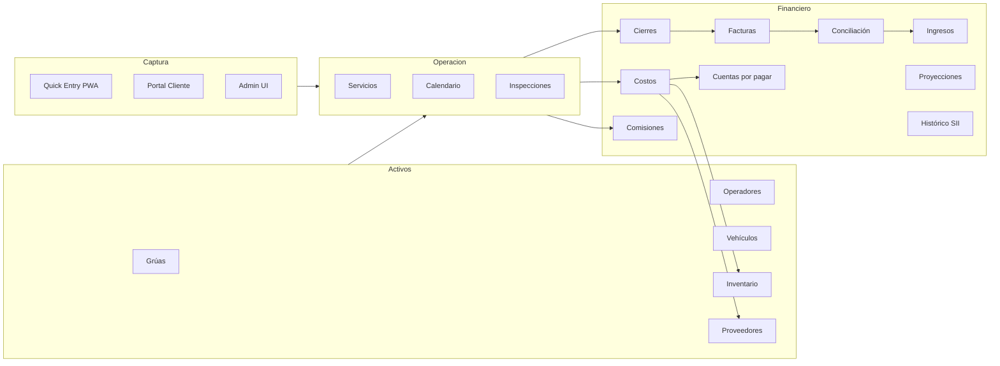
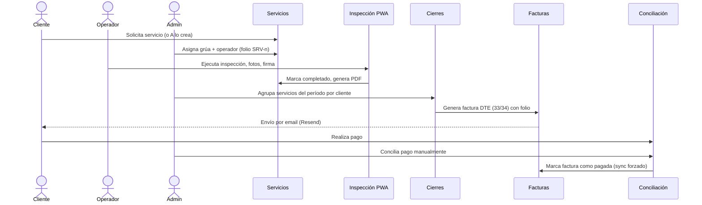

# Product Requirements Document (PRD)

## TMS Grúas — Towing Management System

- **Versión del documento:** 3.1
- **Última actualización:** 2026-04-26
- **Versión del producto:** 2.2.x (en producción)
- **Estado:** Vigente — fuente única de verdad de producto
- **URLs:**
  - Preview: https://id-preview--89675068-6cf4-4412-9e10-ddd5c75dfafb.lovable.app
  - App publicada: https://t-m-s.lovable.app
  - Dominio productivo: https://gruas5norte.com

---

## Tabla de contenidos

0. Resumen ejecutivo para stakeholders no técnicos
1. Resumen ejecutivo
2. Glosario y convenciones
3. Personas, roles y permisos
4. Mapa funcional y flujos end-to-end
5. Especificación detallada por módulo
5.bis Criterios de aceptación (Definition of Done) por módulo crítico
6. Reglas de negocio críticas
7. Integraciones externas
8. Catálogo de Edge Functions
9. Modelo de datos (alto nivel)
10. Auditoría y trazabilidad
11. Capacidad offline / PWA
12. Seguridad
13. Sistema de diseño y UX
14. Requisitos no funcionales
15. Despliegue, entornos y operación
16. Métricas de éxito (KPIs)
17. Roadmap
18. Apéndices
19. Supuestos, restricciones y out-of-scope global
20. Riesgos y mitigaciones
21. Matriz de dependencias críticas

---

## 0. Resumen ejecutivo para stakeholders no técnicos

> Lectura sugerida: 5 minutos. Esta sección está pensada para perfiles **no técnicos** (gerencia, finanzas, clientes internos). El resto del PRD (§1 en adelante) es la especificación detallada para producto, ingeniería y QA.

### Qué es TMS Grúas
TMS Grúas es la plataforma operativa y financiera de una empresa de grúas en Chile. Reemplaza planillas, papel y sistemas dispersos por una sola aplicación web (también instalable como app en celular) que cubre el ciclo completo: tomar el servicio, ejecutarlo en terreno con foto y firma, facturarlo, cobrarlo, controlar costos e inventario, y reportar resultados.

Está diseñada para que **el equipo administrativo sea pequeño** y **los operadores trabajen desde el celular**, incluso sin internet. Toda la información financiera y operativa queda registrada con autor, fecha y trazabilidad de cambios.

Comercialmente está desplegada como **Grúas 5 Norte** (`gruas5norte.com`), pero la plataforma es reutilizable para otras empresas del rubro.

### Quién la usa y para qué

| Rol | Beneficio principal |
|---|---|
| **Administrador / dueño** | Visión integral del negocio, KPIs, control de cobros y pagos, configuración. |
| **Personal administrativo (viewer)** | Carga de servicios, facturación, conciliación de pagos, reportes. |
| **Operador en terreno** | App móvil offline para inspección, fotos, firma y cierre del servicio. |
| **Cliente final (B2B)** | Portal para solicitar servicios, ver historial y descargar facturas. |

### Estado actual (semáforo de madurez)

| Área | Estado | Comentario |
|---|---|---|
| Operaciones (servicios, calendario, cierres) | 🟢 Estable | Núcleo del negocio, en producción. |
| Finanzas (facturas, costos, conciliación, comisiones) | 🟢 Estable | Reglas críticas y triggers SQL endurecidos. |
| Inventario y proveedores | 🟢 Estable | Importador XML SII operativo. |
| Móvil / PWA / Offline | 🟡 En consolidación | Funciona, pero requiere endurecer conflictos y límites (ver §11 y R2 en §20). |
| Integraciones externas (OpenAI, Mapbox, GetAPI, Resend) | 🟡 Operativas con dependencia | Funcionan, pero hay riesgo si un proveedor cae (ver §21 plan de degradación). |
| Notificaciones WhatsApp | 🔴 Pendiente | Decisión tomada (Meta Cloud API), implementación en curso. |
| Multi-tenant | 🔴 No iniciado | En preparación, no comprometido. |

### Próximos hitos priorizados

1. **Separar entornos preview y producción a nivel de datos** (P0). Hoy comparten la misma base Supabase; ver R1 en §20.
2. **Endurecer offline/PWA** (P0): definir conflictos, límites y casos no soportados de manera explícita.
3. **Notificaciones WhatsApp directas** (P0/P1): cierre de la integración con Meta Cloud API.

Detalle completo de prioridades en §17 (Roadmap) y de riesgos en §20.

---

## 1. Resumen ejecutivo

**TMS Grúas** (también identificado como *Towing Manage System* y comercialmente desplegado bajo "Grúas 5 Norte") es una plataforma SaaS web e instalable como PWA que digitaliza, centraliza y automatiza el ciclo completo de operación de una empresa de servicios de grúas en Chile: desde la solicitud o captura del servicio hasta su cierre, facturación electrónica, conciliación de pagos, control de costos, gestión de flota e inventario, y reportería gerencial.

### Propuesta de valor

- **Operación 100% digital en terreno:** los operadores ejecutan inspecciones, capturan fotos y firman desde una PWA con soporte offline robusto.
- **Integración financiera SII-aware:** importación nativa de DTEs (Documentos Tributarios Electrónicos) chilenos en XML para facturación de ventas y para registro de gastos/proveedores.
- **Control financiero en doble vista:** visión activa (cuentas por cobrar, pagos, cierres) y visión histórica (importación masiva de ventas SII, deudas estructuradas en cuotas con interés/reajuste).
- **Trazabilidad punta a punta:** cada cambio en servicios, costos, repuestos, pagos y facturas queda auditado con autor, fecha, valor anterior y nuevo, visible en la UI.
- **Resiliencia operativa:** funcionamiento offline en módulos clave (Servicios, Costos, Clientes, Operadores, Grúas, Inventario) con sincronización automática al recuperar conexión.

### Mercado objetivo

- Empresas chilenas de servicios de grúas y asistencia vial (B2B con aseguradoras, B2C ocasional).
- Operaciones con flotas de 1 a 50 grúas y operación multi-bodega.
- Equipos administrativos pequeños que requieren automatización financiera y reducción de carga operativa.

### Estado actual

- Las **Fases 1 a 5 del roadmap original están completadas**.
- 33 módulos funcionales documentados y operativos (ver `docs/modules/`).
- 22 Edge Functions desplegadas en Supabase (ver §8).
- Infraestructura desplegada en Lovable Cloud + Supabase con dominio propio (gruas5norte.com).

---

## 2. Glosario y convenciones

| Término | Significado |
|---|---|
| **Servicio** | Operación principal de remolque/asistencia. Tiene folio único (`SRV-{n}`), cliente, operador, grúa, vehículo atendido, ubicación, fechas y estado. |
| **Folio** | Identificador correlativo legible: servicios (`SRV-`), facturas (configurable), excedentes (`EXE-`). Configurado en `company_data`. |
| **Cierre** | Agrupación de servicios por período (semanal/quincenal/mensual) usada como unidad de facturación a clientes B2B. |
| **DTE** | Documento Tributario Electrónico chileno (Factura 33, Factura Exenta 34, Boleta 39, Nota de Crédito 61, Nota de Débito 56). |
| **Custodia** | Cobro adicional por almacenamiento del vehículo retirado. |
| **VIP** | Pipeline especial post-servicio para clientes premium (importación PDF de OC y cotizaciones). |
| **Repuesto / Crane Part** | Parte adquirida o consumida por una grúa, con doble vínculo a costo e inventario. |
| **Inspección** | Checklist + fotografías + firma realizada por el operador en terreno. |
| **Quick Entry** | Captura rápida desde móvil (foto + GPS + OCR opcional) que luego se promueve a servicio o costo. |
| **Conciliación** | Aplicación manual de pagos a facturas (no se permite asignación automática). |
| **Bodega / Location** | Punto físico de inventario con stock independiente. |

### Convenciones del sistema

- **Moneda:** CLP (Peso Chileno), sin decimales en montos visibles.
- **Zona horaria:** `America/Santiago` (configurable por reporte en `company_data.report_timezone`).
- **Formato de fecha UI:** `DD/MM/YYYY HH:mm`.
- **Idioma:** Español chileno (es-CL).
- **IVA por defecto:** 19% (`company_data.vat_percentage`).
- **Plazo de pago por defecto:** 30 días (`company_data.invoice_due_days`).
- **Numeración:** correlativos servidor-side mediante `next_*_folio_number` en `company_data`.
- **Color de marca:** violeta `#8b5cf6` (HSL `271 81% 56%`).

---

## 3. Personas, roles y permisos

### 3.1 Personas

1. **Administrador / Gerente (`admin`)** — control total: configuración, usuarios, finanzas, eliminación, herramientas de emergencia, backups. Único rol con escritura a tablas financieras críticas (`creditors`, `debts`, `debt_installments`, `debt_payments`). Puede ejecutar acciones masivas, anular facturas con NC y eliminar costos.
2. **Visualizador / Auditor (`viewer`)** — acceso de solo lectura al dashboard administrativo y módulos financieros. Útil para contabilidad externa y auditoría.
3. **Operador de Grúa (`operator`)** — PWA móvil. Ve únicamente los servicios donde está asignado (titular o en `service_resources`). Puede crear inspecciones, subir fotos, firmar, capturar Quick Entries y registrar consumos de mantenimiento. RLS aplica filtros transitivos.
4. **Cliente B2B / Aseguradora / Particular (`client`)** — portal de autoservicio aislado. Solicita servicios, ve historial, descarga inspecciones y facturas. Solo accede a sus propios datos vía `get_user_client_id_safe()`.

### 3.2 Matriz de acceso por módulo (resumen)

| Módulo | admin | viewer | operator | client |
|---|:---:|:---:|:---:|:---:|
| Dashboard administrativo | RW | R | — | — |
| Servicios | RW | R | RW (asignados) | R (propios) |
| Calendario | RW | R | R (asignados) | — |
| Clientes | RW | R | R (de sus servicios) | R (propio) |
| Grúas / Operadores / Vehículos | RW | R | R | — |
| Inspección móvil | — | — | RW (asignados) | — |
| Quick Entry | RW | — | RW | — |
| Cierres | RW | R | — | — |
| Facturas / Ingresos / Costos | RW | R | R parcial | R (sus facturas) |
| Inventario / Bodega | RW | R | R | — |
| Proveedores / Cuentas por pagar | RW | R | — | — |
| Comisiones | RW | R | R (propias) | — |
| Proyecciones / Reportes | RW | R | — | — |
| Backup / Settings / Catálogos | RW | — | — | — |
| Portal cliente | — | — | — | RW |

### 3.3 Permisos granulares por módulo

Adicionalmente al rol, los administradores pueden activar/desactivar la visibilidad de módulos específicos por usuario sin promover/degradar el rol base. Aplicado desde Settings → Gestión de Usuarios.

### 3.4 Modelo técnico de roles

- Enum `app_role` (`admin`, `viewer`, `operator`, `client`).
- Tabla `user_roles` separada de `profiles` para evitar escalación de privilegios.
- Función `has_role(uuid, app_role)` declarada `SECURITY DEFINER` para uso seguro en políticas RLS sin recursión.
- Helpers RLS: `is_admin_user_safe()`, `is_operator_user_safe()`, `is_client_user_safe()`, `is_authenticated_user_safe()`, `get_user_client_id_safe()`, `is_operator_assigned_to_service()`.

---

## 4. Mapa funcional y flujos end-to-end

### 4.1 Mapa funcional

### 4.2 Flujo end-to-end: Servicio → Cobro

### 4.3 Flujos secundarios

- **Costo de proveedor:** Importación XML DTE → Detección de duplicado → Costo + pago a proveedor + (opcional) ingreso a inventario (sincronización triangular atómica).
- **Mantención de grúa:** Mantención → Repuestos asociados → Costo + descuento de stock + pago al proveedor.
- **Comisión de operador:** Servicio cerrado → Cálculo según regla → Registro en `costs` (única fuente). Operadores con `commission_exempt = true` quedan excluidos del cálculo (configurable en su ficha, sin nombres hardcoded).
- **Captura rápida móvil:** Foto de boleta → OCR (`parse-receipt-image`) → Pre-llenado de costo.

---

## 5. Especificación detallada por módulo

Cada módulo abajo declara propósito, usuarios, funcionalidades clave, reglas de negocio, dependencias y KPIs. Documentación técnica detallada en `docs/modules/<módulo>.md`.

### 5.1 Núcleo y capas transversales

#### 5.1.1 core-app
- Bootstrap, routing, providers globales, resiliencia post-deploy.
- Lazy loading + precarga silenciosa de rutas; recuperación automática ante errores de chunk (1 reload por sesión); `BrowserRouter`; separación por área (público / admin / operator / portal).
- React 18, React Router, React Query con `staleTime`/`gcTime` calibrados.

#### 5.1.2 layout-navigation
- Layouts diferenciados por rol (`Layout`, `OperatorLayout`, `PortalLayout`), navegación lateral colapsable, header sticky con notificaciones y perfil.
- Patrón visual: design system v3 con primitivos (`PageHeader`, `MetricCard`, `StatusBadge`, `SectionCard`).

#### 5.1.3 auth
- Supabase Auth (email/password + invitaciones).
- Login, registro, reset de contraseña (`/reset-password` + `send-password-reset`), invitaciones (`send-user-invitation`), session timeout, validación de fortaleza, diagnóstico.
- Rol asignado por admin tras invitación; profile creado automáticamente; cleanup de sesiones huérfanas.

#### 5.1.4 supabase-integration
- Cliente Supabase (`integrations/supabase/client.ts`), tipado generado, enhanced client con manejo de errores y retry, helpers RLS-aware.

#### 5.1.5 notifications
- Tabla central `notifications` con RLS estricta (cada usuario solo ve y crea las suyas), context global, toasts (sonner), centro de notificaciones, badges.
- Triggers automáticos: vencimientos de documentos, recordatorios de pago, alertas de inventario, asignaciones a operadores, reporte diario.

#### 5.1.6 PWA
- Service Worker (`public/sw.js`), manifest, IndexedDB v5, indicador de conexión, prompt de instalación, notificaciones de actualización.
- Compatibilidad Safari/WebKit garantizada (pdfjs-dist v4.8.6+ con compat layer).

#### 5.1.7 backup
- `generate-backup` (JSON multi-tabla) y `generate-sql-dump` (SQL completo), historial en `backup_logs`, descarga, validación de autoría, logger estructurado.
- Acceso: solo `admin`.

### 5.2 Operación

#### 5.2.1 dashboard
- KPIs, alertas, accesos rápidos. Componentes: `MetricCard`, `AlertsPanel`, `RecentServicesTable`, `PendingCategoryCard`.
- **Modal de pendientes al iniciar sesión:** popup proactivo con resumen (servicios, facturas vencidas, alertas de stock, documentos por vencer).

#### 5.2.2 services
- CRUD completo, asignación de grúa + operador (titular y `service_resources`), folio automático, estados protegidos por trigger, duplicación, batch close, reasignación, cambio masivo, subcontratación (`outsourced_provider_id`).
- 4 tarjetas de métricas (Total, Gastos, Ingresos, Balance) con filtros (Hoy, Semana, Mes, Todos).
- **Audit log** (`service_audit_log`) visible en UI: quién, cuándo, qué cambió.
- **Tarifas automáticas:** jerarquía cliente → tipo de servicio → tarifa global.
- LEFT JOIN obligatorio en queries para evitar pérdidas de servicios huérfanos.

#### 5.2.3 calendar
- Vista unificada de servicios, eventos manuales y mantenciones programadas.
- Sincronización: `services` + `calendar_events` + `crane_maintenance`.
- Vistas mes/semana/día, drag & drop, validaciones de solapamiento, colores por departamento.

#### 5.2.4 quick-entry
- Captura rápida móvil para operadores. FAB persistente, foto + GPS automático, OCR de boletas (`parse-receipt-image`, GPT-4o-mini), promoción a servicio o costo, preview previo.
- Auto-extracción al guardar tipo `costo` con foto: pre-llena monto, fecha, proveedor, RUT.

#### 5.2.5 daily-report
- Reporte diario consolidado (operativo + financiero).
- Envío automático vía `send-daily-pending-report` con cron, configurable por hora y emails destino en `company_data`.

#### 5.2.6 trip-calculator
- Estimación de costos operativos pre-cotización.
- Mapbox (rutas + previsualización), `tollroutes-proxy` (peajes Chile), `crane_consumption_rates` y `fuel_prices`.
- Output: distancia, tiempo, peajes desglosados, combustible estimado, costo total operacional.

#### 5.2.7 operator-app
- PWA dedicada al operador en terreno.
- Lista offline de servicios asignados, ficha de servicio, inspección digital (checklist, fotos `vehicle/equipment_used/before_service`, firma `react-signature-canvas`), generación PDF en dispositivo, envío por email (`send-inspection-email`), Quick Entry integrado.
- Flujo 100% offline; sincroniza al recuperar.

#### 5.2.8 portal (cliente)
- Autoservicio para clientes. Dashboard, lista de servicios propios, solicitud de nuevo servicio (formulario zod), descarga de facturas e inspecciones.
- Aislamiento por `client_id` vía RLS.

### 5.3 Activos, catálogos y administración

#### 5.3.1 cranes
- Ficha completa: datos generales, propietario (RUT empresa), categoría de peaje, vencimientos (permiso, revisión técnica, seguro), documentos adjuntos.
- **Bitácora técnica e historial financiero unificado**, mantenciones, repuestos, kilometraje.
- Alertas de vencimiento (`document_alerts` + `send-document-alerts`).
- Historial visible en UI con autor de cada cambio (`crane_part_change_history`).

#### 5.3.2 operators-admin
- CRUD, vinculación a usuario auth, vencimiento de licencias, asignación a grúa por defecto, comisiones configurables.

#### 5.3.3 clients
- CRUD con verificación de RUT multi-proveedor (SRE → GetAPI Chile fallback).
- Formato automático de RUT chileno en tiempo real en todos los formularios.
- Departamentos múltiples por cliente (gestión desde modal de edición).
- Tipo de facturación (`standard` / `monthly`), término de pago por defecto, métricas e historial.
- **Selectores activos-only:** todos los selectores de cliente filtran `is_active = true`.
- **Facturación mensual:** clientes marcados quedan excluidos de cierres semanales/quincenales.

#### 5.3.4 inventory
- Bodega multi-ubicación. Catálogo (`inventory_items`: SKU, código de barras, categoría, stocks min/max/seguridad, costo, vencimientos), stock por ubicación (`inventory_stock`), movimientos auditados (entrada/salida/transferencia/ajuste), consumos por grúa/mantención (`inventory_consumptions`), alertas (`inventory_alerts`), proveedores, reportes (valorización solo `status='active'`, ABC, consumo, proyección).
- Importación XML resiliente v4 con vínculo atómico entre facturas, costos, pagos y bodega.
- Auto-SKU permitido **solo en importación XML**; el formulario manual exige SKU explícito.
- Rediseño Violet alineado al sistema de diseño global.

#### 5.3.5 suppliers
- Maestro de proveedores y pagos. Unificado con `inventory_suppliers` como única fuente de verdad.
- Importación XML de DTEs (detección de duplicados, fallback de RUT, sincronización triangular).
- Pagos programados, calendario de pagos, asociación XML a costo existente para evitar duplicación.
- Orden de pestañas: Pagos / Proveedores / Calendario.

#### 5.3.6 catalogos-admin
- Tipos de servicio, tarifas (`service_rates`), centros de costo (`cost_centers`), vehículos (`vehicles`).
- Vehículos: validación de patentes chilenas (GetAPI Chile, `check-vehicle-patent`), reconocimiento de VIN.

#### 5.3.7 settings-admin
- Datos de empresa (`company_data`), gestión de usuarios + permisos granulares por módulo, alertas de documentos, configuración de reporte diario, configuración de notificaciones push.
- **Panel de Emergencia:** herramientas administrativas centralizadas (limpieza de servicios, sincronización forzada de comisiones, eliminación segura).

### 5.4 Financiero, comercial y reportería

#### 5.4.1 closures
- Generación por cliente y rango (semanal/quincenal/mensual), exclusión automática de clientes `monthly`, vista previa, conversión directa a factura.

#### 5.4.2 invoices
- Generación desde cierre o ad-hoc, folios correlativos, descripción opcional, detalle multi-ítem, IVA configurable.
- Estados: `pending`, `paid`, `overdue`, `cancelled`. Envío email (`send-invoice-email`), descarga PDF.
- **Anulación con NC:** anular requiere generar Nota de Crédito formal con razón obligatoria.
- **Vencimiento real-time:** "Vencida" se calcula por saldo pendiente y `due_date`, no solo por status.
- **Conciliación automática al crear** si `status='paid'`.
- **Sincronización con servicios:** al facturar, los servicios pasan a estado consistente.
- **Protección contra eliminación:** facturas de la app (sin prefijo `HIST-`) no son eliminables.
- **N° Fiscal** como identificador prioritario en tablas y búsquedas.

#### 5.4.3 costs
- CRUD con categoría/subcategoría dinámica, vínculo opcional a servicio/grúa/operador/centro de costo/proveedor/factura proveedor.
- Importación CSV/XLSX masiva e importación XML DTE proveedor (Wizard estándar).
- Clasificación automática histórica (`classify-cost`, basada en tokens del histórico, sin reglas fijas).
- Descripciones editables dinámicamente, indicador visual multi-ítem (badge ámbar) para costos vinculados a facturas con varios ítems.
- **Historial de cambios visible en UI** (`cost_change_history`).
- Estado de pago: estándar visual con tres estados (no pagado / parcial / pagado).
- Eliminación segura confirmada por bidireccionalidad con proveedores/inventario.
- **Relación 1:1 con facturas de proveedor.**
- **Preservación de fechas:** todos los costos asociados a un servicio (incl. comisiones y gastos manuales) preservan la fecha del servicio.

#### 5.4.4 accounts-payable
- Gestión de deudas estructuradas (fiscales, créditos, intereses). Tablas: `creditors`, `debts`, `debt_installments`, `debt_payments`.
- Alta de deuda con número de cuotas, interés y reajuste configurables; generación automática de cuotas con vencimientos; registro de pagos por cuota; dashboard de vencimientos.
- Lectura `admin`/`viewer`; escritura solo `admin`.

#### 5.4.5 commissions
- Comisiones de operadores. **Fuente única de verdad:** tabla `costs`.
- Soporta múltiples esquemas (% por servicio, fijo, escalonado).
- **Exclusiones configurables:** operadores marcados con `commission_exempt = true` en su ficha. El trigger DB `prevent_excluded_operator_commissions` impide insertar comisiones para operadores exentos. Sin nombres hardcoded — totalmente escalable a nuevos socios o exentos sin tocar código.
- Herramienta admin para forzar resync.

#### 5.4.6 incomes
- Registro de ingresos (incluye pagos de facturas y otros).
- Alta manual, vínculo opcional a factura/cliente, categorías/subcategorías, conciliación.
- **Sin auto-asignación** (FIFO/LIFO prohibido). Toda aplicación de pago es manual y explícita.
- Modal de pago inteligente muestra `due_date` y antigüedad para priorizar.

#### 5.4.7 projections
- Proyecciones de cashflow y aging.
- Ingresos esperados (facturas pendientes con `due_date`), aging buckets, cashflow proyectado, comparativa proyectado vs real.

#### 5.4.8 finance-historical
- Análisis histórico aislado de la operación activa.
- **Sistema de Historial de Ventas SII:** importación CSV/XLSX de Facturas, NC, ND con prefijo `HIST-`.
- Aislamiento estricto: las facturas históricas no afectan cierres ni servicios.

#### 5.4.9 reports
- Reportes operativos (servicios, mantenciones) y financieros (costos, ingresos, comisiones, facturas).
- Exportación PDF (con header corporativo desde `company_data`) y Excel multi-hoja.
- KPIs contextuales y navegación por categorías.

#### 5.4.10 vip-pipeline
- Flujo post-servicio para clientes VIP.
- Importación PDF de Órdenes de Compra (`parse-purchase-order-pdf`) y Cotizaciones (`parse-quote-pdf`) con fuzzy matching tolerante a errores OCR.
- Sincronización con sistema de refresco global, métricas de conversión.

---

## 5.bis Criterios de aceptación (Definition of Done) por módulo crítico

> Checklist verificable por QA y desarrollo. Si un cambio toca un módulo de esta lista, debe cumplir TODOS los criterios marcados antes de considerarse "listo". Los módulos no listados aplican criterios genéricos de §14.

### Genérico (aplica a todos)
- [ ] RLS activa y verificada para todos los roles relevantes.
- [ ] `created_by` poblado y visible en UI cuando aplica.
- [ ] Estados de carga, vacío y error implementados.
- [ ] Responsive mobile (cards) y desktop (tabla) según patrón del módulo de Costos.
- [ ] Sin colores hardcoded; usa tokens del design system v3.
- [ ] Sin regresiones en módulos dependientes (ver §21).

### Servicios
- [ ] Estados protegidos: `pending → in_progress → completed → closed` (no se permite saltar hacia atrás sin permiso).
- [ ] Tarifa pre-llenada según jerarquía cliente → tipo → default.
- [ ] Subcontratación con `outsourced_provider_id` correctamente reflejada en cierres y reportes.
- [ ] Audit log (`service_audit_log`) registra cambios de estado, operador, grúa, valor y cliente.
- [ ] Operaciones por lote (cerrar, cambiar estado, reasignar) protegidas por confirmación.
- [ ] CRUD funciona offline y sincroniza al recuperar conexión.
- [ ] Gastos auto-pagados (peajes/viáticos) no duplican costos.

### Facturas
- [ ] Estado de pago calculado por **saldo real**, no por estado nominal.
- [ ] Anulación SOLO vía Nota de Crédito; nunca delete directo.
- [ ] Eliminación protegida con confirmación "ELIMINAR" para facturas no históricas.
- [ ] Importación histórica SII (CSV/XLSX) marca prefijo `HIST-`.
- [ ] Conciliación automática al crear factura ya pagada.
- [ ] Aging (0-30/31-60/61-90/90+) coincide con vista de proyecciones.
- [ ] N° fiscal es el identificador prioritario en búsquedas.

### Costos
- [ ] Relación 1:1 estricta con Facturas de proveedor (no se permite duplicar).
- [ ] Importador XML detecta duplicados por folio + hash + contenido.
- [ ] Clasificación histórica por tokens funciona y es la única vía (no hay otra).
- [ ] Fechas originales del DTE preservadas (no se reemplazan por fecha de importación).
- [ ] Eliminación pasa por flujo seguro con verificación de dependencias.
- [ ] Badge multi-ítem visible cuando el costo está vinculado a factura con varios ítems.

### Pagos / Conciliación
- [ ] Prohibida cualquier auto-asignación FIFO/LIFO. La conciliación es manual.
- [ ] Modal de pago muestra `due_date` y prioridad por vencimiento.
- [ ] Pago parcial actualiza saldo correctamente y refleja estado en factura.
- [ ] `reference_number` (folio del DTE) NUNCA se mezcla con la referencia bancaria.

### Inventario
- [ ] Auto-SKU SOLO en importación XML (`SKU-YYYYMMDD-HEX4`); manual exige SKU del usuario.
- [ ] Valoración total filtra estrictamente `status='active'`.
- [ ] Movimientos generan trazabilidad (`inventory_movement_change_history`).
- [ ] Stock crítico genera alerta visible en Dashboard.
- [ ] Vínculo atómico XML → factura → costo → stock (rollback si una etapa falla).

### Comisiones
- [ ] Única fuente de verdad: tabla `costs`.
- [ ] Operadores con `commission_exempt = true` NO generan comisiones (validado por trigger en BD).
- [ ] Sincronización con servicios cerrados respeta fecha del servicio.
- [ ] Sin nombres hardcoded en código ni documentación.

### Cuentas por Pagar
- [ ] Solo `admin` puede escribir en `creditors`, `debts`, `debt_installments`, `debt_payments` (RLS verificada).
- [ ] Cuotas con interés/reajuste calculan correctamente.
- [ ] Pagos parciales se reflejan en deuda pendiente.

### PWA Offline
- [ ] Módulos soportados (Servicios, Costos, Clientes, Operadores, Grúas, Inventario) operan 100% sin red para CRUD básico.
- [ ] Cola de operaciones pendientes visible en `SyncIndicator`.
- [ ] Resolución de conflictos documentada (last-write-wins por fila con timestamp).
- [ ] Operaciones NO soportadas offline (importadores XML, OCR, envío de email, generación PDF server-side, integraciones externas) muestran mensaje claro.
- [ ] Inspecciones (fotos + firma) funcionan completamente offline y sincronizan al reconectar.

---

## 6. Reglas de negocio críticas

Reglas no-negociables del sistema (consolidadas desde memorias del proyecto y código productivo):

1. **Roles en tabla separada.** Nunca almacenar el rol en `profiles`. Usar `user_roles` + `has_role()` SECURITY DEFINER.
2. **Sin auto-asignación de pagos.** La conciliación es 100% manual (decisión expresa del cliente).
3. **Exclusión de comisiones configurable.** Operadores con `commission_exempt = true` no generan comisiones. La regla vive en la base de datos (flag en `operators` + trigger `prevent_excluded_operator_commissions`), no en código ni por nombre — escalable a nuevos exentos sin modificar la app.
4. **Facturación mensual.** Clientes con `billing_type='monthly'` quedan fuera de cierres semanales/quincenales.
5. **Costo ↔ Factura proveedor: relación 1:1.**
6. **Anulación de factura ⇒ Nota de Crédito.** No se elimina; se genera NC con razón obligatoria.
7. **Facturas de la app no se eliminan.** Solo las históricas (`HIST-`) son eliminables.
8. **Vencimiento por saldo, no por status.** "Vencida" se determina financieramente.
9. **Sincronización bidireccional Costos ↔ Pagos a Proveedores** vía triggers DB; descripciones unificadas.
10. **Estados de servicios protegidos.** Triggers impiden saltar estados intermedios.
11. **Preservación de fecha en costos** asociados a servicio (incl. comisiones y gastos automáticos).
12. **Auto-SKU solo en importación XML** de inventario.
13. **Auto-pago de gastos operativos** generados desde modales de servicios (peajes, viáticos, combustible).
14. **Prevención de duplicación inventario↔compra.**
15. **Sincronización triangular XML proveedor:** factura, costo y stock atómicos.
16. **Selectores de clientes solo activos** en toda la app.
17. **Detección de duplicados XML** en los tres importadores (Costos, Proveedores, Inventario).
18. **N° Fiscal como identificador prioritario** en módulos financieros.
19. **RLS estricta en notificaciones**: cada usuario solo inserta y lee las suyas.
20. **Restricción de escritura financiera**: `creditors`, `debts`, `debt_installments`, `debt_payments` solo `admin`.
21. **Llaves API GetAPI separadas** por servicio (vehículos vs RUT).
22. **Parsing de fechas timezone-safe** para evitar el "off-by-one-day" en Chile.
23. **PDFs en Edge Functions Deno** siguen patrón estándar v2 (jsPDF + jspdf-autotable).
24. **`created_by` en todos los módulos principales** para trazabilidad de autoría.
25. **Audit log de servicios completo** con visualización UI.

---

## 7. Integraciones externas

| Servicio | Uso | Notas |
|---|---|---|
| **Supabase** | DB Postgres, Auth, Storage, Edge Functions, Realtime | Backend principal. RLS en todas las tablas. |
| **Resend** | Emails transaccionales | Invitaciones, recordatorios de pago, reset, reportes diarios, confirmaciones, alertas de documentos, inspección, factura, notificaciones a operador. `resend@6` en todas las Edge Functions. |
| **Mapbox** | Rutas y previsualización geográfica | Vía `mapbox-proxy`. Trip Calculator. |
| **Tollroutes (Chile)** | Cálculo de peajes | Vía `tollroutes-proxy`. |
| **GetAPI Chile (vehículos)** | Verificación de patentes y datos de vehículo | `check-vehicle-patent`. |
| **GetAPI Chile / SRE (RUT)** | Verificación de RUT y enriquecimiento | `sre-lookup`. Estrategia multi-proveedor. |
| **OpenAI** (gpt-4o-mini) | Clasificación de costos + OCR boletas + parsing PDF VIP | `classify-cost`, `parse-receipt-image`, `parse-purchase-order-pdf`, `parse-quote-pdf`. |
| **Web Push (VAPID)** | Notificaciones push PWA | `save-push-subscription`, `remove-push-subscription`, `send-push-notification`. |
| **WhatsApp Cloud API (Meta)** | Notificaciones por WhatsApp | Decisión: integración directa con Meta. En roadmap. |
| **pdfjs-dist 4.8.6+** | Parsing PDF cliente | Compat layer Safari/WebKit para VIP pipeline. |

---

## 8. Catálogo de Edge Functions

| Función | Propósito |
|---|---|
| `check-vehicle-patent` | Validar patente chilena y obtener datos del vehículo. |
| `classify-cost` | Clasificar automáticamente categoría/subcategoría de costo. |
| `generate-backup` | Backup multi-tabla en JSON. Solo admin. |
| `generate-sql-dump` | Dump SQL completo. Solo admin. |
| `mapbox-proxy` | Proxy autenticado para rutas Mapbox. |
| `parse-purchase-order-pdf` | Extraer datos de OC PDF (VIP). |
| `parse-quote-pdf` | Extraer datos de cotización PDF (VIP). |
| `parse-receipt-image` | OCR de boletas/recibos para Quick Entry y costos. |
| `remove-push-subscription` | Eliminar suscripción push. |
| `save-push-subscription` | Guardar suscripción push (VAPID). |
| `send-daily-pending-report` | Reporte diario de pendientes por email (cron). |
| `send-document-alerts` | Alertas de vencimiento de documentos de grúas. |
| `send-inspection-email` | Enviar PDF de inspección al cliente. |
| `send-invoice-email` | Enviar factura PDF al cliente. |
| `send-operator-notification` | Notificar a operador (asignación, cambios). |
| `send-password-reset` | Email de reset de contraseña. |
| `send-payment-reminder` | Recordatorio de pago de factura vencida. |
| `send-push-notification` | Envío de push a usuario/segmento. |
| `send-service-confirmation` | Confirmación de servicio creado al cliente. |
| `send-user-invitation` | Invitación a nuevo usuario. |
| `sre-lookup` | Verificación de RUT chileno multi-proveedor. |
| `tollroutes-proxy` | Cálculo de peajes en rutas chilenas. |

Estándar: Deno + Resend v6, CORS estandarizado, logging estructurado, validación de auth donde aplica.

---

## 9. Modelo de datos (alto nivel)

### Entidades principales

- **Operación:** `services`, `service_resources`, `inspections`, `calendar_events`, `quick_entries`.
- **Activos:** `cranes`, `crane_documents`, `crane_maintenance`, `crane_parts`, `operators`, `vehicles`.
- **Clientes:** `clients` (con `billing_type`, `default_payment_term_id`, `department`).
- **Inventario:** `inventory_items`, `inventory_stock`, `inventory_locations`, `inventory_categories`, `inventory_movements`, `inventory_consumptions`, `inventory_alerts`, `inventory_suppliers`.
- **Proveedores:** `inventory_suppliers` (unificado), `supplier_invoices`, `supplier_payments`.
- **Financiero (activo):** `closures`, `closure_services`, `invoices`, `invoice_items`, `costs`, `cost_categories`, `cost_subcategories`, `cost_centers`, `cost_inventory_items`, `incomes`, `income_categories`, `income_subcategories`, `commissions`.
- **Financiero (deuda estructurada):** `creditors`, `debts`, `debt_installments`, `debt_payments`.
- **Configuración:** `company_data`, `company_profiles`, `service_rates`, `service_types`, `crane_consumption_rates`, `fuel_prices`, `document_alerts`.
- **Auditoría:** `audit_log`, `cost_change_history`, `crane_part_change_history`, `inventory_movement_change_history`, `service_audit_log`, `backup_logs`, `import_batches`, `import_batch_records`, `cost_bulk_payment_operations`.
- **Identidad y permisos:** `profiles`, `user_roles`, `module_permissions`, `notifications`.

### Reglas de RLS comunes

- RLS activo en todas las tablas.
- Helpers `is_*_user_safe()` y `has_role()` SECURITY DEFINER previenen recursión.
- Operadores y clientes acceden por `auth.uid()` con joins transitivos a `services`.
- Tablas financieras críticas restringen escritura a `admin`.
- Tablas de historial bloquean `INSERT` directo desde cliente (`WITH CHECK (false)`); solo se escriben vía triggers SECURITY DEFINER.

---

## 10. Auditoría y trazabilidad

- **Autoría:** todos los módulos principales registran `created_by` y `updated_by` cuando aplica.
- **Historial visible en UI:**
  - Servicios → `service_audit_log` (pestaña Historial en modal de detalle).
  - Costos → `cost_change_history` (pestaña Historial en `ConsolidatedCostDetails`).
  - Repuestos → `crane_part_change_history` (pestaña Historial en modal de repuestos).
  - Movimientos de inventario → `inventory_movement_change_history`.
- **Backup logs:** `backup_logs` con tipo, status, tamaño, autor, mensaje de error.
- **Audit log global:** `audit_log` (operaciones críticas).
- **Importaciones:** `import_batches` + `import_batch_records` para soportar rollback.
- **Pagos masivos:** `cost_bulk_payment_operations` registra cada operación batch.

---

## 11. Capacidad offline / PWA

- Arquitectura offline v5 basada en IndexedDB.
- Módulos con CRUD offline completo: Servicios, Costos, Clientes, Operadores, Grúas, Inventario.
- Sincronización automática al recuperar conexión, con cola de operaciones pendientes y resolución de conflictos last-write-wins por entidad.
- Indicadores UI: `ConnectionStatus`, `SyncIndicator` con detalle de pendientes.
- Inspección PWA opera 100% offline (incluye fotos y firma).
- Push notifications: suscripción VAPID, backend en Edge Function.
- Instalación: prompt nativo (`InstallPrompt`, `PWAInstallButton`).
- Actualización: notificación al usuario cuando hay nueva versión del SW.

### Soportado offline (lista cerrada)
- CRUD: Servicios, Costos, Clientes, Operadores, Grúas, Inventario (movimientos básicos).
- Inspección PWA completa: checklist + fotos + firma.
- Lectura de catálogos previamente cacheados (tipos de servicio, tarifas, vehículos).

### NO soportado offline
- Importadores XML (DTE de costos, proveedores e inventario).
- OCR de boletas / Quick Entry con auto-extracción.
- Generación de PDFs server-side y envío por email (Resend).
- Integraciones externas: Mapbox (rutas), GetAPI (peajes/patentes/RUT), Tollroutes, OpenAI, Meta WhatsApp.
- Conciliación de pagos compleja (requiere consistencia transaccional contra el servidor).
- Reportes con agregaciones server-side y exportación.

### Resolución de conflictos
- Estrategia: **last-write-wins a nivel de fila**, usando timestamp del cliente para ordenar y timestamp del servidor como árbitro final.
- Campos calculados (saldos, totales, estados derivados) se recalculan SIEMPRE en servidor; el valor offline es provisional.
- En caso de conflicto destructivo (borrado offline + edición online o viceversa), prevalece la versión más reciente y se notifica al usuario en el `SyncIndicator`.

### Límites declarados
- Cola IndexedDB: máximo recomendado ~500 operaciones pendientes por dispositivo; sobre ese umbral se muestra advertencia.
- TTL de operaciones pendientes: 7 días. Pasado ese plazo se solicita confirmación manual antes de sincronizar.
- Tamaño máximo de fotos en cola: comprimidas en cliente antes de encolar.
- No hay garantía de orden global entre dispositivos; el orden lo determina el servidor al recibir.

---

## 12. Seguridad

- RLS obligatorio en todas las tablas.
- Roles en tabla separada (`user_roles`) + `has_role()` SECURITY DEFINER.
- Permisos granulares por módulo además del rol base.
- Hardening de notificaciones: RLS estricta para evitar inyección entre usuarios.
- Hardening de storage: buckets con políticas explícitas; validación de owner en uploads.
- Restricción de escritura financiera (`creditors`, `debts`, `debt_installments`, `debt_payments`) solo `admin`.
- Separación de claves API por servicio (GetAPI vehículos vs RUT); secretos solo server-side.
- Validación de auth en Edge Functions sensibles (`generate-backup` con `authValidator`).
- Anti-escalación: prohibido evaluar rol desde `localStorage`/`sessionStorage` o credenciales hardcoded.
- Session timeout automático.
- Cleanup de auth al detectar sesiones huérfanas.
- Validación de fortaleza de contraseña y reset seguro vía Edge Function.

---

## 13. Sistema de diseño y UX

### Tokens v3
- Color de marca: violeta `#8b5cf6` (HSL `271 81% 56%`).
- Tokens semánticos en `src/index.css :root` y `.dark`.
- Prohibido usar colores literales en componentes; siempre tokens semánticos (`bg-primary`, `text-foreground`, etc.).
- Modo claro y oscuro soportados, alto contraste.
- **Accesibilidad:** preferencia explícita por violeta sobre verde por discapacidad visual del usuario.

### Primitivos
- `PageHeader`, `MetricCard`, `StatusBadge`, `SectionCard`.
- `EnhancedCostsTable` y `CostsTable` con estándar visual de estado de pago en 3 estados.
- Importadores XML siguen estándar visual del módulo Bodega (Wizard agrupado).

### Patrones técnicos
- Modales con Radix Select estable (patrón v3) para evitar cierres inesperados con datos asíncronos.
- Responsive web-first con foco mobile (operadores).
- Formato automático de RUT chileno en tiempo real en todos los formularios.
- Autocompletado inteligente en campos de texto libre (Observaciones, Descripciones, Referencias).

### Marca
- Logo Grúas 5 Norte y datos corporativos centralizados en `company_data`, embebidos automáticamente en todos los PDFs.

---

## 14. Requisitos no funcionales

| Categoría | Requisito |
|---|---|
| **Rendimiento** | TTI < 3s en red 4G; precarga silenciosa de rutas; React Query con `staleTime`/`gcTime` ajustados; lazy loading de páginas. |
| **Disponibilidad** | Hosting en Lovable + Supabase con SLA del proveedor; backups bajo demanda y reporte diario. |
| **Escalabilidad** | Postgres + RLS soporta multi-tenant futuro; Edge Functions stateless. |
| **Compatibilidad** | Chrome, Edge, Safari, Firefox actuales. PWA en iOS Safari y Android Chrome. Compat layer pdfjs para WebKit. |
| **Resiliencia** | Recuperación automática de chunks post-deploy (1 reload por sesión); retry de queries; offline-first en módulos clave. |
| **Seguridad** | Ver §12. |
| **Accesibilidad** | WCAG AA en componentes principales; alto contraste; foco visible; soporte teclado. |
| **Internacionalización** | UI en es-CL. Moneda CLP. Zona horaria Chile/Santiago. |
| **Auditabilidad** | Toda operación financiera y operativa relevante queda con autor + timestamp + valor anterior/nuevo. |
| **Mantenibilidad** | Documentación por módulo en `docs/modules/`. Memorias de proyecto vivas. Convenciones en design system. |

---

## 15. Despliegue, entornos y operación

### Entornos
- **Preview:** despliegue automático con cada cambio.
- **Producción:** `t-m-s.lovable.app` + dominio propio `gruas5norte.com`.
- Preview y producción comparten la misma instancia de Supabase y Edge Functions.

> ⚠️ **Riesgo operativo R1 (ver §20).** Compartir Supabase entre preview y producción facilita pruebas pero permite que un cambio en preview impacte datos reales. Mientras no se separe la instancia, aplican las mitigaciones definidas en §20 (ventana de pruebas, snapshot diario, prohibición de mutaciones masivas/destructivas en preview).

### Pipeline
- Cambios desde Lovable → despliegue automático preview.
- Migraciones SQL: archivos timestamped en `supabase/migrations/` (gestionados desde Lovable).
- Edge Functions: deploy automático al guardar.
- `.env` no se versiona; secretos gestionados desde Lovable Cloud.

### Operación
- Backups bajo demanda desde `/backup` (admin); reporte diario por email; dump SQL completo disponible.
- Logs de Edge Functions en Supabase; logs de cliente con `src/lib/logger.ts`.
- Recuperación ante fallos: reload de chunk automático; retry de fetch; modo offline.

---

## 16. Métricas de éxito (KPIs)

### Operativas
- Servicios completados por día/semana/mes.
- Tiempo medio de cierre de servicio (creación → completed).
- % de servicios con inspección digital completa.
- % de servicios cerrados en cierre periódico vs fuera de plazo.
- Disponibilidad de flota (grúas activas vs en mantención).

### Financieras
- Ingresos vs Costos vs Balance por período.
- Margen % por servicio / cliente / grúa.
- DSO (Days Sales Outstanding).
- Aging de cuentas por cobrar (0-30, 31-60, 61-90, 90+).
- Tasa de cobro (% facturas pagadas en plazo).
- Costo operativo por kilómetro (Trip Calculator).

### Inventario
- Valorización total (solo `status='active'`).
- Items en stock crítico.
- Rotación ABC.
- Consumo por grúa.

### Técnicas
- Errores client-side (runtime errors).
- Tiempo medio de sincronización offline → online.
- Tasa de éxito de Edge Functions.
- Latencia de queries críticas.

---

## 17. Roadmap

### Fases completadas
- **Fase 1:** Base, Auth, Dashboard, Servicios, Grúas.
- **Fase 2:** Portales (Operador y Cliente), Inspecciones digitales, PDFs.
- **Fase 3:** Módulo financiero, Cierres, Lector XML DTE.
- **Fase 4 (v2.1.0):** Sistema integral de Inventario y Bodega + alertas.
- **Fase 5 (v2.2.x):** Optimización de rendimiento, reportes avanzados, integraciones (Mapbox, Tollroutes, GetAPI, OpenAI), VIP pipeline, Cuentas por Pagar estructuradas, Histórico SII, Quick Entry con OCR, audit logs visibles en UI, hardening de seguridad y RLS, design system v3, sistema de comisiones reescrito.

### En curso / próximo
- Notificaciones WhatsApp directas (Meta Cloud API).
- Analítica predictiva (predicción de demanda y mantención).
- Expansión de reportes con dashboards interactivos.
- Mejoras al VIP pipeline (matching más robusto, dashboard de conversión).
- Multi-tenant nativo (preparación de schema y RLS).

---

## 18. Apéndices

### A. Variables de entorno y secretos

**Cliente (`.env`, prefijo `VITE_`):**
- `VITE_SUPABASE_URL`
- `VITE_SUPABASE_PUBLISHABLE_KEY` (anon key)
- `VITE_APP_NAME`

**Edge Functions (Supabase secrets):**
- `SUPABASE_URL`, `SUPABASE_ANON_KEY`, `SUPABASE_SERVICE_ROLE_KEY`
- `RESEND_API_KEY`
- `OPENAI_API_KEY`
- `MAPBOX_TOKEN`
- `TOLLROUTES_API_KEY`
- `GETAPI_VEHICLE_KEY`, `GETAPI_RUT_KEY` (separadas)
- `VAPID_PUBLIC_KEY`, `VAPID_PRIVATE_KEY`, `VAPID_SUBJECT`

### B. Catálogo de rutas

**Público:** `/`, `/auth`, `/reset-password`, `/performance-test`, `/debug-freeze`, `/connection-test`.

**Administrativas (`admin`, `viewer`):** `/dashboard`, `/services`, `/calendar`, `/closures`, `/clients`, `/cranes`, `/invoices`, `/inventory`, `/reports`, `/suppliers`, `/daily-report`, `/incomes`, `/income-projections`, `/accounts-payable`, `/historical`, `/trip-calculator`, `/profile`.

**Solo admin:** `/operators`, `/service-types`, `/service-rates`, `/vehicles`, `/commissions`, `/cost-centers`, `/settings`, `/quick-entries`, `/backup`.

**Operador (`operator`, `admin`):** `/operator`, `/operator/service/:id/inspection`.

**Portal cliente (`client`):** `/portal/dashboard`, `/portal/services`, `/portal/request-service`, `/portal/invoices`.

### C. Referencias cruzadas

- Documentación por módulo: [`docs/modules/`](docs/modules/README.md)
- Configuración técnica: [`docs/technical/configuration.md`](docs/technical/configuration.md)
- PWA: [`docs/technical/pwa-configuration.md`](docs/technical/pwa-configuration.md)
- Sistema de pagos: [`docs/technical/payment-system.md`](docs/technical/payment-system.md)
- Guía de administrador: [`docs/technical/system-admin-guide.md`](docs/technical/system-admin-guide.md)
- Troubleshooting: [`docs/technical/troubleshooting.md`](docs/technical/troubleshooting.md)
- Changelog: [`CHANGELOG.md`](CHANGELOG.md), [`docs/changelog/releases.md`](docs/changelog/releases.md)
- Design system: [`docs/design-system.md`](docs/design-system.md)
- Memorias de proyecto vivas en `mem://`.

### D. Historial de versiones del producto

| Versión | Hito principal |
|---|---|
| 1.x | Base operativa: servicios, grúas, dashboard. |
| 2.0 | Portales operador/cliente, inspecciones digitales. |
| 2.1.0 | Sistema integral de Inventario y Bodega. |
| 2.1.1 | Métricas de servicios con filtros por período. |
| 2.2.x | Hardening de seguridad, audit logs UI, design system v3, VIP pipeline, Cuentas por Pagar, Histórico SII, Quick Entry OCR, comisiones reescritas. |

### E. Historial de versiones de este PRD

| Versión | Fecha | Cambios |
|---|---|---|
| 1.0 | — | PRD inicial breve (~78 líneas). |
| 3.0 | 2026-04-25 | Reescritura completa exhaustiva: 18 secciones, los 33 módulos, reglas de negocio críticas, integraciones, Edge Functions, modelo de datos, RLS, offline/PWA, seguridad, design system, KPIs, roadmap actualizado y apéndices. |
