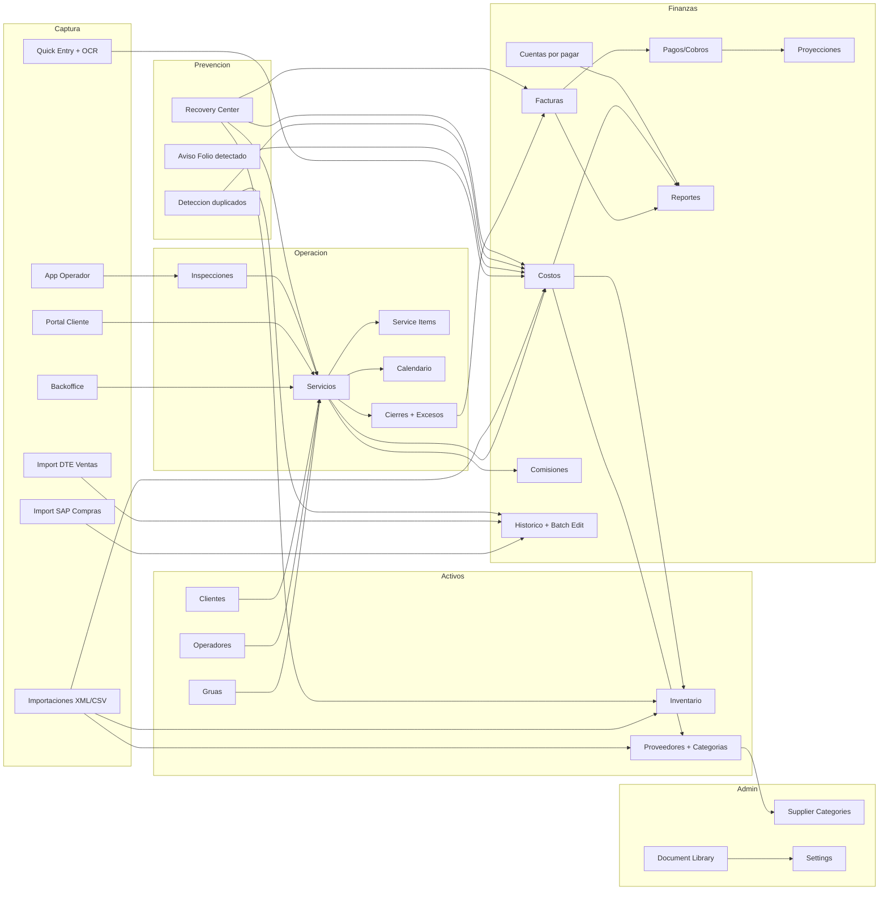

# Product Requirements Document (PRD)

## TMS Gruas - Towing Management System

- **Version del documento:** 4.2
- **Ultima actualizacion:** 2026-07-04
- **Estado:** Vigente
- **Base de actualizacion:** lectura completa del routing, paginas, componentes, hooks, servicios, migraciones, `docs/modules/*` y features implementados hasta julio 2026

---

## 0. Resumen ejecutivo

TMS Gruas es una plataforma web operativa y financiera para empresas de gruas en Chile. Centraliza el ciclo completo del negocio:

- solicitud o creacion del servicio
- asignacion de grua y operador
- ejecucion en terreno con inspeccion, fotos y firma
- cierre operacional (con soporte de excesos/deducibles)
- facturacion y seguimiento de cobros
- control de costos, proveedores e inventario
- importacion historica de compras (SAP) y ventas (DTE SII)
- administracion documental (biblioteca de documentos de negocio)
- centro de recuperacion transaccional (auditoria, simulacion y reversion)
- categorizacion de proveedores (independiente de centros de costo)
- deteccion y prevencion de duplicados entre modulos
- reportes, proyecciones y control administrativo

El producto tiene 3 superficies principales:

1. **Backoffice administrativo** para operaciones, finanzas, activos y configuracion.
2. **App de operador** con foco en inspeccion y evidencia en terreno.
3. **Portal cliente** para autoservicio, consulta documental y solicitud de servicios.

### Estado actual por area

| Area | Estado | Comentario |
|---|---|---|
| Servicios, calendario y cierres | Estable | Nucleo operacional. Soporte de excesos/deducibles en cierres. |
| Facturas, pagos/cobros, costos y cuentas por pagar | Estable | Cobertura amplia y madura del flujo financiero. |
| Inventario, compras y proveedores | Estable | Con categorias propias de proveedor y producto/servicio por defecto. |
| App operador / inspecciones | Estable | Flujo operativo real con fotos, firma y PDF. |
| Portal cliente | Operativo | Permite solicitar servicios y revisar historial/facturas. |
| Importadores historicos (SAP / DTE SII) | Estable | Deteccion de duplicados cross-modulo (costos, compras, glosas). |
| Biblioteca documental (Document Library) | Operativo | Gestion documental por categoria con alertas de vencimiento. |
| Centro de recuperacion (Recovery Center) | Operativo | Auditoria, simulacion y reversion transaccional. |
| Categorias de proveedores | Estable | CRUD en Settings, independientes de cost_categories. |
| Avisos preventivos "Folio detectado" | Operativo | En CostForm, PaymentForm y SmartPaymentForm. |
| Consolidacion de proveedores duplicados | Aplicado | Migracion SQL + backfill de datos existentes. |
| PWA, push y offline | Operativo con alcance acotado validado | Flujo operador offline validado para inspeccion inicial y sincronizacion posterior; backoffice offline sigue fuera de foco. |
| Integraciones externas | Operativas con dependencia | Email, push, OCR, mapas, peajes, WhatsApp via Edge Functions. |
| WhatsApp | Operativo | Integracion via Meta WhatsApp Cloud API + Supabase Edge Functions. |
| Multi-tenant | Fuera de alcance actual | Implementacion single-tenant. |

---

## 1. Objetivo del producto

### Vision
Digitalizar de punta a punta la operacion de una empresa de gruas, reduciendo trabajo manual, errores administrativos y perdida de trazabilidad entre operacion, finanzas y activos.

### Objetivos principales

- consolidar servicios, clientes, gruas, operadores, facturas, costos, inventario y proveedores en una sola plataforma
- permitir trabajo en terreno desde movil con evidencia formal
- reducir reprocesos administrativos en facturacion, conciliacion, pagos y reporteria
- mantener trazabilidad operativa y financiera entre documentos, movimientos y usuarios
- habilitar decisiones gerenciales con indicadores y reportes actualizados
- prevenir duplicados y registros huerfanos entre modulos (compras, costos, ventas, ingresos)
- normalizar catalogos y categorias para segmentacion y reportes consistentes

### Objetivos secundarios

- soportar importaciones masivas y captura asistida
- mantener experiencia web y PWA usable en escritorio y movil
- permitir administracion granular por rol y por modulo
- ofrecer auditoria y reversibilidad de operaciones criticas

### Terminos clave

| Termino | Significado operativo |
|---|---|
| Servicio | Unidad central de trabajo operativo del negocio. |
| Cierre | Agrupacion de servicios para control y posterior facturacion, con soporte de covered/excess. |
| Costo | Registro financiero vinculado o vinculable a servicio, proveedor, inventario o grua. |
| Inventario / Bodega | Control de catalogo, stock y movimientos fisicos. |
| Proveedor | Entidad emisora de documentos, pagos y compras, con categoria propia. |
| Factura (compra) | Documento de proveedor registrado en `supplier_invoices`. |
| Factura (venta) | Documento emitido al cliente registrado en `invoices`. |
| XML | DTE o documento estructurado usado para importacion automatizada. |
| Quick Entry | Captura rapida desde movil para registrar evidencia o preparar un costo. |
| Inspeccion | Evidencia formal del servicio en terreno, con fotos, items y firma. |
| Portal cliente | Superficie restringida para autoservicio del cliente. |
| App operador | Superficie operativa simplificada para usuarios `operator`. |
| Recovery Center | Modulo de auditoria, simulacion y reversion de operaciones. |
| Document Library | Biblioteca documental clasificada por categoria y entidad. |
| Supplier Category | Categoria propia del maestro de proveedores (no confundir con cost_categories). |
| Backfill | Proceso de normalizacion retrospectiva de datos existentes. |
| SAP | Sistema ERP origen para importacion de compras historicas. |
| DTE SII | Documento tributario electronico origen para importacion de ventas historicas. |

---

## 2. Alcance actual del producto

### Superficies de producto

| Superficie | Rutas principales | Proposito |
|---|---|---|
| Backoffice | `/dashboard`, `/services`, `/calendar`, `/closures`, `/clients`, `/cranes`, `/invoices`, `/costs`, `/inventory`, `/suppliers`, `/reports`, `/operator-locations`, `/accounts-payable`, `/settings`, `/historical`, `/document-library`, etc. | Operacion, finanzas, activos y administracion. |
| Operador | `/operator`, `/operator/service/:id/inspection` | Ejecucion de inspecciones y seguimiento de servicios asignados. |
| Portal cliente | `/portal/dashboard`, `/portal/services`, `/portal/purchase-orders`, `/portal/request-service`, `/portal/invoices` | Autoservicio de clientes y aseguradoras. |

Rutas transversales:

- autenticacion: `/auth`, `/auth/callback`, `/register`, `/pending`, `/reset-password`
- diagnostico/QA interno: `/performance-test`, `/debug-freeze`, `/connection-test`

### Roles soportados

| Rol | Alcance |
|---|---|
| `admin` | Control total de modulos administrativos, configuracion, usuarios, herramientas criticas y datos financieros. |
| `viewer` | Acceso de lectura a modulos administrativos y financieros. |
| `operator` | Acceso al portal de operador y funciones asociadas a servicios asignados. |
| `client` | Acceso restringido al portal cliente y sus propios documentos/servicios. |

### Permisos modulares
Ademas del rol base, el sistema maneja visibilidad granular por modulo para usuarios administrativos desde configuracion.

### Mapa ejecutivo de modulos

| Modulo | Ruta principal | Roles | Dependencias principales |
|---|---|---|---|
| Dashboard | `/dashboard` | `admin`, `viewer` | servicios, facturas, costos, inventario, alertas |
| Servicios | `/services` | `admin`, `viewer` | clientes, gruas, operadores, cierres, costos, inspecciones, service_items |
| Calendario | `/calendar` | `admin`, `viewer` | servicios, eventos, mantenciones |
| Cierres | `/closures` | `admin`, `viewer` | servicios, clientes, facturas, excesos/deducibles |
| Clientes | `/clients` | `admin`, `viewer` | servicios, facturas, pipeline VIP, RUT normalizado |
| Gruas | `/cranes` | `admin`, `viewer` | servicios, mantenciones, repuestos, inventario, costos |
| Vehiculos | `/vehicles` | `admin` | catalogos operativos, datos de vehiculo |
| Operadores | `/operators` | `admin` | servicios, inspecciones, comisiones |
| Tipos de servicio | `/service-types` | `admin` | servicios, configuracion operativa |
| Tarifas de servicio | `/service-rates` | `admin` | servicios, proyecciones, calculos operativos |
| Facturas | `/invoices` | `admin`, `viewer` | cierres, clientes, pagos/cobros, reportes |
| Costos | `/costs` | `admin`, `viewer` | servicios, proveedores, inventario, XML, reportes, aviso folio en glosa |
| Centros de costo | `/cost-centers` | `admin` | costos, reportes |
| Inventario | `/inventory` | `admin`, `viewer` | costos, proveedores, compras, gruas, movimientos |
| Proveedores | `/suppliers` | `admin`, `viewer` | supplier_categories, pagos, XML, costos, inventario, producto/servicio por defecto |
| Cuentas por pagar | `/accounts-payable` | `admin`, `viewer` | deudas, cuotas, pagos, reportes |
| Reportes | `/reports` | `admin`, `viewer` | servicios, facturas, costos, inventario, pagos/cobros, operadores |
| Ubicaciones | `/operator-locations` | `admin`, `viewer` | operadores, ubicaciones en vivo, historial |
| Proyecciones | `/income-projections` | `admin`, `viewer` | facturas, pagos/cobros, aging, cashflow |
| Comisiones | `/commissions` | `admin` | servicios, operadores, costos |
| Quick Entries | `/quick-entries` | `admin` | OCR, costos, evidencia movil |
| Daily Report | `/daily-report` | `admin`, `viewer` | servicios, finanzas, alertas |
| Trip Calculator | `/trip-calculator` | `admin`, `viewer` | mapas, peajes, tarifas operativas |
| Settings | `/settings` | `admin` | usuarios, permisos, categorias (proveedores + costos), recovery center, WhatsApp |
| Backup | `/backup` | `admin` | backups, logs, restauracion operativa |
| Historical | `/historical` | `admin`, `viewer` | analitica financiera, importacion SAP/DTE, compras/ventas historicas, batch edit, RUT normalizado |
| Document Library | `/document-library` | `admin`, `viewer` | biblioteca documental, categorias, vencimientos |
| App Operador | `/operator` | `operator`, `admin` | servicios asignados, inspecciones, fotos, firma |
| Portal Cliente | `/portal/*` | `client` | servicios propios, facturas, solicitudes |

---

## 3. Personas

### Administrador / gerente

- necesita vision global del negocio
- controla configuracion, usuarios, catalogos, backups, categorias y acciones criticas
- administra Recovery Center, categorias de proveedores, importaciones historicas
- revisa KPIs, cierres, facturacion, costos, pagos, inventario y reportes

### Administrativo / finanzas

- registra servicios y documentos
- genera cierres y facturas (cubierto y exceso)
- concilia pagos
- carga costos, XML y movimientos asociados
- importa historicos SAP (compras) y DTE SII (ventas)
- consulta reportes, proyecciones y estados
- normaliza descripciones y categorias de proveedores

### Operador en terreno

- ve solo servicios asignados
- ejecuta inspecciones con items, fotos y firma
- captura quick entries
- opera desde movil/PWA

### Cliente B2B / aseguradora / particular

- solicita servicios desde portal
- consulta estado e historial
- descarga facturas y documentos

---

## 4. Mapa funcional actual

---

## 5. Modulos funcionales vigentes

### 5.1 Dashboard

- tablero principal con metricas y alertas
- resumen operacional y financiero

### 5.2 Servicios

- modulo central del negocio
- CRUD, folios, estados, asignacion de recursos y datos del vehiculo/cliente
- **Nuevo:** items del servicio (`service_items`): glosa, cantidad y valor unitario por linea
- se relaciona con cierres, costos, inspecciones, calendario y comisiones

### 5.3 Calendario

- vista temporal de servicios y eventos
- navegacion diaria, semanal y mensual

### 5.4 Clientes

- CRUD y ficha ampliada
- historial de servicios y facturacion
- RUT normalizado en tablas (`xx.xxx.xxx-x`)
- pipeline VIP desde ficha de cliente

### 5.5 Cierres

- agrupa servicios por periodo para facturacion
- **Nuevo:** soporte de `value_type` (covered / excess) para manejar deducibles y excesos
- cierres independientes para parte cubierta y exceso de un mismo servicio
- puente formal entre operacion y finanzas

### 5.6 Facturas

- genera y administra facturas de venta y compra
- soporta vista tabular y pipeline
- pagos, historial y acciones de marcado/correccion
- `source` para trazabilidad de origen (manual, importacion)

### 5.7 Pagos y cobros (en Facturas)

- gestion dentro del modulo de Facturas
- **Nuevo:** aviso preventivo "Folio detectado" en `PaymentForm` y `SmartPaymentForm`
- detecta cuando el operador escribe un folio en notas/referencia bancaria en vez de vincular la factura

### 5.8 Costos

- CRUD de costos operativos y financieros
- formulario manual, carga CSV y carga XML
- cruza con servicios, proveedores, inventario y gruas
- **Nuevo:** aviso "Folio detectado" en `CostFormStep2` para prevenir que se escriba el folio en la glosa
- **Nuevo:** backfill de `document_number` desde description por patron "N°/Folio XXXX"
- **Nuevo:** deteccion de duplicados contra `supplier_invoices` (compras) y limpieza correctiva
- detalle consolidado, batch update, marcado masivo de pago

### 5.9 Inventario / Bodega

- catalogo, stock, movimientos y ubicaciones
- entradas, salidas, movimientos manuales y carga XML
- `UnifiedPurchaseService` para sincronizacion compras↔inventario

### 5.10 Proveedores

- CRUD de proveedores, pagos y documentos asociados
- importacion XML de documentos tributarios
- **Nuevo:** categorias propias de proveedor (`supplier_categories`) independientes de cost_categories
- **Nuevo:** `default_product_service` en ficha de proveedor para normalizacion de glosas
- **Nuevo:** consolidacion de proveedores duplicados (por RUT, inactivos fusionados al activo)
- **Nuevo:** batch edit masivo (categoria, producto/servicio por defecto)
- modal de edicion con layout corregido (no se corta en viewports bajos)

### 5.11 Cuentas por pagar

- acreedores, deudas, cuotas y pagos
- calendario de vencimientos y detalle de deuda

### 5.12 Gruas

- activos de flota, mantenciones, piezas, documentacion
- consume inventario y vincula historial operacional

### 5.13 Operadores

- CRUD, datos, documentos y tablas de soporte
- **Nuevo:** campo `Cargo` disponible para todos los tipos de operador (operador de grua y administrativo)
- **Nuevo:** modal de detalle con seccion `Informacion Laboral` (tipo, cargo, licencia/departamento, vencimiento)
- **Nuevo:** iconografia unificada con `UserCog` de Lucide para operadores operativos
- relacion con servicios, comisiones e inspecciones
- **Nuevo:** hook `useTrackableOperators` para filtro de operadores con rastreo habilitado (activos, tipo `crane_operator`, `trackingEnabled = true`)
- **Nuevo:** filtro de rastreo aplicado en Ubicaciones (mapa en vivo, historial de ruta, tiempos muertos)

### 5.14 Reportes

- reporteria operacional y financiera con 8 tabs de dominio:
  - `Servicios`, `Ingresos`, `Clientes`, `Operadores`, `Flota`, `Finanzas`, `Costos`, `Disputas`
- **Nuevo:** filtro por operador en tab `Operadores` con selector contextual
- **Nuevo:** detalle de servicios en pantalla (tabla con fecha, folio, cliente, tipo, operador, grua, origen, destino, estado, valor) segun periodo y filtros activos
- **Nuevo:** exportaciones PDF y Excel con hoja/seccion `Detalle Servicios` en todos los tipos de informe (General, Operadores, Costos)
- **Nuevo:** exportador dedicado `operatorReportExporter` con ranking, resumen del periodo y estados
- **Nuevo:** exportador `costReportExporter` con detalle de servicios del periodo
- **Nuevo:** canonicalizacion de empresas (`companyCanonicalization`) para evitar duplicados por RUT invalido
- **Nuevo:** optimizacion de rendimiento con constantes de referencia estables (`EMPTY_OPERATORS`, `EMPTY_COSTS`) y `try/finally` para estado `loading`
- filtros por periodo (predefinidos + personalizado), cliente, empresa y categoria de costo
- KPIs, graficos y ranking por tab activo
- tiempo real via `useReportsRealtime`

### 5.15 Proyecciones

- cashflow, aging y vistas proyectadas

### 5.16 Comisiones

- calcula y presenta comisiones de operadores
- depende del cierre de servicios

### 5.17 Quick Entries

- captura rapida desde movil
- OCR de boletas/comprobantes

### 5.18 Daily Report

- consolidado diario operacional/financiero

### 5.19 Trip Calculator

- rutas, peajes y estimaciones

### 5.20 Settings / Catalogos / Backup

- configuracion general, usuarios y permisos
- **Nuevo:** Categorias con sub-tabs Proveedores / Costos
  - Supplier Categories: CRUD, activar/desactivar, backfill de datos existentes
  - Cost Categories: sin cambios, independientes
- **Nuevo:** Recovery Center (Ver 5.24)
- catalogos: tipos de servicio, tarifas, centros de costo, terminos de pago
- WhatsApp Business: configuracion, switches, historial de envios

### 5.21 App de operador

- dashboard, inspeccion de servicio asignado
- fotos, items, firma y generacion de evidencia
- soporte offline validado para inspeccion inicial en terreno
- guardado local de formulario, fotos y firmas con sincronizacion al reconectar
- la fase de entrega puede depender de que la inspeccion inicial ya este sincronizada en base de datos

### 5.22 Portal cliente

- dashboard, servicios, facturas, solicitud de servicios y ordenes de compra

### 5.23 Historico financiero

- modulo `Historical` con sub-tabs Compras / Ventas
- **Importacion de compras historicas (SAP):**
  - parseo XLSX/CSV con deteccion automatica de columnas
  - preview con tabs: Facturas nuevas, Proveedores nuevos (con sugerencias de match), Duplicados
  - agrupacion normalizada de proveedores por RUT base (sin DV) para evitar splitting visual
  - limpieza de caracteres de reemplazo (U+FFFD)
  - progreso con rango de fechas real durante la importacion
  - deteccion de duplicados: supplier_invoices (RUT+folio), costs (supplier+document_number)
  - columna "Duplicado en" (Compras / Costos) con tooltip del costo existente
  - aviso "Posible periodo ya importado" condicionado a duplicados reales
  - reset de estado al abrir modal (permite re-subir mismo archivo)
- **Importacion de ventas historicas (DTE SII):**
  - deteccion de duplicados contra invoices (numero_fiscal, folio)
  - **Nuevo:** deteccion de duplicados contra incomes y payments con folio en glosa
  - `duplicateSource` tag (invoice, income_glosa, payment_glosa)
- **Tablas de compras/ventas historicas:**
  - columna RUT de cliente/proveedor con formato `xx.xxx.xxx-x`
  - batch edit masivo (modificar descripcion de producto/servicio por lotes)
  - filtros, paginacion, vista agrupada y pipeline
  - `source` para trazabilidad del origen del registro
  - boton "Recibir en Inventario" para compras con items de inventario

### 5.24 Recovery Center (NUEVO)

- modulo en Settings → Centro de recuperacion
- **Auditoria transaccional:** tabla `recovery_audit_entries` con bitacora inmutable de operaciones
  - modulos auditados: invoices, services, costs, inventory
  - metadata completa (old_data, new_data, user_id, operation_id)
  - solo funciones SECURITY DEFINER pueden escribir o revertir
- **Simulacion:** preview de impacto antes de ejecutar una reversion
- **Reversion:** rollback transaccional de operaciones con registro de quien y cuando revirtio
- **Configuracion:** retention_days (30-3650), max_records_per_reversal (1-500)

### 5.25 Document Library (NUEVO)

- ruta `/document-library`
- tabla `business_documents` con categorias:
  - contratos, permisos, seguros, documentos_legales
  - documentos_vehiculos, documentos_operadores
  - proveedores, clientes, facturas_y_respaldo, otros
- upload a Supabase Storage con metadatos (file_name, file_type, file_size)
- tags, fechas de vencimiento, confidencialidad
- soft delete (`deleted_at`)
- indices para consultas por categoria activa y vencimientos proximos

### 5.26 Ubicaciones de Operadores (NUEVO)

- ruta `/operator-locations`
- **Mapa en vivo:** visualizacion en tiempo real de operadores rastreables en mapa interactivo
- **Panel lateral** con lista de operadores activos y su ubicacion actual
- **Historial de ruta:** consulta de trayectoria por operador y rango de fechas
- **Tiempos muertos:** metricas de inactividad por operador (`IdleMetricsPanel`)
- **Filtro de rastreo:** solo muestra operadores activos, tipo `crane_operator` y con `trackingEnabled = true`
- usa `useTrackableOperators` para filtrar administrativos y operadores sin rastreo
- hooks: `useOperatorLiveLocations`, `useOperatorRouteHistory`, `useOperatorIdleMetrics`

### 5.27 Prevencion de duplicados y registros huerfanos (Transversal)

- **Aviso "Folio detectado":**
  - `CostFormStep2`: detecta "N° XXXX" o "Folio XXXX" en description
  - `PaymentForm`: detecta en notes y bank_reference
  - `SmartPaymentForm`: idem, adaptado a modal de pago rapido
- **Deteccion en importadores:**
  - Compras (SAP): chequea `supplier_invoices` + `costs` con `document_number`
  - Ventas (DTE SII): chequea `invoices` + `incomes` y `payments` con folio en glosa
- **Limpiezas correctivas aplicadas:**
  - Consolidacion de inventory_suppliers duplicados (inactivos → activo canonico)
  - Eliminacion de supplier_invoices duplicados con su par en costs
  - Backfill de costs.document_number desde description
  - Eliminacion de pagos huerfanos (sin factura asociada)
- **Prevencion DB:**
  - `UNIQUE` en inventory_suppliers.rut
  - indices unicos parciales en supplier_invoices y costs para bloquear duplicados futuros
  - FK cascade y triggers de limpieza para pagos automaticos huerfanos

---

## 6. Flujos end-to-end principales

### 6.1 Servicio a cobro

1. Cliente solicita servicio o backoffice lo crea.
2. Administracion asigna grua y operador.
3. Operador ejecuta inspeccion en terreno con evidencia (fotos, items, firma).
4. Servicio se cierra operacionalmente.
5. Backoffice agrupa en cierres (cubierto + exceso cuando aplica).
6. Se genera factura.
7. Se registra o concilia pago (con aviso si escriben folio en glosa).
8. Impacta dashboard, reportes y proyecciones.

### 6.2 Compra o costo con proveedor

1. Usuario carga costo manual, por CSV o por XML.
2. Sistema valida proveedor, categoria, duplicados y sugiere matches.
3. **Si escribe folio en la glosa**, el sistema muestra aviso preventivo.
4. Crea costo, pago a proveedor y si corresponde movimiento de inventario.
5. Informacion queda enlazada con trazabilidad de compra.

### 6.3 Importacion de compras historicas (SAP)

1. Usuario sube archivo XLSX/CSV.
2. Sistema parsea, normaliza RUTs, detecta proveedores existentes.
3. Preview en tabs: Facturas nuevas, Proveedores nuevos (con sugerencias), Duplicados.
4. Duplicados se detectan contra supplier_invoices (RUT+folio) y costs (supplier+document_number).
5. Usuario selecciona que importar y confirma.
6. Sistema muestra progreso con rango de fechas real.
7. Si aplica, se muestra aviso "Posible periodo ya importado" solo si hay duplicados reales.

### 6.4 Importacion de ventas historicas (DTE SII)

1. Usuario sube archivo XLSX/CSV.
2. Sistema parsea, normaliza RUTs, detecta clientes existentes.
3. Duplicados detectados contra invoices (numero_fiscal, folio) + incomes/payments con folio en glosa.
4. Preview y confirmacion.

### 6.5 Inventario con trazabilidad financiera

1. Registro de entrada o compra (manual o XML).
2. Costo asociado (creado o enlazado).
3. Movimiento de inventario.
4. Si aplica, consumo en grua/servicio.
5. Reportes y valorizacion actualizados.

---

## 7. Reglas de negocio clave

- `services` es la entidad central del dominio.
- La conciliacion de pagos es manual; no se asume matching automatico final.
- Costos, inventario y proveedores estan acoplados en compras y XML.
- **Categorias de proveedor y categorias de costo son dominios distintos.** No comparten maestro.
- Las importaciones deben tratar duplicados y coincidencias antes de registrar.
- **Los duplicados pueden existir entre modulos** (un costo y una compra con mismo folio). El sistema los detecta pero no los prohibe automaticamente; la decision es del usuario (vincular, mantener uno, eliminar otro).
- Las inspecciones del operador son parte formal del expediente del servicio.
- Los cierres soportan separacion entre monto cubierto y exceso/deducible.
- Las comisiones dependen del cierre correcto del servicio.
- El sistema usa timezone de negocio (`businessClock`).
- Los imports historicos deben resetear estado al abrir el modal y permitir re-subir el mismo archivo.

### Criterios transversales de aceptacion

- no romper el flujo operativo actual del modulo intervenido
- respetar permisos por rol y visibilidad por modulo
- mantener trazabilidad en servicios, facturas, costos, pagos, inventario y proveedores
- contemplar estados vacios, errores de red y feedback visible
- validar impactos cruzados en costos, inventario, proveedores, cierres y facturas
- revisar importaciones, duplicados y sincronizacion si el cambio afecta XML, CSV o SAP/DTE
- dejar referencia actualizada en `PRD.md` o `docs/modules/*`

---

## 8. Arquitectura funcional actual

### Frontend

- React 18 + TypeScript + Vite
- React Router v6 con lazy loading por ruta
- React Query (TanStack Query) para cache y acceso a datos
- UI basada en Radix/shadcn + Tailwind CSS
- precarga diferida de chunks despues del primer render

### Backend y datos

- Supabase como backend (PostgreSQL, Auth, Storage, Realtime, Edge Functions)
- PostgreSQL con tablas relacionales, RPCs y triggers
- `supabase db push --linked` para deploy de migraciones
- `supabase gen types typescript --linked` para tipos sincronizados

### Patrones observados

- hooks fachada por dominio
- transformacion de datos al borde entre Supabase y UI
- invalidacion de cache como mecanismo de sincronizacion
- servicios utilitarios para flujos complejos (UnifiedPurchaseService)
- `extractFolioFromDescription` para deteccion cross-modulo de patrones de folio

### Archivos fuente clave

- `src/App.tsx` — routing y superficies activas
- `src/hooks/useServices.ts` — hook principal de servicios
- `src/hooks/useInventory.ts` — hook de inventario
- `src/hooks/useHistoricalImport.ts` — hook compartido de importacion historica
- `src/hooks/reports/useReports.ts` — hook central de reportes con metricas y serviceDetails
- `src/hooks/operators/useTrackableOperators.ts` — filtro de operadores rastreables
- `src/services/UnifiedPurchaseService.ts` — compras unificadas
- `src/utils/businessClock.ts` — timezone de negocio
- `src/utils/folioExtractor.ts` — extraccion de folios desde texto
- `src/utils/companyCanonicalization.ts` — canonicalizacion de empresas
- `src/utils/purchaseHistoryParser.ts` — parser de compras SAP
- `src/utils/invoiceHistoryParser.ts` — parser de ventas DTE SII

---

## 9. Integraciones y Edge Functions confirmadas

### Edge Functions invocadas desde el frontend

- `check-vehicle-patent`
- `generate-backup`
- `mapbox-proxy`
- `parse-purchase-order-pdf`
- `parse-quote-pdf`
- `parse-receipt-image`
- `send-user-invitation` / `send-password-reset`
- `send-invoice-email` / `send-inspection-email` / `send-service-confirmation`
- `send-daily-pending-report`
- `sre-lookup` / `tollroutes-proxy`
- `save-push-subscription` / `remove-push-subscription` / `send-push-notification`
- `scheduled-backup-email`
- `send-whatsapp-admin`

### Edge Functions server-side (cron/webhooks)

- `classify-cost`
- `generate-sql-dump`
- `send-document-alerts` / `send-operator-notification` / `send-payment-reminder`
- `send-whatsapp-operator` / `whatsapp-daily-alerts` / `whatsapp-webhook`

### Integraciones derivadas

- correo transaccional
- reporte diario programado por `pg_cron`
- push notifications
- OCR server-side para comprobantes
- parseo de PDFs (cotizaciones, OC)
- lookup de patentes
- backups on-demand y programado por email
- mapas, rutas y peajes

### WhatsApp Business (Meta Cloud API)

Documentado en detalle en `docs/guia-configuracion-whatsapp.md`. Configuracion via Settings → Alertas → WhatsApp Business.

---

## 10. Importaciones y automatizacion documental

### SAP (Compras historicas)

- archivos XLSX y CSV
- parseo y normalizacion de RUT
- deteccion de proveedores por RUT (con/sin DV)
- agrupacion normalizada de proveedores no encontrados
- limpieza de caracteres de reemplazo en nombres
- duplicados detectados contra supplier_invoices y costs

### DTE SII (Ventas historicas)

- archivos XLSX y CSV
- deteccion de duplicados contra invoices, incomes y payments

### XML

- parseo de DTE en Costos, Proveedores e Inventario
- deteccion de duplicados y coincidencias

### CSV

- carga masiva en costos y servicios

### PDF / OCR

- PDF en inspecciones y reportes
- OCR de comprobantes para captura rapida
- PDF asociados al pipeline VIP

---

## 11. PWA, offline y notificaciones

- instalacion PWA, Service Worker, push notifications
- almacenamiento offline via IndexedDB
- colas de acciones offline con sincronizacion al reconectar
- cache local de servicios y datos seleccionados
- validacion manual realizada el 27 de junio de 2026:
  - app operador puede precargarse online y continuar inspeccion inicial offline
  - formulario, fotos y firmas quedan persistidos localmente
  - la cola pendiente sincroniza al recuperar conectividad
  - la recuperacion del flujo de entrega queda habilitada despues de sincronizar
- alcance offline prioritario vigente:
  - obligatorio: operaciones en terreno del operador
  - no prioritario por ahora: modulos administrativos de escritorio

---

## 12. Seguridad y control de acceso

- Supabase Auth con RLS
- rutas protegidas por rol con `ProtectedRoute`
- separacion de superficies (backoffice, operador, portal)
- permisos granulares por modulo
- recuperacion de contraseña con throttling + Turnstile anti-bot
- Edge Functions sensibles restringidas por rol en backend
- CSP y headers de seguridad base
- modulo Recovery Center con politicas solo admin + SECURITY DEFINER

---

## 13. Requisitos no funcionales

### Rendimiento

- SPA con lazy loading
- pre-carga de chunks principales
- React Query con stale-while-revalidate

### Usabilidad

- responsive para escritorio y movil
- experiencia diferenciada por perfil
- patrones visuales consistentes

### Confiabilidad

- build estable del frontend
- sincronizacion en tiempo real via Supabase Realtime
- migraciones idempotentes con verificacion post-ejecucion

### Mantenibilidad

- documentacion modular en `docs/modules/*`
- tipos TypeScript sincronizados con Supabase
- separacion por paginas, hooks, componentes y utilidades

---

## 14. KPIs de producto

### Operacion

- tiempo desde solicitud a asignacion
- porcentaje de servicios inspeccionados digitalmente
- porcentaje de servicios cerrados dentro del SLA

### Finanzas

- tiempo desde cierre a facturacion
- porcentaje de facturas conciliadas
- monto vencido y aging de cobranza

### Inventario y compras

- porcentaje de compras con trazabilidad completa
- quiebres de stock y sobrestock

### Adopcion

- usuarios activos por rol
- tasa de uso del portal cliente / app operador

---

## 15. Roadmap recomendado desde el estado actual

### Prioridad alta

1. **Endurecer producto offline/PWA** — mejorar reapertura offline en origen estable, reintentos y estados de sync mas visibles
2. **Normalizacion masiva de producto/servicio en historicos** usando `default_product_service` del proveedor
3. **Separar claramente entornos** (preview vs dev vs prod)

### Prioridad media

4. **Homogeneizar UX en importadores y cargas masivas**
5. **Fortalecer testing automatizado en flujos criticos**
6. **Consolidar documentacion modular** (`docs/modules/*`) con trazabilidad a codigo

### Prioridad baja / futura

7. **WhatsApp hardening operacional** — monitoreo, matriz de eventos vs plantillas
8. **Evaluar multi-tenant** solo si cambia la estrategia comercial
9. **Vincular costos a compras** desde el importador (accion "Vincular a compra existente")

---

## 16. Riesgos actuales

| Riesgo | Impacto | Mitigacion |
|---|---|---|
| Dependencia de Edge Functions e integraciones externas | Medio/Alto | Fallbacks operativos y monitoreo |
| Ambiguedad del alcance offline | Medio | Alcance operador ya validado; mantener matriz oficial de soporte offline por modulo |
| Complejidad de sincronizacion costos↔inventario↔proveedores | Alto | Flujos conservadores, trazabilidad transaccional |
| Duplicados entre modulos (costos vs compras) | Medio | Deteccion implementada, decision manual del usuario |
| Crecimiento del frontend | Medio | Code splitting y revision de bundles |
| Diferencia entre documentacion y codigo | Medio | PRD y docs/modules sincronizados |

### Matriz resumida de modulo, datos e integraciones criticas

| Modulo | Entidades / tablas dominantes | Integraciones criticas | Riesgo principal |
|---|---|---|---|
| Servicios | `services`, `service_items` | asignacion, inspecciones, cierres | inconsistencia estado ↔ recursos |
| Facturas y pagos | `invoices`, pagos, cierres | email, conciliacion, pipeline | desalineacion emision ↔ cobro |
| Costos | `costs`, clasificaciones | XML, CSV, inventario, proveedores | duplicados, clasificacion incorrecta |
| Inventario | `inventory_items`, `stock`, `movements` | compras, costos, gruas | quiebres de trazabilidad |
| Proveedores | `inventory_suppliers`, `supplier_categories` | XML, costos, inventario | categorias inconsistentes, duplicados |
| Cuentas por pagar | acreedores, deudas, cuotas | reportes financieros | divergencia deuda ↔ caja real |
| Operador / inspecciones | servicios, inspecciones, adjuntos | PWA, PDF, email | sincronizacion diferida entre inspeccion inicial y entrega |
| Portal cliente | servicios, facturas del cliente | auth, permisos | exposicion indebida de datos |
| Historico financiero | `supplier_invoices`, importaciones | SAP, DTE SII | duplicados no detectados |
| Recovery Center | `recovery_audit_entries`, `recovery_settings` | modulos auditables | reversion indebida |
| Document Library | `business_documents` | Storage | archivos huerfanos, vencimientos |

---

## 17. Out of scope actual

- multi-tenant real
- automatizacion completa de conciliacion contable
- apertura del sistema como plataforma generica para multiples verticales

---

## 18. Trazabilidad tecnica resumida

| Modulo | Pagina / entrypoint | Hooks / servicios clave | Docs |
|---|---|---|---|
| Servicios | `src/pages/Services.tsx` | `useServicesPage`, `useServiceManager` | `docs/modules/services.md` |
| Facturas | `src/pages/Invoices.tsx` | `useInvoices`, `usePagedInvoices` | `docs/modules/invoices.md` |
| Costos | `src/pages/Costs.tsx` | `useCosts`, `useUniversalSync` | `docs/modules/costs.md` |
| Inventario | `src/pages/Inventory.tsx` | `useInventory`, `UnifiedPurchaseService` | `docs/modules/inventory.md` |
| Proveedores | `src/pages/Suppliers.tsx` | `useSuppliers`, `BatchEditSuppliersModal` | `docs/modules/suppliers.md` |
| Cierres | `src/pages/Closures.tsx` | hooks de cierres (covered/excess) | `docs/modules/closures.md` |
| Clientes | `src/pages/Clients.tsx` | hooks de clientes, `formatRut` | `docs/modules/clients.md` |
| Gruas | `src/pages/Cranes.tsx` | hooks de flota y mantenciones | `docs/modules/cranes.md` |
| Reportes | `src/components/reports/ReportsPage.tsx` | `useReports`, `useReportActions`, `useCostReportActions`, `useReportsRealtime` | `docs/modules/reports.md` |
| Ubicaciones | `src/pages/OperatorLocations.tsx` | `useOperatorLiveLocations`, `useOperatorRouteHistory`, `useOperatorIdleMetrics`, `useTrackableOperators` | NUEVO |
| Proyecciones | `src/pages/IncomeProjections.tsx` | hooks de aging/cashflow | `docs/modules/projections.md` |
| Cuentas por pagar | `src/pages/AccountsPayable.tsx` | hooks de deudas | `docs/modules/accounts-payable.md` |
| Comisiones | `src/pages/Commissions.tsx` | hooks y RPCs | `docs/modules/commissions.md` |
| Historico | `src/pages/Historical.tsx` | `useHistoricalImport`, importers | `docs/modules/finance-historical.md` |
| Document Library | `src/pages/DocumentLibrary.tsx` | hooks de documentos | NUEVO |
| Operador | `src/pages/OperatorDashboard.tsx` | `useServiceInspection` | `docs/modules/operator-app.md` |
| Portal | `src/pages/portal/*` | hooks del portal | `docs/modules/portal.md` |
| Settings | `src/pages/Settings.tsx` | `CategoriesTab`, `RecoveryCenterTab` | `docs/modules/settings-admin.md` |
| Backup | `src/pages/BackupPage.tsx` | `useBackupManager` | `docs/modules/backup.md` |

---

## 19. Fuente de verdad complementaria

Este PRD debe leerse junto con:

- `src/App.tsx` para routing y superficies activas
- `docs/modules/README.md` para mapa tecnico por modulo
- `docs/modules/*.md` para detalle tecnico de cada area
- `supabase/migrations/*.sql` para schema y reglas de negocio en DB
- `src/hooks/*` y `src/services/*` para flujos funcionales reales
- `src/utils/folioExtractor.ts` para deteccion cross-modulo de folios

Cuando exista diferencia entre documentacion y codigo vigente, **debe prevalecer el comportamiento observable en el codigo** y luego actualizar esta documentacion.

### Gobernanza del documento

- actualizar cuando cambie el alcance real de rutas, modulos o integraciones
- reflejar cambios mayores de UX o negocio tambien en `docs/modules/*`
- el PRD es fuente ejecutiva; las docs modulares son detalle tecnico
- evitar registrar funcionalidades aspiracionales como operativas
