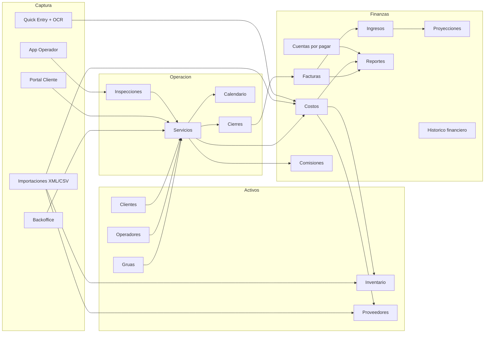

# Product Requirements Document (PRD)

## TMS Gruas - Towing Management System

- **Version del documento:** 3.4
- **Ultima actualizacion:** 2026-05-12
- **Estado:** Vigente
- **Base de actualizacion:** revision del routing real, paginas, componentes, hooks, servicios y `docs/modules/*`

---

## 0. Resumen ejecutivo

TMS Gruas es una plataforma web operativa y financiera para empresas de gruas en Chile. Centraliza el ciclo completo del negocio:

- solicitud o creacion del servicio
- asignacion de grua y operador
- ejecucion en terreno con inspeccion, fotos y firma
- cierre operacional
- facturacion y seguimiento de cobros
- control de costos, proveedores e inventario
- reportes, proyecciones y control administrativo

El producto hoy no es solo un "sistema de servicios". Es un backoffice integral con 3 superficies principales:

1. **Backoffice administrativo** para operaciones, finanzas, activos y configuracion.
2. **App de operador** con foco en inspeccion y evidencia en terreno.
3. **Portal cliente** para autoservicio, consulta documental y solicitud de servicios.

### Estado actual por area

| Area | Estado | Comentario |
|---|---|---|
| Servicios, calendario y cierres | Estable | Es el nucleo operacional del sistema. |
| Facturas, ingresos, costos y cuentas por pagar | Estable | Cobertura amplia y madura del flujo financiero. |
| Inventario, compras y proveedores | Estable | Hay trazabilidad cruzada con costos y XML. |
| App operador / inspecciones | Estable | Flujo operativo real con fotos, firma y PDF. |
| Portal cliente | Operativo | Permite solicitar servicios y revisar historial/facturas. |
| PWA, push y offline | Operativo con consolidacion pendiente | Existen capacidades reales, pero requieren endurecer conflictos y sincronizacion. |
| Integraciones externas | Operativas con dependencia | Email, push, OCR, mapas y peajes estan activos via Edge Functions. |
| WhatsApp | No implementado | No se observo integracion activa en el frontend actual. |
| Multi-tenant | Fuera de alcance actual | El producto se comporta como una implementacion single-tenant. |

---

## 1. Objetivo del producto

### Vision
Digitalizar de punta a punta la operacion de una empresa de gruas, reduciendo trabajo manual, errores administrativos y perdida de trazabilidad entre operacion, finanzas y activos.

### Objetivos principales

- consolidar servicios, clientes, gruas, operadores, facturas, costos, inventario y proveedores en una sola plataforma
- permitir trabajo en terreno desde movil con evidencia formal
- reducir reprocesos administrativos en facturacion, conciliacion, pagos y reporteria
- mantener trazabilidad operativa y financiera entre documentos, movimientos y usuarios
- habilitar decisiones gerenciales con indicadores y reportes actualizados

### Objetivos secundarios

- soportar importaciones masivas y captura asistida
- mantener experiencia web y PWA usable en escritorio y movil
- permitir administracion granular por rol y por modulo

### Terminos clave

| Termino | Significado operativo |
|---|---|
| Servicio | Unidad central de trabajo operativo del negocio. |
| Cierre | Agrupacion de servicios para control y posterior facturacion. |
| Costo | Registro financiero vinculado o vinculable a servicio, proveedor, inventario o grua. |
| Inventario / Bodega | Control de catalogo, stock y movimientos fisicos. |
| Proveedor | Entidad emisora de documentos, pagos y compras. |
| XML | DTE o documento estructurado usado para importacion automatizada. |
| Quick Entry | Captura rapida desde movil para registrar evidencia o preparar un costo. |
| Inspeccion | Evidencia formal del servicio en terreno, con fotos, formulario y firma. |
| Portal cliente | Superficie restringida para autoservicio del cliente. |
| App operador | Superficie operativa simplificada para usuarios `operator`. |

---

## 2. Alcance actual del producto

### Superficies de producto

| Superficie | Rutas principales | Proposito |
|---|---|---|
| Backoffice | `/dashboard`, `/services`, `/calendar`, `/closures`, `/clients`, `/cranes`, `/invoices`, `/costs`, `/inventory`, `/suppliers`, `/reports`, `/incomes`, `/accounts-payable`, `/settings`, etc. | Operacion, finanzas, activos y administracion. |
| Operador | `/operator`, `/operator/service/:id/inspection` | Ejecucion de inspecciones y seguimiento de servicios asignados. |
| Portal cliente | `/portal/dashboard`, `/portal/services`, `/portal/request-service`, `/portal/invoices` | Autoservicio de clientes y aseguradoras. |

### Roles soportados

| Rol | Alcance |
|---|---|
| `admin` | Control total de modulos administrativos, configuracion, usuarios, herramientas criticas y datos financieros. |
| `viewer` | Acceso de lectura a modulos administrativos y financieros. |
| `operator` | Acceso al portal de operador y funciones asociadas a servicios asignados. |
| `client` | Acceso restringido al portal cliente y sus propios documentos/servicios. |

### Permisos modulares
Ademas del rol base, el sistema maneja visibilidad granular por modulo para usuarios administrativos desde configuracion.

### Mapa ejecutivo de modulos

| Modulo | Ruta principal | Roles | Dependencias principales |
|---|---|---|---|
| Dashboard | `/dashboard` | `admin`, `viewer` | servicios, facturas, costos, inventario, alertas |
| Servicios | `/services` | `admin`, `viewer` | clientes, gruas, operadores, cierres, costos, inspecciones |
| Calendario | `/calendar` | `admin`, `viewer` | servicios, eventos, mantenciones |
| Cierres | `/closures` | `admin`, `viewer` | servicios, clientes, facturas |
| Clientes | `/clients` | `admin`, `viewer` | servicios, facturas, pipeline VIP |
| Gruas | `/cranes` | `admin`, `viewer` | servicios, mantenciones, repuestos, inventario, costos |
| Operadores | `/operators` | `admin` | servicios, inspecciones, comisiones |
| Facturas | `/invoices` | `admin`, `viewer` | cierres, clientes, pagos, ingresos, reportes |
| Ingresos | `/incomes` | `admin`, `viewer` | facturas, pagos, proyecciones |
| Costos | `/costs` | `admin`, `viewer` | servicios, proveedores, inventario, XML, reportes |
| Inventario | `/inventory` | `admin`, `viewer` | costos, proveedores, compras, gruas, movimientos |
| Proveedores | `/suppliers` | `admin`, `viewer` | pagos, XML, costos, inventario |
| Cuentas por pagar | `/accounts-payable` | `admin`, `viewer` | deudas, cuotas, pagos, reportes |
| Reportes | `/reports` | `admin`, `viewer` | servicios, facturas, costos, inventario, ingresos |
| Proyecciones | `/income-projections` | `admin`, `viewer` | facturas, ingresos, aging, cashflow |
| Comisiones | `/commissions` | `admin` | servicios, operadores, costos |
| Quick Entries | `/quick-entries` | `admin` | OCR, costos, evidencia movil |
| Daily Report | `/daily-report` | `admin`, `viewer` | servicios, finanzas, alertas |
| Trip Calculator | `/trip-calculator` | `admin`, `viewer` | mapas, peajes, tarifas operativas |
| Settings | `/settings` | `admin` | usuarios, permisos, configuracion, notificaciones |
| Backup | `/backup` | `admin` | backups, logs, restauracion operativa |
| Historical | `/historical` | `admin`, `viewer` | analitica financiera, historicos |
| App Operador | `/operator` | `operator`, `admin` | servicios asignados, inspecciones, fotos, firma |
| Portal Cliente | `/portal/*` | `client` | servicios propios, facturas, solicitudes |

---

## 3. Personas

### Administrador / gerente

- necesita vision global del negocio
- controla configuracion, usuarios, catalogos, backups y acciones criticas
- revisa KPIs, cierres, facturacion, costos, pagos, inventario y reportes

### Administrativo / finanzas

- registra servicios y documentos
- genera cierres y facturas
- concilia pagos
- carga costos, XML y movimientos asociados
- consulta reportes y estados

### Operador en terreno

- ve solo servicios asignados
- ejecuta inspecciones
- captura fotos y firma
- opera desde movil/PWA

### Cliente B2B / aseguradora / particular

- solicita servicios desde portal
- consulta estado e historial
- descarga facturas y documentos

---

## 4. Mapa funcional actual

---

## 5. Modulos funcionales vigentes

### 5.1 Dashboard

- tablero principal con metricas y alertas
- resumen operacional y financiero
- sirve como punto de entrada para usuarios administrativos

### 5.2 Servicios

- modulo central del negocio
- crea, edita, filtra y gestiona servicios
- maneja folios, estados, asignacion de recursos y datos del vehiculo/cliente
- se relaciona con cierres, costos, inspecciones, calendario y comisiones

### 5.3 Calendario

- vista temporal de servicios y eventos
- soporta navegacion diaria, semanal y mensual
- expone detalles y operacion calendarizada

### 5.4 Clientes

- CRUD de clientes y ficha ampliada
- historial de servicios y facturacion
- soporte a flujo VIP desde ficha de cliente

### 5.5 Cierres

- agrupa servicios por periodo para posterior facturacion
- puente formal entre operacion y finanzas

### 5.6 Facturas

- genera y administra facturas
- soporta vista tabular y pipeline
- incluye pagos, historial y acciones de marcado/correccion
- se integra con cierres, ingresos y alertas

### 5.7 Ingresos

- registra y gestiona ingresos/cobros
- complementa el seguimiento de facturas y pagos

### 5.8 Costos

- administra costos operativos y financieros
- soporta formularios manuales, carga CSV y carga XML
- cruza informacion con servicios, proveedores, inventario y gruas
- incluye deteccion de duplicados y trazabilidad de costo

### 5.9 Inventario / Bodega

- gestiona catalogo, stock, movimientos y ubicaciones
- soporta entradas, salidas, movimientos manuales y carga XML
- se integra con costos, proveedores, gruas y compras
- existe sincronizacion con compras mediante `UnifiedPurchaseService`

### 5.10 Proveedores

- administra proveedores, pagos y documentos asociados
- soporta importacion XML de documentos tributarios
- comparte flujos y datos con costos e inventario

### 5.11 Cuentas por pagar

- maneja acreedores, deudas, cuotas y pagos
- orientado al control estructurado de obligaciones financieras

### 5.12 Gruas

- administra activos de flota
- registra mantenciones, piezas, documentacion y costos relacionados
- consume inventario y vincula historial operacional

### 5.13 Operadores

- administra operadores, datos y tablas de soporte
- se relaciona con servicios, comisiones e inspecciones

### 5.14 Reportes

- reporteria operacional y financiera
- exportaciones a PDF y Excel
- combina datos de servicios, costos, facturas, ingresos e inventario

### 5.15 Proyecciones

- cashflow, aging y vistas proyectadas
- soporte a planificacion financiera

### 5.16 Comisiones

- calcula y presenta comisiones de operadores
- depende del cierre de servicios y sincronizacion financiera

### 5.17 Quick Entries

- captura rapida de informacion desde movil
- puede asistir carga de costos mediante OCR de boletas/comprobantes

### 5.18 Daily Report

- consolidado diario operacional/financiero

### 5.19 Trip Calculator

- calcula rutas, peajes y estimaciones
- usa integraciones externas para mapas y peajes

### 5.20 Settings / Catalogos / Backup

- configuracion general del sistema
- gestion de usuarios y permisos
- catalogos administrativos
- herramientas criticas y respaldos

### 5.21 App de operador

- dashboard de operador
- inspeccion de servicio asignado
- fotos, firma y generacion de evidencia/documentos

### 5.22 Portal cliente

- dashboard de cliente
- consulta de servicios y facturas
- solicitud de nuevos servicios

### 5.23 Historico financiero y pipeline VIP

- modulo `Historical` para vistas historicas y analiticas
- flujo VIP asociado a clientes y a importacion PDF

---

## 6. Flujos end-to-end principales

### 6.1 Servicio a cobro

1. Cliente solicita servicio o backoffice lo crea.
2. Administracion asigna grua y operador.
3. Operador ejecuta inspeccion en terreno con evidencia.
4. Servicio se cierra operacionalmente.
5. Backoffice agrupa en cierres cuando aplica.
6. Se genera factura.
7. Se registra o concilia pago.
8. Impacta dashboard, ingresos, reportes y proyecciones.

### 6.2 Compra o costo con proveedor

1. Usuario carga costo manualmente, por CSV o por XML.
2. El sistema valida proveedor, categoria, duplicados y sugerencias.
3. Puede crear costo, pago a proveedor y, si corresponde, movimiento de inventario.
4. La informacion queda enlazada con proveedor, documento y trazabilidad de compra.

### 6.3 Inventario con trazabilidad financiera

1. Se registra entrada o compra.
2. Se crea o enlaza costo asociado.
3. Se registra movimiento de inventario.
4. Si aplica, se descuenta o consume en grua/servicio.
5. Reportes y valorizacion se actualizan sobre la misma base.

### 6.4 Captura rapida con OCR

1. Usuario captura foto de documento.
2. Edge Function procesa OCR.
3. El sistema propone datos para costo o registro posterior.

### 6.5 Solicitud desde portal cliente

1. Cliente autenticado ingresa al portal.
2. Completa formulario dinamico de solicitud.
3. Se crea solicitud/servicio segun flujo configurado.
4. Se notifica y se incorpora al trabajo administrativo.

---

## 7. Reglas de negocio clave

- `services` es la entidad central del dominio.
- La conciliacion de pagos es manual; no se asume matching automatico final.
- Costos, inventario y proveedores estan fuertemente acoplados en compras y XML.
- Las importaciones XML deben tratar duplicados y coincidencias similares antes de registrar.
- Las inspecciones del operador son parte formal del expediente operativo del servicio.
- Los cierres son la unidad operacional previa a la facturacion para clientes B2B.
- Las comisiones dependen del cierre correcto del servicio y de la sincronizacion de costos/reglas.
- El sistema usa timezone de negocio y no debe depender de la zona horaria local del dispositivo para logica critica.

### Criterios transversales de aceptacion para cambios futuros

Todo cambio relevante de producto deberia cumplir, como minimo, con estos criterios:

- no romper el flujo operativo actual del modulo intervenido
- respetar permisos por rol y visibilidad por modulo
- mantener trazabilidad cuando afecte servicios, facturas, costos, pagos, inventario o proveedores
- contemplar estados vacios, errores de red y feedback visible al usuario
- validar impactos cruzados cuando el flujo toque `costos`, `inventario`, `proveedores`, `cierres` o `facturas`
- revisar importaciones, duplicados y sincronizacion si el cambio afecta XML, CSV o OCR
- dejar referencia actualizada en `PRD.md` o `docs/modules/*` cuando cambie el alcance funcional

---

## 8. Arquitectura funcional actual

### Frontend

- React + TypeScript + Vite
- React Router con lazy loading por ruta
- React Query para acceso y cache de datos
- UI basada en Radix/shadcn

### Backend y datos

- Supabase como backend principal
- PostgreSQL con tablas relacionales y RPCs
- Auth, Storage, Realtime y Edge Functions

### Patrones observados

- hooks fachada por dominio
- transformacion de datos al borde entre Supabase y UI
- invalidacion de cache como mecanismo principal de sincronizacion
- servicios utilitarios para flujos complejos de compra e inventario

### Archivos fuente de referencia

- `src/App.tsx`
- `src/hooks/useServices.ts`
- `src/hooks/services/useServiceQueries.ts`
- `src/hooks/services/useServiceManager.ts`
- `src/hooks/useInventory.ts`
- `src/hooks/useUnifiedRealtimeManager.ts`
- `src/services/UnifiedPurchaseService.ts`
- `src/utils/businessClock.ts`

---

## 9. Integraciones y Edge Functions confirmadas

### Edge Functions observadas en uso

- `send-user-invitation`
- `send-password-reset`
- `send-invoice-email`
- `send-inspection-email`
- `send-service-confirmation`
- `send-daily-pending-report`
- `generate-backup`
- `generate-sql-dump`
- `parse-receipt-image`
- `sre-lookup`
- `tollroutes-proxy`
- `mapbox-proxy`
- `save-push-subscription`
- `remove-push-subscription`
- `send-push-notification`

### Integraciones funcionales derivadas

- correo transaccional
- push notifications
- OCR server-side para comprobantes
- mapas y rutas
- peajes
- busqueda/lookup externo de datos
- backup y exportacion

### Integraciones no confirmadas como activas en frontend actual

- WhatsApp / Meta Cloud API
- multi-tenant real

---

## 10. Importaciones y automatizacion documental

### XML

El producto soporta importacion XML en al menos 4 frentes:

- `Facturas` / documentos financieros
- `Costos`
- `Proveedores`
- `Inventario/Bodega`

Capacidades observadas:

- parseo de DTE
- deteccion de duplicados y coincidencias similares
- clasificacion por proveedor
- sincronizacion de glosas y defaults
- integracion opcional con inventario

### CSV

- carga masiva en costos
- carga masiva en servicios

### PDF / OCR

- PDF en inspecciones y reportes
- OCR de comprobantes para captura rapida
- importaciones PDF asociadas al pipeline VIP

---

## 11. PWA, offline y notificaciones

### Capacidades verificadas

- instalacion PWA
- Service Worker
- push notifications
- almacenamiento offline via IndexedDB
- colas de acciones offline y sincronizacion cuando vuelve conexion
- cache local de servicios y datos seleccionados

### Alcance offline observado

- hay infraestructura real para trabajo offline
- el flujo parece priorizar especialmente al rol operador y ciertos datos de servicios
- sigue siendo necesario explicitar mejor limites, conflictos y casos no soportados a nivel de producto

---

## 12. Seguridad y control de acceso

- autenticacion sobre Supabase Auth
- rutas protegidas por rol
- roles base: `admin`, `viewer`, `operator`, `client`
- permisos granulares por modulo para usuarios administrativos
- separacion de superficies entre backoffice, operador y portal cliente
- uso de RLS y helpers seguros a nivel backend documentado en el repositorio

### Requisito de producto

Toda funcionalidad nueva debe respetar:

- aislamiento por rol
- visibilidad minima necesaria
- trazabilidad de cambios sobre operaciones financieras y operativas

---

## 13. Requisitos no funcionales

### Rendimiento

- navegacion SPA con carga diferida por rutas
- pre-carga de chunks principales despues del render inicial
- cache de consultas con React Query

### Usabilidad

- interfaz responsive para escritorio y movil
- experiencia diferenciada por perfil
- patrones visuales consistentes entre modulos administrativos

### Confiabilidad

- build estable del frontend
- soporte de sincronizacion en tiempo real
- mecanismos de idempotencia parcial en compras/inventario

### Mantenibilidad

- documentacion modular en `docs/modules/*`
- separacion por paginas, hooks, componentes y utilidades

---

## 14. KPIs de producto

### Operacion

- tiempo desde solicitud a asignacion
- porcentaje de servicios inspeccionados digitalmente
- porcentaje de servicios cerrados dentro del SLA

### Finanzas

- tiempo desde cierre a facturacion
- porcentaje de facturas conciliadas
- monto vencido y aging de cobranza
- desviacion entre costos y presupuesto por periodo

### Inventario y compras

- tiempo de registro de compra
- porcentaje de compras con trazabilidad completa costo + proveedor + inventario
- quiebres de stock y sobrestock

### Adopcion

- usuarios activos por rol
- tasa de uso del portal cliente
- tasa de uso de app operador
- porcentaje de documentos cargados por XML/CSV versus manual

---

## 15. Roadmap recomendado desde el estado actual

### Prioridad alta

1. **Endurecer producto offline/PWA**
   - definir conflictos, reintentos, limites de almacenamiento y estados de sync visibles

2. **Separar claramente entornos y datos**
   - evitar ambiguedad entre preview, desarrollo y productivo

3. **Cerrar definicion de integraciones externas criticas**
   - mapas, peajes, OCR, email y push con fallback operativo

### Prioridad media

4. **Consolidar PRD y mapa de modulos con trazabilidad a codigo**
5. **Homogeneizar UX en importadores y cargas masivas**
6. **Fortalecer testing automatizado en flujos de negocio criticos**

### Prioridad baja / futura

7. **Evaluar WhatsApp si se confirma decision de negocio**
8. **Evaluar multi-tenant solo si cambia la estrategia comercial**

---

## 16. Riesgos actuales

| Riesgo | Impacto | Mitigacion recomendada |
|---|---|---|
| Dependencia de Edge Functions e integraciones externas | Medio/Alto | Fallbacks operativos y monitoreo por integracion |
| Ambiguedad del alcance offline | Alto | Definir matriz oficial de soporte offline por modulo |
| Complejidad de sincronizacion entre costos, inventario y proveedores | Alto | Mantener flujos conservadores y trazabilidad transaccional |
| Crecimiento del frontend y chunks pesados | Medio | Code splitting adicional y revision de bundles |
| Diferencia entre documentacion historica y comportamiento actual | Medio | Mantener PRD y docs/modules sincronizados con el codigo |

### Matriz resumida de modulo, datos e integraciones criticas

| Modulo | Entidades / tablas dominantes | Integraciones o dependencias criticas | Riesgo principal |
|---|---|---|---|
| Servicios | `services`, `service_resources`, relaciones con clientes, gruas y operadores | asignacion, inspecciones, calendario, cierres | inconsistencia entre estado operativo y recursos asignados |
| Facturas e ingresos | `invoices`, pagos, cierres, clientes | email, conciliacion, pipeline, reportes | desalineacion entre emision, cobro y estado financiero |
| Costos | `costs`, clasificaciones, relaciones con servicio/proveedor | XML, CSV, inventario, proveedores | duplicados, clasificacion incorrecta o enlace incompleto |
| Inventario | `inventory_items`, `inventory_stock`, `inventory_movements` | compras, costos, consumo en gruas, XML | quiebres de trazabilidad entre costo y movimiento fisico |
| Proveedores | `inventory_suppliers`, pagos, documentos XML | costos, inventario, calendario de pagos | pagos o documentos sin asociacion consistente |
| Cuentas por pagar | acreedores, deudas, cuotas, pagos | reportes financieros | divergencia entre deuda estructurada y caja real |
| Operador / inspecciones | servicios asignados, inspecciones, adjuntos | PWA, PDF, email | perdida de evidencia o sync incompleto offline |
| Portal cliente | servicios y facturas del cliente | auth, permisos, formularios dinamicos | exposicion indebida de datos o solicitudes incompletas |
| Reportes y proyecciones | agregados de servicios, facturas, costos, ingresos | exportadores, filtros, calculos derivados | decisiones sobre datos incompletos o no sincronizados |

---

## 17. Out of scope actual

- multi-tenant real
- automatizacion completa de conciliacion contable
- WhatsApp operativo confirmado
- apertura del sistema como plataforma generica para multiples verticales fuera del rubro de gruas

---

## 18. Trazabilidad tecnica resumida

Tabla orientada a onboarding. Lista archivos y hooks representativos, no exhaustivos.

| Modulo | Pagina / entrypoint | Hooks / servicios clave | Documentacion relacionada |
|---|---|---|---|
| Servicios | `src/pages/Services.tsx` | `useServicesPage`, `useServices`, `useServiceManager`, `useServiceQueries` | `docs/modules/services.md` |
| Facturas | `src/pages/Invoices.tsx` | `useInvoices`, `usePagedInvoices` | `docs/modules/invoices.md` |
| Costos | `src/pages/Costs.tsx` | `useCosts`, `useDeleteCost`, `useUniversalSync`, `useInventorySyncWatcher` | `docs/modules/costs.md` |
| Inventario | `src/pages/Inventory.tsx` | `useInventory`, `useInventoryStats`, `useInventoryMovements`, `UnifiedPurchaseService` | `docs/modules/inventory.md` |
| Proveedores | `src/pages/Suppliers.tsx` | `useSupplierStats`, `XMLDocumentUpload` | `docs/modules/suppliers.md` |
| Cierres | `src/pages/Closures.tsx` | hooks propios de cierres y relaciones con facturacion | `docs/modules/closures.md` |
| Clientes | `src/pages/Clients.tsx` | hooks de clientes y formularios/ficha de cliente | `docs/modules/clients.md` |
| Gruas | `src/pages/Cranes.tsx` | hooks de flota, mantenciones y consumo de inventario | `docs/modules/cranes.md` |
| Reportes | `src/pages/Reports.tsx` | `useReports`, exportadores PDF/XLSX | `docs/modules/reports.md` |
| Ingresos y proyecciones | `src/pages/Incomes.tsx`, `src/pages/IncomeProjections.tsx` | hooks de ingresos, pipeline y proyeccion | `docs/modules/incomes.md`, `docs/modules/projections.md` |
| Cuentas por pagar | `src/pages/AccountsPayable.tsx` | hooks de deudas, cuotas y pagos | `docs/modules/accounts-payable.md` |
| Comisiones | `src/pages/Commissions.tsx` | hooks y RPCs de comisiones | `docs/modules/commissions.md` |
| Operador | `src/pages/operator/OperatorDashboard.tsx`, `src/pages/operator/ServiceInspection.tsx` | `useServiceInspection` | `docs/modules/operator-app.md` |
| Portal cliente | `src/pages/portal/PortalDashboard.tsx`, `src/pages/portal/PortalRequestService.tsx` | hooks del portal y formularios de solicitud | `docs/modules/portal.md` |
| Backup y settings | `src/pages/Backup.tsx`, `src/pages/Settings.tsx` | `useBackupManager`, hooks de usuarios/permisos | `docs/modules/backup.md`, `docs/modules/settings-admin.md` |
| Realtime y sincronizacion | `src/App.tsx`, capas compartidas | `useUnifiedRealtimeManager`, `useUniversalSync`, `globalDataRefresh` | documentado transversalmente en el codigo y docs modulares |

---

## 19. Fuente de verdad complementaria

Este PRD debe leerse junto con:

- `src/App.tsx` para routing y superficies activas
- `docs/modules/README.md` para mapa tecnico por modulo
- `docs/modules/*.md` para detalle tecnico de cada area
- `src/hooks/*` y `src/services/*` para flujos funcionales reales

Cuando exista diferencia entre documentacion historica y codigo vigente, debe prevalecer el comportamiento observable en el codigo y luego actualizar esta documentacion.

### Gobernanza recomendada del documento

- actualizar este PRD cuando cambie el alcance real de rutas, modulos o integraciones
- reflejar cambios mayores de UX o negocio tambien en `docs/modules/*`
- usar el PRD como fuente ejecutiva y las docs modulares como detalle tecnico
- evitar registrar funcionalidades aspiracionales como si ya estuvieran operativas
