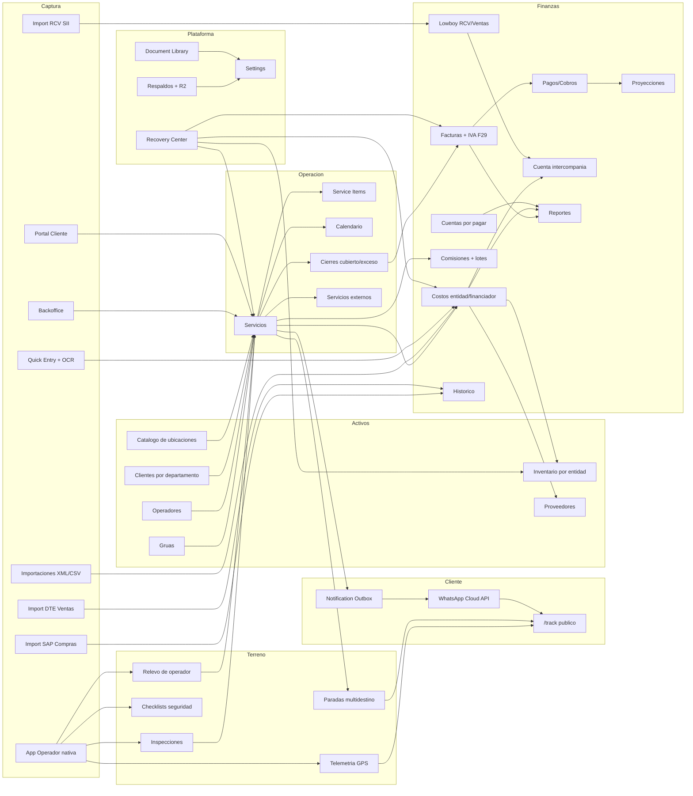

# Product Requirements Document (PRD)

## TMS Grúas 5 Norte — Towing Management System

- **Versión del documento:** 5.0
- **Última actualización:** 2026-08-19
- **Reemplaza a:** v4.2 (2026-07-04)
- **Estado:** Vigente
- **Base de actualización:** barrido completo del código al 2026-08-19 — routing (`src/App.tsx`), 1.476 archivos TS/TSX, 213 migraciones, 49 Edge Functions, 142 tablas + 3 vistas de `public`, `docs/*` y los 244 commits posteriores a la v4.2.

---

## 0. Resumen ejecutivo

TMS Grúas es la plataforma operativa, financiera y de terreno de **Grúas 5 Norte SpA** y su unidad hermana **LowBoy Chile SpA**. Cubre el ciclo completo del negocio:

- solicitud o creación del servicio (backoffice, portal cliente o carga masiva)
- asignación de grúa y operador, con aviso automático por WhatsApp
- **ejecución en terreno desde app móvil nativa**, con GPS en segundo plano, inspección fotográfica, firma y checklists de seguridad
- **seguimiento público en vivo del servicio** por link con token (experiencia tipo Uber, con ETA y línea de tiempo)
- cierre operacional canónico (con soporte de cubierto/exceso y servicios externalizados)
- facturación, cobros, IVA (F29) y control de cuentas por pagar
- control de costos por entidad legal, proveedores, bodega e inventario serializado
- **Lowboy**: unidad de negocio con su propio libro de compras/ventas (RCV SII), contenedores serializados y resultado tributario
- importación histórica de compras (SAP) y ventas (DTE SII)
- administración documental, cumplimiento de flota y alertas de vencimiento
- reportes, proyecciones, comisiones y control administrativo
- respaldos verificables con copia fuera de sitio (R2) y vigilancia automática

El producto tiene **cuatro superficies**:

1. **Backoffice administrativo** — operaciones, finanzas, activos, configuración (web, Cloudflare Pages).
2. **App de operador** — aplicación **nativa iOS/Android** (Capacitor 8), no solo PWA: telemetría GPS en segundo plano, inspecciones, checklists, mapa en vivo y widgets del sistema.
3. **Portal cliente** — autoservicio B2B/aseguradoras.
4. **Seguimiento público** (`/track/:token`) — superficie sin autenticación para el destinatario final del servicio.

### Estado actual por área

| Área | Estado | Comentario |
|---|---|---|
| Servicios, calendario y cierres | Estable | Núcleo operacional. Cierre unificado en `complete_service`; guardas de integridad en base de datos. |
| Multidestino (paradas) | Estable | `service_stops` con ETA y geocerca por parada; retrocompatible con servicios sin paradas. |
| Seguimiento público `/track` | Estable | Token con ciclo de vida, ETA por etapa, línea de tiempo monótona, WhatsApp automático. |
| App operador nativa (iOS/Android) | Estable, con pendiente de build | Capacitor 8, GPS en segundo plano con cola nativa, relanzamiento por cambio significativo de ubicación. Cambios acumulados esperan rebuild. |
| Telemetría y métricas de ruta | Estable | Km reales por vía (Map Matching) + haversine; watchdog que distingue detenido de sin señal. |
| Checklists de seguridad | Operativo | Pre-operacional grúa-cama y fatiga/somnolencia, con PDF y envío interno. |
| Inspecciones | Estable | Firmante que entrega ≠ quien recibe; equipamiento con ausentes explícitos; archivado a R2 a los 30 días. |
| Facturas, pagos, IVA (F29), cuentas por pagar | Estable | Cobertura amplia y madura del flujo financiero, con vista por cliente y anulaciones. |
| Costos por entidad legal | Estable | `costs.entity` / `paid_by` separan Grúas 5 Norte de LowBoy, con cuenta corriente intercompañía. |
| Lowboy (RCV, contenedores, ventas) | Estable | Libro de compras/ventas SII, contenedores serializados, ventas producto/flete, resultado IVA + margen. |
| Inventario / Bodega | Estable | Bodegas separadas por entidad, paginación server-side de movimientos, stock bajo con definición única. |
| Proveedores y compras | Estable | Categorías propias, consolidación de duplicados, XML por línea. |
| Portal cliente | Operativo | Rediseñado (tipografía, a11y, móvil, línea de tiempo honesta) con acceso al tracker en vivo. |
| Servicios externos (tercerizados) | Operativo | Cierre con evidencia y acta al proveedor. |
| Importadores históricos (SAP / DTE SII) | Estable | Detección de duplicados cross-módulo. |
| Notificaciones (WhatsApp, email, push) | Estable | `notification_outbox` con reintentos; interruptor por servicio hacia el cliente (apagado por defecto). |
| Respaldos | Estable | Dump completo por Postgres, verificación por round-trip, copia a R2, purga con retención y watchdog. |
| Sistema visual y apariencia | Estable | Tema claro/oscuro/automático, densidad y escala de texto como tokens únicos. |
| PWA y offline | Operativo, alcance acotado | Terreno del operador: validado. Backoffice offline: fuera de foco. |
| Multi-tenant | Fuera de alcance | Implementación single-tenant, dos entidades legales dentro del mismo tenant. |

### Deuda técnica reconocida (medida, no estimada)

| Indicador | Valor al 2026-08-19 |
|---|---|
| Errores de tipos (`tsc --noEmit`) | **99** — el build de Vite no chequea tipos, por eso no rompen despliegue |
| Archivos muertos catalogados | **161 archivos / 26.608 LOC** (10,4 % de `src/`), inventariados en `CODIGO_MUERTO.md` |
| Suite de tests | 140 archivos, 1.253 tests; **2-3 fallan** (contratos visuales + `_shared/r2.test.ts`, que es de Deno) |
| Migraciones aplicadas | 213 |

---

## 1. Objetivo del producto

### Visión
Digitalizar de punta a punta la operación de una empresa de grúas en Chile, reduciendo trabajo manual, errores administrativos y pérdida de trazabilidad entre terreno, operación, finanzas y activos — y darle al cliente final una respuesta verificable de dónde está su vehículo.

### Objetivos principales

- consolidar servicios, clientes, grúas, operadores, facturas, costos, inventario y proveedores en una sola plataforma
- **llevar el terreno al sistema en tiempo real**: posición, etapa, evidencia y firma desde la app nativa del operador
- **darle al cliente visibilidad honesta** del servicio sin exponer datos internos
- reducir reprocesos administrativos en facturación, conciliación, pagos y reportería
- mantener trazabilidad operativa y financiera entre documentos, movimientos y usuarios
- **separar contablemente las dos entidades legales** sin duplicar la operación
- habilitar decisiones gerenciales con indicadores y reportes actualizados
- prevenir duplicados y registros huérfanos entre módulos
- garantizar que el dato sea recuperable: respaldo completo, verificado y fuera de sitio

### Objetivos secundarios

- soportar importaciones masivas y captura asistida (XML, CSV, OCR, PDF)
- mantener experiencia usable en escritorio, móvil y app nativa
- permitir administración granular por rol y por módulo
- ofrecer auditoría y reversibilidad de operaciones críticas

### Términos clave

| Término | Significado operativo |
|---|---|
| Servicio | Unidad central de trabajo operativo. Tabla `services`, folio por secuencia. |
| Parada (stop) | Punto intermedio o final de un servicio multidestino (`service_stops`), con ETA y geocerca propia. |
| Etapa del viaje (`journey_stage`) | Progreso del traslado: `assigned` → `en_route` → `on_site` → `towing` → `finished`. Monótona hacia adelante en `/track`. |
| Sesión de transmisión | Ventana en que la app del operador está enviando GPS (`operator_location_sessions`). La sesión en base de datos manda, no el estado del teléfono. |
| Link de seguimiento | Token público con expiración (`service_tracking_links`) que habilita `/track/:token`. |
| Cierre | Agrupación de servicios para facturación, con soporte cubierto/exceso. |
| Costo | Registro financiero vinculable a servicio, proveedor, inventario o grúa, **con entidad legal y financiador**. |
| Entidad (`entity`) | Empresa dueña del gasto: `gruas_5_norte` o `lowboy`. |
| Financiador (`paid_by`) | Empresa que efectivamente pagó. La diferencia contra `entity` es la deuda intercompañía. |
| RCV | Registro de Compras y Ventas del SII, importado por CSV en el módulo Lowboy. |
| Checklist | Formulario de seguridad firmado por el operador: pre-operacional grúa-cama o fatiga/somnolencia. |
| Inspección | Evidencia formal del servicio en terreno: fotos, equipamiento, items y dos firmas (entrega y recibe). |
| Relevo (handoff) | Traspaso de un servicio en curso entre operadores, con fotos del entrante. |
| Departamento de cliente | Unidad separada dentro de un mismo RUT. **Ningún módulo agrupa por RUT.** |
| Recovery Center | Módulo de auditoría, simulación y reversión de operaciones. |
| Document Library | Biblioteca documental clasificada por categoría y entidad. |
| Outbox | Cola `notification_outbox` que despacha WhatsApp/email con reintentos y motivos de omisión. |
| Quick Entry | Captura rápida desde móvil para registrar evidencia o preparar un costo. |
| SAP / DTE SII | Orígenes de importación histórica de compras y ventas. |

---

## 2. Alcance actual del producto

### Superficies de producto

| Superficie | Rutas | Autenticación | Propósito |
|---|---|---|---|
| Backoffice | `/dashboard`, `/services`, `/calendar`, `/closures`, `/clients`, `/cranes`, `/vehicles`, `/operators`, `/invoices`, `/costs`, `/accounts-payable`, `/inventory`, `/suppliers`, `/reports`, `/income-projections`, `/commissions`, `/historical`, `/lowboy`, `/document-library`, `/trip-calculator`, `/daily-report`, `/operator-locations`, `/quick-entries`, `/settings`, `/backup`, `/admin/*` | Supabase Auth + rol + permiso de módulo | Operación, finanzas, activos y administración. |
| App operador | `/operator`, `/operator/activity`, `/operator/profile`, `/operator/checklists`, `/operator/service/:id/inspection` | Auth + PIN de operador | Ejecución en terreno, telemetría, inspección y checklists. |
| Portal cliente | `/portal/dashboard`, `/portal/services`, `/portal/purchase-orders`, `/portal/request-service`, `/portal/invoices`, `/portal/account` | Auth rol `client` | Autoservicio de clientes y aseguradoras. |
| Seguimiento público | `/track/:token` | **Ninguna** (token + PIN opcional) | Seguimiento en vivo para el destinatario del servicio. |

Rutas transversales:

- autenticación: `/auth`, `/auth/callback`, `/register`, `/pending`, `/reset-password`
- alias: `/operador` → `/operator` (deep link nativo, conserva la query), `/libros-sii` → `/lowboy`
- redirecciones a Configuración: `/service-types`, `/service-rates`, `/cost-centers`
- diagnóstico/QA interno: `/performance-test`, `/debug-freeze`, `/connection-test`

### Roles soportados (`app_role`)

| Rol | Alcance |
|---|---|
| `admin` | Control total de módulos administrativos, configuración, usuarios, herramientas críticas y datos financieros. |
| `viewer` | Lectura de módulos administrativos y financieros. |
| `operator` | App de operador y funciones asociadas a servicios asignados. |
| `client` | Portal cliente y sus propios documentos/servicios. |

Estados de cuenta: alta con aprobación (`/register` → `/pending` → `/admin/usuarios-pendientes`), invitación por email, y **auto-eliminación de cuenta** (`delete-my-account`, requisito de tienda de apps).

### Permisos modulares (`user_module_permissions`)

21 llaves de módulo definidas en `src/constants/modules.ts`, evaluadas en el `Sidebar` y en las rutas:

| Llave | Módulo | Roles por defecto |
|---|---|---|
| `dashboard` | Dashboard | admin, viewer |
| `services` | Servicios | admin, viewer |
| `calendar` | Calendario | admin, viewer |
| `closures` | Cierres | admin, viewer |
| `clients` | Clientes | admin, viewer |
| `operators` | Operadores | admin |
| `cranes` | Grúas | admin, viewer |
| `invoices` | Facturas | admin, viewer |
| `costs` | Costos | admin, viewer |
| `inventory` | Inventario | admin, viewer, operator |
| `document-library` | Biblioteca Documental | admin, viewer |
| `trip-calculator` | Cálculo de Viajes | admin, viewer |
| `reports` | Reportes | admin, viewer |
| `income-projections` | Proyección de Ingresos | admin, viewer |
| `commissions` | Comisiones | admin |
| `suppliers` | Proveedores | admin, viewer |
| `accounts-payable` | Cuentas por Pagar | admin, viewer |
| `service-rates` | Tarifas | admin |
| `backup` | Respaldos | admin |
| `settings` | Configuración | admin |
| `operator_portal` | Portal Operador | operator |

> **Brecha conocida:** `historical`, `lowboy`, `operator-locations`, `daily-report`, `quick-entries` y `external-services` no tienen llave de permiso modular propia; su visibilidad depende solo del rol (`adminOnly` en el Sidebar). Ver §15.

### Mapa ejecutivo de módulos

| Grupo (Sidebar) | Módulo | Ruta | Acceso | Dependencias principales |
|---|---|---|---|---|
| Principal | Dashboard | `/dashboard` | admin, viewer | servicios, facturas, costos, inventario, alertas, indicadores económicos |
| Principal | Portal Operador | `/operator` | operator | servicios asignados, telemetría, inspecciones, checklists |
| Principal | Informe Diario | `/daily-report` | admin, viewer | servicios, finanzas, alertas |
| Operaciones | Servicios | `/services` | admin, viewer | clientes, grúas, operadores, cierres, costos, inspecciones, `service_items`, `service_stops` |
| Operaciones | Servicios Externos | `/admin/external-services` | admin | servicios tercerizados, evidencia, acta al proveedor |
| Operaciones | Clientes | `/clients` | admin, viewer | servicios, facturas, pipeline VIP, departamentos por RUT |
| Operaciones | Biblioteca Documental | `/document-library` | admin, viewer | `business_documents`, Storage, vencimientos |
| Operaciones | Calendario | `/calendar` | admin, viewer | servicios, eventos, mantenciones |
| Recursos | Grúas | `/cranes` | admin, viewer | mantenciones, repuestos, documentos, inventario, costos |
| Recursos | Operadores | `/operators` | admin | servicios, comisiones, inspecciones, documentos, PIN |
| Recursos | Vehículos | `/vehicles` | admin | catálogo marca/modelo, historial por patente |
| Recursos | Ubicaciones | `/operator-locations` | admin | sesiones y puntos GPS, rutas ajustadas a calles, tiempos muertos, catálogo `saved_locations` |
| Inventario | Bodega | `/inventory` | admin, viewer, operator | costos, proveedores, compras, grúas, movimientos, bodega por entidad |
| Inventario | Proveedores | `/suppliers` | admin, viewer | `supplier_categories`, pagos, XML, costos, inventario |
| Finanzas | Costos | `/costs` | admin, viewer | servicios, proveedores, inventario, XML, entidad/financiador |
| Finanzas | Cuentas por Pagar | `/accounts-payable` | admin, viewer | acreedores, deudas, cuotas, pagos |
| Finanzas | Comisiones | `/commissions` | admin | servicios, operadores, lotes de pago |
| Finanzas | Cierres | `/closures` | admin, viewer | servicios, clientes, facturas, cubierto/exceso |
| Finanzas | Facturas | `/invoices` | admin, viewer | cierres, clientes, pagos, IVA F29, anulaciones |
| Finanzas | Históricos | `/historical` | admin, viewer | importación SAP/DTE, compras/ventas históricas |
| Finanzas | Lowboy | `/lowboy` | admin, viewer | RCV SII, contenedores, ventas, resultado IVA/margen |
| Finanzas | Cálculo de Viajes | `/trip-calculator` | admin, viewer | Google Maps, peajes GetAPI V3, tarifas |
| Análisis | Proyección de Ingresos | `/income-projections` | admin, viewer | facturas, pagos, aging, cashflow |
| Análisis | Reportes | `/reports` | admin, viewer | servicios, facturas, costos, inventario, pagos, operadores |
| Configuración | Configuración | `/settings` | admin | usuarios, permisos, catálogos, alertas, apariencia, recuperación |
| Configuración | Respaldos | `/settings#respaldos` y `/backup` | admin | respaldos, logs, R2, verificación |
| Configuración | Registros Rápidos | `/quick-entries` | admin | OCR, costos, evidencia móvil |
| Configuración | Regenerar Inspección | `/admin/inspecciones/regenerar` | admin | inspecciones, PDF, R2 |
| Configuración | Usuarios pendientes | `/admin/usuarios-pendientes` | admin | aprobación de altas |

---

## 3. Personas

### Administrador / gerente

- necesita visión global del negocio y de las dos entidades legales
- controla configuración, usuarios, catálogos, respaldos, categorías y acciones críticas
- administra Recovery Center, herramientas de emergencia, importaciones históricas
- revisa KPIs, cierres, facturación, costos, pagos, inventario y reportes
- **es quien decide cuándo se publica una nueva versión de la app del operador**

### Administrativo / finanzas

- registra servicios y documentos; genera cierres y facturas (cubierto y exceso)
- concilia pagos, controla IVA (F29) y cuentas por pagar
- carga costos, XML y movimientos asociados, asignando entidad y financiador
- importa históricos SAP (compras), DTE SII (ventas) y RCV (Lowboy)
- consulta reportes, proyecciones y estados

### Operador en terreno

- trabaja desde la **app nativa**, no desde el navegador
- ve solo servicios asignados y vigentes
- transmite posición mientras conduce; su app sobrevive a suspensión del sistema y pérdida de red
- ejecuta checklists de seguridad, inspecciones con fotos y firmas, y entrega evidencia
- puede recibir o entregar un servicio en curso mediante relevo

### Cliente B2B / aseguradora / particular

- solicita servicios desde el portal y consulta estado e historial
- descarga facturas y documentos
- accede al seguimiento en vivo del servicio

### Destinatario final del servicio (sin cuenta)

- recibe un link por WhatsApp y abre `/track/:token`
- ve etapa, ETA y posición de la grúa; puede llamar al contacto operativo
- **no ve** datos financieros, otros servicios ni información del operador más allá de lo necesario

---

## 4. Mapa funcional actual



---

## 5. Módulos funcionales vigentes

### 5.1 Dashboard (`/dashboard`)

- tablero principal con métricas operativas y financieras
- panel de alertas (`AlertsPanel`) y resumen de pendientes por categoría (`PendingSummaryModal`)
- tabla de servicios recientes
- **cinta de indicadores económicos chilenos** (`EconomicIndicatorsTicker`, fuente `findic.cl` habilitada en CSP)

### 5.2 Servicios (`/services`)

Módulo central del negocio.

- CRUD, folios por secuencia, estados, asignación de recursos, datos de vehículo y cliente
- **items del servicio** (`service_items`): glosa, cantidad y valor unitario por línea
- **multidestino**: `service_stops` con orden, tipo, dirección, coordenadas, geocerca de 300 m y marca de llegada (`reached_at`); retrocompatible con servicios sin paradas
- **campo de ubicación con cascada de resolución**: catálogo curado `saved_locations` primero, luego Places Text Search, geocoding y plus codes; pin manual solo para admin; `location_source` registra de dónde salió cada coordenada
- **etiqueta y coordenada desacopladas**: el texto libre nunca bloquea el guardado; la coordenada solo frena cuando se va a usar
- costos del servicio con **entidad y financiador derivados de la grúa** (LowBoy vs G5N), con anulación por costo
- historial de cambios ampliado (`service_change_history`), sin registrar cambios no-op
- carga masiva por CSV con previsualización completa del lote
- vista tabla, pipeline y móvil; filtros avanzados; acciones por lote
- panel de relevo de operador (`ServiceHandoffPanel`)
- interruptor de notificaciones al cliente por servicio (`ClientNotificationsToggle`)
- **guardas de integridad**: no se puede borrar un servicio con evidencia de terreno; el folio no se recicla; el DELETE queda auditado con snapshot

### 5.3 Calendario (`/calendar`)

- vista temporal de servicios, eventos y mantenciones
- navegación diaria, semanal y mensual

### 5.4 Clientes (`/clients`)

- CRUD y ficha ampliada; historial de servicios y facturación
- RUT normalizado (`xx.xxx.xxx-x`)
- **departamentos**: cada departamento de un mismo RUT es una unidad separada. Ningún módulo agrupa por RUT; el rótulo `Nombre — Departamento` es lo que los distingue en listas y selectores
- contactos de cobranza (`client_billing_contacts`) y selector de destinatarios para avisos
- pipeline VIP desde la ficha (`/clients/:clientId/pipeline`)

### 5.5 Cierres (`/closures`)

- agrupa servicios por período para facturación
- `value_type` cubierto / exceso: cierres independientes para la parte cubierta y el exceso de un mismo servicio
- **wizard con filtro de cliente resuelto en el servidor** (no sobre la página cargada)
- disponibilidad de facturación y manejo de excesos con órdenes de compra de aseguradora ocultas en vistas de terceros
- puente formal entre operación y finanzas

### 5.6 Facturas (`/invoices`)

Pestañas: **Facturas**, **Por cliente**, **IVA (F29)**, **Pipeline**, **Alertas**, **Pagos**, **Anulaciones**.

- genera y administra facturas de venta; `source` para trazabilidad de origen
- vista por cliente (`InvoicesByClientView`)
- **IVA (F29)**: panel de débito fiscal con selector de período. `paid_amount` no es confiable como criterio: se usa `status = 'paid'`; las anuladas se excluyen por `status` + `invoice_cancellations`
- alertas de vencimiento con configuración propia y notificación por email con plantilla de membrete
- anulaciones con historial (`invoice_cancellations`)
- exportación con filtros y previsualización
- pago automático al marcar una factura como pagada

### 5.7 Pagos y cobros (dentro de Facturas)

- aplicación de pagos FIFO, manual o proporcional (`apply_payment_fifo`, `apply_payment_manual`)
- conciliación, reasignación y detección de duplicados
- aviso preventivo "Folio detectado" en `PaymentForm` y `SmartPaymentForm` cuando el folio se escribe en notas o referencia bancaria en vez de vincular la factura
- importación de pagos de cliente (`ClientPaymentImportDialog`)

### 5.8 Costos (`/costs`)

- CRUD de costos operativos y financieros; formulario manual, carga CSV y carga XML
- **entidad legal y financiador** (`entity` / `paid_by`) obligatorios: separan Grúas 5 Norte de LowBoy y alimentan la cuenta corriente intercompañía (`intercompany_adjustments`)
- en costos de servicio la entidad se **deriva automáticamente de la grúa**, con override por costo
- importación XML con **detalle por línea**, selección de subconjunto y título editable
- aviso "Folio detectado" en la glosa; backfill de `document_number` desde la descripción
- detección de duplicados contra `supplier_invoices`
- fecha de pago por costo, marcado masivo de pago (`mark_costs_paid_batch`), batch update
- **auditoría de borrado con snapshot completo** (`delete_cost_with_context`): la fila borrada se guarda entera y el origen del borrado queda registrado
- **propagación de recursos**: cambiar grúa u operador del servicio arrastra los costos del formulario
- `costs.supplier_id` apunta a `inventory_suppliers` (no a `suppliers`)
- `costs.service_folio` es un snapshot desnormalizado que un trigger mantiene sincronizado con `services.folio`

### 5.9 Inventario / Bodega (`/inventory`)

- pestañas **Stock**, **Movimientos**, **Reportes**, con **filtro por entidad** (G5N / LowBoy / todas)
- bodegas físicas separadas por entidad (`BP001` Bodega Principal, `LB001` Bodega LowBoy) resueltas por código, no por UUID
- catálogo de productos, precio de venta configurable, buscador de productos
- entradas, salidas, movimientos manuales, compras y carga XML
- **Movimientos con paginación server-side**: orden por `movement_date`, búsqueda, filtros de fecha y conteo resueltos en el servidor
- **stock bajo con definición única** (`utils/lowStock.ts`): "bajo mínimo" y "sin stock" son excluyentes; mínimo 0 significa no controlar
- salidas de bodega vinculables a servicios de venta de productos
- `UnifiedPurchaseService` para sincronización compras ↔ inventario; anulación de compras (`void_inventory_purchase`)
- consolidación de productos duplicados y panel de reparación

### 5.10 Proveedores (`/suppliers`)

- CRUD de proveedores, pagos y documentos asociados
- importación XML de documentos tributarios
- categorías propias (`supplier_categories`), independientes de `cost_categories`
- `default_product_service` para normalización de glosas
- consolidación de duplicados por RUT (`merge_suppliers`) y batch edit masivo
- estadísticas de pago y trazabilidad por proveedor

### 5.11 Cuentas por pagar (`/accounts-payable`)

- acreedores, deudas, cuotas y pagos
- calendario de vencimientos y detalle de deuda
- pagos programados (`scheduled_payments`)

### 5.12 Grúas (`/cranes`)

- activos de flota, mantenciones, piezas, tasas de consumo y documentación
- consume inventario y vincula historial operacional
- **cumplimiento documental de flota** (`get_fleet_compliance`, `get_resource_compliance`) con alertas de vencimiento
- métricas y estadísticas por grúa

### 5.13 Operadores (`/operators`)

- CRUD, datos laborales (tipo, cargo, licencia, vencimiento), documentos y PIN
- relación con servicios, comisiones e inspecciones
- `useTrackableOperators`: filtro de operadores con rastreo habilitado (activos, `crane_operator`, `trackingEnabled`)
- alertas de vencimiento de documentos del operador, con aviso al propio operador
- gestión de PIN (`set_operator_pin`, `verify_operator_pin`, `clear_operator_pin`)

### 5.14 Ubicaciones (`/operator-locations`)

- **mapa en vivo** de operadores rastreables, con agrupación de marcadores y vista móvil corregida
- panel lateral con operadores activos
- **historial de ruta** por operador y rango de fechas
- **ruta ajustada a calles** (Map Matching de Mapbox, cacheada en `matched_routes`) como capa visual sobre el trazo GPS crudo
- **tiempos muertos** por operador (`IdleMetricsPanel`)
- **catálogo curado de ubicaciones** (`saved_locations`): nombres y alias editables, accesos viales para ruteo, `usage_count`, y confirmación/reutilización de orígenes y destinos

### 5.15 Seguimiento público (`/track/:token`)

Superficie sin autenticación para el destinatario del servicio.

- token con ciclo de vida completo en `service_tracking_links`: creación, `shared_at`, `access_count`, `expires_at`, `revoked_at`
- **el token se pre-crea**; "hay alguien mirando" exige `shared_at` o `access_count > 0`. Ningún estado final puede parir un token nuevo
- gate de PIN opcional, que nunca decide con caché
- **línea de tiempo monótona**: `journey_stage_reached` solo avanza, aunque la grúa vuelva a pasar por el origen
- **ETA por etapa**: apunta al origen antes de la carga y al destino desde `towing`; en multidestino apunta a `eta_target_stop_id`. El rótulo lo decide `resolveEtaLabel`
- diseño móvil tipo Uber: mapa a sangre completa, marcador de grúa animado, pin de origen
- botón de llamada al contacto operativo configurable
- muestra "finalizado" incluso con el token ya revocado

### 5.16 App de operador (nativa iOS/Android + web)

Aplicación **Capacitor 8** empaquetada (`cl.gruas5norte.tmsoperador`), con el JS **bundleado**: un cambio de cliente no se arregla desde el servidor.

**Navegación:** Inicio · Activos · Entrega · Historial · Checklists · Actividad.

- servicios asignados y vigentes, con visibilidad garantizada en tres capas
- **transmisión GPS**: el watcher vive sobre el `<Outlet/>` del layout, es singleton de módulo y su dueño es la sesión en base de datos, no el estado del teléfono
- **captura vs. subida separadas**: cola nativa con backoff, marca forense `is_offline_sync`, y un vigilante que re-arma el watcher cuando queda mudo
- relanzamiento en iOS por **cambio significativo de ubicación** (sin dependencias de terceros de pago); `distanceFilter 0` con filtrado en JS para sobrevivir la suspensión
- **watchdog de silencio**: distingue "estacionado" de "sin señal"; detención abierta y geocerca suprimen la alerta; estacionado sube el umbral a 45 min
- mapa en vivo con velocímetro, pantalla completa y marcador neutral
- panel de conducción (`OperatorDrivePanel`), cinta de progreso en vivo y rótulos de detención por motivo
- **inspecciones**: fotos con captura nativa, equipamiento del vehículo con ausentes explícitos (`equipment_status`), firma en canvas, y **separación entre quien entrega y quien recibe** el vehículo
- **checklists de seguridad** (ver 5.17)
- **relevo de operador**: traspaso pendiente + 2 a 4 fotos del entrante; "en vuelo" se decide por sesión de transmisión, no por status
- feed de actividad (`operator_activity_events`) y **widgets nativos iOS/Android**
- PIN de acceso, tema claro/oscuro, layout de login en dos columnas para tablet
- soporte offline: formulario, fotos y firmas persistidos en IndexedDB con sincronización al reconectar
- OTA disponible vía Capgo `capacitor-updater` (`autoUpdate: false`), **nunca usado en producción**

### 5.17 Checklists de seguridad

- dos formatos: **pre-operacional grúa-cama** (`preoperacional_grua_cama`) y **fatiga y somnolencia** (`fatiga_somnolencia`)
- tipos de respuesta por nivel: `si_no_na` y `bueno_malo_na`; un SOAP se responde "vigente", no "bueno"
- estados: `draft` → `signed` → `sent`; con `is_safe_to_operate` y observaciones
- `items_snapshot` congela el maestro al momento de responder (`template_version`)
- PDF de ambos formatos con columnas por sección, y envío al correo interno vía outbox
- **maestro administrable** desde Configuración → Checklists de Seguridad (secciones, ítems, orden)
- decisiones de producto explícitas del dueño: el pre-operacional **no se autogenera** y fatiga **no lleva unicidad**
- no existe asignación operador→grúa; RLS por `operators.user_id`

### 5.18 Servicios externos (`/admin/external-services`)

- servicios tercerizados a un proveedor (`outsourced_provider_id`, `outsourced_cost`)
- pestañas **Pendientes** / **Cerrados**, con métricas de costo y proveedores
- cierre con evidencia (`service_external_evidence`) y acta enviada al proveedor por email
- vista `external_services_pending` endurecida

### 5.19 Lowboy (`/lowboy`)

Unidad de negocio **LowBoy Chile SpA** con su propia contabilidad dentro del mismo tenant.

Pestañas: **Ventas** · **Importar / Registros** · **Contenedores** · **Resultado**.

- **Importar / Registros**: importación CSV del RCV del SII (`sii_rcv_imports`, `sii_rcv_records`), con RUT normalizado, `content_hash` para deduplicar y autocompletado de razón social vía caché compartida `rut_directory` (consulta a `sre-lookup` solo si falta)
- vinculación de un registro RCV a un costo o a una venta, con modal de solo lectura del documento vinculado
- **Contenedores**: inventario serializado (`lowboy_containers`, `lowboy_container_costs`), asignación a venta, informe PDF
- **Ventas**: pipeline `lowboy_sales` con dos tipos, **producto** y **flete**; estados forward-only; vehículos trasladados como tabla hija sincronizada atómicamente en `save_lowboy_sale_with_containers`; modal de detalle por venta con timeline y auditoría (`lowboy_sale_change_history`)
- el **neto de flete** tiene una fuente única, `computeFleteNeto(rows, adjustment)` = valores de línea + un único campo "Ajuste (CLP)"; el RPC re-suma y falla si no cuadra
- **Resultado**: sub-pestañas **IVA (F29)** (por defecto, con arrastre de remanente y exportación PDF con detalle compra/venta y por factura) y **Margen/Costos**
- PDFs de LowBoy usan `company_profiles` por RUT, no los datos de Grúas 5 Norte
- cuenta corriente intercompañía (`IntercompanyAccountSection`, `intercompany_adjustments`)

### 5.20 Histórico financiero (`/historical`)

Sub-pestañas Compras / Ventas.

- **Compras (SAP)**: parseo XLSX/CSV con detección de columnas; preview en pestañas Facturas nuevas / Proveedores nuevos / Duplicados; agrupación por RUT base; limpieza de caracteres de reemplazo; progreso con rango de fechas real; duplicados contra `supplier_invoices` (RUT+folio) y `costs` (proveedor+`document_number`); aviso "Posible período ya importado" solo si hay duplicados reales
- **Ventas (DTE SII)**: duplicados contra `invoices` (`numero_fiscal`, folio), `incomes` y `payments` con folio en glosa; `duplicateSource` distingue el origen
- tablas con RUT formateado, batch edit masivo, filtros, paginación, vista agrupada y pipeline
- botón "Recibir en Inventario" para compras con ítems de inventario
- lotes de importación reversibles (`import_batches`, `rollback_import_batch`)
- divisor / selección múltiple de facturas dentro de un mismo DTE

### 5.21 Reportes (`/reports`)

Ocho pestañas de dominio: **Servicios**, **Ingresos**, **Clientes**, **Operadores**, **Flota**, **Finanzas**, **Costos**, **Disputas**.

- filtros por período (predefinido + personalizado), cliente, empresa, operador y categoría de costo
- detalle de servicios en pantalla y en las exportaciones (PDF y Excel), en todos los tipos de informe
- exportadores dedicados: `operatorReportExporter`, `costReportExporter`, `supplierPaymentReportExporter`
- los exports de servicios informan el **monto cubierto**, no el valor crudo
- canonicalización de empresas para evitar duplicados por RUT inválido
- tiempo real vía `useReportsRealtime`

### 5.22 Proyecciones (`/income-projections`)

- cashflow, aging y vistas proyectadas a partir de facturas y pagos

### 5.23 Comisiones (`/commissions`)

- cálculo y presentación de comisiones de operadores; depende del cierre del servicio
- comisiones manuales (`create_manual_commission`)
- **lotes de pago** (`commission_batches`, `create_commission_payment_batch`) y edición de fecha de pago
- origen del servicio registrado en la comisión; filtros optimizados; exportación

### 5.24 Informe Diario (`/daily-report`) y Registros Rápidos (`/quick-entries`)

- **Informe Diario**: consolidado diario operacional y financiero, con envío programado por email
- **Registros Rápidos**: captura desde móvil con OCR de boletas/comprobantes, FAB arrastrable con posición persistida, y retención automática de fotos

### 5.25 Cálculo de Viajes (`/trip-calculator`)

- rutas y estimaciones con **mapa interactivo de Google Maps**
- **peajes V3** vía GetAPI (`calculate-by-path`), sin variación semanal en la presentación de precios
- autocompletado de ubicaciones apoyado en el catálogo

### 5.26 Biblioteca Documental (`/document-library`)

- `business_documents` por categoría: contratos, permisos, seguros, documentos legales, documentos de vehículos, documentos de operadores, proveedores, clientes, facturas y respaldo, otros
- upload a Storage con metadatos, tags, vencimientos y marca de confidencialidad
- soft delete (`deleted_at`); alertas de vencimiento (`get_document_expiry_alerts`, `document_alerts`)

### 5.27 Portal cliente (`/portal/*`)

- dashboard, servicios, facturas, órdenes de compra, solicitud de servicio y cuenta
- rediseño 2026-07: tipografía, accesibilidad, comportamiento móvil y coherencia de cifras
- **línea de tiempo honesta**: derivada de hechos verificados del servicio, no de estados aspiracionales
- enlace "Ver seguimiento" al tracker en vivo del servicio
- preferencias por cliente (`client_portal_preferences`)

### 5.28 Configuración (`/settings`)

Navegación por seis grupos:

| Grupo | Secciones |
|---|---|
| Experiencia | Apariencia (tema claro/oscuro/automático, densidad cómoda/compacta, escala de texto 100/110/120 %, reducir movimiento) |
| Organización | Empresa, Zona horaria, Condiciones de pago |
| Catálogos y costos | Tipos de servicio, Tarifas de servicio, Centros de costo |
| Operación | Alertas y canales (Email, WhatsApp, Facturas), Categorías (Proveedores / Costos), Equipamiento de inspección, Checklists de Seguridad |
| Acceso y trazabilidad | Usuarios y permisos, Auditoría |
| Sistema e integridad | Sistema y respaldos, Centro de recuperación, Herramientas de emergencia |

- **Apariencia**: `--app-density` es la fuente única de espaciado; el espejo `tms.appearance.device` evita el parpadeo al rehidratar; la escala está limitada a 100/110/120 por CHECK
- **Alertas y canales**: 14 interruptores de WhatsApp agrupados por audiencia, configuración de email separada por tipo de notificación, historial de mensajes
- **Herramientas de emergencia**: liberación de servicios, cambio forzado de estado, reparación masiva, reasignación de pagos, anulación de compras, eliminación de servicios — todas auditadas

### 5.29 Respaldos (`/settings#respaldos`, `/backup` redirige)

- respaldo **completo y verificable**: lo arma Postgres, no PostgREST (el esquema anterior truncaba en 1.000 filas y cubría 16 de 143 tablas)
- inventario de tablas respaldadas y paginación interna del dump
- verificación por **round-trip** sobre una muestra (`verify-backup-restore`, mensual)
- **copia fuera de sitio a Cloudflare R2** (`sync-backups-to-r2`, horaria) y purga con retención (`purge-old-backups`, diaria)
- **watchdog** que avisa si el respaldo no ocurrió (`backup-watchdog`, diario)
- respaldo programado por email con configuración propia (`backup_email_config`)

### 5.30 Centro de recuperación (Settings → Sistema e integridad)

- bitácora inmutable `recovery_audit_entries` sobre invoices, services, costs e inventory, con `old_data` / `new_data` / `user_id` / `operation_id`
- simulación previa (`preview_recovery_operation`) y reversión transaccional (`execute_recovery_operation`)
- escritura y reversión solo por funciones `SECURITY DEFINER`; política solo admin
- configuración de retención (30-3650 días) y máximo de registros por reversión (1-500)

### 5.31 Prevención de duplicados y registros huérfanos (transversal)

- aviso "Folio detectado" en `CostFormStep2`, `PaymentForm` y `SmartPaymentForm`
- detección en importadores (SAP contra `supplier_invoices` + `costs`; DTE contra `invoices` + `incomes` + `payments`)
- consolidación de `inventory_suppliers` duplicados, backfill de `costs.document_number`, eliminación de pagos huérfanos
- prevención en base de datos: `UNIQUE` en `inventory_suppliers.rut`, índices únicos parciales en `supplier_invoices` y `costs`, FK cascade y triggers de limpieza
- barrido de huérfanos de Storage (`purge-storage-orphans`, diario) e `inspection_storage_orphans`

---

## 6. Flujos end-to-end principales

### 6.1 Servicio a cobro

1. El cliente solicita el servicio desde el portal, o el backoffice lo crea (manual, CSV masivo o desde una solicitud).
2. Se resuelve la ubicación de origen y destino con la cascada de catálogo → Places → geocoding → plus code, y se confirma el pin cuando se va a usar.
3. Administración asigna grúa y operador; **todos los operadores asignados reciben el aviso por WhatsApp**.
4. El operador inicia el servicio desde la app. Recién ahí arranca la guía de ruta y la transmisión GPS queda amarrada al operador principal.
5. Si el servicio tiene paradas, cada una arma su geocerca y su ETA propios.
6. Se comparte el link `/track/:token` con el destinatario; la etapa avanza `assigned → en_route → on_site → towing → finished` y solo hacia adelante.
7. El operador ejecuta la inspección con fotos, equipamiento, y las dos firmas (quien entrega y quien recibe).
8. El servicio se cierra por la vía canónica `complete_service`, que estampa `end_time` en zona horaria de negocio.
9. Backoffice agrupa en cierres (cubierto + exceso cuando aplica).
10. Se genera la factura; se registra o concilia el pago.
11. Impacta dashboard, reportes, proyecciones, comisiones e IVA.

### 6.2 Servicio tercerizado

1. El servicio se marca como externalizado con proveedor y costo.
2. Aparece en `/admin/external-services` como pendiente.
3. Se cierra cargando la evidencia recibida del proveedor.
4. Se envía el acta al proveedor por email y el servicio queda cerrado.

### 6.3 Relevo de operador

1. Con el servicio en curso, se solicita el traspaso al operador entrante.
2. El entrante confirma y sube entre 2 y 4 fotos del estado del vehículo.
3. `confirm_service_handoff` consolida el traspaso; `assert_no_pending_handoff` impide avanzar con un relevo abierto.
4. La transmisión GPS pasa al nuevo operador principal. Los operadores adicionales nunca tiñen la posición del servicio.

### 6.4 Compra o costo con proveedor

1. Se carga el costo manual, por CSV o por XML (con detalle por línea y selección de subconjunto).
2. Se define **entidad** y **financiador**; en costos de servicio se derivan de la grúa.
3. El sistema valida proveedor, categoría y duplicados, y avisa si el folio quedó escrito en la glosa.
4. Se crea el costo, el pago a proveedor y, si corresponde, el movimiento de inventario en la bodega de esa entidad.
5. Si entidad ≠ financiador, la diferencia alimenta la cuenta corriente intercompañía.

### 6.5 Checklist de seguridad

1. El operador abre Checklists en la app y elige formato (pre-operacional o fatiga).
2. Responde por sección con el maestro vigente, que queda congelado en `items_snapshot`.
3. Firma; el checklist pasa a `signed` y se encola el PDF al correo interno.
4. `process-notification-outbox` lo despacha y lo marca `sent`.

### 6.6 Importación de compras históricas (SAP)

1. Se sube el archivo XLSX/CSV.
2. El sistema parsea, normaliza RUTs y detecta proveedores existentes.
3. Preview en pestañas: Facturas nuevas, Proveedores nuevos (con sugerencias de match), Duplicados.
4. Duplicados contra `supplier_invoices` (RUT+folio) y `costs` (proveedor+`document_number`), con columna "Duplicado en".
5. El usuario selecciona qué importar y confirma; el progreso muestra el rango de fechas real.
6. El lote queda registrado y es reversible.

### 6.7 Importación de ventas históricas (DTE SII) y RCV Lowboy

1. Ventas: duplicados contra `invoices`, `incomes` y `payments` con folio en glosa; `duplicateSource` distingue el origen.
2. RCV Lowboy: CSV del SII, RUT normalizado, `content_hash` para deduplicar, razón social resuelta por `rut_directory`.
3. Cada registro RCV puede vincularse a un costo o a una venta del pipeline Lowboy.

### 6.8 Respaldo, verificación y copia fuera de sitio

1. `pg_cron` dispara el respaldo diario; Postgres arma el dump completo.
2. `sync-backups-to-r2` copia a Cloudflare R2 cada hora.
3. `purge-old-backups` aplica retención diariamente.
4. `verify-backup-restore` valida mensualmente por round-trip sobre una muestra.
5. `backup-watchdog` avisa a diario si algo de lo anterior no ocurrió.

---

## 7. Reglas de negocio clave

### Servicios y terreno

- `services` es la entidad central del dominio; el folio se emite por secuencia y **nunca se recicla**.
- **`complete_service` es la única vía de cierre.** Las tres rutas alternativas fueron eliminadas. Un admin puede cerrar desde cualquier estado no facturado; el resto, no.
- Cerrar un servicio y escribir evidencia exigen **doble llave `id` + folio de pantalla**; la guarda es por asignación, no por rol.
- Un servicio con evidencia de terreno **no se puede borrar**; el DELETE que sí procede queda auditado con snapshot.
- `armed_at` no significa "iniciado": es la guarda de geocerca por GPS. El criterio de servicio iniciado es `services.status`.
- La visibilidad del operador sobre un servicio se garantiza en tres capas independientes.
- Los servicios comerciales solo son visibles para el operador con fecha vigente.
- El pin de ubicación **solo frena el guardado cuando se va a usar**; las columnas intactas no viajan en el UPDATE.

### Telemetría y seguimiento

- El dueño del estado de transmisión es **la sesión en base de datos**, no el teléfono; el watcher es singleton de módulo y las reglas de terreno se evalúan en el servidor.
- "Servicio activo" y "servicio que transmite" son dos nociones distintas: los eventos del traslado van siempre al servicio en curso.
- La sesión y el punto GPS se amarran **solo si el operador es `services.operator_id`**.
- La etapa del cliente en `/track` **solo avanza** (`journey_stage_reached`).
- Ningún estado final puede generar un token de seguimiento nuevo.
- "Hay alguien mirando" exige `shared_at` o `access_count > 0`; el token pre-creado no cuenta.
- `services.updated_at` no es un reloj de telemetría; el silencio se deduplica por episodio.
- "Sin señal" lo decide la velocidad, no la antigüedad del último punto. Estacionado sube el umbral a 45 min; detención abierta y geocerca suprimen la alerta, y los suprimidos se devuelven con motivo.

### Finanzas

- Categorías de proveedor y categorías de costo son **dominios distintos**; no comparten maestro.
- Todo costo tiene entidad y financiador. La diferencia entre ambos **es** la deuda intercompañía.
- `costs.supplier_id` referencia `inventory_suppliers`, no `suppliers`.
- En IVA (F29), `paid_amount` no es confiable: el criterio es `status = 'paid'`, y las anuladas se excluyen por `status` + `invoice_cancellations`.
- El neto de flete de Lowboy tiene una fuente única de cálculo; el RPC re-suma y falla si el neto no cuadra con líneas + ajuste.
- Los cierres soportan separación entre monto cubierto y exceso/deducible; las comisiones dependen del cierre correcto.
- La conciliación de pagos es manual; no se asume matching automático final.
- Los duplicados entre módulos existen y el sistema los **detecta pero no los prohíbe**: la decisión es del usuario.

### Clientes y catálogos

- **Cada departamento de un RUT es una unidad separada.** Ningún módulo agrupa por RUT.
- El catálogo `saved_locations` gana ante un match exacto normalizado, antes de consultar Places o Geocoding.
- Marca y modelo de vehículo en `services` son texto libre; `findCatalogMatch` es la fuente única de emparejamiento contra el catálogo.

### Notificaciones

- El interruptor de notificaciones al cliente está **apagado por defecto en todo servicio** desde 2026-07-29.
- Solo los `kind` dirigidos al cliente pasan por ese interruptor; las alertas internas (watchdog de telemetría) salen igual.
- El WhatsApp de asignación llega a **todos** los operadores asignados, y no libera el teléfono de uno ya notificado.

### Plataforma

- El sistema usa la zona horaria de negocio (`businessClock`) para todo lo que el usuario ve como fecha.
- Los imports históricos resetean su estado al abrir el modal y permiten re-subir el mismo archivo.
- La app del operador lleva el JS empaquetado: **un cambio de cliente no se arregla desde el servidor**.
- Los recursos externos nuevos van declarados en la directiva CSP correcta de `public/_headers`; desarrollo no aplica `_headers`, producción sí.

### Criterios transversales de aceptación

- no romper el flujo operativo del módulo intervenido
- respetar permisos por rol y visibilidad por módulo
- mantener trazabilidad en servicios, facturas, costos, pagos, inventario y proveedores
- contemplar estados vacíos, errores de red y feedback visible
- validar impactos cruzados en costos, inventario, proveedores, cierres y facturas
- revisar importaciones, duplicados y sincronización si el cambio toca XML, CSV, SAP/DTE o RCV
- validar en local con `vitest` cuando el cambio toca la app del operador; "requiere dispositivo" no es una salida
- dejar referencia actualizada en `PRD.md` o `docs/modules/*`

---

## 8. Arquitectura funcional actual

### Frontend web

- React 18 + TypeScript + Vite 5, con `@vitejs/plugin-react-swc`
- React Router v6 con lazy loading por ruta y precarga diferida de chunks
- TanStack Query v5 para caché y acceso a datos, con llaves de query centralizadas (`src/lib/queryKeys/`)
- UI Radix/shadcn + Tailwind CSS, con sistema visual unificado y tokens de apariencia
- Mapbox GL para mapas operativos, Google Maps para el cálculo de viajes
- jsPDF + autotable para todos los PDFs; `xlsx` fijado al tarball del CDN
- variante de build `VITE_APP_VARIANT=operator-mobile` para la app nativa

### App nativa

- Capacitor 8 (iOS + Android), `appId` `cl.gruas5norte.tmsoperador`
- plugins: background-geolocation, geolocation, camera, keep-awake, network, preferences, splash-screen, status-bar, keyboard, app
- ciclo de vida UIScene en iOS; widgets nativos en ambas plataformas
- Capgo `capacitor-updater` disponible para OTA, con `autoUpdate: false`
- splash cerrado explícitamente desde `src/main.tsx`, con `launchAutoHide` como red de seguridad

### Backend y datos

- Supabase: PostgreSQL, Auth, Storage, Realtime, Edge Functions (Deno)
- **142 tablas**, 3 vistas y **262 funciones** en `public`; 213 migraciones aplicadas
- **11 buckets** de Storage; archivado frío a Cloudflare R2 para inspecciones y respaldos
- `pg_cron` + `pg_net` para trabajos programados, autenticados con `CRON_SECRET` desde Vault
- `supabase db push --linked` para migraciones; `supabase gen types typescript --linked` para tipos
- despliegue de Edge Functions con `--use-api`

### Despliegue

- **Cloudflare Pages**: `app.gruas5norte.cl` compila y despliega automáticamente en cada push a `main`
- cabeceras y CSP en `public/_headers`
- `wrangler` incorporado al proyecto para operaciones sobre R2

### Patrones observados

- hooks fachada por dominio, con transformación de datos en el borde Supabase ↔ UI
- invalidación de caché como mecanismo de sincronización, con llaves compartidas por módulo
- servicios utilitarios para flujos complejos (`UnifiedPurchaseService`, `lowboySaleService`, `originResolutionService`, `locationUploadQueue`)
- reglas críticas empujadas a la base de datos: guardas, triggers y `SECURITY DEFINER`
- contratos visuales verificados por tests (`globalVisualContract`, `operationsCoreVisualContract`)

### Archivos fuente clave

| Archivo | Rol |
|---|---|
| `src/App.tsx` | routing y superficies activas |
| `src/constants/modules.ts` | catálogo de permisos modulares |
| `src/constants/operatorVisibility.ts` | reglas de visibilidad del operador |
| `src/lib/entities.ts` | entidades legales, bodegas y resolución por RUT |
| `src/lib/queryKeys/` | llaves de caché por dominio |
| `src/lib/liveLocationQuality.ts` | calidad y confianza de puntos GPS |
| `src/services/locationUploadQueue.ts` | cola de subida de puntos con backoff |
| `src/services/originResolutionService.ts` | cascada de resolución de ubicación |
| `src/services/UnifiedPurchaseService.ts` | compras unificadas |
| `src/services/lowboySaleService.ts` | ventas Lowboy |
| `src/utils/trackEtaLabel.ts` | rótulo y objetivo del ETA público |
| `src/utils/businessClock.ts` | zona horaria de negocio |
| `src/utils/lowStock.ts` | definición única de stock bajo |
| `src/utils/folioExtractor.ts` | detección cross-módulo de folios |
| `src/contexts/OperatorTransmissionContext.tsx` | dueño único de la transmisión GPS |
| `src/contexts/AppearanceContext.tsx` | tema, densidad y escala de texto |

---

## 9. Integraciones y Edge Functions

49 funciones desplegadas. `verify_jwt` según `supabase/config.toml`.

### Invocadas desde el frontend (requieren JWT)

| Función | Uso |
|---|---|
| `check-vehicle-patent` | consulta de patente |
| `vehicle-api` | catálogo/datos de vehículo |
| `mapbox-proxy` | geocoding, direcciones y **map matching** |
| `maps-proxy` | proxy de Google Maps |
| `tollroutes-proxy` | peajes GetAPI V3 |
| `sre-lookup` | razón social por RUT (cuota; solo si falta en `rut_directory`) |
| `parse-purchase-order-pdf` | OC en PDF |
| `parse-quote-pdf` | cotizaciones en PDF |
| `parse-receipt-image` | OCR de comprobantes |
| `classify-cost` | clasificación asistida de costos |
| `get-archived-inspection-files` | recuperación de inspecciones archivadas en R2 |
| `delete-my-account` | auto-eliminación de cuenta |
| `send-whatsapp-admin` / `send-whatsapp-retiro` | mensajes puntuales |
| `send-invoice-overdue-notification` | aviso de factura vencida |

### Invocadas sin JWT (cron, webhooks o superficie pública)

| Función | Uso |
|---|---|
| `service-tracking` | backend de `/track/:token` (etapa, ETA, posición) |
| `whatsapp-webhook` | recepción de Meta Cloud API |
| `send-whatsapp-operator` / `send-whatsapp-inspection` / `send-whatsapp-tracking` | despacho de plantillas |
| `whatsapp-daily-alerts` | alertas diarias |
| `process-notification-outbox` | despacho de la cola de notificaciones |
| `send-service-confirmation`, `send-inspection-email`, `send-invoice-email`, `send-payment-reminder`, `send-operator-notification`, `send-document-alerts`, `send-daily-pending-report`, `send-external-service-email`, `send-user-invitation`, `send-password-reset` | correo transaccional |
| `save-push-subscription` / `remove-push-subscription` / `send-push-notification` | push |
| `generate-backup`, `generate-sql-dump`, `scheduled-backup-email`, `sync-backups-to-r2`, `purge-old-backups`, `verify-backup-restore`, `backup-watchdog` | respaldos |
| `archive-inspections-to-r2`, `purge-cold-inspections`, `purge-storage-orphans` | retención y archivado |
| `compute-matched-route-metrics` | km reales por vía |
| `log-frontend-error` | captura de errores del cliente |
| `delete-user`, `repair-invited-user-profile` | administración de usuarios |

### Trabajos programados (`pg_cron`)

| Job | Frecuencia | Qué hace |
|---|---|---|
| `process-notification-outbox-minutely` | cada minuto | despacha WhatsApp/email pendientes |
| `compute-matched-route-metrics-10min` | cada 10 min | km reales por vía |
| `tracking-silence-watchdog` | periódico | detecta silencio de telemetría |
| `operator-tracking-session-sweep` | periódico | cierra sesiones GPS colgadas |
| `operator-tracking-points-retention` | periódico | retención de puntos GPS |
| `sync-backups-to-r2-hourly` | horaria | copia de respaldos fuera de sitio |
| `scheduled-backup-email-hourly` | horaria | envío programado de respaldo |
| `generate-auto-backup-daily` | diaria | respaldo automático |
| `purge-old-backups-daily` | diaria | retención de respaldos |
| `backup-watchdog-daily` | diaria | avisa si el respaldo no ocurrió |
| `verify-backup-restore-monthly` | mensual | verificación por round-trip |
| `archive-inspections-to-r2-daily` / `-monthly` | diaria / mensual | archivado de inspecciones a los 30 días |
| `purge-cold-inspections-monthly` | mensual | purga de inspecciones frías |
| `purge-storage-orphans-daily` | diaria | huérfanos de Storage |
| `cleanup-expired-quick-entry-photos-daily` | diaria | retención de fotos de captura rápida |
| `cleanup-orphaned-costs` | periódico | limpieza de costos huérfanos |
| `send-daily-pending-report` / `-hourly` | diaria / horaria | informe de pendientes |
| `whatsapp-daily-alerts` | diaria | alertas por WhatsApp |
| `whatsapp-weekly-summary` | **deshabilitado** | resumen semanal |

> Todos los jobs autentican contra la Edge Function con `x-cron-secret`, leído de Vault. Si `CRON_SECRET` falta o se desincroniza, **todos** devuelven 401 en silencio.

### Integraciones externas

- **Meta WhatsApp Cloud API** — plantillas por audiencia, webhook de estado, historial y deduplicación (`whatsapp_alert_dedupe`). Configuración documentada en `docs/guia-configuracion-whatsapp.md`
- **Mapbox** — mapas, geocoding, direcciones y map matching
- **Google Maps** — mapa interactivo del cálculo de viajes
- **GetAPI** — peajes por ruta (V3)
- **Cloudflare R2** — archivado frío de inspecciones y copia fuera de sitio de respaldos
- **Cloudflare Turnstile** — anti-bot en recuperación de contraseña
- **findic.cl** — indicadores económicos del dashboard
- **SRE / registro civil** — razón social por RUT, con caché para no gastar cuota
- correo transaccional, push notifications y OCR server-side

---

## 10. Importaciones y automatización documental

| Origen | Formato | Destino | Deduplicación |
|---|---|---|---|
| SAP (compras históricas) | XLSX / CSV | `supplier_invoices`, `costs` | RUT+folio contra compras; proveedor+`document_number` contra costos |
| DTE SII (ventas históricas) | XLSX / CSV | `invoices` | `numero_fiscal`/folio contra facturas; folio en glosa contra `incomes` y `payments` |
| RCV SII (Lowboy) | CSV | `sii_rcv_records` | `content_hash` con RUT normalizado |
| DTE XML | XML | costos, proveedores, inventario | por documento y por línea |
| CSV genérico | CSV | costos, servicios | por lote |
| PDF | PDF | cotizaciones, órdenes de compra | parseo server-side |
| Imagen | JPG/PNG | quick entries → costos | OCR server-side |

- los lotes de importación quedan registrados (`import_batches`, `import_batch_records`, `import_history_log`) y son reversibles con `rollback_import_batch`
- mapeos de RUT persistidos (`import_rut_mappings`) para no re-resolver proveedores/clientes en cada importación

---

## 11. App móvil, offline y notificaciones

### Distribución

- la app del operador se distribuye **empaquetada** (sin `server.url`): el JS viaja dentro del binario
- publicación por App Store / TestFlight y APK de Android, con guías en `docs/technical/`
- OTA vía Capgo disponible pero **nunca usado en producción**; el dueño decide cuándo se publica

### Telemetría en terreno

- captura y subida están separadas: cola nativa con backoff y marca forense `is_offline_sync`
- vigilante que re-arma el watcher cuando la captura queda muda
- relanzamiento en iOS por cambio significativo de ubicación, registrado en `app_boot_log`
- `is_trusted_live_location_point` filtra puntos no confiables antes de que lleguen al mapa público
- métricas de recorrido por servicio (`service_route_metrics`): haversine + km reales por vía

### Offline

- almacenamiento en IndexedDB con cola de acciones y sincronización al reconectar
- alcance validado: inspección inicial en terreno, con formulario, fotos y firmas persistidos localmente
- la fase de entrega puede depender de que la inspección inicial ya esté sincronizada
- **fuera de foco:** operación offline de los módulos administrativos de escritorio

### Notificaciones

- `notification_outbox` es la cola única, con `claim_notification_outbox`, reintentos y motivos de omisión explícitos
- `kind` soportados: `tracking_link`, `inspection_whatsapp`, `inspection_email`, `delivery_whatsapp`, `delivery_email`, `operator_tracking_silence`, `checklist_email`
- los cinco primeros son **hacia el cliente** y pasan por `service_client_notifications_enabled`; el watchdog de telemetría es interno y sale igual
- 14 interruptores de WhatsApp por audiencia, configuración de email separada, historial completo (`whatsapp_message_log`, `notification_logs`, `invoice_email_log`)
- PWA con Service Worker y push notifications para el backoffice

---

## 12. Seguridad y control de acceso

- Supabase Auth con RLS en todas las tablas de negocio
- rutas protegidas por rol (`ProtectedRoute`, `AdminOnlyRoute`) y por permiso de módulo
- separación estricta de superficies: backoffice, operador, portal cliente y tracking público
- **PIN de operador** para acceso a la app en terreno
- alta de usuarios con aprobación explícita; invitación por email; auto-eliminación de cuenta
- recuperación de contraseña con throttling (`password_reset_rate_limits`) y Turnstile
- funciones sensibles como `SECURITY DEFINER` con lista blanca de operaciones
- **doble llave `id` + folio** para cerrar servicios y escribir evidencia
- Edge Functions con `verify_jwt` explícito por función; las de cron autenticadas por `x-cron-secret` desde Vault
- CORS que contempla el origen `capacitor://` / `ionic://` de la app nativa
- CSP y cabeceras de seguridad en `public/_headers`
- auditoría transversal: `audit_log`, `user_activity_log`, `recovery_audit_entries`, `service_change_history`, `cost_change_history`, `lowboy_sale_change_history`, `inventory_movement_change_history`, `crane_part_change_history`
- captura de errores tempranos del cliente por script inline + `log-frontend-error` (`frontend_error_logs`)

---

## 13. Requisitos no funcionales

### Rendimiento

- SPA con lazy loading por ruta y precarga de chunks principales
- paginación server-side en los listados que crecen (servicios, movimientos de bodega, cierres)
- TanStack Query con stale-while-revalidate y llaves compartidas
- virtualización de tablas largas (`@tanstack/react-virtual`)

### Usabilidad

- responsive de escritorio a móvil, con vistas móviles dedicadas en los módulos pesados
- tema claro/oscuro/automático, densidad y escala de texto configurables por usuario
- experiencia diferenciada por perfil; contratos visuales verificados por tests

### Confiabilidad

- respaldo diario completo, verificado por round-trip y replicado fuera de sitio
- sincronización en tiempo real vía Supabase Realtime
- migraciones idempotentes con verificación post-ejecución
- guardas de integridad en base de datos, no solo en la UI

### Mantenibilidad

- documentación modular en `docs/modules/*` y técnica en `docs/technical/*`
- tipos TypeScript generados desde Supabase
- inventario de código muerto vivo y fechado (`CODIGO_MUERTO.md`, auditado con `knip`)
- 140 archivos de test con `vitest`

---

## 14. KPIs de producto

### Operación

- tiempo desde solicitud a asignación
- porcentaje de servicios con telemetría GPS completa de punta a punta
- porcentaje de servicios inspeccionados digitalmente
- porcentaje de servicios cerrados dentro del SLA
- episodios de silencio de telemetría por semana, y cuántos resultaron ser reales

### Experiencia del cliente final

- porcentaje de servicios con link de seguimiento efectivamente compartido
- tasa de apertura del link (`access_count > 0` sobre links compartidos)
- desviación entre el ETA informado y la llegada real

### Seguridad en terreno

- porcentaje de jornadas con checklist pre-operacional firmado
- checklists con `is_safe_to_operate = false` y su desenlace
- documentos de flota y de operador vencidos o por vencer

### Finanzas

- tiempo desde cierre a facturación
- porcentaje de facturas conciliadas
- monto vencido y aging de cobranza
- saldo de la cuenta corriente intercompañía G5N ↔ LowBoy
- margen por unidad de negocio (Grúas 5 Norte vs Lowboy)

### Inventario y compras

- porcentaje de compras con trazabilidad completa
- quiebres de stock y sobrestock, por bodega y por entidad

### Adopción y plataforma

- usuarios activos por rol
- tasa de uso del portal cliente y de la app operador
- respaldos verificados con éxito sobre respaldos esperados

---

## 15. Roadmap recomendado desde el estado actual

### Prioridad alta

1. **Saldar la deuda de tipos** — 99 errores de `tsc` que el build no ve. Cada uno es un fallo que solo aparece en producción.
2. **Cerrar la brecha de permisos modulares** — `historical`, `lowboy`, `operator-locations`, `daily-report`, `quick-entries` y `external-services` no tienen llave propia; hoy solo los protege el rol.
3. **Publicar el rebuild pendiente de la app del operador** — hay cambios acumulados que el terreno todavía no tiene.
4. **Eliminar el código muerto catalogado** — 161 archivos / 26.608 LOC ya inventariados y fechados; el riesgo documentado es editar el archivo equivocado.
5. **Reparar los tests rojos** — dos contratos visuales y `_shared/r2.test.ts`, que es de Deno y no debería correr bajo `vitest`.

### Prioridad media

6. **Verificar la lista de grúas LowBoy** — `LOWBOY_CRANE_IDS` declara 3 IDs; la operación reconoce 2.
7. **Homogeneizar UX de importadores y cargas masivas** (SAP, DTE, RCV, XML, CSV).
8. **Normalización masiva de producto/servicio en históricos** usando `default_product_service` del proveedor.
9. **Separar entornos** (preview vs. dev vs. prod) — hoy `main` va directo a producción.
10. **Consolidar `docs/modules/*`** con trazabilidad real al código: varios módulos nuevos (Lowboy, checklists, tracking, servicios externos) no tienen doc modular.

### Prioridad baja / futura

11. **Matriz de eventos vs. plantillas de WhatsApp** y monitoreo de entregabilidad.
12. **Vincular costos a compras existentes** desde el importador.
13. **Evaluar multi-tenant** solo si cambia la estrategia comercial.

---

## 16. Riesgos actuales

| Riesgo | Impacto | Mitigación vigente |
|---|---|---|
| 99 errores de tipos invisibles al build | Alto | Ninguna automática: `vite build` no chequea tipos. Requiere `tsc --noEmit` en CI |
| Dependencia de `CRON_SECRET` en Vault | Alto | Un desajuste 401ea **todos** los jobs en silencio; ya ocurrió una vez |
| App operador empaquetada | Alto | Un defecto del cliente exige rebuild y publicación en tienda; no hay atajo desde el servidor |
| Complejidad de sincronización costos ↔ inventario ↔ proveedores | Alto | Flujos conservadores, trazabilidad transaccional, auditoría con snapshot |
| Telemetría en terreno (suspensión iOS, red intermitente) | Alto | Cola nativa, relanzamiento por ubicación significativa, watchdog, `app_boot_log` |
| CSP en `public/_headers` no aplica en desarrollo | Medio | Un recurso externo nuevo "funciona en dev y no en prod"; ya rompió el mapa de Google |
| 161 archivos muertos en `src/` | Medio | Inventariados y fechados en `CODIGO_MUERTO.md`; `knip` en el tooling |
| Duplicados entre módulos (costos vs. compras) | Medio | Detección implementada; la decisión es del usuario |
| Ambigüedad del alcance offline | Medio | Alcance operador validado; backoffice explícitamente fuera |
| Deriva entre documentación y código | Medio | Este PRD + `docs/modules/*`; regla de que el código manda |
| `main` despliega directo a producción | Medio | Sin ambiente de preview separado |

### Matriz de módulo, datos e integraciones críticas

| Módulo | Tablas dominantes | Integraciones críticas | Riesgo principal |
|---|---|---|---|
| Servicios | `services`, `service_items`, `service_stops`, `service_resources` | asignación, inspecciones, cierres, tracking | inconsistencia estado ↔ recursos |
| Tracking público | `service_tracking_links`, `operator_location_points`, `service_stop_events` | Mapbox, WhatsApp, `service-tracking` | informar una posición o ETA falsos |
| Telemetría operador | `operator_location_sessions`, `operator_location_points`, `app_boot_log` | Capacitor, background-geolocation | pérdida de puntos, watcher mudo |
| Checklists | `checklists`, `checklist_templates`, `checklist_template_items` | Storage, outbox | maestro cambiado bajo un checklist ya firmado |
| Inspecciones | `inspections`, `inspection_equipment_items`, `inspection_retention_audit` | Storage, R2, PDF, email | evidencia perdida o irrecuperable |
| Facturas y pagos | `invoices`, `payments`, `payment_applications`, `invoice_cancellations` | email, conciliación | desalineación emisión ↔ cobro |
| Costos | `costs`, `cost_change_history`, `intercompany_adjustments` | XML, CSV, inventario, proveedores | entidad/financiador mal asignados |
| Lowboy | `sii_rcv_records`, `lowboy_sales`, `lowboy_containers` | RCV SII, `rut_directory`, PDF | resultado tributario incorrecto |
| Inventario | `inventory_items`, `inventory_stock`, `inventory_movements` | compras, costos, grúas | quiebres de trazabilidad, stock mezclado entre entidades |
| Proveedores | `inventory_suppliers`, `supplier_categories`, `supplier_invoices` | XML, costos, inventario | duplicados, categorías inconsistentes |
| Cuentas por pagar | `creditors`, `debts`, `debt_installments`, `debt_payments` | reportes financieros | divergencia deuda ↔ caja real |
| Portal cliente | servicios y facturas del cliente | auth, permisos | exposición indebida de datos |
| Histórico | `supplier_invoices`, `import_batches`, `legacy_services` | SAP, DTE SII | duplicados no detectados |
| Respaldos | `backup_logs`, `backup_email_config` | R2, `pg_cron`, Vault | respaldo que existe pero no sirve |
| Recovery Center | `recovery_audit_entries`, `recovery_settings` | módulos auditables | reversión indebida |

---

## 17. Out of scope actual

- multi-tenant real (dos entidades legales conviven, pero dentro de un solo tenant)
- automatización completa de conciliación contable
- operación offline de los módulos administrativos de escritorio
- apertura del sistema como plataforma genérica para múltiples verticales
- facturación electrónica directa contra el SII (hoy el SII es origen de importación, no destino de emisión)

---

## 18. Trazabilidad técnica

| Módulo | Página / entrypoint | Hooks y servicios clave | Doc |
|---|---|---|---|
| Servicios | `src/pages/Services.tsx` | `useServicesPage`, `useServiceManager`, `useServices` | `docs/modules/services.md` |
| Multidestino | `src/components/services/form/` | `serviceStopEventService` | — |
| Tracking público | `src/pages/TrackService.tsx` | `trackEtaLabel`, `service-tracking` (edge) | `docs/technical/tracking-resilience.md` |
| App operador | `src/pages/OperatorDashboard.tsx` | `useOperatorServices`, `useServiceInspection`, `OperatorTransmissionContext` | `docs/modules/operator-app.md`, `docs/technical/operator-mobile-*.md` |
| Checklists | `src/pages/operator/OperatorChecklists.tsx` | `useChecklistManager`, `useChecklistMaster`, `useChecklistTemplates` | — |
| Ubicaciones | `src/pages/OperatorLocations.tsx` | `useOperatorLiveLocations`, `useOperatorRouteHistory`, `useOperatorIdleMetrics`, `useSavedLocations` | — |
| Servicios externos | `src/pages/admin/ExternalServices.tsx` | `useExternalServices`, `useExternalServiceClosure` | — |
| Facturas | `src/pages/Invoices.tsx` | `useInvoices`, `usePagedInvoices`, `useIvaF29` | `docs/modules/invoices.md` |
| Costos | `src/pages/Costs.tsx` | `useCosts`, `useUniversalSync`, `manualCostXmlImport` | `docs/modules/costs.md` |
| Lowboy | `src/pages/LibrosSii.tsx` | `useSiiRcv`, `lowboySaleService`, `useIvaF29` | — |
| Inventario | `src/pages/Inventory.tsx` | `useInventory`, `UnifiedPurchaseService`, `queryKeys/inventory` | `docs/modules/inventory.md` |
| Proveedores | `src/pages/Suppliers.tsx` | `useSuppliers`, `useSupplierPayments` | `docs/modules/suppliers.md` |
| Cierres | `src/pages/Closures.tsx` | `useServiceClosures`, `useClosuresForInvoices` | `docs/modules/closures.md` |
| Clientes | `src/pages/Clients.tsx` | `useClients`, `useClientMetrics`, `formatRut` | `docs/modules/clients.md` |
| Grúas | `src/pages/Cranes.tsx` | `useCranes`, `useCraneMaintenance`, `useFleetCompliance` | `docs/modules/cranes.md` |
| Operadores | `src/pages/Operators.tsx` | `useOperators`, `useTrackableOperators` | `docs/modules/operators-admin.md` |
| Reportes | `src/components/reports/ReportsPage.tsx` | `useReports`, `useReportActions`, `useCostReportActions` | `docs/modules/reports.md` |
| Proyecciones | `src/pages/IncomeProjections.tsx` | hooks de aging/cashflow | `docs/modules/projections.md` |
| Cuentas por pagar | `src/pages/AccountsPayable.tsx` | `useDebts`, `useDebtInstallments` | `docs/modules/accounts-payable.md` |
| Comisiones | `src/pages/Commissions.tsx` | `useCommissions`, `usePaymentBatches` | `docs/modules/commissions.md` |
| Histórico | `src/pages/Historical.tsx` | `useHistoricalImport`, `purchaseHistoryParser`, `invoiceHistoryParser` | `docs/modules/finance-historical.md` |
| Document Library | `src/pages/DocumentLibrary.tsx` | `useBusinessDocuments`, `useDocumentAlerts` | — |
| Portal | `src/pages/portal/*` | hooks en `src/hooks/portal/` | `docs/modules/portal.md` |
| Configuración | `src/pages/Settings.tsx` | `useSystemSettings`, `useUserModulePermissions`, `AppearanceContext` | `docs/modules/settings-admin.md` |
| Respaldos | `src/components/settings/backup/*` | `useBackupManager`, `useBackupEmailConfig` | `docs/modules/backup.md` |
| Recovery Center | `src/components/settings/RecoveryCenterTab.tsx` | `useRecoveryCenter` | — |

---

## 19. Fuente de verdad complementaria

Este PRD debe leerse junto con:

- `src/App.tsx` — routing y superficies activas
- `src/constants/modules.ts` — permisos modulares reales
- `src/lib/entities.ts` — entidades legales y bodegas
- `docs/modules/README.md` y `docs/modules/*.md` — detalle técnico por módulo
- `docs/technical/*.md` — app móvil, retención, seguridad, WhatsApp, respaldos
- `supabase/migrations/*.sql` — schema y reglas de negocio en base de datos
- `supabase/config.toml` — `verify_jwt` por Edge Function
- `CODIGO_MUERTO.md` — qué no tocar
- `public/_headers` — CSP y cabeceras de producción

Cuando exista diferencia entre documentación y código vigente, **prevalece el comportamiento observable en el código**, y luego se actualiza esta documentación.

### Gobernanza del documento

- actualizar cuando cambie el alcance real de rutas, módulos o integraciones
- reflejar los cambios mayores de UX o negocio también en `docs/modules/*`
- el PRD es la fuente ejecutiva; las docs modulares son el detalle técnico
- no registrar funcionalidades aspiracionales como operativas
- los números de deuda técnica (§0) se re-miden, no se estiman

---

## Anexo A — Inventario de datos (142 tablas + 3 vistas en `public`)

### Operación y terreno (22)

`services` · `service_items` · `service_stops` · `service_stop_events` · `service_resources` · `service_types` · `service_rates` · `service_costs` · `service_closures` · `service_change_history` · `service_disputes` · `service_cash_receipts` · `service_operator_handoffs` · `service_route_metrics` · `service_tracking_links` · `service_external_closures` · `service_external_evidence` · `service_update_error_logs` · `closure_services` · `calendar_events` · `routes` · `matched_routes`

### Telemetría y ubicaciones (6)

`operator_location_sessions` · `operator_location_points` · `operator_activity_events` · `saved_locations` · `trip_estimates` · `app_boot_log`

### Evidencia de terreno (9)

`inspections` · `inspection_equipment_items` · `inspection_retention_audit` · `inspection_retention_cron_jobs` · `inspection_storage_orphans` · `checklists` · `checklist_templates` · `checklist_template_sections` · `checklist_template_items`

### Clientes y portal (5)

`clients` · `client_billing_contacts` · `client_portal_preferences` · `rut_directory` · `quick_entries`

### Recursos y flota (13)

`operators` · `operator_documents` · `operator_pins` · `cranes` · `crane_documents` · `crane_maintenance` · `crane_parts` · `crane_part_change_history` · `crane_consumption_rates` · `vehicle_brands` · `vehicle_models` · `vehicle_api_cache` · `patent_search_history`

### Inventario y compras (14)

`inventory_items` · `inventory_stock` · `inventory_movements` · `inventory_movement_change_history` · `inventory_locations` · `inventory_categories` · `inventory_consumptions` · `inventory_alerts` · `inventory_suppliers` · `suppliers` · `supplier_categories` · `supplier_invoices` · `supplier_invoice_items` · `supplier_payments`

### Finanzas (26)

`invoices` · `invoice_services` · `invoice_closures` · `invoice_cancellations` · `invoice_alert_settings` · `invoice_email_log` · `payments` · `payment_applications` · `payment_terms` · `scheduled_payments` · `costs` · `cost_categories` · `cost_subcategories` · `cost_centers` · `cost_change_history` · `cost_inventory_items` · `cost_bulk_payment_operations` · `incomes` · `income_categories` · `income_subcategories` · `creditors` · `debts` · `debt_installments` · `debt_payments` · `commission_batches` · `purchase_voids`

### Lowboy e intercompañía (8)

`sii_rcv_imports` · `sii_rcv_records` · `lowboy_sales` · `lowboy_sale_vehicles` · `lowboy_sale_change_history` · `lowboy_containers` · `lowboy_container_costs` · `intercompany_adjustments`

### Importaciones históricas (6)

`import_batches` · `import_batch_records` · `import_history_log` · `import_rut_mappings` · `legacy_services` · `legacy_service_imports`

### Notificaciones y alertas (12)

`notification_outbox` · `notifications` · `notification_settings` · `notification_email_settings` · `notification_logs` · `whatsapp_settings` · `whatsapp_message_log` · `whatsapp_alert_dedupe` · `push_subscriptions` · `document_alerts` · `alert_acknowledgements` · `user_dismissed_notices`

### Usuarios, acceso y auditoría (11)

`profiles` · `user_roles` · `user_module_permissions` · `user_settings` · `user_invitations` · `user_activity_log` · `password_reset_rate_limits` · `audit_log` · `recovery_audit_entries` · `recovery_settings` · `frontend_error_logs`

### Plataforma y configuración (10)

`company_data` · `company_profiles` · `system_settings` · `tracking_settings` · `business_documents` · `backup_logs` · `backup_email_config` · `app_bundle_versions` · `internal_scheduler_secrets` · `fuel_prices`

### Vistas (3)

`external_services_pending` · `services_with_excess_summary` · `orphan_crane_parts_candidates`

### Enums de dominio

| Enum | Valores |
|---|---|
| `app_role` | `admin`, `operator`, `viewer`, `client` |
| `service_status` | `pending`, `in_progress`, `completed`, `cancelled`, `invoiced`, `inspection_completed`, `quoted`, `purchase_order_pending`, `with_purchase_order`, `failed`, `partially_invoiced` |
| `closure_status` | `open`, `closed`, `invoiced`, `quoted`, `purchase_order_pending` |
| `invoice_status` | `draft`, `sent`, `paid`, `overdue`, `cancelled`, `partial` |
| `payment_status` | `pending`, `applied`, `partial`, `cancelled` |
| `application_method` | `fifo`, `manual`, `proportional` |
| `crane_status` | `active`, `inactive`, `sold`, `written_off` |
| `crane_type` | `light`, `medium`, `heavy`, `taxi`, `other`, `horquilla`, `remolque` |
| `supplier_category` | `combustible`, `mantenimiento`, `seguros`, `otros`, `peajes`, `salarios`, `administrativos`, `impuestos`, `comision_operador` |
| `supplier_payment_status` | `pending`, `paid`, `overdue`, `cancelled` |

> `journey_stage` no es un enum de Postgres: vive como texto validado (`assigned`, `en_route`, `on_site`, `towing`, `finished`) con `journey_stage_rank` como orden canónico.

---

## Anexo B — Buckets de Storage (11)

| Bucket | Contenido | Retención |
|---|---|---|
| `inspection-photos` | fotos de inspección de terreno | archivado a R2 a los 30 días, purga posterior |
| `inspection-pdfs` | PDF de inspección firmado | archivado a R2 |
| `checklist-pdfs` | PDF de checklists de seguridad | permanente |
| `external-evidence` | evidencia de servicios tercerizados | permanente |
| `business-documents` | biblioteca documental | soft delete + barrido de huérfanos |
| `crane-documents` | documentación de flota | permanente |
| `operator-documents` | documentación de operadores | permanente |
| `quick-entry-photos` | fotos de captura rápida | purga diaria de expiradas |
| `company-assets` | logotipos y membretes | permanente |
| `avatars` | fotos de perfil | permanente |
| `backups-auto` | respaldos automáticos | copia a R2 + purga con retención |

> Los buckets con `upsert: true` **necesitan política de UPDATE** en `storage.objects`, además de INSERT; su ausencia se manifiesta como "violates RLS" en la subida.

---

## Anexo C — RPCs críticos

### Servicios y terreno

`complete_service` · `safe_update_service` · `update_service_comprehensive` · `assert_service_identity` · `assert_service_deletable` · `service_delete_block_reason` · `delete_service_cascade` · `next_service_folio` · `generate_service_folio` · `generate_excess_folio` · `advance_operator_service_status` · `operator_startable_statuses` · `is_operator_assigned_to_service` · `save_inspection_evidence` · `confirm_service_handoff` · `assert_no_pending_handoff` · `enqueue_checklist_email`

### Telemetría y seguimiento

`record_operator_location_point` · `record_operator_sync_completed` · `is_trusted_live_location_point` · `get_operator_live_locations` · `get_best_service_location_point` · `get_best_session_location_point` · `get_service_live_progress` · `get_service_telemetry` · `compute_service_route_metrics` · `detect_tracking_silence` · `enqueue_tracking_silence_alerts` · `journey_stage_rank` · `create_service_tracking_link` · `get_or_create_tracking_token` · `get_client_service_tracking_token` · `get_operator_service_tracking_token` · `mark_service_tracking_link_shared` · `service_has_active_tracking_link` · `service_client_notifications_enabled` · `service_stops_distance_meters` · `service_location_distance_m` · `assert_tracking_service_coordinates`

### Ubicaciones

`upsert_service_origin_location` · `record_confirmed_service_location` · `assert_location_matches_locked_catalog` · `normalize_service_location_text`

### Finanzas

`create_invoice_transaction` · `create_automatic_payment_for_invoice` · `apply_payment_fifo` · `apply_payment_manual` · `smart_apply_payment` · `validate_payment_application_amount` · `get_invoice_payment_status` · `mark_costs_paid_batch` · `delete_cost_with_context` · `cascade_delete_cost` · `create_cost_with_payment_link` · `log_cost_snapshot_entry` · `resolve_cost_change_context` · `create_commission_payment_batch` · `create_manual_commission` · `sync_service_commissions` · `calculate_billing_date`

### Lowboy

`save_lowboy_sale_with_containers` · `sell_lowboy_container` · `assign_lowboy_container_to_sale` · `set_lowboy_rcv_cost_link` · `set_lowboy_rcv_sale_link`

### Inventario y compras

`get_or_create_inventory_supplier` · `merge_inventory_items` · `merge_suppliers` · `void_inventory_purchase` · `search_voidable_inventory_purchases` · `get_purchase_void_impact` · `get_weighted_average_cost` · `sync_crane_part_to_inventory` · `import_xml_batch` · `import_xml_inventory_invoice` · `import_xml_supplier_documents` · `rollback_import_batch` · `build_import_batch_summary`

### Acceso, auditoría y plataforma

`admin_create_user` · `approve_pending_user` · `reject_pending_user` · `get_pending_users` · `finalize_user_invitation` · `delete_account_permanently` · `set_operator_pin` · `verify_operator_pin` · `clear_operator_pin` · `check_operator_visibility` · `log_audit_entry` · `log_security_event` · `preview_recovery_operation` · `execute_recovery_operation` · `purge_expired_recovery_audit` · `claim_notification_outbox` · `get_fleet_compliance` · `get_resource_compliance` · `get_document_expiry_alerts` · `generate_database_backup` · `activate_app_bundle_version`

### Maestros de checklists

`admin_add_checklist_section` · `admin_add_checklist_item` · `admin_delete_checklist_section` · `admin_reorder_checklist_sections` · `admin_reorder_checklist_items` · `get_checklist_email_status`

> El esquema conserva además una familia amplia de funciones `fix_*`, `check_*`, `diagnose_*` y `cleanup_*` — herramientas de reparación puntual acumuladas. No forman parte de ningún flujo de producto y su uso es manual y administrativo.

---

## Anexo D — Cómo se re-mide este documento

```bash
# rutas y superficies
grep -nE 'path=' src/App.tsx

# permisos modulares
grep -E "key: '" src/constants/modules.ts

# tablas, vistas y funciones
grep -c 'Row: {' src/integrations/supabase/types.ts

# Edge Functions y su verify_jwt
grep -E "^\[functions\.|^verify_jwt" supabase/config.toml | paste - -

# trabajos programados
grep -rhA2 'cron\.schedule(' supabase/migrations/*.sql | grep -oE "^\s*'[a-z0-9-]+'"

# deuda de tipos
NODE_OPTIONS=--max-old-space-size=8192 npx tsc -p tsconfig.app.json --noEmit | grep -c 'error TS'

# tests
npx vitest run --reporter=dot

# código muerto
npm run knip
```
