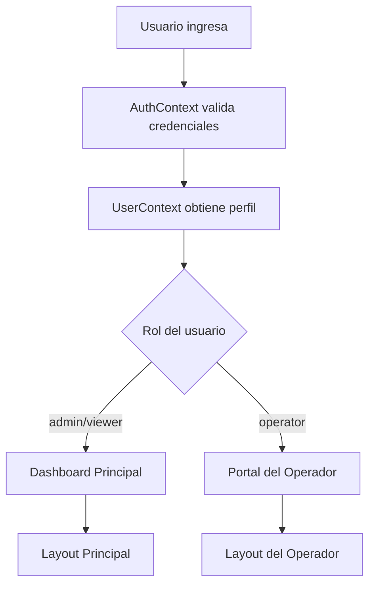
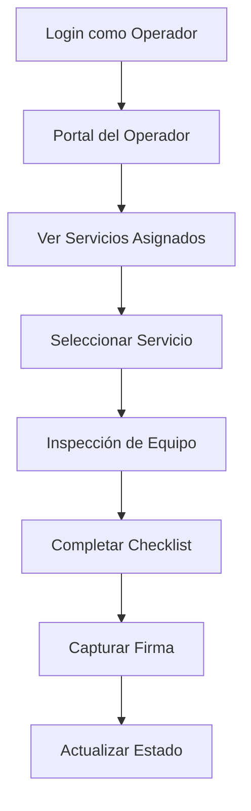

# Arquitectura del Sistema TMS Grúas

## Descripción General

TMS Grúas es un sistema de gestión integral para empresas de grúas que incluye funcionalidades completas de CRM, gestión de servicios, facturación y portal especializado para operadores. El sistema está construido como una Progressive Web App (PWA) con React, TypeScript y Supabase.

## Stack Tecnológico

### Frontend
- **React 18** - Framework principal de UI
- **TypeScript** - Tipado estático
- **Vite** - Build tool y dev server
- **Tailwind CSS** - Framework de estilos
- **Shadcn/ui** - Componentes de UI
- **React Router DOM** - Enrutamiento
- **TanStack Query** - Gestión de estado del servidor
- **React Hook Form** - Manejo de formularios
- **Zod** - Validación de esquemas

### Backend
- **Supabase** - Backend como servicio
- **PostgreSQL** - Base de datos principal
- **Row Level Security (RLS)** - Seguridad a nivel de fila
- **Edge Functions** - Funciones serverless

### PWA Features
- **Service Worker** - Cache y funcionalidad offline
- **Web App Manifest** - Instalación como app nativa
- **Responsive Design** - Adaptable a dispositivos móviles

## Arquitectura de Roles y Autenticación

### Sistema de Roles
El sistema implementa tres roles principales:

#### 1. Administrador (`admin`)
- Acceso completo al sistema
- Gestión de usuarios y roles
- Configuración del sistema
- Todas las funcionalidades de gestión

#### 2. Operador (`operator`)
- Portal especializado para operadores de grúa
- Visualización de servicios asignados
- Inspección de equipos y vehículos
- Actualización de estado de servicios
- Acceso limitado solo a sus servicios asignados

#### 3. Visualizador (`viewer`)
- Solo lectura del sistema
- Visualización de dashboards
- Reportes básicos
- Sin capacidad de edición

### Flujo de Autenticación



### Vinculación Usuario-Operador
Para que un usuario pueda acceder al portal del operador:

1. El usuario debe tener rol `operator` en la tabla `profiles`
2. Debe existir un registro en la tabla `operators` con el `user_id` correspondiente
3. Los servicios deben estar asignados al `operator_id` correspondiente

```sql
-- Ejemplo de vinculación
UPDATE operators 
SET user_id = (SELECT id FROM profiles WHERE email = 'operador@empresa.com')
WHERE name = 'Juan Pérez';
```

## Arquitectura de Datos

### Entidades Principales

#### Servicios (`services`)
- Núcleo del sistema
- Relacionado con clientes, operadores, grúas y tipos de servicio
- Estados: `pending`, `in_progress`, `completed`, `cancelled`

#### Clientes (`clients`)
- Información de contacto y facturación
- Historial de servicios

#### Operadores (`operators`)
- Información personal y profesional
- Vinculación con usuarios del sistema (`user_id`)
- Licencias y certificaciones

#### Grúas (`cranes`)
- Información técnica y documentación
- Mantenimiento y revisiones

### Row Level Security (RLS)

#### Operadores
Los operadores solo pueden ver:
- Sus propios datos en la tabla `operators`
- Servicios asignados a ellos en la tabla `services`

```sql
-- Política para servicios de operadores
CREATE POLICY "Users can view services based on role" ON services
  FOR SELECT
  USING (
    (get_user_role(auth.uid()) IN ('admin', 'viewer'))
    OR
    (get_user_role(auth.uid()) = 'operator' AND operator_id = get_operator_id_by_user(auth.uid()))
  );
```

#### Administradores y Visualizadores
- Acceso completo a todos los datos según sus permisos de rol

## Arquitectura de Componentes

### Estructura de Directorios

```
src/
├── components/
│   ├── layout/           # Componentes de layout
│   │   ├── Layout.tsx           # Layout principal
│   │   ├── OperatorLayout.tsx   # Layout del operador
│   │   └── ProtectedRoute.tsx   # Rutas protegidas
│   ├── operator/         # Componentes específicos del operador
│   ├── services/         # Gestión de servicios
│   ├── clients/          # Gestión de clientes
│   └── ui/              # Componentes de UI reutilizables
├── pages/               # Páginas principales
├── hooks/               # Custom hooks
├── contexts/            # Contextos de React
├── types/               # Definiciones de tipos
└── utils/               # Utilidades
```

### Componentes Clave

#### ProtectedRoute
Maneja la autorización y redirección basada en roles:
- Verifica autenticación
- Redirecciona operadores al portal especializado
- Protege rutas administrativas

#### Layout vs OperatorLayout
- **Layout**: Interface completa para admin/viewer
- **OperatorLayout**: Interface simplificada para operadores

## Portal del Operador

### Características Específicas

#### Dashboard Operador
- Vista simplificada de servicios asignados
- Estados de servicio en tiempo real
- Información de contacto del cliente

#### Inspección de Servicios
- Checklist de equipos y vehículos
- Captura de firmas digitales
- Observaciones y notas

#### Navegación Restringida
- Solo acceso a funcionalidades relacionadas con sus servicios
- Sin acceso a gestión de usuarios o configuración

### Flujo de Trabajo del Operador



## PWA (Progressive Web App)

### Características Implementadas

#### Service Worker
- Cache de recursos estáticos
- Estrategias de cache para API calls
- Funcionalidad offline básica

#### Manifest
- Instalación como app nativa
- Íconos y splash screens
- Configuración de pantalla completa

#### Responsive Design
- Adaptado para móviles y tablets
- Touch-friendly interfaces
- Optimización para pantallas pequeñas

### Configuración PWA

```javascript
// manifest.json
{
  "name": "TMS Grúas",
  "short_name": "TMS",
  "description": "Sistema de Gestión para Empresas de Grúas",
  "start_url": "/",
  "display": "standalone",
  "theme_color": "#10b981",
  "background_color": "#0f172a"
}
```

## Seguridad

### Autenticación
- JWT tokens manejados por Supabase Auth
- Renovación automática de tokens
- Logout seguro

### Autorización
- Row Level Security en base de datos
- Validación de roles en frontend y backend
- Políticas granulares por tabla

### Protección de Datos
- Encriptación en tránsito (HTTPS)
- Encriptación en reposo (Supabase)
- Auditoría de accesos

## Performance

### Optimizaciones Frontend
- Code splitting por rutas
- Lazy loading de componentes
- Optimización de imágenes
- Cache de consultas con TanStack Query

### Optimizaciones Backend
- Índices en columnas frecuentemente consultadas
- Consultas optimizadas con JOIN selectivos
- Paginación en listados grandes

## Monitoring y Debugging

### Logging
- Console logs para desarrollo
- Error boundaries para captura de errores
- Métricas de performance

### Tools de Desarrollo
- React DevTools
- TanStack Query DevTools
- Supabase Dashboard para monitoring de DB

## Escalabilidad

### Horizontal
- Supabase maneja escalado automático
- CDN para recursos estáticos
- Edge functions para lógica distribuida

### Vertical
- Optimización de consultas
- Índices estratégicos
- Cache layers múltiples

## Deployment

### Producción
- Build optimizado con Vite
- Assets minificados
- Service Worker registrado
- Variables de entorno configuradas

### CI/CD
- Deploy automático desde git
- Testing automatizado
- Rollback capabilities

Esta arquitectura proporciona una base sólida, escalable y segura para la gestión integral de empresas de grúas, con especial énfasis en la experiencia del operador en campo.
