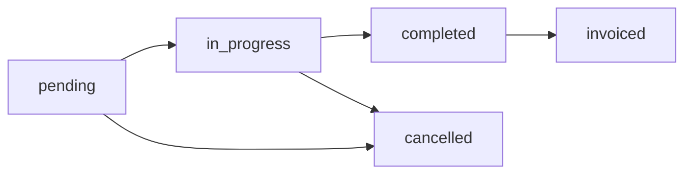

# Documentación Técnica - TMS Grúas

## Portal del Operador

### Configuración Inicial

Para que un operador pueda acceder al sistema, se requiere:

1. **Crear perfil de usuario con rol de operador:**
```sql
INSERT INTO profiles (id, email, full_name, role) 
VALUES (uuid_generate_v4(), 'operador@empresa.com', 'Juan Pérez', 'operator');
```

2. **Vincular usuario con registro de operador:**
```sql
UPDATE operators 
SET user_id = (SELECT id FROM profiles WHERE email = 'operador@empresa.com')
WHERE name = 'Juan Pérez';
```

3. **Asignar servicios al operador:**
```sql
UPDATE services 
SET operator_id = (SELECT id FROM operators WHERE name = 'Juan Pérez')
WHERE id = 'service-uuid';
```

### Flujo de Autenticación

#### 1. Login y Validación
```typescript
// AuthContext maneja la autenticación
const { user: authUser, session } = useAuth();

// UserContext obtiene el perfil completo
const { user: profileUser } = useUser();
```

#### 2. Redirección Automática
```typescript
// ProtectedRoute.tsx
if (userRole === 'operator' && !isOperatorPortalRoute) {
  return <Navigate to="/operator" replace />;
}
```

#### 3. Carga de Servicios
```typescript
// useOperatorServices.ts
const fetchOperatorServices = async (userId: string) => {
  // 1. Obtener operator_id del usuario
  const { data: operatorData } = await supabase
    .from('operators')
    .select('id')
    .eq('user_id', userId)
    .single();

  // 2. Obtener servicios asignados
  const { data: services } = await supabase
    .from('services')
    .select('*, clients(*), cranes(*), service_types(*)')
    .eq('operator_id', operatorData.id)
    .in('status', ['pending', 'in_progress']);
};
```

### Componentes Principales

#### OperatorDashboard
- **Propósito**: Vista principal del operador
- **Datos**: Servicios asignados, información del usuario
- **Estados**: Loading, error, sin servicios, servicios disponibles

#### AssignedServiceCard
- **Propósito**: Tarjeta de servicio individual
- **Navegación**: Link a inspección del servicio
- **Información**: Folio, cliente, fecha, tipo de servicio, ubicaciones

#### OperatorLayout
- **Propósito**: Layout simplificado para operadores
- **Características**: Sin sidebar completo, navegación mínima

## Sistema de Estados de Servicios

### Estados Principales
```typescript
type ServiceStatus = 'pending' | 'in_progress' | 'completed' | 'cancelled' | 'invoiced';
```

### Transiciones de Estado


### Trigger Automático de Facturación
```sql
-- Función que actualiza automáticamente el status
CREATE OR REPLACE FUNCTION public.update_service_status_on_invoice()
RETURNS trigger
LANGUAGE plpgsql
AS $function$
BEGIN
  UPDATE services 
  SET status = 'invoiced', updated_at = now()
  WHERE id = NEW.service_id;
  
  RETURN NEW;
END;
$function$

-- Trigger que se ejecuta al insertar en invoice_services
CREATE TRIGGER trigger_update_service_status_on_invoice
  AFTER INSERT ON invoice_services
  FOR EACH ROW
  EXECUTE FUNCTION update_service_status_on_invoice();
```

## Sistema de Cierres

### Lógica de Filtrado
```typescript
// useServicesForClosures.ts
const fetchAvailableServices = async () => {
  // 1. Obtener servicios completados en rango de fechas
  let servicesQuery = supabase
    .from('services')
    .select('*')
    .eq('status', 'completed')
    .gte('service_date', dateFrom)
    .lte('service_date', dateTo);

  // 2. Obtener servicios ya en cierres
  const { data: closureServices } = await supabase
    .from('closure_services')
    .select('service_id');

  // 3. Obtener servicios ya facturados
  const { data: invoicedServices } = await supabase
    .from('invoice_services')
    .select('service_id');

  // 4. Filtrar servicios disponibles
  const usedServiceIds = new Set([
    ...closureServices.map(cs => cs.service_id),
    ...invoicedServices.map(is => is.service_id)
  ]);

  const availableServices = services.filter(service => 
    !usedServiceIds.has(service.id)
  );
};
```

### Componente ServicesSelector
```typescript
// Filtra servicios por cliente si está seleccionado
const filteredServices = services.filter(service => {
  if (!clientId) return true;
  return service.client.id === clientId;
});

// Muestra información clara sobre exclusiones
<Alert>
  <InfoIcon />
  <AlertDescription>
    • Solo servicios completados del rango de fechas
    • Se excluyen servicios ya incluidos en cierres
    • Se excluyen servicios ya facturados (status: invoiced)
  </AlertDescription>
</Alert>
```

## Servicios con Campos Opcionales

### Configuración en Base de Datos
```sql
-- Campo en service_types
ALTER TABLE service_types 
ADD COLUMN vehicle_info_optional boolean NOT NULL DEFAULT false;

-- Servicios especiales
UPDATE service_types 
SET vehicle_info_optional = true 
WHERE name ILIKE '%taxi%' OR name ILIKE '%transporte de materiales%';
```

### Validación Condicional
```typescript
// VehicleSection.tsx
interface VehicleSectionProps {
  serviceType?: ServiceType;
  // otros props...
}

const VehicleSection = ({ serviceType, ...props }) => {
  const isOptional = serviceType?.vehicle_info_optional || false;

  return (
    <div>
      <Label>
        Marca del Vehículo 
        {!isOptional && <span className="text-red-500">*</span>}
      </Label>
      {isOptional && (
        <p className="text-xs text-gray-400">
          Opcional para este tipo de servicio
        </p>
      )}
      <Input required={!isOptional} {...props} />
    </div>
  );
};
```

### Esquema de Validación
```typescript
// En serviceSchema.ts
const createServiceSchema = (isVehicleOptional: boolean) => z.object({
  folio: z.string().min(1),
  client_id: z.string().uuid(),
  service_type_id: z.string().uuid(),
  vehicle_brand: isVehicleOptional 
    ? z.string().optional() 
    : z.string().min(1, "Marca requerida"),
  vehicle_model: isVehicleOptional 
    ? z.string().optional() 
    : z.string().min(1, "Modelo requerido"),
  license_plate: isVehicleOptional 
    ? z.string().optional() 
    : z.string().min(1, "Patente requerida"),
});
```

## Gestión de Usuarios

### Funciones de Base de Datos

##### get_all_users()
```sql
CREATE OR REPLACE FUNCTION public.get_all_users()
RETURNS TABLE (
  id uuid,
  email text,
  full_name text,
  role app_role,
  is_active boolean,
  created_at timestamp with time zone,
  updated_at timestamp with time zone
) AS $$
BEGIN
  RETURN QUERY
  SELECT 
    p.id, p.email, p.full_name, p.role, p.is_active, p.created_at, p.updated_at
  FROM public.profiles p
  ORDER BY p.created_at DESC;
END;
$$ LANGUAGE plpgsql SECURITY DEFINER;
```

##### update_user_role()
```sql
CREATE OR REPLACE FUNCTION public.update_user_role(
  user_id uuid,
  new_role app_role
) RETURNS void AS $$
BEGIN
  IF (SELECT role FROM public.profiles WHERE id = auth.uid()) != 'admin' THEN
    RAISE EXCEPTION 'Solo los administradores pueden cambiar roles';
  END IF;

  UPDATE public.profiles 
  SET role = new_role, updated_at = now()
  WHERE id = user_id;
END;
$$ LANGUAGE plpgsql SECURITY DEFINER;
```

#### Hook useUserManagement
```typescript
const useUserManagement = () => {
  const fetchUsers = useQuery({
    queryKey: ['users'],
    queryFn: async () => {
      const { data, error } = await supabase.rpc('get_all_users');
      if (error) throw error;
      return data;
    },
  });

  const updateUserRole = useMutation({
    mutationFn: async ({ userId, newRole }: { userId: string; newRole: string }) => {
      const { error } = await supabase.rpc('update_user_role', { 
        user_id: userId, 
        new_role: newRole 
      });
      if (error) throw error;
    },
    onSuccess: () => queryClient.invalidateQueries(['users']),
  });

  return { fetchUsers, updateUserRole };
};
```

## Progressive Web App (PWA)

### Configuración del Manifest
```json
{
  "name": "TMS Grúas - Sistema de Gestión",
  "short_name": "TMS Grúas",
  "description": "Sistema integral de gestión para empresas de grúas",
  "start_url": "/",
  "display": "standalone",
  "theme_color": "#10b981",
  "background_color": "#0f172a",
  "icons": [
    {
      "src": "/favicon.ico",
      "sizes": "64x64 32x32 24x24 16x16",
      "type": "image/x-icon"
    }
  ]
}
```

### Service Worker
```javascript
// sw.js
self.addEventListener('install', (event) => {
  event.waitUntil(
    caches.open('tms-gruas-v1').then((cache) => {
      return cache.addAll([
        '/',
        '/static/js/bundle.js',
        '/static/css/main.css'
      ]);
    })
  );
});

self.addEventListener('fetch', (event) => {
  event.respondWith(
    caches.match(event.request).then((response) => {
      return response || fetch(event.request);
    })
  );
});
```

## Row Level Security (RLS)

### Políticas para Operadores
```sql
-- Servicios: Solo ver servicios asignados
CREATE POLICY "Users can view services based on role" ON services
  FOR SELECT
  USING (
    (get_user_role(auth.uid()) IN ('admin', 'viewer'))
    OR
    (get_user_role(auth.uid()) = 'operator' AND operator_id = get_operator_id_by_user(auth.uid()))
  );

-- Operadores: Solo ver su propio registro
CREATE POLICY "Users can view operators based on role" ON operators
  FOR SELECT
  USING (
    (get_user_role(auth.uid()) IN ('admin', 'viewer'))
    OR
    (get_user_role(auth.uid()) = 'operator' AND user_id = auth.uid())
  );
```

### Funciones de Soporte
```sql
-- Obtener rol del usuario
CREATE OR REPLACE FUNCTION public.get_user_role(user_id uuid DEFAULT auth.uid())
RETURNS app_role AS $$
  SELECT role FROM public.profiles WHERE id = user_id;
$$ LANGUAGE sql STABLE SECURITY DEFINER;

-- Obtener ID del operador por usuario
CREATE OR REPLACE FUNCTION public.get_operator_id_by_user(p_user_id uuid)
RETURNS uuid AS $$
BEGIN
  RETURN (SELECT id FROM public.operators WHERE user_id = p_user_id LIMIT 1);
END;
$$ LANGUAGE plpgsql STABLE SECURITY DEFINER;
```

## Inspección de Servicios

### Esquema de Datos
```typescript
interface Inspection {
  id: string;
  service_id: string;
  operator_id: string;
  equipment_checklist: ChecklistItem[];
  vehicle_observations: string;
  operator_signature: string;
  client_name?: string;
  client_rut?: string;
  photos_before_service: string[];
  photos_client_vehicle: string[];
  photos_equipment_used: string[];
  created_at: string;
}

interface ChecklistItem {
  id: string;
  name: string;
  category: string;
  checked: boolean;
  observations?: string;
}
```

### Componente de Inspección
```typescript
// ServiceInspection.tsx
const ServiceInspection = () => {
  const { id } = useParams();
  const { data: service } = useOperatorService(id);
  
  const handleSubmitInspection = async (data: InspectionData) => {
    const { error } = await supabase.from('inspections').insert({
      service_id: id,
      operator_id: service.operator.id,
      equipment_checklist: data.checklist,
      vehicle_observations: data.observations,
      operator_signature: data.signature,
      photos_before_service: data.photos,
    });
    
    if (error) throw error;
    
    // Actualizar estado del servicio
    await supabase
      .from('services')
      .update({ status: 'completed' })
      .eq('id', id);
  };
};
```

## Debugging y Troubleshooting

### Console Logs para Debugging
```typescript
// En useServicesForClosures.ts
console.log('Fetching services with filters:', { dateFrom, dateTo });
console.log('Completed services found:', servicesData?.length);
console.log('Services already in closures:', usedServiceIds.size);
console.log('Available services for closures:', availableServicesData.length);

// En ServicesSelector.tsx
console.log('ServicesSelector render:', { 
  servicesCount: services.length, 
  loading, 
  clientId 
});
console.log('Filtered services for client:', filteredServices.length);
```

### Problemas Comunes y Soluciones

#### 1. Operador no ve servicios
**Diagnóstico:**
```sql
-- Verificar vinculación usuario-operador
SELECT o.*, p.email, p.role 
FROM operators o 
JOIN profiles p ON o.user_id = p.id 
WHERE p.email = 'operador@empresa.com';

-- Verificar servicios asignados
SELECT s.folio, s.status, o.name as operator_name
FROM services s
JOIN operators o ON s.operator_id = o.id
WHERE o.user_id = 'user-uuid';
```

**Solución:**
```sql
-- Vincular usuario con operador
UPDATE operators 
SET user_id = (SELECT id FROM profiles WHERE email = 'operador@empresa.com')
WHERE name = 'Juan Pérez';
```

#### 2. Servicios no aparecen en cierres
**Diagnóstico:**
```typescript
// Verificar estado de servicios
console.log('Service status check:', {
  folio: service.folio,
  status: service.status,
  isCompleted: service.status === 'completed',
  isInvoiced: service.status === 'invoiced'
});
```

**Solución:**
```sql
-- Corregir servicios mal marcados
UPDATE services 
SET status = 'completed' 
WHERE status = 'invoiced' 
AND id NOT IN (SELECT service_id FROM invoice_services);
```

#### 3. Campos de vehículo requeridos incorrectamente
**Diagnóstico:**
```typescript
// Verificar configuración de tipo de servicio
console.log('Service type config:', {
  name: serviceType.name,
  vehicleOptional: serviceType.vehicle_info_optional
});
```

**Solución:**
```sql
-- Configurar tipo como opcional
UPDATE service_types 
SET vehicle_info_optional = true 
WHERE name ILIKE '%taxi%';
```

## API References

### Endpoints Principales
```typescript
// Obtener servicios del operador
GET /rest/v1/services?operator_id=eq.{operatorId}&status=in.(pending,in_progress)

// Servicios disponibles para cierres
GET /rest/v1/services?status=eq.completed&service_date=gte.{dateFrom}&service_date=lte.{dateTo}

// Crear inspección
POST /rest/v1/inspections
{
  "service_id": "uuid",
  "operator_id": "uuid",
  "equipment_checklist": [...],
  "operator_signature": "base64string"
}

// Actualizar estado de servicio
PATCH /rest/v1/services?id=eq.{serviceId}
{
  "status": "completed"
}
```

### Performance Optimizations

#### Query Optimization
```typescript
// Usar select específicos para reducir datos transferidos
const { data } = await supabase
  .from('services')
  .select(`
    id, folio, status, service_date, value,
    clients(id, name),
    service_types(id, name, vehicle_info_optional)
  `)
  .eq('operator_id', operatorId);
```

#### Cache Strategy
```typescript
// TanStack Query con cache inteligente
const { data } = useQuery({
  queryKey: ['operatorServices', operatorId],
  queryFn: fetchOperatorServices,
  staleTime: 5 * 60 * 1000, // 5 minutos
  refetchOnWindowFocus: false,
  refetchInterval: 30 * 1000, // 30 segundos para operadores
});
```

### Security Considerations

#### Input Validation
```typescript
// Validación con Zod
const inspectionSchema = z.object({
  equipment_checklist: z.array(checklistItemSchema),
  vehicle_observations: z.string().max(1000),
  operator_signature: z.string().min(1)
});
```

#### Sanitización
```typescript
// Sanitizar datos antes de enviar
const sanitizeInput = (input: string) => {
  return input.trim().replace(/[<>]/g, '');
};
```

Esta documentación técnica proporciona toda la información necesaria para entender, mantener y extender el sistema TMS Grúas, con especial enfoque en el correcto funcionamiento del sistema de estados de servicios, cierres y facturación.
