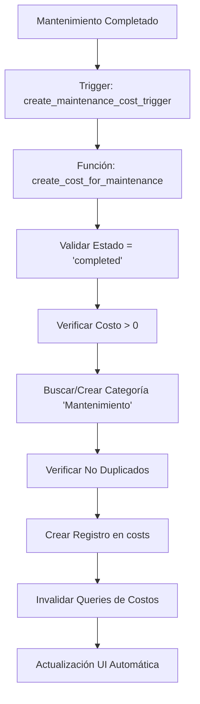
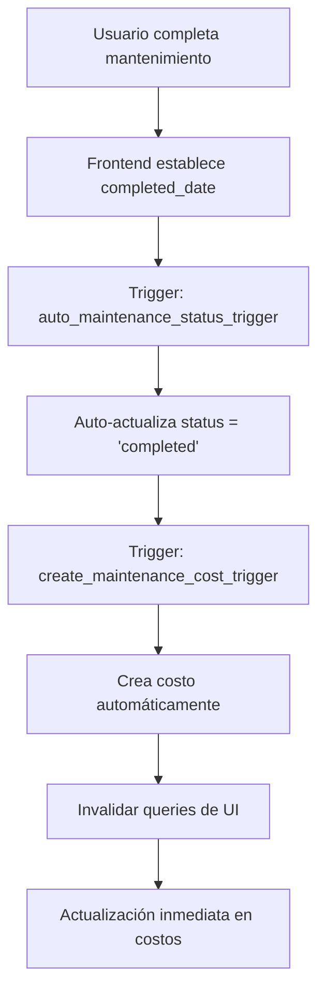

# Fix: Sincronización de Mantenimientos con Costos

## Problema Identificado

Los mantenimientos de grúas completados no se registraban automáticamente en la tabla `costs`, causando que los gastos de mantenimiento no aparecieran en los reportes financieros.

## Solución Implementada

### 1. Trigger Automático para Creación de Costos

Se creó un trigger (`create_maintenance_cost_trigger`) que automáticamente crea un registro en `costs` cuando:
- Un mantenimiento cambia su estado a `completed`
- El costo del mantenimiento es mayor a 0

#### Función: `create_cost_for_maintenance()`
- **Ubicación**: Base de datos (función trigger)
- **Activación**: `AFTER INSERT OR UPDATE` en `crane_maintenance`
- **Validaciones**:
  - Verifica que el estado sea `completed`
  - Previene duplicados basado en grúa, fecha, monto y tipo
  - Solo procesa costos mayores a 0

#### Campos del Costo Generado:
```sql
amount: NEW.cost
category_id: 'Mantenimiento' (auto-creada si no existe)
crane_id: NEW.crane_id
date: COALESCE(NEW.completed_date, NEW.scheduled_date)
description: 'Mantenimiento [tipo] - [proveedor]'
notes: Combinación de notes y description del mantenimiento
subcategory: Según tipo (Preventivo/Correctivo/Emergencia/General)
```

### 2. Función de Corrección Histórica

Se implementó `backfill_maintenance_costs()` para corregir mantenimientos históricos:
- **Permisos**: Solo administradores
- **Funcionalidad**: Crea costos para mantenimientos completados que no tienen registro asociado
- **Seguridad**: Incluye manejo de errores y logging detallado

### 3. Prevención de Duplicados

Nueva función `prevent_duplicate_maintenance_costs()`:
- **Trigger**: `BEFORE INSERT OR UPDATE` en `costs`
- **Validación**: Previene costos duplicados para la misma grúa, fecha y monto en categoría mantenimiento

### 4. Actualización de Hooks

Modificación en `useCraneMaintenance.ts`:
- Importa `useCostInvalidation`
- Invalida queries de costos en `useCreateMaintenance` y `useUpdateMaintenance`
- Asegura sincronización de datos en tiempo real

## Flujo de Datos Automatizado



## Beneficios

1. **Automatización Total**: No requiere intervención manual
2. **Prevención de Duplicados**: Sistema robusto contra duplicaciones
3. **Trazabilidad Completa**: Todos los gastos de mantenimiento quedan registrados
4. **Integridad de Datos**: Triggers aseguran consistencia
5. **Reportes Precisos**: Costos de mantenimiento incluidos en reportes financieros

## Validación de Funcionamiento

Para verificar que el sistema funciona:

1. **Crear nuevo mantenimiento** con estado `completed` y costo > 0
2. **Verificar en tabla costs** que se creó el registro automáticamente
3. **Revisar reportes** que incluyan los costos de mantenimiento
4. **Ejecutar función de backfill** para corregir datos históricos (solo admin)

## Archivos Modificados

- **Base de datos**: Funciones y triggers nuevos
- **src/hooks/useCraneMaintenance.ts**: Agregada invalidación de costos
- **docs/MANTENIMIENTO_COSTOS_FIX.md**: Documentación del fix (este archivo)

## Consideraciones de Seguridad

- Función de backfill requiere permisos de administrador
- Triggers con validaciones robustas
- Prevención de duplicados a nivel de base de datos
- Logging para auditabilidad

## Actualización - Solución Definitiva (2025-08-01)

### Problema Solucionado
- **Inconsistencia detectada**: Mantenimiento "Reparacion Botella Levante" tenía `completed_date` pero `status = 'in_progress'`
- **Causa raíz**: Falta de sincronización automática entre `completed_date` y `status`

### Solución Implementada

#### 1. Corrección Inmediata ✅
- Actualizado mantenimiento específico de "in_progress" a "completed"
- Trigger automático generó el costo de $550,000 en tabla `costs`

#### 2. Lógica Automática de Consistencia ✅
**Trigger: `auto_maintenance_status_trigger`**
- **Cuando se establece `completed_date`** → automáticamente cambia `status` a "completed"
- **Cuando se quita `completed_date`** → automáticamente cambia `status` a "in_progress"
- **Resultado**: Elimina inconsistencias humanas, garantiza integridad

#### 3. Función de Reparación Global ✅
**Función: `fix_maintenance_status_inconsistencies()`**
- Corrige automáticamente todos los mantenimientos inconsistentes
- Ejecuta backfill de costos faltantes
- Retorna reporte detallado de correcciones

### Flujo Mejorado


### Beneficios de la Solución
1. **✅ Automatización Total**: No requiere decisiones manuales del usuario
2. **✅ Prevención de Inconsistencias**: Impossible crear mantenimientos inconsistentes
3. **✅ Autocorrección**: Sistema se repara automáticamente
4. **✅ Escalabilidad**: Funciona para todos los casos futuros
5. **✅ Integridad Garantizada**: Relación 1:1 entre mantenimientos completados y costos

### Validación Post-Implementación
- [x] Mantenimiento específico corregido
- [x] Trigger automático funcionando
- [x] Costo generado en tabla `costs`
- [x] Sistema previene futuras inconsistencias

## Resultado Final
**SOLUCIÓN DEFINITIVA IMPLEMENTADA** - El sistema ahora mantiene automáticamente la consistencia entre mantenimientos y costos, eliminando la posibilidad de inconsistencias futuras.