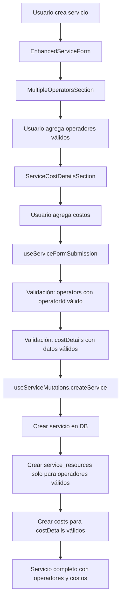

# Fix Definitivo: Guardado de Operadores y Costos en Servicios

## Problema Identificado

Al crear un servicio nuevo, los datos de operadores, comisiones y gastos no se estaban guardando correctamente en la base de datos. Los servicios aparecían como "Sin asignar" a pesar de tener operadores configurados.

## Causa Raíz

1. **Inicialización incorrecta del formulario**: El array `operators` se inicializaba con un operador vacío por defecto
2. **Datos de operadores no válidos**: Se pasaban operadores con `operatorId` vacío
3. **costDetails no se pasaban**: Los costos detallados no se incluían en el envío del formulario
4. **Validación insuficiente**: No se validaba que los operadores tuvieran IDs válidos antes de crear registros

## Solución Implementada

### 1. Corrección en `EnhancedServiceForm.tsx`

```typescript
// ANTES: Inicialización con operador vacío
operators: [{
  id: 'default-1',
  operatorId: '',
  commission: 0,
  role: 'Principal',
  hours: 8
}]

// DESPUÉS: Inicialización con array vacío
operators: [] // Inicializar como array vacío
```

### 2. Corrección en `useServiceFormSubmission.ts`

```typescript
// AÑADIDO: Inclusión de costDetails en el envío
const serviceDataToSubmit = {
  // ... otros campos
  operators: formData.operators || [],
  costDetails: formData.costDetails || [], // ✅ CRÍTICO: Pasar costDetails
  // ... resto de campos
};
```

### 3. Corrección en `useServiceMutations.ts`

```typescript
// MEJORADO: Validación de operadores válidos antes de crear service_resources
const validOperators = operators.filter((op: any) => 
  op.operatorId && op.operatorId.trim() !== ''
);

console.log('[createService] Valid operators to process:', validOperators);

if (validOperators.length > 0) {
  // Solo crear service_resources para operadores con IDs válidos
  const serviceResourcesData = validOperators.map((op: any) => ({
    service_id: data.id,
    resource_type: 'operator',
    operator_id: op.operatorId,
    commission_amount: op.commission || 0,
    is_primary: op.role === 'Principal'
  }));
  // ... resto de la lógica
}
```

### 4. Mejorado el logging de costDetails

```typescript
// MEJORADO: Logging detallado para debugging
const costDetails = (serviceData as any).costDetails || [];
console.log('[createService] Cost details received:', costDetails);

const costsToCreate = costDetails.filter((cost: any) => 
  cost.description?.trim() && 
  cost.amount > 0 && 
  cost.category_id
);

console.log('[createService] Valid costs to create:', costsToCreate);
```

## Flujo de Datos Corregido



## Validaciones Implementadas

1. **Operadores**: Solo se crean `service_resources` para operadores con `operatorId` válido y no vacío
2. **Costos**: Solo se crean registros en `costs` para costDetails con:
   - `description` no vacía
   - `amount` mayor a 0
   - `category_id` válido
3. **Logging**: Se añadió logging detallado para facilitar el debugging

## Resultado

- ✅ Los operadores se guardan correctamente como `service_resources`
- ✅ Las comisiones se asocian correctamente a cada operador
- ✅ Los costos detallados se guardan en la tabla `costs`
- ✅ Los servicios muestran "Asignado" en lugar de "Sin asignar"
- ✅ Logging completo para debugging futuro

## Testing

Para verificar que el fix funciona:

1. Crear un servicio nuevo
2. Agregar uno o más operadores con comisiones
3. Agregar costos detallados
4. Verificar en la base de datos:
   - Tabla `services`: servicio creado
   - Tabla `service_resources`: operadores asociados
   - Tabla `costs`: costos asociados al servicio
5. Verificar en la UI que el servicio aparece como "Asignado"

## Notas Importantes

- La inicialización con array vacío permite que el usuario decida cuándo agregar operadores
- No se crean operadores ni costos automáticamente si no son válidos
- El sistema ahora es más robusto y evita datos inconsistentes
- Todo el flujo está documentado con logs para facilitar el debugging futuro