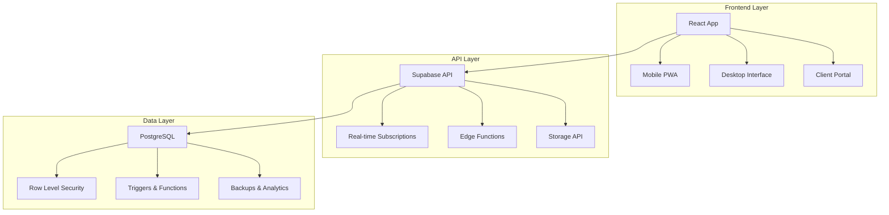
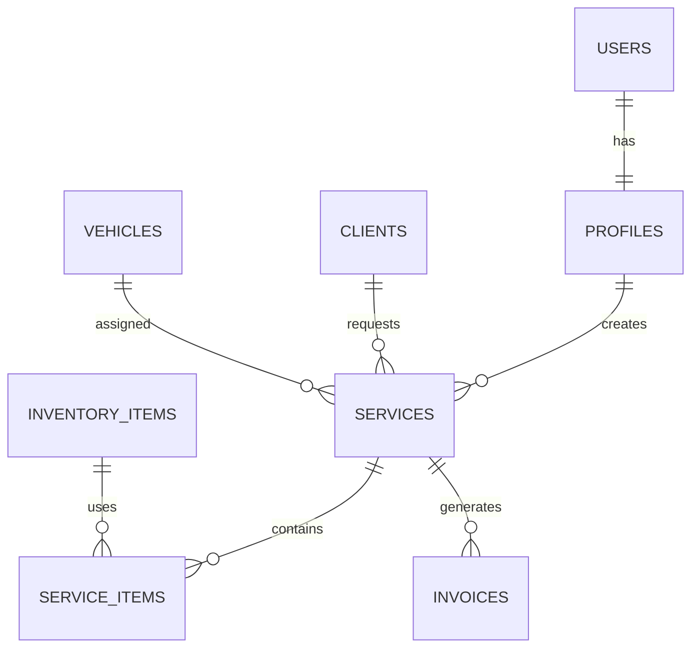

# 📋 Arquitectura del Sistema - TMS Grúas v2.1.0

## 🎯 Visión General del Sistema

TMS Grúas v2.1.0 es un sistema integral de gestión de transporte especializado (TMS) diseñado específicamente para empresas de servicios de grúas. El sistema está construido con una arquitectura moderna, escalable y centrada en la experiencia móvil.

## 🏗️ Arquitectura de Alto Nivel



## 🎨 Stack Tecnológico

### Frontend
- **React 18**: Framework principal con hooks modernos
- **TypeScript**: Tipado estático para mayor confiabilidad
- **Vite**: Build tool optimizado para desarrollo rápido
- **Tailwind CSS**: Framework CSS utility-first
- **Radix UI**: Componentes accesibles y customizables
- **React Query**: Gestión de estado del servidor
- **React Router**: Navegación SPA

### Backend
- **Supabase**: Backend-as-a-Service completo
- **PostgreSQL**: Base de datos relacional robusta
- **Edge Functions**: Lógica serverless
- **Real-time**: Actualizaciones en tiempo real
- **Storage**: Gestión de archivos y documentos

### DevOps & Herramientas
- **Git**: Control de versiones
- **ESLint**: Linting de código
- **Prettier**: Formateo automático
- **Vitest**: Testing framework
- **Lighthouse**: Auditoría de performance

## 📊 Arquitectura de Datos

### Esquema Principal
```sql
-- Estructura simplificada de las tablas principales
users                    -- Usuarios del sistema
├── profiles            -- Perfiles extendidos de usuarios
├── companies           -- Datos de empresas
└── user_permissions    -- Permisos granulares

services                 -- Servicios de grúas
├── service_items       -- Items/detalles del servicio
├── service_costs       -- Costos asociados
├── service_inventory   -- Movimientos de inventario
└── service_maintenance -- Registros de mantenimiento

clients                  -- Clientes
├── client_contacts     -- Contactos del cliente
└── client_locations    -- Ubicaciones del cliente

inventory               -- Gestión de inventario
├── inventory_items     -- Productos/items
├── inventory_stock     -- Stock por ubicación
├── inventory_movements -- Movimientos de stock
├── inventory_alerts    -- Alertas automáticas
└── inventory_locations -- Ubicaciones/bodegas

vehicles                -- Flota de vehículos
├── vehicle_maintenance -- Mantenimiento de vehículos
├── crane_types        -- Tipos de grúas
└── operators          -- Operadores de grúas

billing                 -- Facturación
├── invoices           -- Facturas
├── invoice_items      -- Items de factura
└── payments           -- Pagos
```

### Relaciones Clave


## 🔒 Seguridad y Autenticación

### Row Level Security (RLS)
Todas las tablas implementan RLS para garantizar que los usuarios solo accedan a sus datos:

```sql
-- Ejemplo: Política para servicios
CREATE POLICY "Users can only see their organization's services" 
ON services FOR SELECT USING (
  organization_id = (
    SELECT organization_id FROM profiles 
    WHERE user_id = auth.uid()
  )
);
```

### Roles y Permisos
- **Admin**: Acceso completo al sistema
- **Manager**: Gestión operativa sin configuraciones críticas
- **Operator**: Acceso limitado a servicios asignados
- **Client**: Solo acceso al portal de clientes

### Auditoría
```sql
-- Todas las tablas críticas incluyen auditoría
created_at TIMESTAMP WITH TIME ZONE DEFAULT now()
updated_at TIMESTAMP WITH TIME ZONE DEFAULT now()
created_by UUID REFERENCES auth.users
updated_by UUID REFERENCES auth.users
```

## 📱 Arquitectura Responsiva

### Sistema Mobile-First
```typescript
// Breakpoints del sistema
const breakpoints = {
  sm: '640px',   // Mobile large
  md: '768px',   // Tablet
  lg: '1024px',  // Desktop
  xl: '1280px',  // Desktop large
  '2xl': '1536px' // Desktop extra large
};
```

### Hooks Especializados
- `useDeviceType()`: Detecta tipo de dispositivo
- `useBreakpoint()`: Maneja breakpoints responsivos
- `useOrientation()`: Detecta orientación del dispositivo
- `useTouchOptimized()`: Optimizaciones para touch

### PWA Features
- **Service Worker**: Cache inteligente y funcionalidad offline
- **Web App Manifest**: Instalación como app nativa
- **Push Notifications**: Notificaciones en tiempo real
- **Background Sync**: Sincronización en segundo plano

## 🔄 Flujo de Datos

### Estado Global
```typescript
// React Query para estado del servidor
const { data: services } = useServices();
const { data: inventory } = useInventoryItems();

// Zustand para estado local (si necesario)
const useAppStore = create((set) => ({
  currentUser: null,
  notifications: [],
  updateUser: (user) => set({ currentUser: user }),
}));
```

### Real-time Updates
```typescript
// Suscripciones en tiempo real
useEffect(() => {
  const subscription = supabase
    .channel('services_channel')
    .on('postgres_changes', 
       { event: '*', schema: 'public', table: 'services' },
       (payload) => {
         queryClient.invalidateQueries(['services']);
       }
    )
    .subscribe();

  return () => subscription.unsubscribe();
}, []);
```

## 🚀 Performance y Optimización

### Code Splitting
```typescript
// Lazy loading de rutas
const Dashboard = lazy(() => import('./pages/Dashboard'));
const Services = lazy(() => import('./pages/Services'));
const Inventory = lazy(() => import('./pages/Inventory'));
```

### Optimización de Imágenes
```typescript
// Lazy loading y optimización automática

```

### Caching Strategy
- **React Query**: Cache de datos del servidor
- **Service Worker**: Cache de assets estáticos
- **Supabase**: Cache de consultas frecuentes

## 🧪 Testing Strategy

### Niveles de Testing
```typescript
// Unit Tests - Componentes individuales
test('ServiceCard displays correct information', () => {
  render(<ServiceCard service={mockService} />);
  expect(screen.getByText(mockService.title)).toBeInTheDocument();
});

// Integration Tests - Flujos completos
test('Create service flow works correctly', async () => {
  // Test del flujo completo de creación
});

// E2E Tests - Cypress para flujos críticos
describe('Service Management', () => {
  it('should create and complete a service', () => {
    // Test end-to-end
  });
});
```

## 📈 Escalabilidad

### Horizontal Scaling
- **Supabase**: Auto-scaling de base de datos
- **Edge Functions**: Scaling automático de funciones
- **CDN**: Distribución global de assets

### Performance Monitoring
```typescript
// Métricas de performance
const observer = new PerformanceObserver((list) => {
  list.getEntries().forEach((entry) => {
    analytics.track('performance', {
      metric: entry.name,
      value: entry.duration,
      timestamp: Date.now()
    });
  });
});
```

## 🔍 Monitoring y Logging

### Sistema de Logging Inteligente
```typescript
// Logger que solo funciona en desarrollo
import { logger } from '@/lib/logger';

logger.info('Service created', { serviceId, userId });
logger.error('Failed to create service', { error, context });
```

### Analytics Integration
- **User Behavior**: Tracking de interacciones
- **Performance Metrics**: Core Web Vitals
- **Business Metrics**: KPIs operacionales
- **Error Tracking**: Monitoreo de errores

## 🔮 Arquitectura Futura (Roadmap)

### v2.2.0 - Microservicios
- Separación de servicios por dominio
- API Gateway centralizado
- Event-driven architecture

### v3.0.0 - AI/ML Integration
- Predicción de demanda
- Optimización de rutas
- Mantenimiento predictivo

---

## 📚 Referencias Técnicas

- **[Frontend Architecture](frontend.md)**: Detalles del frontend React
- **[Backend Architecture](backend.md)**: Configuración de Supabase
- **[Security Architecture](security.md)**: Seguridad y compliance
- **[API Reference](../development/api-reference.md)**: Documentación de APIs

---

*Arquitectura actualizada para TMS Grúas v2.1.0 - Julio 2025*