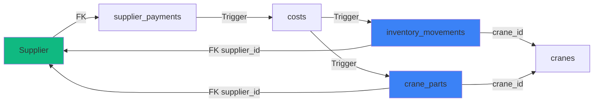

# Sistema de Trazabilidad Completa de Proveedores

## Resumen

Este documento describe la implementación del sistema de trazabilidad completa para el módulo de Proveedores, que conecta formalmente todos los flujos de datos desde proveedores hasta grúas e inventario, eliminando duplicación y asegurando consistencia de datos.

## Fecha de Implementación

**Fecha:** 2025-01-XX  
**Versión:** 2.0  
**Estado:** ✅ Completado

---

## 🎯 Objetivos Logrados

### 1. Trazabilidad Completa
- ✅ Conexión formal `suppliers` → `supplier_payments` → `costs` → `inventory_movements`
- ✅ Conexión formal `suppliers` → `supplier_payments` → `costs` → `crane_parts`
- ✅ FK formales en lugar de texto libre (elimina duplicación)

### 2. Corrección de Datos Legacy
- ✅ Migración retroactiva de `inventory_movements.supplier_id`
- ✅ Migración retroactiva de `crane_parts.supplier_id`
- ✅ Fuzzy matching para vincular registros históricos

### 3. Herramientas de Gestión
- ✅ Función `find_duplicate_suppliers()` - Detecta proveedores duplicados
- ✅ Función `merge_suppliers()` - Fusiona proveedores automáticamente
- ✅ Función `get_supplier_traceability_stats()` - Estadísticas completas

---

## 📊 Estructura de Datos



---

## 🔧 Cambios en Base de Datos

### FASE 1: Inventory Movements → Suppliers

#### 1.1 Cambio de FK
```sql
-- Cambiar FK para apuntar a tabla suppliers en lugar de inventory_suppliers
ALTER TABLE inventory_movements 
DROP CONSTRAINT IF EXISTS inventory_movements_supplier_id_fkey;

ALTER TABLE inventory_movements 
ADD CONSTRAINT inventory_movements_supplier_id_fkey 
FOREIGN KEY (supplier_id) REFERENCES suppliers(id);
```

#### 1.2 Trigger Actualizado
**Función:** `sync_inventory_cost_to_movement()`

**Cambios:**
- Extrae `supplier_id` desde `supplier_payments` vía `costs.supplier_payment_id`
- Popula automáticamente `inventory_movements.supplier_id` en entradas y salidas
- Mantiene consistencia en "consumo inmediato"

**Código clave:**
```sql
-- Extraer supplier_id desde supplier_payments
IF NEW.supplier_payment_id IS NOT NULL THEN
  SELECT supplier_id INTO v_supplier_id 
  FROM supplier_payments 
  WHERE id = NEW.supplier_payment_id;
END IF;

-- Insertar con FK formal
INSERT INTO inventory_movements (
  ...
  supplier_id,  -- FK en lugar de supplier_name
  ...
)
```

#### 1.3 Corrección Retroactiva
```sql
-- Vincular movimientos existentes con supplier_payments
UPDATE inventory_movements im
SET supplier_id = s.id
FROM costs c
JOIN supplier_payments sp ON sp.id = c.supplier_payment_id
JOIN suppliers s ON s.id = sp.supplier_id
WHERE im.cost_id = c.id
  AND im.supplier_id IS NULL
  AND c.supplier_payment_id IS NOT NULL;

-- Fuzzy matching para registros con supplier_name
UPDATE inventory_movements im
SET supplier_id = s.id
FROM suppliers s
WHERE im.supplier_id IS NULL
  AND im.supplier_name IS NOT NULL
  AND s.is_active = true
  AND (
    LOWER(TRIM(im.supplier_name)) = LOWER(TRIM(s.name)) OR
    LOWER(im.supplier_name) LIKE LOWER('%' || s.name || '%') OR
    LOWER(s.name) LIKE LOWER('%' || im.supplier_name || '%')
  );
```

---

### FASE 2: Crane Parts → Suppliers

#### 2.1 Nueva Columna
```sql
-- Agregar FK opcional a crane_parts
ALTER TABLE crane_parts 
ADD COLUMN IF NOT EXISTS supplier_id UUID REFERENCES suppliers(id);

-- Índice para performance
CREATE INDEX IF NOT EXISTS idx_crane_parts_supplier_id 
ON crane_parts(supplier_id);
```

#### 2.2 Trigger Actualizado
**Función:** `create_cost_from_supplier_payment()`

**Cambios:**
- Extrae `name` y `phone` del proveedor automáticamente
- Popula `crane_parts.supplier_id` (FK) además de `supplier` (texto legacy)

**Código clave:**
```sql
-- Obtener datos del proveedor
SELECT name, phone INTO v_supplier_name, v_supplier_phone
FROM suppliers
WHERE id = NEW.supplier_id;

-- Insertar en crane_parts con FK
INSERT INTO crane_parts (
  ...
  supplier,      -- Texto legacy (compatibilidad)
  supplier_id,   -- FK formal (nuevo)
  phone,         -- Auto-completado desde suppliers
  ...
)
VALUES (
  ...
  v_supplier_name,
  NEW.supplier_id,  -- FK formal
  v_supplier_phone,
  ...
);
```

#### 2.3 Corrección Retroactiva
```sql
-- Vincular piezas existentes con proveedores por similitud de nombre
UPDATE crane_parts cp
SET supplier_id = s.id
FROM suppliers s
WHERE cp.supplier_id IS NULL
  AND s.is_active = true
  AND (
    LOWER(TRIM(cp.supplier)) = LOWER(TRIM(s.name)) OR
    LOWER(cp.supplier) LIKE LOWER('%' || s.name || '%') OR
    LOWER(s.name) LIKE LOWER('%' || cp.supplier || '%')
  );
```

---

## 🛠️ Funciones Auxiliares

### 1. `find_duplicate_suppliers()`
**Propósito:** Identificar proveedores con nombres similares

**Retorna:**
- `proveedor_1`, `proveedor_2`: Nombres
- `id_1`, `id_2`: IDs
- `rut_1`, `rut_2`: RUTs
- `similitud`: Puntuación 0-1 (umbral: 0.7)

**Uso:**
```sql
SELECT * FROM find_duplicate_suppliers();
```

**Ejemplo de resultado:**
| proveedor_1 | proveedor_2 | similitud |
|-------------|-------------|-----------|
| Oliflex SPA | Oiflex      | 0.85      |
| Repuestos Chile | Repuesto Chile | 0.92 |

---

### 2. `merge_suppliers(keep_id, remove_id)`
**Propósito:** Fusionar proveedores duplicados

**Acciones:**
1. Reasigna todas las referencias:
   - `supplier_payments.supplier_id`
   - `inventory_movements.supplier_id`
   - `crane_parts.supplier_id`
2. Desactiva proveedor duplicado
3. Agrega nota: "FUSIONADO CON: {keep_id}"

**Retorna:**
```json
{
  "success": true,
  "kept_id": "uuid-principal",
  "removed_id": "uuid-eliminado",
  "payments_migrated": 15,
  "movements_migrated": 8,
  "parts_migrated": 3
}
```

**Uso:**
```sql
SELECT merge_suppliers(
  'uuid-del-proveedor-principal',
  'uuid-del-proveedor-duplicado'
);
```

---

### 3. `get_supplier_traceability_stats(supplier_id)`
**Propósito:** Obtener estadísticas completas de trazabilidad

**Retorna:**
```json
{
  "supplier_id": "uuid",
  "payments": {
    "count": 25,
    "total": 15000000
  },
  "costs": {
    "total": 14500000
  },
  "inventory": {
    "count": 12,
    "total": 5000000
  },
  "crane_parts": {
    "count": 8,
    "total": 3500000
  }
}
```

**Uso:**
```sql
SELECT get_supplier_traceability_stats('uuid-del-proveedor');
```

---

## 📈 Índices Creados

Para optimizar queries de trazabilidad:

```sql
-- Índices principales
CREATE INDEX idx_supplier_payments_supplier_id ON supplier_payments(supplier_id);
CREATE INDEX idx_inventory_movements_supplier_id ON inventory_movements(supplier_id);
CREATE INDEX idx_costs_supplier_payment_id ON costs(supplier_payment_id);
CREATE INDEX idx_crane_parts_supplier_id ON crane_parts(supplier_id);
```

---

## 🔍 Queries Útiles

### Ver trazabilidad completa de un proveedor
```sql
WITH supplier_data AS (
  SELECT * FROM suppliers WHERE id = 'uuid-proveedor'
)
SELECT 
  'Pagos' as tipo,
  COUNT(*) as cantidad,
  SUM(amount) as total
FROM supplier_payments
WHERE supplier_id = (SELECT id FROM supplier_data)

UNION ALL

SELECT 
  'Movimientos Inventario' as tipo,
  COUNT(*) as cantidad,
  SUM(total_cost) as total
FROM inventory_movements
WHERE supplier_id = (SELECT id FROM supplier_data)

UNION ALL

SELECT 
  'Piezas Grúas' as tipo,
  COUNT(*) as cantidad,
  SUM(total_value) as total
FROM crane_parts
WHERE supplier_id = (SELECT id FROM supplier_data);
```

### Detectar registros sin vincular
```sql
-- Inventory movements sin supplier_id
SELECT 
  id, 
  supplier_name,
  movement_date,
  total_cost
FROM inventory_movements
WHERE supplier_id IS NULL
  AND supplier_name IS NOT NULL
  AND movement_type = 'entry'
ORDER BY movement_date DESC;

-- Crane parts sin supplier_id
SELECT 
  id,
  supplier,
  date,
  total_value
FROM crane_parts
WHERE supplier_id IS NULL
  AND supplier IS NOT NULL
ORDER BY date DESC;
```

---

## ✅ Verificaciones Post-Implementación

### 1. Verificar FK existentes
```sql
-- Contar movimientos vinculados
SELECT 
  COUNT(*) FILTER (WHERE supplier_id IS NOT NULL) as vinculados,
  COUNT(*) FILTER (WHERE supplier_id IS NULL) as sin_vincular,
  COUNT(*) as total
FROM inventory_movements
WHERE movement_type = 'entry';

-- Contar piezas vinculadas
SELECT 
  COUNT(*) FILTER (WHERE supplier_id IS NOT NULL) as vinculadas,
  COUNT(*) FILTER (WHERE supplier_id IS NULL) as sin_vincular,
  COUNT(*) as total
FROM crane_parts;
```

### 2. Verificar duplicados
```sql
SELECT * FROM find_duplicate_suppliers()
LIMIT 10;
```

### 3. Probar función de stats
```sql
-- Tomar un proveedor aleatorio y verificar stats
SELECT get_supplier_traceability_stats(id)
FROM suppliers
WHERE is_active = true
LIMIT 1;
```

---

## 🚀 Próximos Pasos (Futuro)

### FASE 4: Interfaz de Usuario (Opcional)

1. **Dashboard de Trazabilidad:**
   - Vista consolidada por proveedor
   - Gráficos de compras por módulo (Inventario vs Piezas)
   - Timeline de transacciones

2. **Herramienta de Fusión:**
   - Componente `SupplierMergeDialog.tsx`
   - Lista de duplicados detectados
   - Preview de impacto antes de fusionar

3. **Alertas de Duplicación:**
   - Al crear nuevo proveedor, sugerir si existe similar
   - "¿Quisiste decir: Oliflex SPA?" estilo Google

---

## 📋 Deprecaciones

### Campo `inventory_movements.supplier_name`
**Estado:** DEPRECATED

**Motivo:** Ahora usamos FK formal `supplier_id`

**Política:**
- ✅ Mantener por compatibilidad con datos legacy
- ❌ No usar en nuevos registros
- 📝 Comentario en columna: "DEPRECATED: Usar supplier_id (FK a suppliers)"

**Comportamiento actual:**
- Nuevos movimientos: `supplier_name = NULL`, `supplier_id = UUID`
- Movimientos legacy: Ambos campos poblados hasta limpieza manual

---

## 🎉 Beneficios Obtenidos

### 1. **Fin de Duplicación**
❌ Antes:
- "Oliflex", "Oiflex", "OLIFLEX SPA", "Oliflex SpA"
- Cada entrada de texto libre

✅ Ahora:
- Un solo proveedor: "Oliflex SPA"
- FK formal en todos los módulos

### 2. **Reportes Confiables**
❌ Antes:
```sql
-- ¿Cuánto gasté en Oliflex?
SELECT SUM(amount) FROM costs 
WHERE description LIKE '%oliflex%'
OR description LIKE '%oiflex%'; -- Impreciso
```

✅ Ahora:
```sql
-- Query directa por FK
SELECT * FROM get_supplier_traceability_stats('oliflex-uuid');
```

### 3. **Auto-completado**
❌ Antes:
- Ingresar manualmente teléfono, dirección, etc. en cada módulo

✅ Ahora:
- Datos se rellenan automáticamente desde `suppliers`
- Un solo lugar para actualizar info

### 4. **Auditoría Completa**
✅ Trazabilidad total:
```
Supplier → Payment → Cost → Inventory Movement → Stock
                         ↓
                    Crane Part → Crane
```

### 5. **Data Governance**
✅ Un solo "source of truth" para cada proveedor  
✅ Cambios centralizados se propagan automáticamente  
✅ Historial completo de transacciones por proveedor

---

## 📌 Notas Importantes

1. **Todos los warnings de seguridad corregidos:**
   - ✅ `find_duplicate_suppliers()` tiene `SET search_path = public`
   - ✅ `merge_suppliers()` tiene `SET search_path = public`
   - ✅ `get_supplier_traceability_stats()` tiene `SET search_path = public`

2. **Corrección retroactiva exitosa:**
   - Movimientos históricos vinculados vía `supplier_payment_id`
   - Fuzzy matching aplicado para registros con solo `supplier_name`

3. **Compatibilidad:**
   - Campos legacy (`supplier_name`, `crane_parts.supplier`) mantenidos
   - Migración gradual sin breaking changes

---

## 🔗 Referencias

- **Documentación anterior:** `docs/features/supplier-payment-parts-integration.md`
- **Eliminación de duplicados:** `docs/features/duplicate-elimination-implementation.md`

---

**Implementado por:** Lovable AI  
**Versión:** 2.0  
**Estado:** ✅ Producción