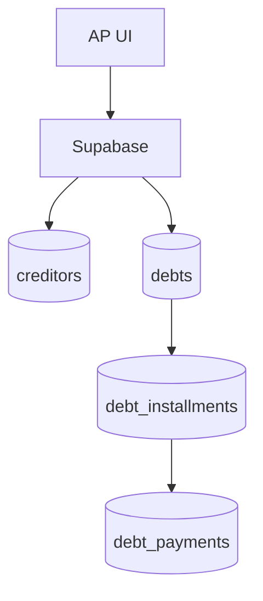

# accounts-payable

## Resumen
Módulo de **cuentas por pagar** (AP) orientado a administrar acreedores, deudas, cuotas y calendario de pagos.

**Entrypoints**
- Página: [AccountsPayable](file:///Users/sergioiriartevasquez/Desktop/gruas-alerta-calendario/src/pages/AccountsPayable.tsx)
- Componentes: [src/components/accounts-payable](file:///Users/sergioiriartevasquez/Desktop/gruas-alerta-calendario/src/components/accounts-payable)

## Arquitectura y componentes
- Acreedores: `CreditorList`, `CreditorForm`.
- Deudas: `DebtList`, `DebtForm`, `DebtDetailModal`.
- Cuotas/pagos: `MonthlyInstallments`, `PayInstallmentModal`.
- Vista calendario: `DebtCalendar`.

## API expuesta

### Ruta (frontend)
- `/accounts-payable`

### Operaciones Supabase (tablas)
- `creditors`
- `debts`
- `debt_installments`
- `debt_payments`
- `scheduled_payments` (si se usa para programación)

## Especificación de uso (con ejemplos)

### Crear acreedor y deuda
```ts
import { supabase } from '@/integrations/supabase/client'

const { data: creditor } = await supabase
  .from('creditors')
  .insert({ name: 'Proveedor financiero', type: 'leasing' })
  .select('id')
  .single()

await supabase.from('debts').insert({
  creditor_id: creditor!.id,
  total_amount: 5000000,
  status: 'active'
})
```

## Dependencias

### Externas (principales)
- `react`
- `date-fns`
- `lucide-react`

### Internas (principales)
- Hooks típicos: `useCreditors`, `useDebts`, `useDebtInstallments`, `usePendingPayments`
- UI: `@/components/ui/*`
- `@/integrations/supabase/client`

## Configuración requerida
- RLS: acceso a datos financieros restringido a roles autorizados.
- Reglas de estado: asegurar consistencia (deuda activa vs cuotas pagadas).

## Casos de uso principales
- Registrar deudas y programar pagos.
- Controlar vencimientos y pagos realizados.
- Visualizar calendario de obligaciones.

## Diagramas



## Rendimiento
- Calendarios: filtrar por rango de fecha y status.
- Agregaciones de montos: preferir vistas/RPC si hay alto volumen.

## Seguridad
- Datos financieros: proteger con RLS estricta y auditoría.
