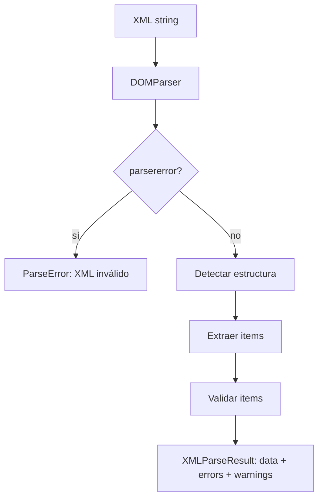
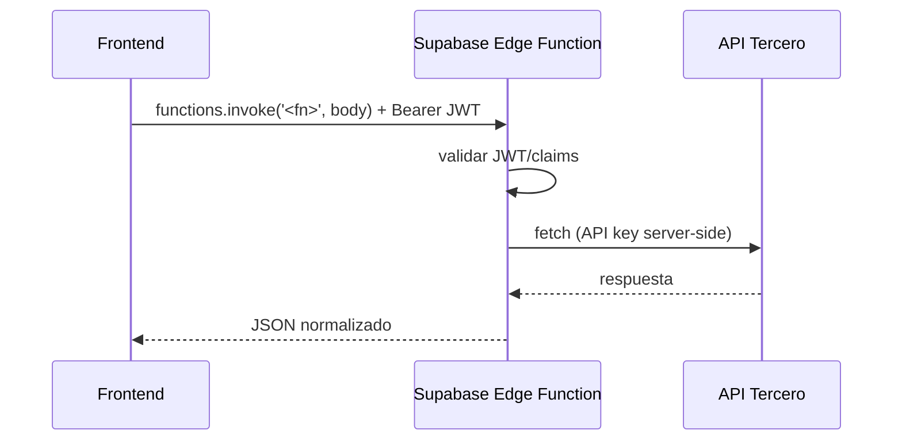

# Funcionalidades Avanzadas (XML + Batch Processing + Validación + Observabilidad)

## Propósito
Este documento describe una implementación **reutilizable** de capacidades avanzadas para ingestión de datos en frontend:
- importación de XML (XLM en algunos requerimientos),
- procesamiento y carga por lotes (batch processing),
- validación de datos (errores vs advertencias),
- manejo de errores y recuperación,
- logging detallado (observabilidad),
- configuración de parámetros,
- guía de instalación, pruebas, criterios de aceptación y checklist de verificación.

Está diseñado para que pueda portarse a otros proyectos con una estructura modular estable.

## Alcance y contexto del proyecto
El repositorio implementa estas capacidades principalmente en:
- Batch CSV/Excel para servicios: `EnhancedCSVUploadServices` y `EnhancedCSVUploader`.
- Importación XML para costos y facturas proveedor: `XMLCostUpload` y utilidades `utils/xmlParser/*`.

Referencias de implementación existente:
- Código relacionado: `src/components/services/EnhancedCSVUploadServices.tsx`, `src/components/costs/XMLCostUpload.tsx`, `src/hooks/useEnhancedCSVUpload.ts`, `src/utils/xmlParser/*`
- Módulos relacionados: [costs](./costs.md), [services](./services.md), [suppliers](./suppliers.md), [inventory](./inventory.md), [supabase-integration](./supabase-integration.md)

## Arquitectura reutilizable (pipeline de ingestión)

### Componentes del pipeline
1. **Ingesta de archivo**: selección/drag&drop + validación de tipo/tamaño.
2. **Parsing**: CSV/Excel/XML → estructura intermedia (rows/items).
3. **Normalización**: mapeo de headers/campos, conversión de tipos (fechas, números), limpieza de strings.
4. **Validación**: reglas por campo + reglas cruzadas (duplicados, referencias).
5. **Preview**: tabla/resumen con errores y posibilidad de ajuste (mapeo de categorías).
6. **Persistencia**: insert/update (Supabase), idealmente con idempotencia.
7. **Post-proceso**: links bidireccionales, sync de contadores, invalidación de queries.
8. **Observabilidad**: logs estructurados, métricas de batch, registro de fallos por fila.
9. **Recuperación**: reintento selectivo y reportes de filas fallidas.

### Diagrama de flujo (alto nivel)
```mermaid
flowchart TD
  A[Seleccionar archivo] --> B{Validar tipo/tamaño}
  B -- no --> E[Rechazar + error UI]
  B -- sí --> C[Parse (CSV/Excel/XML)]
  C --> D[Normalizar + mapear]
  D --> F[Validar]
  F --> G{¿Hay filas válidas?}
  G -- no --> H[Mostrar errores + descargar reporte]
  G -- sí --> I[Preview + ajustes]
  I --> J[Procesar por lotes]
  J --> K[Persistir en Supabase]
  K --> L[Post-proceso (sync/links/cache)]
  L --> M[Resumen final + filas fallidas]
```

## Estructura modular recomendada (para replicación)

### Separación por capas
- **UI** (presentación): componentes, modales, tabla de preview, barra de progreso.
- **Hook orquestador**: estado + transiciones + comandos (parse/validate/upload/reset).
- **Core de ingestión** (sin UI): parsers, mappers, validadores, uploaders.
- **Adaptadores**: persistencia (Supabase), storage, logging.

### Layout de carpetas (patrón)
Basado en la estructura real del repo:
```
src/
  components/
    services/EnhancedCSVUploadServices.tsx
    costs/XMLCostUpload.tsx
    ui/batch-progress-modal.tsx
  hooks/
    useEnhancedCSVUpload.ts
    useCSVUpload.ts
    useCostCSVUpload.ts
  utils/
    enhancedCsvUpload.ts
    dataMapper/*
    csvValidations.ts
    xmlParser/*
    supabaseErrorHandler.ts
  integrations/supabase/*
```

## Importación XML (Extensible Markup Language)

### Objetivo
Extraer datos desde XML, detectar estructura (ej. DTE chileno u otros esquemas), convertirlos a un modelo interno y cargarlos a Supabase con vista previa y correcciones de mapeo (categoría/subcategoría).

### Referencias en el proyecto
- UI: `XMLCostUpload` (en `components/costs`).
- Parser: `XMLCostParser` (en `utils/xmlParser`).
- Integración con proveedores e inventario: `supplier_invoices`, `supplier_invoice_items`, `inventory_movements` (según flujo).

### Contrato de datos (modelo intermedio)
Modelo sugerido (equivalente a lo que usa el repo en `types/costs`):
- `fecha: string | Date`
- `descripcion: string`
- `monto: number`
- `proveedor?: string`
- `categoria?: string`
- `numeroFactura?: string`
- `rut?: string`

### Estrategia técnica
- **Parsing**: `DOMParser.parseFromString(xml, 'text/xml')`.
- **Detección de estructura**:
  - heurísticas por tags raíz (`DTE`, `gastos`, `facturas`, etc.),
  - fallback con detección automática por campos encontrados.
- **Extracción**:
  - mapeos por paths (`Encabezado/IdDoc/FchEmis`) en DTE,
  - queries directos (`item.querySelector('fecha')`) en XML genérico.
- **Validación**:
  - requisitos mínimos: `fecha`, `monto > 0`, `descripcion` no vacía,
  - advertencias: proveedor faltante, categoría faltante (autocompletar).

### Diagrama (detectar → extraer → validar)


### Ejemplo de código (parser reutilizable)
```ts
export type Severity = 'error' | 'warning'

export type ValidationIssue = {
  row: number
  field: string
  message: string
  severity: Severity
}

export type XmlItem = {
  fecha: string
  descripcion: string
  monto: number
  proveedor?: string
  categoria?: string
  numeroFactura?: string
  rut?: string
}

export type XmlParseResult = {
  success: boolean
  data: XmlItem[]
  issues: ValidationIssue[]
}

export function parseXmlCosts(xmlString: string): XmlParseResult {
  const parser = new DOMParser()
  const doc = parser.parseFromString(xmlString, 'text/xml')
  if (doc.querySelector('parsererror')) {
    return { success: false, data: [], issues: [{ row: -1, field: 'xml', message: 'XML no válido', severity: 'error' }] }
  }

  const items = Array.from(doc.querySelectorAll('gasto'))
  const data: XmlItem[] = []
  const issues: ValidationIssue[] = []

  items.forEach((node, idx) => {
    const fecha = node.querySelector('fecha')?.textContent?.trim() ?? ''
    const descripcion = node.querySelector('descripcion')?.textContent?.trim() ?? ''
    const montoRaw = node.querySelector('monto')?.textContent?.trim() ?? ''
    const monto = Number(montoRaw)

    if (!fecha) issues.push({ row: idx, field: 'fecha', message: 'Fecha requerida', severity: 'error' })
    if (!descripcion) issues.push({ row: idx, field: 'descripcion', message: 'Descripción requerida', severity: 'error' })
    if (!Number.isFinite(monto) || monto <= 0) issues.push({ row: idx, field: 'monto', message: 'Monto debe ser > 0', severity: 'error' })

    if (fecha && descripcion && monto > 0) {
      data.push({ fecha, descripcion, monto })
    }
  })

  return { success: issues.every(i => i.severity !== 'error'), data, issues }
}
```

### Casos de uso (XML)
- Importar facturas/boletas XML para crear costos.
- Importar XML de proveedor para poblar `supplier_invoices` y sus items y, opcionalmente, sincronizar inventario.
- Validar y categorizar automáticamente, con posibilidad de override en UI.

### Configuración requerida (XML)
- MIME aceptados: `text/xml` + extensión `.xml`.
- Tamaño máximo sugerido: 5–10MB en frontend (ajustable).
- Normalización regional:
  - formatos de fecha,
  - separador decimal/miles.

## Batch processing (carga por lotes CSV/Excel)

### Objetivo
Procesar grandes volúmenes de filas con:
- validación incremental,
- mapeo inteligente de headers,
- inserción por lotes,
- progreso visible y reintentos selectivos.

### Referencias en el proyecto
- UI: `EnhancedCSVUploadServices` (en `src/components/services`).
- Core: `EnhancedCSVUploader` (en `src/utils/enhancedCsvUpload.ts`).
- Dependencias: `papaparse`, `xlsx`, `@tanstack/react-query`, `@supabase/supabase-js`.

### Diagrama (parse → map → validate → upload en batches)
```mermaid
flowchart TD
  F[File CSV/Excel] --> P[Parse]
  P --> H[Header mapping]
  H --> M[Map entidades (rut/patente/nombres)]
  M --> V[Validación de fila]
  V --> S{Fila válida?}
  S -- no --> ER[Acumular error/warning]
  S -- sí --> Q[Queue]
  Q --> B[Batch N]
  B --> U[Upsert/Insert Supabase]
  U --> PR[Progreso + reporte fallos]
```

### Parámetros recomendados
- `batchSize`: 25 (por defecto en el repo).
- `batchDelayMs`: 100ms entre lotes para no saturar (ajustable por entorno).
- `maxRowsPreview`: limitar preview (p.ej. primeras 100).
- `acceptTypes`: CSV/Excel MIME.

### Ejemplo de orquestación (pseudo-código)
```ts
type UploadProgress = {
  stage: 'parsing' | 'validating' | 'uploading'
  total: number
  processed: number
  percentage: number
  currentBatch: number
  totalBatches: number
}

async function uploadInBatches<T>(
  rows: T[],
  batchSize: number,
  uploadOne: (row: T) => Promise<void>,
  onProgress: (p: UploadProgress) => void
) {
  const total = rows.length
  const totalBatches = Math.ceil(total / batchSize)
  let processed = 0
  for (let b = 0; b < totalBatches; b++) {
    const batch = rows.slice(b * batchSize, (b + 1) * batchSize)
    for (const row of batch) {
      await uploadOne(row)
      processed++
    }
    onProgress({
      stage: 'uploading',
      total,
      processed,
      percentage: Math.round((processed / total) * 100),
      currentBatch: b + 1,
      totalBatches,
    })
    await new Promise(r => setTimeout(r, 100))
  }
}
```

### Casos de uso (batch)
- Cargar servicios desde plantillas CSV/Excel con validación previa.
- Importar masivamente costos y asociarlos a entidades existentes.
- Migraciones controladas (con rollback parcial o marcación de “cancelled”).

## Validación de datos (estándar reutilizable)

### Principios
- Validación **determinista** y **reproducible**.
- Separar:
  - errores bloqueantes (`error`) vs advertencias (`warning`),
  - problemas de parsing vs problemas de negocio.
- Validación incremental (fila a fila) con un reporte final.

### Tipos de validación
- **Sintáctica**: tipos, formatos (fecha, números, RUT/patente).
- **Semántica**: rangos (`monto > 0`), estados, enumeraciones.
- **Referencial**: existencia de IDs en BD (cliente, grúa, proveedor).
- **Cruzada**: duplicados internos (folios repetidos), conflictos con BD.

### Resultado unificado
Recomendación: unificar resultados en una estructura común:
- `issues: Array<{ row, field, message, severity }>`
- `validRows: Row[]`
- contadores: `totalRows`, `validCount`, `errorCount`, `warningCount`

## Manejo de errores (error handling y recuperación)

### Taxonomía recomendada
- `ParseError`: archivo no legible o formato inválido.
- `ValidationError`: fallas por fila/campo (con severidad).
- `ReferenceError`: entidad no encontrada (cliente/proveedor/grúa).
- `PersistError`: error Supabase (RLS, constraints, network).
- `PartialFailure`: lote con mezcla de éxitos y fallos.

### Estrategias
- **Fail-fast** en parsing: si el XML/CSV es inválido, detener.
- **Fail-soft** en validación por fila: continuar procesando y acumular issues.
- **Persistencia**:
  - reintentar errores transitorios (network),
  - permitir reintento selectivo de filas fallidas,
  - no duplicar inserciones (idempotencia).

### Idempotencia
Opciones:
- upsert con clave natural (folio, número de factura, hash documento).
- pre-check de duplicados en BD (RPC o query indexada).
- enlaces bidireccionales (cuando aplica) deben tolerar re-ejecución.

## Logging detallado (observabilidad)

### Objetivos
- Diagnóstico en producción (sin exponer secretos).
- Trazabilidad por ejecución (importId/correlationId).
- Métricas de desempeño: duración por etapa, filas procesadas, tasa de error.

### Reglas de seguridad para logs
- No loguear tokens (`access_token`) ni claves.
- No loguear XML completos si incluyen PII; preferir hash + metadata.
- Limitar payloads en errores a muestras truncadas.

### Especificación de logger (reutilizable)
```ts
export type LogLevel = 'debug' | 'info' | 'warn' | 'error'

export type LogEvent = {
  level: LogLevel
  name: string
  message: string
  context?: Record<string, unknown>
  correlationId?: string
}

export interface Logger {
  log(event: LogEvent): void
}
```

Implementaciones:
- Dev: `console.*`.
- Prod: enviar a tabla `audit_log`/`notification_logs` o a un servicio externo (Sentry/Datadog) si el proyecto lo incorpora.

### Logging recomendado por etapa
- Ingesta: nombre archivo, tamaño, MIME.
- Parsing: duración, cantidad de filas/items.
- Validación: `errorCount/warningCount`, top N errores.
- Persistencia: `processed/success/fail`, tiempos por batch.
- Post-proceso: invalidaciones y sync ejecutados.

## Configuración de parámetros

### Variables de entorno (Vite)
En este repo se usan:
- `VITE_SUPABASE_URL`
- `VITE_SUPABASE_PUBLISHABLE_KEY`
- `VITE_SUPABASE_PROJECT_ID`

Referencia: [.env](file:///Users/sergioiriartevasquez/Desktop/gruas-alerta-calendario/.env#L1-L3)

### Configuración runtime (recomendada)
Centralizar en un módulo:
- batch:
  - `BATCH_SIZE`
  - `BATCH_DELAY_MS`
  - `MAX_FILE_SIZE_MB`
  - `MAX_PREVIEW_ROWS`
- xml:
  - `XML_ACCEPTED_STRUCTURES`
  - `XML_MAX_ITEMS`
- logging:
  - `LOG_LEVEL`
  - `ENABLE_VERBOSE_LOGS`

Ejemplo:
```ts
export const ingestConfig = {
  batchSize: 25,
  batchDelayMs: 100,
  maxFileSizeBytes: 10 * 1024 * 1024,
  maxPreviewRows: 100,
} as const
```

## Dependencias del sistema

### Dependencias npm (mínimas para estas capacidades)
- `papaparse` + `@types/papaparse` (CSV)
- `xlsx` (Excel)
- `@tanstack/react-query` (hooks de datos)
- `@supabase/supabase-js` (persistencia + auth)
- `zod` (validación de formularios/config cuando aplique)
- `sonner` (toasts) y `lucide-react` (UI)

### Dependencias del backend (Supabase)
- Tablas y catálogos según flujo:
  - costos: `costs`, `cost_categories`
  - proveedores: `suppliers`, `supplier_invoices`, `supplier_invoice_items`, `supplier_payments`
  - servicios: `services`, `service_types`, `clients`, `cranes`, `operators`
- RPC opcionales:
  - deduplicación/diagnóstico (ej. `check_cost_duplicates`, `check_supplier_invoice_duplicates`)
- Policies:
  - RLS consistente para inserts/updates desde frontend.

## Integración con APIs de terceros

### Patrón recomendado: Edge Functions como API Gateway/Proxy
En este proyecto, la mayoría de integraciones con terceros se implementan mediante **Supabase Edge Functions** (Deno), por razones de seguridad y control:
- las claves/API tokens viven en variables de entorno del servidor (no en el browser),
- se valida autenticación (`Authorization: Bearer <JWT>`) con `supabase.auth.getClaims()` o `supabase.auth.getUser()`,
- se unifica CORS y formato de respuesta,
- se normaliza error handling (incluye manejo explícito de rate limits).

Diagrama:


#### Ejemplo base (frontend)
```ts
import { supabase } from '@/integrations/supabase/client'

const { data, error } = await supabase.functions.invoke('mapbox-proxy', {
  body: { action: 'geocode', query: 'Concepción' }
})
if (error) throw error
```

### Mapbox (geocoding, directions, static maps)
**Función proxy**: [mapbox-proxy](file:///Users/sergioiriartevasquez/Desktop/gruas-alerta-calendario/supabase/functions/mapbox-proxy/index.ts#L75-L220)

**Acciones soportadas**
- `geocode` → `GET https://api.mapbox.com/geocoding/v5/mapbox.places/{query}.json?...`
- `directions` → `GET https://api.mapbox.com/directions/v5/mapbox/driving/{origin};{destination}?...`
- `static_map` → `GET https://api.mapbox.com/styles/v1/mapbox/streets-v12/static/...?...`

**Variables requeridas (Edge)**
- `MAPBOX_ACCESS_TOKEN`
- `SUPABASE_URL`, `SUPABASE_ANON_KEY`

**Ejemplo (mapa estático con ruta)**
```ts
await supabase.functions.invoke('mapbox-proxy', {
  body: {
    action: 'static_map',
    mode: 'preview',
    geometry,
    origin: originCoords,
    destination: destinationCoords
  }
})
```

**Referencia en UI**
- [TripRouteMap](file:///Users/sergioiriartevasquez/Desktop/gruas-alerta-calendario/src/components/trip-calculator/TripRouteMap.tsx#L41-L108)

**Consideraciones**
- Mapbox URLs pueden exceder límites; el proxy simplifica geometrías y reintenta si el URL es muy largo.
- Controlar cuota/rate limits y cachear resultados de geocoding/directions si se reutilizan.

### GetAPI Chile (peajes y lookup de patente)
**Peajes (rutas/costo)**
- Función: [tollroutes-proxy](file:///Users/sergioiriartevasquez/Desktop/gruas-alerta-calendario/supabase/functions/tollroutes-proxy/index.ts#L11-L158)
- Base: `https://chile.getapi.cl/v1/tollroutes/api`
- Actions:
  - `locations`, `categories`, `highways`, `route-cost`
- Variables:
  - `GETAPI_CHILE_TOLL_API_KEY` (prioritaria) o `GETAPI_CHILE_API_KEY`

Nota de manejo de errores:
- Para `route-cost`, ante error del tercero el proxy devuelve `HTTP 200` con `{ error, details, apiStatus }` para evitar que `functions.invoke` lance excepción por status no-2xx.

**Patentes**
- Función: [check-vehicle-patent](file:///Users/sergioiriartevasquez/Desktop/gruas-alerta-calendario/supabase/functions/check-vehicle-patent/index.ts#L9-L125)
- Endpoint: `GET https://chile.getapi.cl/v1/vehicles/plate/{PLATE}`
- Variable:
  - `GETAPI_CHILE_API_KEY`

**Consideraciones**
- Implementar backoff ante `429` (rate limit) y mensajes user-facing claros.
- Normalizar patente (remover guiones/espacios, uppercase) antes de consultar.

### SRE.cl + ruts.info (lookup de empresa por RUT)
**Función**: [sre-lookup](file:///Users/sergioiriartevasquez/Desktop/gruas-alerta-calendario/supabase/functions/sre-lookup/index.ts#L54-L236)

**Fuentes**
- Primaria: `POST https://sre.cl/api/company_info` (token puede ser público o premium)
- Fallback/enrichment: `GET https://ruts.info/api/company-info?rut={rut}`

**Variables (Edge)**
- `SRE_API_TOKEN` (si falta usa `"token_publico"`)
- `RUTS_INFO_API_KEY`

**Comportamiento**
- Si SRE falla (cuota desactivada/403 o error), hace fallback a ruts.info.
- Si SRE responde pero sin dirección/contacto (tier limitado), enriquece con ruts.info.
- Frecuentemente devuelve `HTTP 200` con `{ error: ... }` en vez de lanzar status de error, para simplificar consumo en frontend.

**Referencia en UI**
- [ClientFormStep1](file:///Users/sergioiriartevasquez/Desktop/gruas-alerta-calendario/src/components/clients/form/ClientFormStep1.tsx#L1-L80) invoca `sre-lookup` vía `supabase.functions.invoke`.

### OpenAI (extracción/clasificación asistida por IA)
Estas integraciones corren en Edge Functions para no exponer la clave.

**Funciones**
- OCR/boletas: [parse-receipt-image](file:///Users/sergioiriartevasquez/Desktop/gruas-alerta-calendario/supabase/functions/parse-receipt-image/index.ts#L32-L225)
- Parse PDF VIP: [parse-quote-pdf](file:///Users/sergioiriartevasquez/Desktop/gruas-alerta-calendario/supabase/functions/parse-quote-pdf/index.ts), [parse-purchase-order-pdf](file:///Users/sergioiriartevasquez/Desktop/gruas-alerta-calendario/supabase/functions/parse-purchase-order-pdf/index.ts)
- Clasificación de costos: [classify-cost](file:///Users/sergioiriartevasquez/Desktop/gruas-alerta-calendario/supabase/functions/classify-cost/index.ts)

**Endpoint usado**
- `POST https://api.openai.com/v1/chat/completions`

**Variables (Edge)**
- `OPENAI_API_KEY`

**Notas técnicas**
- Se usa tool-calling para forzar salida estructurada (ej. `extract_receipt`) y luego se parsea JSON.
- Errores comunes:
  - `429` → rate limit (devolver mensaje de reintento),
  - `402` → créditos insuficientes,
  - `401` → key inválida o gateway auth.

### Resend (envío de emails transaccionales)
**Funciones (ejemplos)**
- [send-invoice-email](file:///Users/sergioiriartevasquez/Desktop/gruas-alerta-calendario/supabase/functions/send-invoice-email/index.ts#L2-L67)
- [send-service-confirmation](file:///Users/sergioiriartevasquez/Desktop/gruas-alerta-calendario/supabase/functions/send-service-confirmation/index.ts)

**Variables (Edge)**
- `RESEND_API_KEY`

**Seguridad**
- Algunas funciones de correo usan `SUPABASE_SERVICE_ROLE_KEY` para leer datos internos (p. ej. `company_data`). Esta key debe existir solo en el entorno de Edge Function y nunca en frontend.

**Buenas prácticas**
- Validar que el solicitante esté autenticado antes de enviar emails.
- Registrar resultados (éxito/fallo) en tabla de logs si se requiere auditoría.

### OpenStreetMap (reverse geocoding desde frontend)
**Uso actual**
- [LocationCapture](file:///Users/sergioiriartevasquez/Desktop/gruas-alerta-calendario/src/components/quick-entry/LocationCapture.tsx#L41-L52) consulta:
  - `GET https://api.openstreetmap.org/reverse?format=json&lat=...&lon=...`

**Recomendación para replicación**
- Para producción y alto volumen, considerar proxy/cache server-side para respetar límites de uso y evitar bloqueos por rate limiting.
- Implementar timeout y fallback sin dirección (mantener solo coordenadas).

### Pruebas unitarias para integraciones con terceros
Recomendación (frontend):
- Mockear `supabase.functions.invoke` y/o `fetch` para simular:
  - éxitos,
  - errores 4xx/5xx,
  - `429` (rate limit),
  - respuestas malformadas.

Recomendación (Edge Functions):
- Extraer la llamada `fetch` a un wrapper (inyectable) para poder testear parseo/normalización.

Checklist específico:
- [ ] Secrets configurados en Edge (`OPENAI_API_KEY`, `MAPBOX_ACCESS_TOKEN`, `RESEND_API_KEY`, `GETAPI_*`, `RUTS_INFO_API_KEY`, `SRE_API_TOKEN`).
- [ ] Funciones desplegadas y accesibles por `functions.invoke`.
- [ ] JWT requerido y validado (claims/user).
- [ ] Manejo explícito de `429` y mensajes de reintento.
- [ ] No se registran tokens ni payloads sensibles en logs.

## Estándares de codificación (para replicación)

### TypeScript
- Preferir tipos explícitos para modelos intermedios (`XmlItem`, `MappedServiceData`).
- No mezclar concerns: parser no debe depender de UI.
- Exponer API pública por módulo (exports claros).

### Errores
- Usar clases o discriminated unions para tipar fallos (`{ kind: 'ParseError', ... }`).
- Todo error user-facing debe incluir mensaje accionable, sin detalles sensibles.

### Rendimiento
- No bloquear UI: mostrar progreso y evitar loops sin `await`/yield.
- Debounce en inputs que disparen queries (en el repo se usa `lodash/debounce`).

## Guía de instalación (para portar a otro proyecto)

### 1) Instalar dependencias
```bash
npm i papaparse xlsx @tanstack/react-query @supabase/supabase-js zod sonner lucide-react
npm i -D @types/papaparse vitest jsdom
```

### 2) Configurar variables de entorno
Crear `.env`:
```
VITE_SUPABASE_URL="https://<project>.supabase.co"
VITE_SUPABASE_PUBLISHABLE_KEY="<anon-key>"
VITE_SUPABASE_PROJECT_ID="<project-id>"
```

### 3) Agregar cliente Supabase
Crear `src/integrations/supabase/client.ts` que exporte `supabase` con `persistSession`.

### 4) Incorporar UI y hooks
- Copiar el módulo UI (u equivalente):
  - `EnhancedCSVUploadServices` (CSV/Excel)
  - `XMLCostUpload` (XML)
- Copiar core:
  - `EnhancedCSVUploader` (batch)
  - `XMLCostParser` (xml)
  - `dataMapper/*` (mapeos y finders)

### 5) Ajustar mapeos a tu dominio
- headers requeridos (CSV/Excel),
- estructura XML esperada y reglas de categorización,
- tablas destino y payloads de insert.

## Pruebas unitarias (Vitest)

### Estrategia
Cubrir al menos:
- parsing CSV/Excel: normalización de headers y fechas,
- parser XML: detección de estructura + extracción,
- validación: reglas por campo, conteos de errores,
- batch uploader: cálculo de batches y progreso.

### Ejemplo de test (parser XML)
```ts
import { describe, it, expect } from 'vitest'
import { parseXmlCosts } from './parseXmlCosts'

describe('parseXmlCosts', () => {
  it('rechaza XML inválido', () => {
    const res = parseXmlCosts('<gastos><gasto></gastos>')
    expect(res.success).toBe(false)
    expect(res.issues.some(i => i.field === 'xml')).toBe(true)
  })

  it('extrae items válidos', () => {
    const xml = `
      <gastos>
        <gasto><fecha>2026-04-13</fecha><monto>100</monto><descripcion>Combustible</descripcion></gasto>
      </gastos>
    `
    const res = parseXmlCosts(xml)
    expect(res.success).toBe(true)
    expect(res.data).toHaveLength(1)
    expect(res.data[0].monto).toBe(100)
  })
})
```

### Ejemplo de test (batch)
```ts
import { describe, it, expect } from 'vitest'

function totalBatches(total: number, batchSize: number) {
  return Math.ceil(total / batchSize)
}

describe('batch sizing', () => {
  it('calcula batches', () => {
    expect(totalBatches(1, 25)).toBe(1)
    expect(totalBatches(25, 25)).toBe(1)
    expect(totalBatches(26, 25)).toBe(2)
  })
})
```

## Criterios de aceptación
- Se puede seleccionar y arrastrar un archivo (CSV/Excel/XML) y el sistema valida tipo/tamaño.
- El sistema parsea el archivo y muestra un resumen (filas totales, válidas, errores, advertencias).
- Se muestra una vista previa de los datos parseados y permite ajustes de mapeo cuando corresponda.
- La carga se ejecuta por lotes, muestra progreso y no congela la UI.
- Se registran errores por fila (y por lote) y existe un reporte de filas fallidas.
- La carga es idempotente o previene duplicados (folios/documentos).
- Se documentan configuraciones y dependencias necesarias para replicación.
- Existen pruebas unitarias mínimas para parser y batch.
- No se exponen secretos ni PII en logs.

## Checklist de verificación (portabilidad)
- [ ] Variables `.env` configuradas (Supabase URL/anon key/project id).
- [ ] Cliente Supabase exportado y consumido por hooks/servicios.
- [ ] Dependencias instaladas (`papaparse`, `xlsx`, `react-query`, etc.).
- [ ] UI de upload implementada con drag&drop y validación de tipo/tamaño.
- [ ] Parser CSV/Excel funciona para plantilla objetivo (headers y fechas).
- [ ] Parser XML detecta estructura objetivo y extrae campos requeridos.
- [ ] Validaciones separan `error` vs `warning` y generan reporte.
- [ ] Batch uploader respeta `batchSize` y aplica `batchDelayMs`.
- [ ] Persistencia en Supabase respeta RLS y constraints.
- [ ] Existe estrategia anti-duplicados (upsert/pre-check/unique index).
- [ ] Logging implementado con correlationId y sin datos sensibles.
- [ ] Tests unitarios ejecutan con `vitest` y pasan en CI/local.
