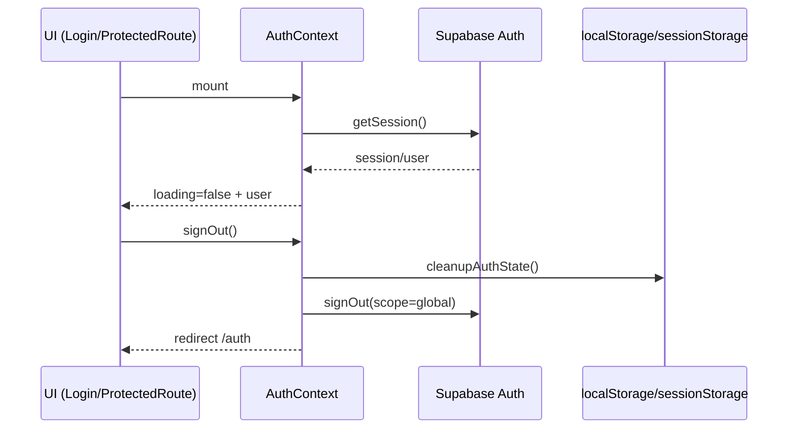

# auth

## Resumen
Módulo de autenticación y sesión basado en **Supabase Auth**. Gestiona:
- inicio/cierre de sesión,
- estado global de usuario (`session`/`user`) y carga inicial,
- mitigación de estados inconsistentes (“limbo”) limpiando storage,
- expiración por inactividad (warning + logout).

**Entrypoints**
- [AuthContext](file:///Users/sergioiriartevasquez/Desktop/gruas-alerta-calendario/src/contexts/AuthContext.tsx#L1-L119)
- UI de autenticación: [pages/Auth.tsx](file:///Users/sergioiriartevasquez/Desktop/gruas-alerta-calendario/src/pages/Auth.tsx)
- Recuperación/creación de password: [pages/ResetPassword.tsx](file:///Users/sergioiriartevasquez/Desktop/gruas-alerta-calendario/src/pages/ResetPassword.tsx)
- Timeout por inactividad: [SessionTimeoutProvider](file:///Users/sergioiriartevasquez/Desktop/gruas-alerta-calendario/src/components/auth/SessionTimeoutProvider.tsx#L1-L40)

## Arquitectura y componentes

### Estado de sesión (AuthContext)
`AuthProvider` mantiene:
- `session: Session | null`
- `user: User | null`
- `loading: boolean` (solo para carga inicial)

Flujo:
- Suscripción a `supabase.auth.onAuthStateChange` actualiza `session/user` sin tocar `loading`.
- Inicialización vía `supabase.auth.getSession()` controla `loading` y detecta JWT expirado; ante error se limpia el estado.
- `signOut()` fuerza limpieza de storage, intenta `signOut({scope:'global'})` y redirige a `/auth`.
- Referencia: [AuthContext.tsx](file:///Users/sergioiriartevasquez/Desktop/gruas-alerta-calendario/src/contexts/AuthContext.tsx#L17-L104).

### Limpieza de estado de auth (hard reset)
El módulo incluye utilidades para evitar inconsistencias entre storage/local state y sesión de backend:
- `cleanupAuthState()` elimina claves relacionadas a Supabase (`supabase.auth.*` y prefijos `sb-`) en `localStorage` y `sessionStorage`.
- `performGlobalSignOut()` intenta invalidar sesión a nivel global.
- `verifySessionConsistency()` valida sesión frontend y ejecuta un query mínimo para detectar JWT inválido/RLS con `auth.uid()` nulo.
- Referencia: [authCleanup.ts](file:///Users/sergioiriartevasquez/Desktop/gruas-alerta-calendario/src/utils/authCleanup.ts#L1-L101).

### Timeout por inactividad
`SessionTimeoutProvider` usa `useSessionTimeout` para:
- mostrar modal de advertencia (`SessionTimeoutModal`) antes del cierre,
- permitir extensión de sesión,
- ejecutar logout al vencer el tiempo total.
- Referencia: [SessionTimeoutProvider.tsx](file:///Users/sergioiriartevasquez/Desktop/gruas-alerta-calendario/src/components/auth/SessionTimeoutProvider.tsx#L1-L39).

## API expuesta

### Rutas (frontend)
- `/auth`: pantalla de login/registro.
- `/reset-password`: flujo de reseteo/seteo de contraseña.
- Recuperación de contraseña: formulario público protegido por `rate limiting` y, opcionalmente, `Cloudflare Turnstile` si las variables están configuradas.

### Hooks/exports públicos
- `useAuth()` (hook) y `AuthProvider`:
  - Import: `import { AuthProvider, useAuth } from '@/contexts/AuthContext'`
  - Referencia: [AuthContext.tsx](file:///Users/sergioiriartevasquez/Desktop/gruas-alerta-calendario/src/contexts/AuthContext.tsx#L17-L119)
- `SessionTimeoutProvider`:
  - Import: `import { SessionTimeoutProvider } from '@/components/auth/SessionTimeoutProvider'`
  - Referencia: [SessionTimeoutProvider.tsx](file:///Users/sergioiriartevasquez/Desktop/gruas-alerta-calendario/src/components/auth/SessionTimeoutProvider.tsx#L12-L40)

### Operaciones Supabase (métodos)
- `supabase.auth.getSession()`
- `supabase.auth.onAuthStateChange(...)`
- `supabase.auth.refreshSession()`
- `supabase.auth.signOut({ scope: 'global' })`

Tablas tocadas por diagnósticos (no por UI directa):
- `profiles` (verificación mínima de JWT/RLS): [authCleanup.ts](file:///Users/sergioiriartevasquez/Desktop/gruas-alerta-calendario/src/utils/authCleanup.ts#L56-L70)

## Especificación de uso (con ejemplos)

### Consumir sesión/usuario en un componente
```tsx
import { useAuth } from '@/contexts/AuthContext'

export function Example() {
  const { user, loading, signOut } = useAuth()
  if (loading) return null
  return (
    <div>
      <div>Usuario: {user?.email ?? 'anónimo'}</div>
      <button onClick={() => void signOut()}>Salir</button>
    </div>
  )
}
```

### Forzar re-autenticación (hard reset)
```ts
import { supabase } from '@/integrations/supabase/client'
import { forceReAuthentication } from '@/utils/authCleanup'

await forceReAuthentication(supabase)
```

## Dependencias

### Externas (principales)
- `@supabase/supabase-js`
- `react`, `react-router-dom`
- `sonner` (toasts) y `lucide-react` (iconos) en UI

### Internas (principales)
- `@/integrations/supabase/client` (cliente)
- `@/utils/authCleanup` (hard reset)
- `@/hooks/useSessionTimeout` + `@/components/auth/SessionTimeoutModal`

## Configuración requerida
- Supabase:
  - URL del proyecto y anon key deben estar disponibles por configuración (idealmente vía variables de entorno Vite).
  - La app persiste sesión en `localStorage` (ver opciones de `createClient`).
- Turnstile:
  - `VITE_TURNSTILE_SITE_KEY` en frontend para renderizar el widget cuando se quiera activar.
  - `TURNSTILE_SECRET_KEY` en la Edge Function `send-password-reset` para validación `siteverify`.
- Routing:
  - Redirecciones a `/auth` deben funcionar en hosting (rewrites a `index.html`).

## Casos de uso principales
- Login/registro y mantenimiento de sesión en navegación.
- Logout confiable incluso ante estados inconsistentes (limpieza de storage).
- Sesión con expiración por inactividad.

## Diagramas



## Rendimiento
- `onAuthStateChange` evita re-fetch de sesión por navegación.
- `refreshSession` es explícito y debe usarse con cuidado (evitar loops).

## Seguridad
- El frontend no debe ser fuente de verdad de autorización: asegurar RLS en Supabase para cada tabla.
- Evitar exponer tokens en logs; el módulo hace logs de diagnóstico, pero no imprime JWT.
- La recuperación de contraseña puede operar solo con `rate limiting`; si se activa captcha, el widget visual por sí solo no es suficiente y backend debe validarlo.
- La limpieza de storage debe ser cuidadosa: borra claves `sb-*` (impacta cualquier app Supabase en el mismo origin).
