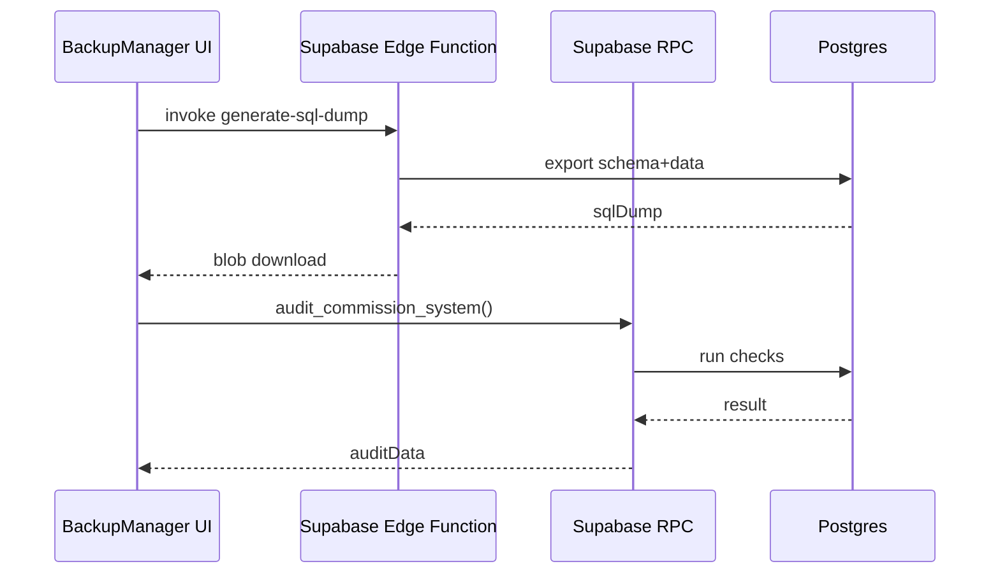

# backup

## Resumen
Módulo de **respaldo** y **reparación/auditoría** para tareas críticas de mantenimiento:
- generación de dump SQL (edge function),
- auditoría y reparación del sistema de comisiones (RPC),
- visualización de logs de respaldos.

**Entrypoints**
- Página (export nombrado): [BackupPage](file:///Users/sergioiriartevasquez/Desktop/gruas-alerta-calendario/src/pages/BackupPage.tsx#L8-L59)
- UI principal: [BackupManager](file:///Users/sergioiriartevasquez/Desktop/gruas-alerta-calendario/src/components/backup/BackupManager.tsx#L15-L243)

## Arquitectura y componentes
- `BackupManager` integra:
  - generación de dump SQL vía `supabase.functions.invoke('generate-sql-dump')`,
  - auditoría y reparación de comisiones vía `supabase.rpc(...)`,
  - feedback de progreso y listados de respaldos recientes (hook `useBackupManager`).

Referencia: [BackupManager.tsx](file:///Users/sergioiriartevasquez/Desktop/gruas-alerta-calendario/src/components/backup/BackupManager.tsx#L22-L107).

## API expuesta

### Ruta (frontend)
- `/backup` (AdminOnlyRoute)

### Operaciones Supabase
- Edge Functions:
  - `functions.invoke('generate-sql-dump', { body: ... })` (dump SQL)
- RPC:
  - `audit_commission_system`
  - `repair_commission_system`
  - (según catálogo) `generate_database_backup`, `generate_quick_backup`

### Tablas
- `backup_logs` (registro de respaldos y metadatos)
- soporte: `audit_log` si se utiliza auditoría general

## Especificación de uso (con ejemplos)

### Invocar dump SQL (edge function)
```ts
import { supabase } from '@/integrations/supabase/client'

const { data, error } = await supabase.functions.invoke('generate-sql-dump', {
  body: { includeData: true, includeStructure: true, tables: ['services', 'costs'] }
})
if (error) throw error
```

### Auditar comisiones (RPC)
```ts
const { data, error } = await supabase.rpc('audit_commission_system')
if (error) throw error
```

## Dependencias

### Externas (principales)
- `react`
- `sonner`
- `lucide-react`

### Internas (principales)
- `@/integrations/supabase/client`
- Hook: `useBackupManager`
- UI: `@/components/ui/*` (card, progress, badge, button)

## Configuración requerida
- Edge function `generate-sql-dump` desplegada en el proyecto Supabase.
- Permisos:
  - Solo admins deben poder invocar dumps y reparaciones.
  - RLS/Policies para `backup_logs` y autorización de funciones.

## Casos de uso principales
- Generar respaldo antes de ejecutar reparaciones/cambios masivos.
- Auditar sistema de comisiones y ejecutar reparación definitiva.
- Consultar historial de respaldos recientes.

## Diagramas



## Rendimiento
- Dumps pueden ser pesados: limitar tablas cuando aplique y ejecutar en horarios controlados.
- Mostrar progreso para evitar percepción de bloqueo.

## Seguridad
- Nunca exponer dumps públicamente: entregarlos solo vía sesión admin y conexión segura.
- RPC de reparación debe validar rol/permiso en backend.
- Evitar loguear SQL dump en consola.
