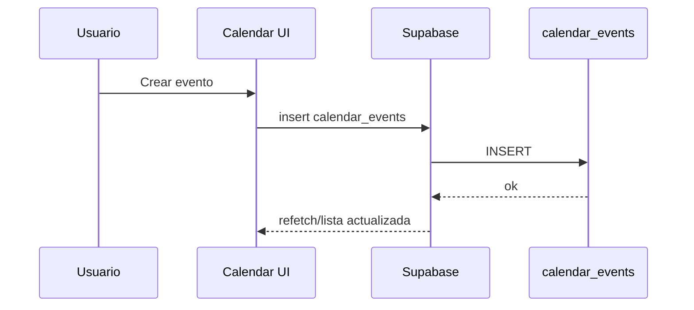

# calendar

## Resumen
Módulo de calendario para visualizar y administrar eventos (agenda) asociados a servicios/recursos. Incluye vistas **mes/semana/día**, sidebar de eventos y modales de creación/detalle.

**Entrypoints**
- Página: [Calendar](file:///Users/sergioiriartevasquez/Desktop/gruas-alerta-calendario/src/pages/Calendar.tsx)
- Componentes: [src/components/calendar](file:///Users/sergioiriartevasquez/Desktop/gruas-alerta-calendario/src/components/calendar)

## Arquitectura y componentes
- UI por vistas:
  - `MonthView`, `WeekView`, `DayView`
  - `CalendarHeader`, `CalendarControls`, `EventsSidebar`
- Edición/detalle:
  - `EventModal`, `EventDetailsModal`
  - `ConvertEventToServiceModal` para convertir/relacionar eventos con un `service`.

El módulo suele persistir eventos en `calendar_events` y puede enlazar opcionalmente:
- `service_id` (evento vinculado a servicio),
- `client_id`, `operator_id`, `crane_id`.

## API expuesta

### Ruta (frontend)
- `/calendar`

### Operaciones Supabase (tablas)
- `calendar_events` (CRUD principal)
- Lecturas de referencia (según filtros): `clients`, `operators`, `cranes`, `services`

Referencia de esquema: [types.ts](file:///Users/sergioiriartevasquez/Desktop/gruas-alerta-calendario/src/integrations/supabase/types.ts#L88-L191).

## Especificación de uso (con ejemplos)

### Crear evento (patrón Supabase)
```ts
import { supabase } from '@/integrations/supabase/client'

await supabase.from('calendar_events').insert({
  date: '2026-04-13',
  start_time: '09:00',
  end_time: '10:00',
  title: 'Mantención grúa',
  type: 'maintenance',
  status: 'scheduled'
})
```

## Dependencias

### Externas (principales)
- `react`
- `date-fns`
- `lucide-react`
- `sonner`

### Internas (principales)
- `@/integrations/supabase/client`
- `@/components/ui/*` (dialogs, buttons, inputs)
- Hooks relacionados: `useCalendarEvents`, `useCalendarNavigation`, validaciones en `@/utils/calendarValidation`

## Configuración requerida
- Zona horaria: el sistema utiliza utilidades de timezone (ver `@/utils/timezoneUtils`) y configuración en settings cuando aplique.
- RLS: `calendar_events` debe permitir leer/escribir según rol.

## Casos de uso principales
- Planificar servicios/recursos con visibilidad semanal/mensual.
- Enlazar un evento con un servicio existente o convertirlo a servicio.
- Auditar/actualizar estado del evento (programado/completado/cancelado).

## Diagramas



## Rendimiento
- Render de grillas (mes/semana): evitar recalcular layouts en cada render; memoizar eventos filtrados.
- Para rangos amplios, consultar por rango de fechas (`gte/lte`) y paginar si el volumen crece.

## Seguridad
- Evitar exponer datos sensibles del cliente en eventos a roles no autorizados.
- Validar en backend (RLS) que usuarios solo puedan modificar eventos permitidos por su rol/relación.
