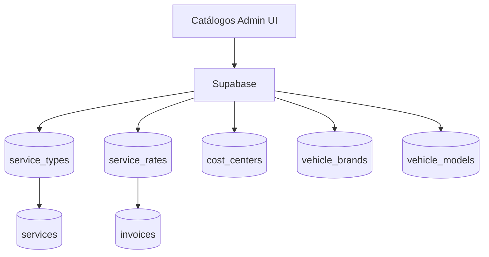

# catalogos-admin

## Resumen
Módulo administrativo de **catálogos** que soportan el resto del sistema:
- tipos de servicio,
- tarifas de servicio,
- centros de costo,
- vehículos (marcas/modelos) y parámetros asociados.

**Entrypoints**
- Páginas:
  - [ServiceTypes](file:///Users/sergioiriartevasquez/Desktop/gruas-alerta-calendario/src/pages/ServiceTypes.tsx)
  - [ServiceRates](file:///Users/sergioiriartevasquez/Desktop/gruas-alerta-calendario/src/pages/ServiceRates.tsx)
  - [CostCenters](file:///Users/sergioiriartevasquez/Desktop/gruas-alerta-calendario/src/pages/CostCenters.tsx)
  - [Vehicles](file:///Users/sergioiriartevasquez/Desktop/gruas-alerta-calendario/src/pages/Vehicles.tsx)
- Componentes:
  - [components/service-types](file:///Users/sergioiriartevasquez/Desktop/gruas-alerta-calendario/src/components/service-types)
  - [components/serviceRates](file:///Users/sergioiriartevasquez/Desktop/gruas-alerta-calendario/src/components/serviceRates)
  - [components/cost-centers](file:///Users/sergioiriartevasquez/Desktop/gruas-alerta-calendario/src/components/cost-centers)

## Arquitectura y componentes
- CRUD por entidad con formularios (react-hook-form + zod) y tablas.
- Se integra con módulos operativos porque estos catálogos se referencian en `services`, `costs`, `invoices` y reportes.

## API expuesta

### Rutas (frontend)
- `/service-types` (AdminOnlyRoute)
- `/service-rates` (AdminOnlyRoute)
- `/cost-centers` (AdminOnlyRoute)
- `/vehicles` (AdminOnlyRoute)

### Operaciones Supabase (tablas)
- `service_types`
- `service_rates`
- `cost_centers`
- `vehicle_brands`, `vehicle_models`

## Especificación de uso (con ejemplos)

### Crear un tipo de servicio
```ts
import { supabase } from '@/integrations/supabase/client'
await supabase.from('service_types').insert({ name: 'Rescate', is_active: true })
```

### Crear una tarifa
```ts
await supabase.from('service_rates').insert({
  service_type_id: serviceTypeId,
  name: 'Tarifa base',
  amount: 80000,
  is_active: true
})
```

## Dependencias

### Externas (principales)
- `react`
- `@tanstack/react-query`
- `react-hook-form`, `zod`
- `date-fns`
- `lucide-react`, `sonner`

### Internas (principales)
- Hooks: `useServiceTypes`, `useServiceRates`, `useCostCenters`, `useVehicleBrands`, `useVehicleModels`
- UI: `@/components/ui/*`

## Configuración requerida
- RLS: catálogos deben ser modificables solo por admins.
- Consistencia referencial: evitar borrar registros en uso; preferir `is_active=false`.

## Casos de uso principales
- Mantener catálogos que alimentan formularios operativos.
- Ajustar tarifas sin cambios de código.

## Diagramas



## Rendimiento
- Catálogos suelen ser pequeños; cachear y reutilizar en formularios.

## Seguridad
- Restringir escritura por rol.
- Validar consistencia (no permitir valores inválidos que rompan flujos posteriores).
