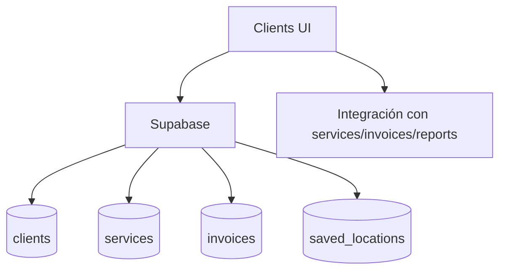

# clients

## Resumen
Módulo de gestión de **clientes**: CRUD, fichas detalladas, historial (servicios/facturas/cierres), métricas y utilidades de exportación/reportes por cliente.

**Entrypoints**
- Página: [Clients](file:///Users/sergioiriartevasquez/Desktop/gruas-alerta-calendario/src/pages/Clients.tsx)
- Componentes: [src/components/clients](file:///Users/sergioiriartevasquez/Desktop/gruas-alerta-calendario/src/components/clients)

## Arquitectura y componentes
- Listado y filtros: `ClientsTable`, `ClientsFilters`, `ClientsHeader`, vistas mobile.
- Detalle: `ClientDetailModal`/`ClientDetailsModal`, `ClientGeneralInfo`, `ClientMetricsOverview`.
- Historial: `ClientServiceHistory`, `ClientClosureHistory`, `ClientRequestHistory`, `ClientInvoicing`.
- Formulario step-by-step: `components/clients/form/*` (Step1..Step3 + navegación).

Relaciones comunes:
- cliente ↔ servicios (`services.client_id`)
- cliente ↔ facturas (`invoices.client_id` o relación vía `invoice_services`)
- cliente ↔ ubicaciones (`saved_locations`)

## API expuesta

### Rutas (frontend)
- `/clients`
- `/clients/:clientId/pipeline` (entrada al pipeline VIP; ver [vip-pipeline](./vip-pipeline.md))

### Operaciones Supabase (tablas)
- `clients` (entidad principal)
- relacionadas según vista:
  - `services`, `invoices`, `closures`/`service_closures`, `saved_locations`, `calendar_events`

## Especificación de uso (con ejemplos)

### Crear cliente (patrón Supabase)
```ts
import { supabase } from '@/integrations/supabase/client'

await supabase.from('clients').insert({
  name: 'Cliente Demo',
  department: 'Operaciones',
  billing_type: 'monthly'
})
```

### Mostrar ficha de cliente
```tsx
import { ClientDetailModal } from '@/components/clients/ClientDetailModal'

<ClientDetailModal clientId={selectedId} onClose={() => setSelectedId(null)} />
```

## Dependencias

### Externas (principales)
- `react`, `react-router-dom`
- `lucide-react`
- `sonner`

### Internas (principales)
- `@/integrations/supabase/client`
- Hooks típicos: `useClients`, `useClientHistory`, `useClientMetrics`, `useClientInvoices`, `useClientServices`
- Componentes UI: `@/components/ui/*`
- Integración con módulos: `services`, `invoices`, `closures`, `reports`

## Configuración requerida
- RLS: acceso a `clients` y datos relacionados debe depender de rol (admin/viewer vs client).
- Normalización de departamentos/billing types: mantener catálogo/validaciones consistentes.

## Casos de uso principales
- Alta y mantenimiento de clientes.
- Revisión de actividad del cliente (servicios, cierres, facturación).
- Exportación/reportes específicos por cliente.

## Diagramas



## Rendimiento
- Listado: paginar y filtrar server-side en `clients`.
- Historial: cargar por pestañas (lazy) para evitar traer todo en una sola consulta.

## Seguridad
- Portal cliente debe restringir lectura a su propio `client_id` (RLS + helper RPC como `get_user_client_id_safe`).
- Evitar que exports incluyan datos personales no necesarios.
