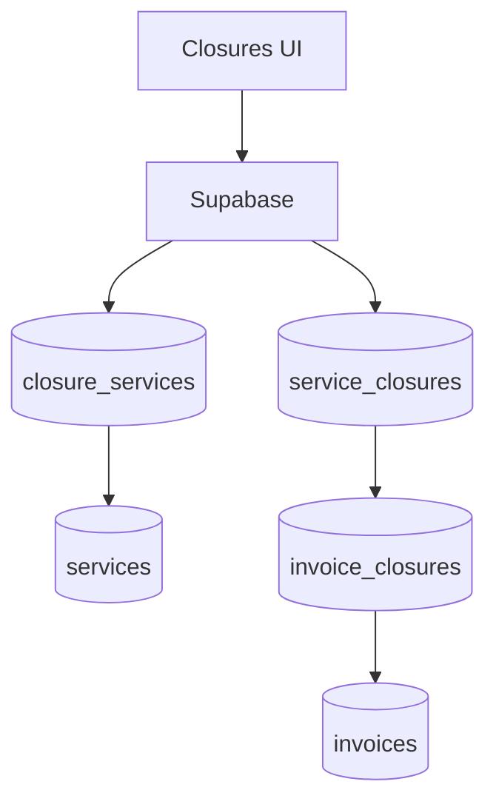

# closures

## Resumen
Módulo de **cierres** que agrupa servicios para consolidación operativa y posterior facturación. Incluye creación/edición, selección de servicios, generación de reportes y relación con facturas.

**Entrypoints**
- Página: [Closures](file:///Users/sergioiriartevasquez/Desktop/gruas-alerta-calendario/src/pages/Closures.tsx)
- Componentes: [src/components/closures](file:///Users/sergioiriartevasquez/Desktop/gruas-alerta-calendario/src/components/closures)

## Arquitectura y componentes
- Listado: `ClosuresTable`, `ClosuresGroupedView`, `ClosuresStats`, búsqueda y vista mobile.
- Formulario: `ClosureForm` + navegación por pasos (`ClosureFormStepNavigation`) y selección de servicios (`ServicesSelector`/`EnhancedServicesSelector`).
- Detalle: `ClosureDetailsModal`, acciones de emergencia y confirmaciones.
- Integración facturación: confirmación y asociación de cierres a facturas.

## API expuesta

### Ruta (frontend)
- `/closures`

### Operaciones Supabase (tablas)
- `service_closures` (entidad de cierre)
- `closure_services` (relación cierre↔servicio)
- `invoice_closures` (relación factura↔cierre)
- apoyo: `services`, `clients`

## Especificación de uso (con ejemplos)

### Crear cierre y asociar servicios
```ts
import { supabase } from '@/integrations/supabase/client'

const { data: closure } = await supabase
  .from('service_closures')
  .insert({ client_id: clientId, status: 'open' })
  .select('id')
  .single()

await supabase.from('closure_services').insert([
  { closure_id: closure!.id, service_id: serviceId1 },
  { closure_id: closure!.id, service_id: serviceId2 }
])
```

## Dependencias

### Externas (principales)
- `react`, `react-router-dom`
- `react-hook-form`, `zod`
- `date-fns`
- `lucide-react`, `sonner`

### Internas (principales)
- Hooks típicos: `useServiceClosures`, `useServicesForClosures`, `useClosuresForInvoices`, `useClosureAutomation`
- UI: `@/components/ui/*`
- Integración con `invoices` y `services`.

## Configuración requerida
- RLS: admins/viewers deben leer/escribir cierres; clientes solo lectura si se expone en portal.
- Reglas de negocio: mantener consistencia de estados (servicio cerrado vs cierre abierto) mediante triggers/RPC cuando aplique.

## Casos de uso principales
- Agrupar servicios por periodo/cliente para consolidación.
- Generar reportes de cierre y preparar facturación.
- Asociar uno o más cierres a una factura.

## Diagramas



## Rendimiento
- Selección de servicios: filtrar por rango de fechas/cliente y paginar.
- Cálculos (totales, métricas): preferir vistas/RPC si crece el volumen.

## Seguridad
- Validar que un usuario no pueda asociar servicios de otro cliente a un cierre (RLS y checks).
- En acciones de emergencia, registrar auditoría y restringir permisos.
