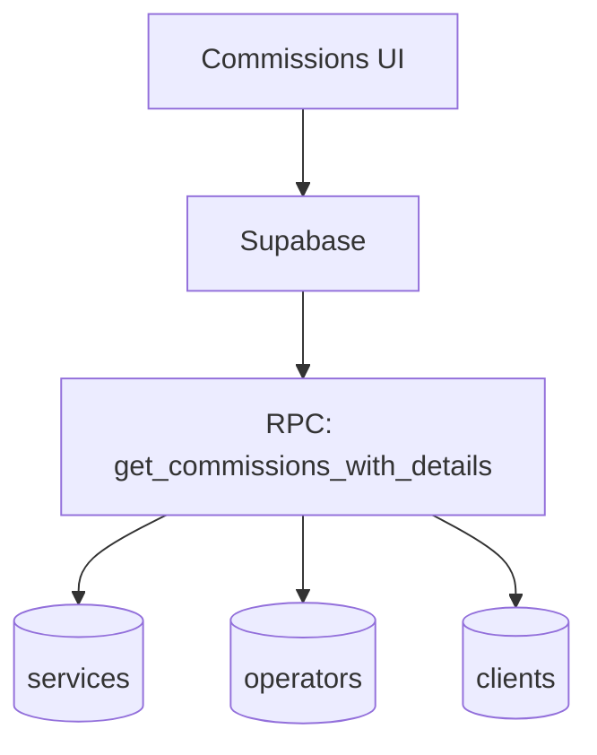

# commissions

## Resumen
Módulo de **comisiones** para cálculo/visualización y herramientas de sincronización con servicios y pagos. Incluye filtros, exportación y acciones administrativas (ajuste de fechas/lotes).

**Entrypoints**
- Página: [Commissions](file:///Users/sergioiriartevasquez/Desktop/gruas-alerta-calendario/src/pages/Commissions.tsx)
- Componentes: [src/components/commissions](file:///Users/sergioiriartevasquez/Desktop/gruas-alerta-calendario/src/components/commissions)
- Utilidades: [commissionSync.ts](file:///Users/sergioiriartevasquez/Desktop/gruas-alerta-calendario/src/utils/commissionSync.ts)
- Referencias existentes: [sistema-comisiones-restaurado.md](../sistema-comisiones-restaurado.md)

## Arquitectura y componentes
- Tabla y filtros: `CommissionTable`, `CommissionFilters`.
- Acciones: `CommissionExportButton`, `CreatePaymentBatchDialog`, `EditPaymentDateDialog`.
- Integración: se apoya en datos de `services` y `operators`, y en RPC para obtener vista consolidada.

## API expuesta

### Ruta (frontend)
- `/commissions` (AdminOnlyRoute)

### Operaciones Supabase (tablas/RPC)
Tablas consumidas (típico):
- `services`, `operators`, `clients`

RPC detectadas en hooks:
- `get_commissions_with_details`
- `update_commission_payment_date`

Otras RPC relacionadas (según uso):
- `force_commission_sync_for_service`, `audit_commission_system`

## Especificación de uso (con ejemplos)

### Cargar comisiones con detalles (RPC)
```ts
import { supabase } from '@/integrations/supabase/client'

const { data, error } = await supabase.rpc('get_commissions_with_details', {
  p_start_date: '2026-04-01',
  p_end_date: '2026-04-30'
})
if (error) throw error
```

## Dependencias

### Externas (principales)
- `react`
- `@tanstack/react-query`
- `date-fns`
- `lucide-react`, `sonner`

### Internas (principales)
- Hooks: `hooks/commissions/*` y/o `useCommissionSync` (según implementación)
- Utilidades: `@/utils/commissionSync`, `@/utils/forceCommissionSync`
- UI: `@/components/ui/*`

## Configuración requerida
- Reglas de negocio (cálculo): deben estar definidas de forma consistente entre UI y backend (idealmente en RPC/vistas).
- RLS: solo admins deben acceder a comisiones completas.

## Casos de uso principales
- Revisar comisiones por periodo/operador/cliente.
- Exportar comisiones y generar lotes de pago.
- Reparar/sincronizar comisiones ante inconsistencias.

## Diagramas



## Rendimiento
- Preferir RPC agregada para evitar N+1 en comisiones.
- Cachear por rango de fechas y filtros.

## Seguridad
- Comisiones son datos sensibles: enforcement por RLS y validación de rol en RPC.
- Registrar auditoría de acciones masivas (lotes/ediciones).
