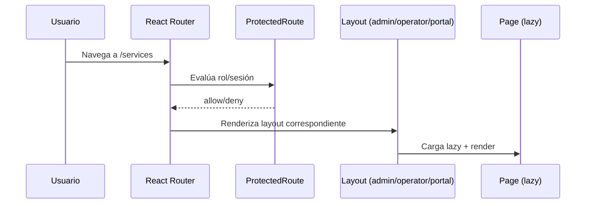

# core-app

## Resumen
Módulo núcleo responsable del **bootstrap** del frontend, configuración de **routing**, proveedores globales (React Query + Contexts) y estrategias de **robustez ante despliegues** (recuperación de errores de carga de chunks y precarga de rutas).

**Entrypoints**
- [main.tsx](file:///Users/sergioiriartevasquez/Desktop/gruas-alerta-calendario/src/main.tsx#L1-L50): punto de entrada del DOM + recuperación ante chunk errors.
- [App.tsx](file:///Users/sergioiriartevasquez/Desktop/gruas-alerta-calendario/src/App.tsx#L1-L232): providers globales, rutas y layouts por rol.

## Arquitectura y componentes

### Bootstrap y resiliencia post-deploy
El entrypoint registra listeners globales para detectar errores típicos de “chunk no encontrado” tras despliegues (hash de assets cambiado con HTML cacheado) y fuerza un hard reload **una sola vez por sesión**:
- `unhandledrejection` y `error` → si el mensaje coincide con patrones de chunk, ejecuta `window.location.reload()` condicionado por `sessionStorage`.
- Referencia: [main.tsx](file:///Users/sergioiriartevasquez/Desktop/gruas-alerta-calendario/src/main.tsx#L11-L44).

### Providers globales
La app se compone con una cadena de providers para estado transversal:
- React Query: `QueryClientProvider` con políticas de cache (staleTime, gcTime, refetchOnWindowFocus, retry).
- Auth/session: `AuthProvider` + `SessionTimeoutProvider`.
- Usuario/rol/permisos: `UserProvider`.
- Notificaciones: `NotificationProvider` + `ToastProvider` + `Toaster`.
- Router: `BrowserRouter`.
- Referencia: [App](file:///Users/sergioiriartevasquez/Desktop/gruas-alerta-calendario/src/App.tsx#L114-L231).

### Routing y separación por rol
Se modelan 3 “áreas” principales con layouts y restricciones:
- Público: `/auth`, `/reset-password`, `/`, rutas de diagnóstico.
- Administrativo: grupo con `ProtectedRoute` + `Layout` (`allowedRoles=['admin','viewer']`) y rutas de operación.
- Operador: `/operator/*` con `OperatorLayout` (`allowedRoles=['operator','admin']`).
- Portal cliente: `/portal/*` con `PortalLayout` (`requireRole='client'`).
- Referencia: [AppContent](file:///Users/sergioiriartevasquez/Desktop/gruas-alerta-calendario/src/App.tsx#L125-L211).

### Precarga de rutas (performance)
Se define un diccionario de imports dinámicos (`routeImports`) y se ejecuta una precarga silenciosa luego del primer render para reducir latencia en navegación:
- `setTimeout(preloadAllRoutes, 1000)` tras mount.
- Referencia: [preloadAllRoutes](file:///Users/sergioiriartevasquez/Desktop/gruas-alerta-calendario/src/App.tsx#L24-L113).

## API expuesta

### Rutas (frontend)
La “API” pública del módulo se expresa como rutas en React Router:
- Público: `/`, `/auth`, `/reset-password`, `/performance-test`, `/debug-freeze`, `/connection-test`.
- Administrativas: `/dashboard`, `/services`, `/calendar`, `/closures`, `/clients`, `/cranes`, `/invoices`, `/inventory`, `/reports`, `/suppliers`, `/daily-report`, etc.
- Admin-only: `/operators`, `/vehicles`, `/commissions`, `/settings`, `/quick-entries`, `/backup`.
- Redirecciones administrativas retrocompatibles: `/service-types` → `/settings#service-types`, `/service-rates` → `/settings#service-rates` y `/cost-centers` → `/settings#cost-centers`.
- Operador: `/operator` (index), `/operator/service/:id/inspection`.
- Portal: `/portal/*` (`dashboard`, `services`, `request-service`, `invoices`).
- Referencia: [Routes](file:///Users/sergioiriartevasquez/Desktop/gruas-alerta-calendario/src/App.tsx#L136-L208).

### Superficie pública (exports)
- Export default: `App` ([App.tsx](file:///Users/sergioiriartevasquez/Desktop/gruas-alerta-calendario/src/App.tsx#L214-L232)).
- `AppContent` es interno al módulo (no exportado).

## Dependencias

### Externas (principales)
- `react`, `react-dom`
- `react-router-dom`
- `@tanstack/react-query`

### Internas (capas transversales)
- Contexts: `@/contexts/*`
- Layouts/guards: `@/components/layout/*`
- Notificaciones UI: `@/components/ui/*`

## Configuración requerida
- Vite env:
  - `import.meta.env.MODE` es usado para logging del entorno (referencia: [main.tsx](file:///Users/sergioiriartevasquez/Desktop/gruas-alerta-calendario/src/main.tsx#L7-L10)).
- Enrutamiento:
  - La app asume `BrowserRouter` (history API). En hosting estático se requiere rewrite a `index.html` (ver `public/_redirects` y `public/_headers` si aplica).

## Casos de uso principales
- Navegar por módulos con carga diferida (lazy routes) y precarga posterior.
- Controlar acceso por rol a rutas y layouts.
- Recuperarse de fallos de chunk tras despliegues sin loops.

## Diagramas

## Rendimiento
- Precarga de rutas: mejora navegación a costa de más requests tras el primer render; en redes lentas puede competir con recursos críticos.
- React Query: `staleTime` y `gcTime` definen equilibrio entre frescura y costo de refetch.
- Recuperación de chunk: evita pantallas rotas post-deploy, pero puede enmascarar errores de red persistentes si el patrón de error coincide.

## Seguridad
- Control de acceso se basa en rol (guards en frontend). Debe complementarse con RLS y políticas en Supabase para evitar escalamiento.
- Evitar exponer secretos en logs del browser; el logging actual es de versión/modo, no de credenciales.
