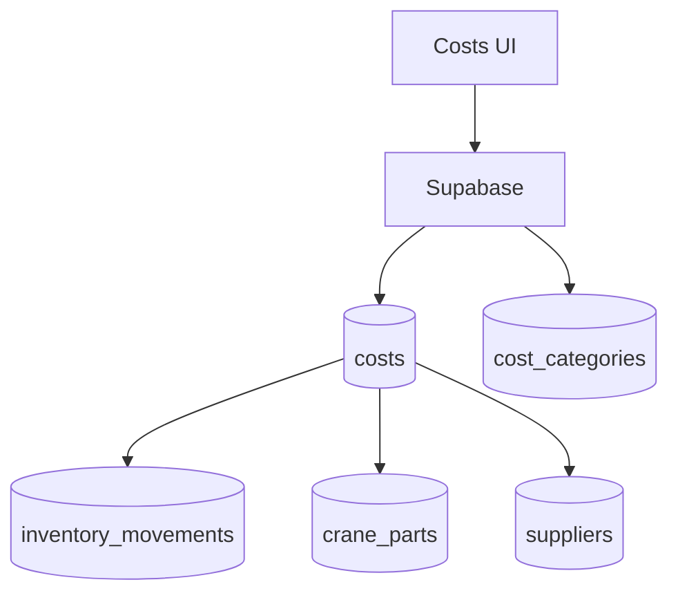

# costs

## Resumen
Módulo de **costos** para registro, edición, trazabilidad y cargas masivas (CSV/XML). Incluye flujos integrados con inventario y piezas de grúa cuando el costo corresponde a repuestos/consumo.

**Entrypoints**
- Página: [Costs](file:///Users/sergioiriartevasquez/Desktop/gruas-alerta-calendario/src/pages/Costs.tsx)
- Componentes: [src/components/costs](file:///Users/sergioiriartevasquez/Desktop/gruas-alerta-calendario/src/components/costs)
- Servicio de sincronización inventario↔costos: [UnifiedPurchaseService](file:///Users/sergioiriartevasquez/Desktop/gruas-alerta-calendario/src/services/UnifiedPurchaseService.ts)
- Referencias existentes:
  - [cost-module-prompt.md](../development/cost-module-prompt.md)

## Arquitectura y componentes
- Listado y filtros: `CostsTable`, `EnhancedCostsTable`, `CostsDashboard`, `CostsHeader`.
- Detalle/edición: `CostDetailsModal`, confirmación de borrado, acciones batch.
- Formulario por pasos: `components/costs/form/*` (inputs, selector de proveedor/servicio, navegación).
- Importación:
  - `CSVCostUpload`, `XMLCostUpload`, uso de plantillas (ver `public/templates`).

## API expuesta

### Ruta (frontend)
- `/costs`

### Operaciones Supabase (tablas)
- `costs` (entidad principal)
- catálogos: `cost_categories`, `cost_subcategories`, `cost_centers`
- integración inventario: `inventory_movements`, `inventory_items`, `inventory_stock`
- integración grúas: `crane_parts`
- integración proveedores: `suppliers`, `supplier_payments` (según flujo)

### RPC destacadas
- `find_matching_costs_for_invoice` (soporte a conciliación/relación con facturas)
- Limpiezas/diagnóstico (según uso): `check_cost_duplicates`, `cleanup_duplicate_inventory_costs`

## Especificación de uso (con ejemplos)

### Registrar un costo
```ts
import { supabase } from '@/integrations/supabase/client'

await supabase.from('costs').insert({
  amount: 250000,
  date: '2026-04-13',
  description: 'Repuesto grúa',
  category_id: categoryId
})
```

### Buscar costos para asociar a una factura (RPC)
```ts
const { data } = await supabase.rpc('find_matching_costs_for_invoice', {
  p_invoice_id: invoiceId
})
```

## Dependencias

### Externas (principales)
- `react`, `react-router-dom`
- `@tanstack/react-query`
- `react-hook-form`, `zod`
- `react-dropzone`
- `xlsx` (procesamiento de plantillas/importación)
- `date-fns`
- `lucide-react`, `sonner`

### Internas (principales)
- Hooks típicos: `useCosts`, `useCostCategories`, `useCostSubcategories`, `useUpdateCostsBatch`, `useCostCSVUpload`
- Utilidades: `@/utils/costHelpers`, `@/utils/csvValidations`, `@/utils/inventoryCostHelper`
- Integración con inventario: `@/services/UnifiedPurchaseService`

## Configuración requerida
- Catálogos: categorías/subcategorías deben existir en BD.
- RLS: escritura en `costs` restringida a roles autorizados.
- Imports: definir formatos de CSV/XML soportados y validar antes de insertar.

## Casos de uso principales
- Registrar costos operativos (combustible, repuestos, peajes, etc.).
- Subir costos masivamente desde CSV/XML.
- Trazar costos hacia movimientos de inventario y piezas de grúa.

## Diagramas



## Rendimiento
- Importaciones masivas: preferir batches y evitar insertar 1 por 1 desde el cliente.
- Listados: paginar y limitar columnas; delegar agregaciones al servidor.

## Seguridad
- Validar archivos importados para evitar inyección de datos corruptos.
- Restringir borrado/actualización con RLS + auditoría (tabla `audit_log` si se usa).
