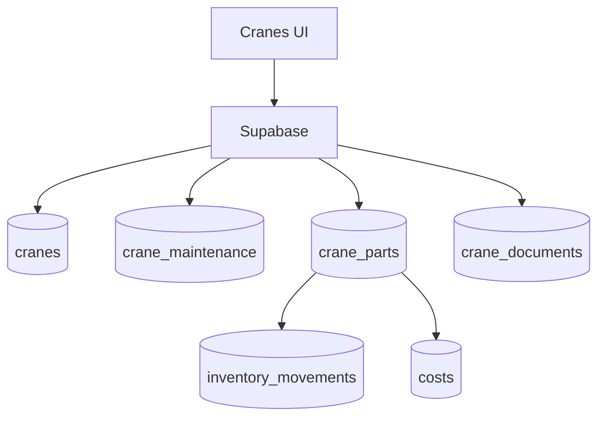

# cranes

## Resumen
Módulo de administración de **grúas** y su ciclo de vida:
- ficha técnica y métricas,
- mantenimiento,
- documentos con vencimiento/alertas,
- piezas/repuestos y trazabilidad,
- historial de servicios asociado.

**Entrypoints**
- Página: [Cranes](file:///Users/sergioiriartevasquez/Desktop/gruas-alerta-calendario/src/pages/Cranes.tsx)
- Componentes: [src/components/cranes](file:///Users/sergioiriartevasquez/Desktop/gruas-alerta-calendario/src/components/cranes)

## Arquitectura y componentes
- Vista principal: `CranesTable`, `CranesHeader`, filtros y vista mobile.
- Detalle: `CraneDetailsModal` con tabs (`CraneInformation`, `CraneMaintenance`, `CraneCosts`, `CraneServices`, `CraneDocumentation`).
- Formularios: `components/cranes/forms/*` (mantención, piezas, configuración documentos).
- Trazabilidad/diagnóstico: `PartsTraceabilityDashboard`, migración `CranePartsDataMigration` cuando aplica.

Relaciones clave:
- grúa ↔ servicios (`services.crane_id`)
- grúa ↔ costos (`costs.crane_id`)
- grúa ↔ piezas (`crane_parts` ↔ `inventory_movements`)
- grúa ↔ mantenciones (`crane_maintenance`)
- grúa ↔ documentos (`crane_documents`, `document_alerts`)

## API expuesta

### Ruta (frontend)
- `/cranes`

### Operaciones Supabase (tablas/RPC)
Tablas:
- `cranes`
- `crane_parts`
- `crane_maintenance`
- `crane_documents`
- `crane_consumption_rates`
- apoyo: `inventory_movements`, `costs`, `services`, `document_alerts`

RPC relevantes (según esquema):
- métricas y trazabilidad: `get_crane_metrics`, `get_parts_traceability`, `force_resync_crane_part`, `detect_duplicate_crane_parts`

## Especificación de uso (con ejemplos)

### Crear grúa
```ts
import { supabase } from '@/integrations/supabase/client'

await supabase.from('cranes').insert({
  internal_code: 'G-12',
  status: 'active'
})
```

### Registrar pieza asociada (trazabilidad)
```ts
await supabase.from('crane_parts').insert({
  crane_id: craneId,
  part_name: 'Bomba hidráulica',
  quantity: 1,
  unit_price: 450000,
  date: '2026-04-13'
})
```

## Dependencias

### Externas (principales)
- `react`, `react-router-dom`
- `@tanstack/react-query`
- `react-hook-form`, `zod` (formularios/validación)
- `jspdf`, `jspdf-autotable` (exportación PDF)
- `date-fns`
- `lucide-react`, `sonner`

### Internas (principales)
- Hooks típicos: `useCranes`, `useCraneMetrics`, `useCraneMaintenance`, `useCraneParts`, `useCraneDocuments`, `useCraneServices`
- Utilidades: `@/utils/*` (pdf, validaciones, helpers)
- Integración con inventario: `@/services/UnifiedPurchaseService` y/o helpers de inventario (según flujo).

## Configuración requerida
- Storage (si se suben documentos/fotos): configurar bucket/políticas en Supabase Storage cuando aplique.
- Alertas de documentos: triggers/RPC para `document_alerts` y configuración en settings.

## Casos de uso principales
- Mantener registro de activos (grúas) y su estado.
- Controlar mantenciones y costos por grúa.
- Trazar consumo de repuestos desde inventario hacia una grúa.
- Gestionar documentación y vencimientos.

## Diagramas



## Rendimiento
- Detalles por tabs: cargar datos bajo demanda (evitar traer mantenciones + piezas + docs + servicios en el primer fetch).
- PDFs: generar bajo demanda, evitar generar automáticamente en cada render.

## Seguridad
- RLS y ownership por rol: solo admins deben poder modificar activos; operadores/clients pueden tener lectura limitada.
- Documentos: validar tipo/tamaño y restringir buckets por política.
