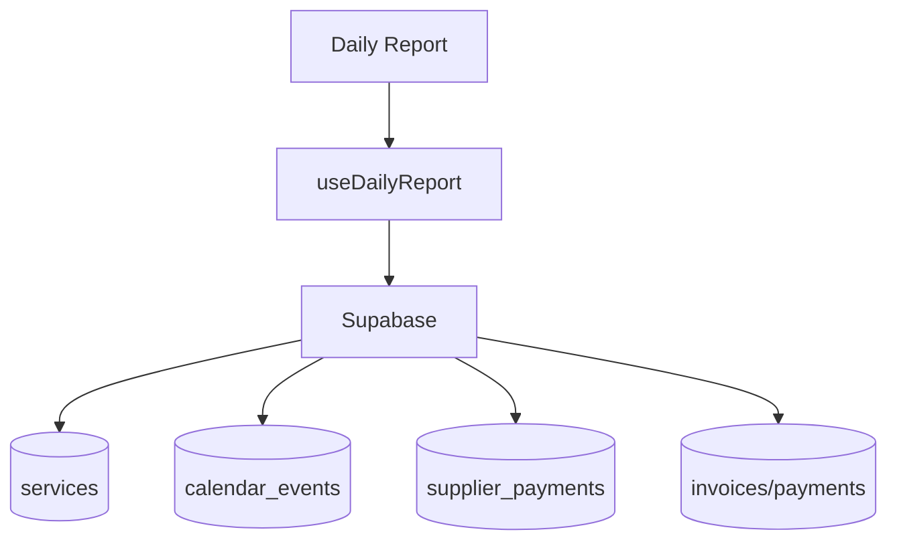

# daily-report

## Resumen
Módulo de **reporte diario** que consolida información operacional y financiera en una vista única (servicios, proveedores, calendario y resumen financiero).

**Entrypoints**
- Página: [DailyReport](file:///Users/sergioiriartevasquez/Desktop/gruas-alerta-calendario/src/pages/DailyReport.tsx)
- Componentes: [src/components/daily-report](file:///Users/sergioiriartevasquez/Desktop/gruas-alerta-calendario/src/components/daily-report)

## Arquitectura y componentes
- Vista compuesta por secciones (`components/daily-report/sections/*`):
  - `ServicesSection`
  - `SuppliersSection`
  - `CalendarSection`
  - `FinancialSection`
- Hook de consolidación (típico): `useDailyReport` para cargar datos agregados y normalizarlos.

## API expuesta

### Ruta (frontend)
- `/daily-report`

### Operaciones Supabase (tablas/RPC típicas)
Tablas:
- `services`, `calendar_events`
- `supplier_payments` (pendientes/vencidos)
- `invoices`, `payments` (resumen financiero)

RPC (si se usa para agregación):
- `get_overdue_invoices_for_alerts`, `get_invoices_due_soon`

## Especificación de uso (con ejemplos)

### Cargar reporte diario (patrón)
```ts
// El patrón recomendado es encapsular la carga en un hook (react-query),
// y que cada sección consuma datos ya agregados.
```

## Dependencias

### Externas (principales)
- `react`
- `lucide-react`

### Internas (principales)
- Hook: `useDailyReport`
- UI: `@/components/ui/*`
- Integración con `services`, `suppliers`, `calendar`, `invoices`.

## Configuración requerida
- Definición del “día” y timezone consistente con settings del sistema.
- RLS por rol.

## Casos de uso principales
- Supervisión diaria de operación y finanzas.
- Identificación rápida de pendientes (servicios, pagos proveedor, vencimientos).

## Diagramas



## Rendimiento
- Consolidar queries (agregación server-side) para no disparar múltiples consultas por sección.

## Seguridad
- Reporte diario suele concentrar datos sensibles: restringir a roles autorizados.
