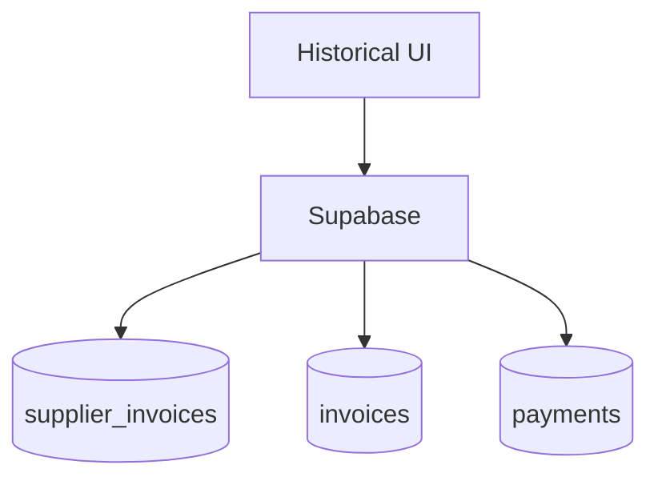

# finance-historical

## Resumen
Módulo de **histórico financiero** para análisis de compras/ventas y resultados por periodo. Complementa reportes con vistas exploratorias y exportaciones.

**Entrypoints**
- Página: [Historical](file:///Users/sergioiriartevasquez/Desktop/gruas-alerta-calendario/src/pages/Historical.tsx)
- Componentes: [src/components/finance](file:///Users/sergioiriartevasquez/Desktop/gruas-alerta-calendario/src/components/finance)

## Arquitectura y componentes
- Componentes principales: `HistoricalPurchases`, `HistoricalSales` y submódulos bajo `finance/historical/*`.
- Visualizaciones: `recharts`.
- Exportación: `jspdf`/`xlsx` cuando se generan reportes descargables.

## API expuesta

### Ruta (frontend)
- `/historical`

### Operaciones Supabase (tablas típicas)
- compras:
  - `supplier_invoices`, `supplier_invoice_items`, `suppliers`
- ventas:
  - `invoices`, `invoice_services`, `payments`
- costos:
  - `costs` (según análisis cruzado)

## Especificación de uso (con ejemplos)

### Consultar compras por periodo (ejemplo)
```ts
import { supabase } from '@/integrations/supabase/client'

const { data } = await supabase
  .from('supplier_invoices')
  .select('id, supplier_id, issue_date, total_amount')
  .gte('issue_date', '2026-04-01')
  .lte('issue_date', '2026-04-30')
```

## Dependencias

### Externas (principales)
- `react`
- `@tanstack/react-query`
- `recharts`
- `date-fns`
- `xlsx`, `jspdf`, `jspdf-autotable` (según exportaciones)
- `lucide-react`, `sonner`

### Internas (principales)
- Hooks: `hooks/finance/*`, `usePurchaseInvoices`, `usePurchaseHistoryParser` (según implementación)
- Utilidades: `@/utils/purchaseHistoryParser`, `@/utils/reportExporter`
- UI: `@/components/ui/*`

## Configuración requerida
- Definición de periodos y timezone consistente.
- RLS para datos financieros.

## Casos de uso principales
- Analizar tendencias de compras/ventas.
- Auditar periodos específicos (cierres contables).

## Diagramas



## Rendimiento
- Consultas por rango de fechas con índices; evitar traer detalle completo de items si no es necesario.

## Seguridad
- Datos financieros sensibles: control por rol y auditoría de exportaciones.
