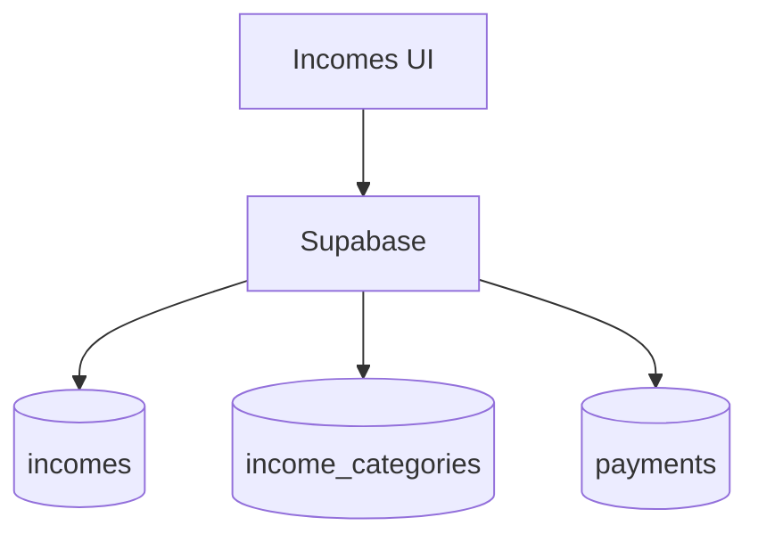

# incomes

## Resumen
Módulo de **ingresos**: registro/edición, pipeline/seguimiento, categorización y relación con pagos aplicados (cuando un ingreso se usa para registrar un pago).

**Entrypoints**
- Página: [Incomes](file:///Users/sergioiriartevasquez/Desktop/gruas-alerta-calendario/src/pages/Incomes.tsx)
- Componentes: [src/components/incomes](file:///Users/sergioiriartevasquez/Desktop/gruas-alerta-calendario/src/components/incomes)
- Tipos: [types/incomes.ts](file:///Users/sergioiriartevasquez/Desktop/gruas-alerta-calendario/src/types/incomes.ts)

## Arquitectura y componentes
- Listado y filtros: `IncomesTable`, `IncomeFilters`, `IncomesHeader`.
- Formularios: `IncomeForm`.
- Pipeline: `IncomesPipelineView` + métricas (`IncomesPipelineMetrics`).
- Integración pagos: algunos flujos pueden crear `payments` desde un ingreso (RPC `create_payment_from_existing_income` y/o `apply_payment_manual` según diseño).

## API expuesta

### Ruta (frontend)
- `/incomes`

### Operaciones Supabase (tablas)
- `incomes`
- `income_categories`, `income_subcategories`
- `payments` (si se generan pagos desde ingresos)

### RPC relevantes
- `apply_payment_manual` (si el ingreso se aplica como pago)
- `create_payment_from_existing_income` (según implementación)

## Especificación de uso (con ejemplos)

### Crear ingreso
```ts
import { supabase } from '@/integrations/supabase/client'

await supabase.from('incomes').insert({
  amount: 1200000,
  date: '2026-04-13',
  description: 'Pago cliente',
  category_id: categoryId
})
```

## Dependencias

### Externas (principales)
- `react`
- `@tanstack/react-query`
- `react-hook-form`, `zod`
- `date-fns`
- `lucide-react`, `sonner`

### Internas (principales)
- Hooks: `useIncomes`, `useIncomeSubcategories`, `useIncomeCategoryManager`
- UI: `@/components/ui/*`
- Integración con `invoices` y `payments` cuando corresponda.

## Configuración requerida
- Catálogos de ingresos deben existir y estar alineados con validaciones del formulario.
- RLS: acceso restringido a roles autorizados.

## Casos de uso principales
- Registrar ingresos por cobros/otros conceptos.
- Analizar ingresos por categoría y estado (pipeline).
- Aplicar ingresos como pagos a facturas (cuando el negocio lo requiere).

## Diagramas



## Rendimiento
- Pipeline: cargar por rangos de fecha/estado y cachear por filtros.

## Seguridad
- Datos financieros: RLS estricta y auditoría de cambios.
