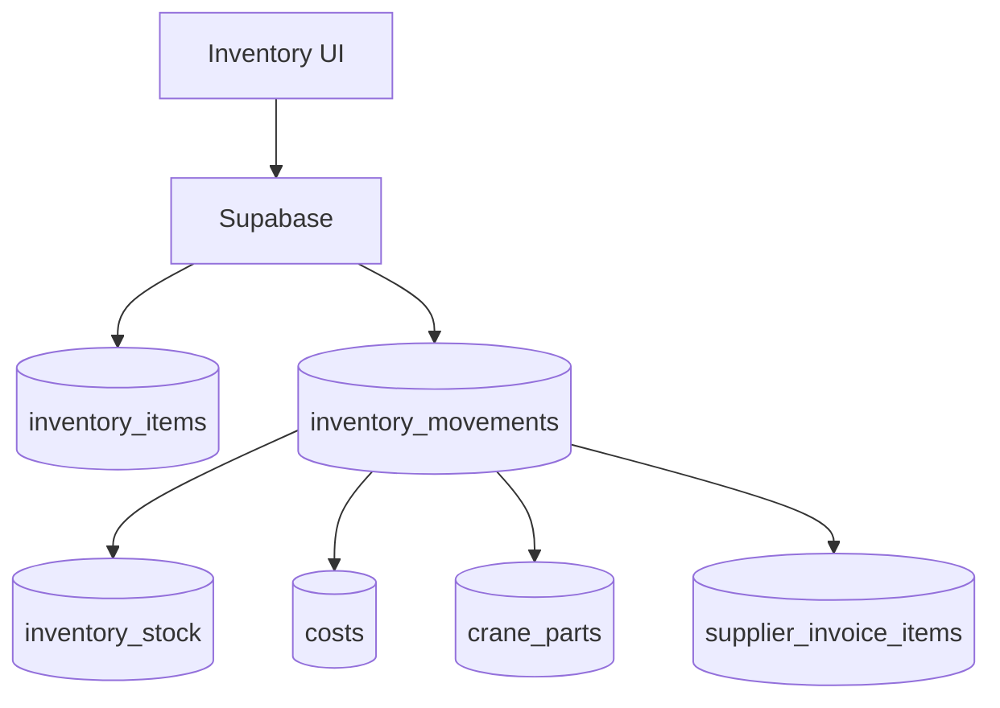

# inventory

## Resumen
Módulo de **inventario** para control de stock, movimientos (entrada/salida), alertas, reportes y sincronización con costos/proveedores/grúas.

**Entrypoints**
- Página: [Inventory](file:///Users/sergioiriartevasquez/Desktop/gruas-alerta-calendario/src/pages/Inventory.tsx)
- Componentes: [src/components/inventory](file:///Users/sergioiriartevasquez/Desktop/gruas-alerta-calendario/src/components/inventory)
- Servicio de compras unificadas: [UnifiedPurchaseService](file:///Users/sergioiriartevasquez/Desktop/gruas-alerta-calendario/src/services/UnifiedPurchaseService.ts)

## Arquitectura y componentes
- Catálogo y stock:
  - `ProductCatalogTable`, `InventoryStockView`, `ProductDetailsModal`, `ProductFormModal`.
- Movimientos:
  - `InventoryMovementForm`, `MovementsHistoryTable`, `MovementDetailsModal`, `MovementEditModal`.
- Alertas y sync:
  - `InventoryAlertsPage`, `InventorySyncDashboard`, `InventoryFixPanel`, `DuplicateProductsPanel`.
- Reportes:
  - `components/inventory/reports/*` (análisis, dashboard ejecutivo, exportaciones).

Integraciones típicas:
- costos ↔ movimientos: `inventory_movements.cost_id` + `costs.inventory_movement_id`
- consumo a grúa: `inventory_movements.crane_id` + `crane_parts.inventory_movement_id`
- facturas proveedor (XML): `supplier_invoices`/`supplier_invoice_items` enlazadas a movimientos.

## API expuesta

### Ruta (frontend)
- `/inventory`

### Operaciones Supabase (tablas)
- núcleo inventario:
  - `inventory_items`, `inventory_stock`, `inventory_movements`
  - `inventory_locations`, `inventory_categories`
  - `inventory_alerts`, `inventory_consumptions`
- integraciones:
  - `costs`, `crane_parts`
  - `supplier_invoices`, `supplier_invoice_items`, `supplier_payments`

### RPC destacadas
- `global_inventory_cleanup` (limpieza global / correcciones)
- migración/sync: `merge_inventory_items`, `migrate_unsynced_crane_parts_to_inventory`, `create_inventory_consumption_movement` (según uso)

## Especificación de uso (con ejemplos)

### Registrar movimiento de entrada
```ts
import { supabase } from '@/integrations/supabase/client'

await supabase.from('inventory_movements').insert({
  item_id: itemId,
  location_id: locationId,
  movement_type: 'entry',
  quantity: 10,
  unit_cost: 12000,
  total_cost: 120000,
  movement_date: '2026-04-13',
  status: 'active',
  reason: 'Compra'
})
```

### Registrar movimiento de salida (consumo)
```ts
await supabase.from('inventory_movements').insert({
  item_id: itemId,
  location_id: locationId,
  movement_type: 'exit',
  quantity: 2,
  unit_cost: 12000,
  total_cost: 24000,
  movement_date: '2026-04-13',
  status: 'active',
  reason: 'Consumo'
})
```

## Dependencias

### Externas (principales)
- `react`, `react-router-dom`
- `@tanstack/react-query`
- `react-hook-form`, `zod`
- `react-dropzone`
- `recharts` (dashboards/reportes)
- `date-fns`
- `lucide-react`, `sonner`

### Internas (principales)
- Hooks típicos: `useInventory`, `useInventoryReports`, `useInventoryAlerts`, `useInventorySyncWatcher`, `useInventoryDeduction`
- Utilidades: `@/utils/inventoryHelper`, `@/utils/inventoryConsumptionHelper`, `@/utils/inventoryCostHelper`
- Integración costos: `@/hooks/useCosts` y `@/services/UnifiedPurchaseService`

## Configuración requerida
- Ubicaciones activas: `inventory_locations.is_active` debe tener al menos una ubicación.
- RLS: permisos diferenciados (admin vs operator vs viewer).
- Reglas de stock: la lógica de actualización puede depender de triggers/vistas; mantener alineada con UI.

## Casos de uso principales
- Mantener catálogo de productos y stock actual por ubicación.
- Registrar compras y consumos.
- Integrar consumos con grúas y costos para trazabilidad financiera.
- Importar facturas proveedor y generar movimientos asociados.

## Diagramas



## Rendimiento
- Cálculos de stock: preferir mantener stock materializado (`inventory_stock`) y actualizar con triggers, en vez de recalcular desde movimientos cada vez.
- Listados de movimientos: paginar por fecha y limitar columnas.

## Seguridad
- Bloquear salidas que exceden stock (validación + enforcement server-side si corresponde).
- Restringir ediciones/borrados de movimientos: son financieros y afectan trazabilidad.
- Aislar datos por rol y registrar auditoría de correcciones masivas (ej. `global_inventory_cleanup`).
