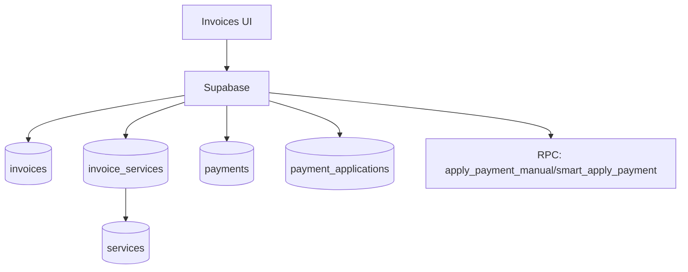

# invoices

## Resumen
Módulo de **facturación** y **pagos**: creación/edición de facturas, asociación de servicios/cierres, aplicación de pagos y reconciliación (incluye herramientas de diagnóstico y corrección cuando aplica).

**Entrypoints**
- Página: [Invoices](file:///Users/sergioiriartevasquez/Desktop/gruas-alerta-calendario/src/pages/Invoices.tsx)
- Componentes: [src/components/invoices](file:///Users/sergioiriartevasquez/Desktop/gruas-alerta-calendario/src/components/invoices)
- Referencias técnicas existentes:
  - [payment-system.md](../technical/payment-system.md)
  - [payment-reconciliation-fix.md](../technical/payment-reconciliation-fix.md)

## Arquitectura y componentes
- Vistas:
  - tabla/pipeline: `InvoicesTable`, `InvoicesPipelineView`, métricas, búsqueda y vista mobile.
- Formularios:
  - `InvoiceForm` + pasos (`components/invoices/form/*`).
- Pagos:
  - `PaymentForm`, `SmartPaymentForm`, `PaymentHistory`,
  - modales: `MarkAsPaidModal`, `PaymentApplicationModal`, `SelectivePaymentModal`.
- Alertas y salud:
  - `InvoiceAlertsDashboard`, `InvoiceAlertSettings`, `SystemHealthIndicator`.
- Cancelaciones:
  - `InvoiceCancellationModal`, `InvoiceCancellationsHistory`.

## API expuesta

### Ruta (frontend)
- `/invoices`

### Operaciones Supabase (tablas)
- `invoices` (entidad principal)
- `invoice_services` (relación factura↔servicio)
- `invoice_closures` (relación factura↔cierre)
- `payments` y `payment_applications` (pagos y aplicaciones)
- `invoice_alert_settings`, `invoice_cancellations`
- apoyo: `services`, `service_closures`

### RPC (funciones) frecuentes
- Aplicación de pagos:
  - `apply_payment_manual`
  - `smart_apply_payment`
  - `apply_payment_selective` (si se usa)
- Diagnóstico/corrección:
  - `comprehensive_payment_diagnosis`
  - `validate_payment_system_integrity`
  - `fix_invoice_payment_inconsistencies`
  - `sync_paid_invoices_with_payments`
  - `update_overdue_invoices`

## Especificación de uso (con ejemplos)

### Crear factura básica
```ts
import { supabase } from '@/integrations/supabase/client'

const { data: invoice, error } = await supabase
  .from('invoices')
  .insert({ client_id: clientId, status: 'draft', issue_date: '2026-04-13' })
  .select('id')
  .single()
if (error) throw error
```

### Asociar servicios a una factura
```ts
await supabase.from('invoice_services').insert([
  { invoice_id: invoiceId, service_id: serviceId }
])
```

### Aplicar pago manual (RPC)
```ts
const { data, error } = await supabase.rpc('apply_payment_manual', {
  p_invoice_id: invoiceId,
  p_amount: 100000,
  p_payment_date: '2026-04-13'
})
if (error) throw error
```

## Dependencias

### Externas (principales)
- `react`, `react-router-dom`
- `react-hook-form`, `zod`
- `date-fns`
- `react-dropzone` (importaciones/adjuntos cuando aplica)
- `lucide-react`, `sonner`

### Internas (principales)
- Hooks típicos: `useInvoices`, `usePayments`, `usePaymentApplications`, `useInvoiceAlerts`, `usePendingPayments`
- Utilidades: `@/utils/invoiceUtils`, `@/utils/currencyUtils`
- Integración con `closures`, `services`, `reports`.

## Configuración requerida
- RLS: acceso a facturas/pagos debe ser consistente por rol (admin/viewer) y por cliente en portal.
- Triggers/RPC: el sistema de pagos depende de funciones y/o triggers (ver documentación técnica enlazada).

## Casos de uso principales
- Generar factura por servicios/cierres.
- Registrar pagos y aplicar a facturas (manual/smart).
- Detectar y corregir inconsistencias (duplicados, montos aplicados, estados vencidos).

## Diagramas



## Rendimiento
- Vistas con gran volumen: paginar por `issue_date`/estado y evitar joins pesados en el cliente.
- Reconciliación: ejecutar diagnósticos/correcciones como acciones explícitas (no en render).

## Seguridad
- Pagos y facturas son datos financieros: RLS estricta y auditoría.
- RPC críticas deben verificar rol y consistencia (evitar aplicar pagos a facturas de otro cliente).
