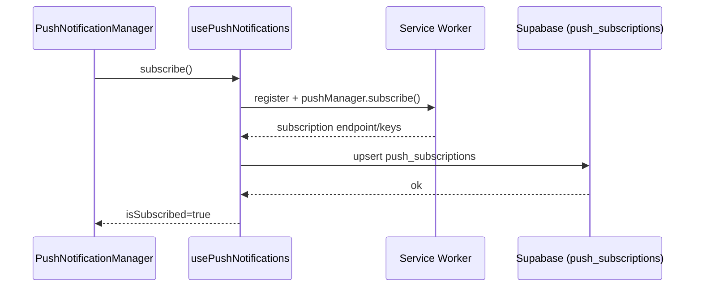

# notifications

## Resumen
Módulo de notificaciones que cubre dos capas:
- Notificaciones **in-app** (lista/contador/estado leído).
- Notificaciones **push** (suscripción del navegador, preferencias y validaciones de entorno HTTPS/SW).

**Entrypoints**
- Contexto: [NotificationContext](file:///Users/sergioiriartevasquez/Desktop/gruas-alerta-calendario/src/contexts/NotificationContext.tsx#L1-L115)
- UI push: [PushNotificationManager](file:///Users/sergioiriartevasquez/Desktop/gruas-alerta-calendario/src/components/notifications/PushNotificationManager.tsx#L1-L289)

## Arquitectura y componentes

### Estado y persistencia “read/unread”
`NotificationProvider` combina:
- datos remotos (hook `useNotificationsData`),
- estado local (marcado como leído) persistido en `localStorage` (`read_notification_ids`).

Modelo:
- `notifications[]` en memoria con `read: boolean`
- `unreadCount` derivado por filtrado.

Referencia: [NotificationContext.tsx](file:///Users/sergioiriartevasquez/Desktop/gruas-alerta-calendario/src/contexts/NotificationContext.tsx#L30-L108).

### Gestión de push notifications
`PushNotificationManager` se encarga de:
- detectar soporte de `serviceWorker`, `PushManager` y `Notification`,
- requerir HTTPS en producción (excepción: `localhost`),
- activar/desactivar suscripción (`subscribe`/`unsubscribe`) mediante `usePushNotifications`,
- mantener preferencias (toggles) para tipos de eventos.

Referencia: [PushNotificationManager.tsx](file:///Users/sergioiriartevasquez/Desktop/gruas-alerta-calendario/src/components/notifications/PushNotificationManager.tsx#L11-L288).

## API expuesta

### Hooks/exports públicos
- `useNotifications()`:
  - Import: `import { useNotifications } from '@/contexts/NotificationContext'`
- `NotificationProvider`:
  - Import: `import { NotificationProvider } from '@/contexts/NotificationContext'`
- `PushNotificationManager`:
  - Import: `import { PushNotificationManager } from '@/components/notifications/PushNotificationManager'`

### Contratos relevantes
`NotificationContextType`:
- `addNotification(notification)` (in-memory)
- `markAsRead(id)`, `markAllAsRead()`, `clearAllNotifications()`
- `unreadCount`, `loading`

### API de navegador (push)
- `Notification.requestPermission()`
- `navigator.serviceWorker` / `PushManager`

### Operaciones de datos (Supabase)
Según el esquema tipado, este módulo se apoya típicamente en:
- `notifications`, `notification_settings`, `notification_logs`
- `push_subscriptions`

Ver tablas disponibles en: [types.ts](file:///Users/sergioiriartevasquez/Desktop/gruas-alerta-calendario/src/integrations/supabase/types.ts#L2704-L3184).

## Especificación de uso (con ejemplos)

### Mostrar contador de no leídas
```tsx
import { useNotifications } from '@/contexts/NotificationContext'

export function NotificationBadge() {
  const { unreadCount } = useNotifications()
  return <span>{unreadCount}</span>
}
```

### Montar UI de push en Settings
```tsx
import { PushNotificationManager } from '@/components/notifications/PushNotificationManager'

export function NotificationsSection() {
  return <PushNotificationManager />
}
```

## Dependencias

### Externas (principales)
- `react`
- `sonner` (toasts)
- `lucide-react` (iconos)

### Internas (principales)
- `@/hooks/useNotificationsData` (carga remota de notificaciones)
- `@/hooks/usePushNotifications` (suscripción/preferencias)
- `@/components/ui/*` (card, button, switch, label)

## Configuración requerida
- PWA/service worker activo para push en producción.
- HTTPS en producción (requisito de Push API).
- Permisos del navegador deben estar en `granted` para suscripción.

## Casos de uso principales
- Alertas in-app (contador, dropdown/lista, marcado leído).
- Push para eventos relevantes (servicios asignados, actualizaciones, inspecciones, facturas, alertas del sistema).

## Diagramas



## Rendimiento
- Reducir polling: preferir subscriptions/realtime o react-query con staleTime razonable (según diseño del hook).
- Persistencia `read_notification_ids`: mantener tamaño acotado (limpiar IDs antiguos si el volumen crece).

## Seguridad
- Push subscriptions contienen endpoints/keys del navegador: tratarlas como datos sensibles (no loguear en producción).
- Validar RLS en tablas `notifications/*` y `push_subscriptions` para evitar lectura/edición cruzada.
- Preferencias deben ligarse al usuario autenticado (server-side enforcement).
