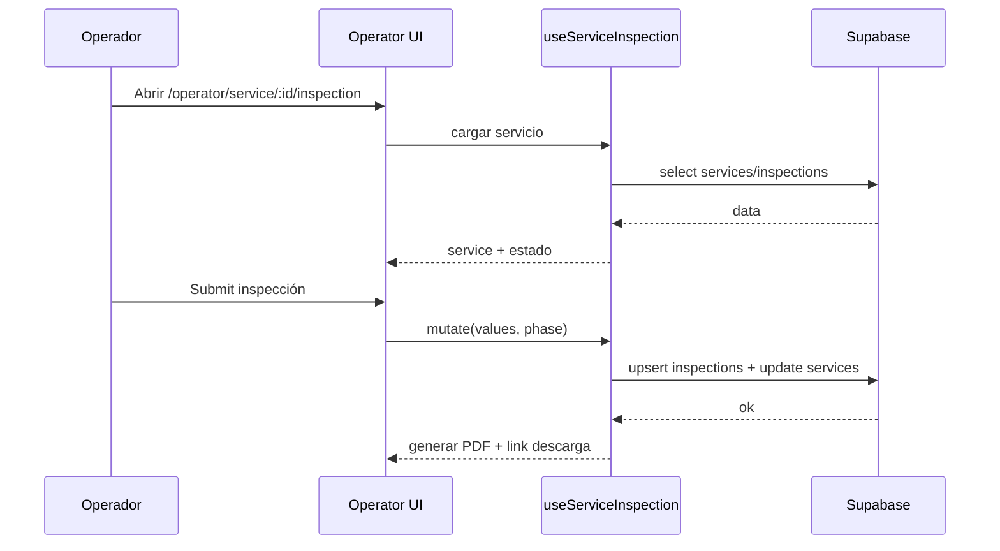

# operator-app

## Resumen
Módulo de operación para **usuarios operador**, enfocado en ejecución de servicios asignados y flujo de **inspección** con evidencia (fotos), firma, validación y generación de PDF.

**Entrypoints**
- Layout operador: [OperatorLayout](file:///Users/sergioiriartevasquez/Desktop/gruas-alerta-calendario/src/components/layout/OperatorLayout.tsx)
- Dashboard operador: [OperatorDashboard](file:///Users/sergioiriartevasquez/Desktop/gruas-alerta-calendario/src/pages/OperatorDashboard.tsx)
- Inspección: [ServiceInspection](file:///Users/sergioiriartevasquez/Desktop/gruas-alerta-calendario/src/pages/operator/ServiceInspection.tsx#L1-L112)
- Componentes: [src/components/operator](file:///Users/sergioiriartevasquez/Desktop/gruas-alerta-calendario/src/components/operator)

## Arquitectura y componentes
- **Rutas protegidas** por rol `operator` o `admin` bajo `/operator/*` (ver routing en [App.tsx](file:///Users/sergioiriartevasquez/Desktop/gruas-alerta-calendario/src/App.tsx#L184-L205)).
- **Dashboard operador**: lista de servicios asignados y accesos a inspección.
- **Inspección**:
  - `useServiceInspection` encapsula carga del servicio, mutaciones y estado de PDF.
  - UI compuesta por `ServiceDetailsCard`, `InspectionForm`, estados de carga/error y `PDFProgress`.

Referencia del ensamblado principal: [ServiceInspection.tsx](file:///Users/sergioiriartevasquez/Desktop/gruas-alerta-calendario/src/pages/operator/ServiceInspection.tsx#L12-L109).

## API expuesta

### Rutas (frontend)
- `/operator` (dashboard operador)
- `/operator/service/:id/inspection` (flujo de inspección)

### Operaciones Supabase (tablas típicas)
- `services` (leer servicio asignado y actualizar estado)
- `inspections` (persistir inspección por fase)
- `service_change_history` (auditar cambios, según flujo)
- Storage (si aplica a fotos/PDF): buckets/policies según implementación de `photoStorage`/helpers.

## Especificación de uso (con ejemplos)

### Navegar a inspección desde un card
```tsx
import { useNavigate } from 'react-router-dom'

const navigate = useNavigate()
const go = (serviceId: string) => navigate(`/operator/service/${serviceId}/inspection`)
```

### Enviar inspección (patrón de hook)
```ts
// El módulo usa un hook que expone una mutation:
// processInspectionMutation.mutate({ values, phase })
```

## Dependencias

### Externas (principales)
- `react`, `react-router-dom`
- `@tanstack/react-query`
- `react-hook-form`, `zod`
- `react-signature-canvas`
- `date-fns`
- `lucide-react`, `sonner`

### Internas (principales)
- Hooks: `useServiceInspection`, `useInspectionPersistence`, `useImageProcessor`, `useOfflineStorage` (según flujo)
- UI: `@/components/ui/*`
- Utilidades: `@/utils/inspectionValidation`, `@/utils/photoProcessor`, `@/utils/inspectionPdfGenerator` (según uso)

## Configuración requerida
- Permisos:
  - RLS para permitir a operador leer/actualizar solo servicios asignados.
  - Escritura en `inspections` restringida al operador autenticado.
- PWA/Offline (si se usa):
  - service worker y almacenamiento local habilitados para capturas en terreno.

## Casos de uso principales
- Operador revisa servicios asignados.
- Operador completa inspección, adjunta evidencia, firma y genera PDF.
- Sistema actualiza estado del servicio e informa a backoffice (notificaciones/cola).

## Diagramas



## Rendimiento
- Manejo de fotos/PDF puede ser costoso: ejecutar generación bajo demanda y mostrar progreso.
- Evitar re-renders grandes en forms; preferir subcomponentes y memoización.

## Seguridad
- Fotos/firma/PDF son datos sensibles: proteger storage y URLs firmadas; evitar exponer links públicos.
- Validar en backend que un operador no pueda enviar inspección para un servicio no asignado (RLS + checks en RPC si corresponde).
