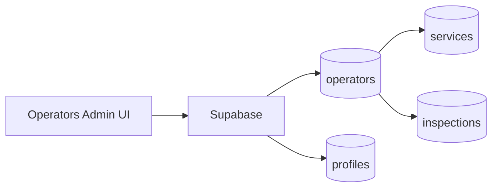

# operators-admin

## Resumen
Módulo administrativo para mantener **operadores** (alta/edición) y su información operativa. Es parte del conjunto admin-only.

**Entrypoints**
- Página: [Operators](file:///Users/sergioiriartevasquez/Desktop/gruas-alerta-calendario/src/pages/Operators.tsx)
- Componentes: [src/components/operators](file:///Users/sergioiriartevasquez/Desktop/gruas-alerta-calendario/src/components/operators)

## Arquitectura y componentes
- Listado: `OperatorsTable` + filtros/vista mobile.
- Formularios/modales: `OperatorForm`, `OperatorDetailsModal` (según implementación).
- Integración con servicios: un operador se relaciona con asignaciones de servicios e inspecciones.

## API expuesta

### Ruta (frontend)
- `/operators` (AdminOnlyRoute)

### Operaciones Supabase (tablas)
- `operators` (entidad principal)
- `profiles`/`user_roles` (según cómo se modela el usuario vinculado al operador)
- relacionadas: `inspections`, `services`, `calendar_events`

## Especificación de uso (con ejemplos)

### Crear operador
```ts
import { supabase } from '@/integrations/supabase/client'

await supabase.from('operators').insert({
  name: 'Operador Demo',
  is_active: true
})
```

## Dependencias

### Externas (principales)
- `react`
- `lucide-react`

### Internas (principales)
- Hooks típicos: `useOperators`, `useOperatorServices`, `useOperatorIdByUser` (según flujo)
- UI: `@/components/ui/*`
- Integración con auth/permisos: `@/contexts/UserContext`, `@/hooks/useUserModulePermissions`

## Configuración requerida
- RLS: solo admins deben poder escribir en `operators`.
- Vinculación operador↔usuario: si existe, validar consistencia (RPC `get_operator_id_by_user` está tipada).

## Casos de uso principales
- Alta/baja y mantenimiento de operadores.
- Consultar historial de servicios/inspecciones por operador.

## Diagramas



## Rendimiento
- Listar operadores suele ser liviano; si se muestran métricas/contadores, agregarlas en RPC o vistas.

## Seguridad
- RLS estricta por rol.
- Evitar exponer datos personales del usuario asociado al operador (email/teléfono) en roles no autorizados.
