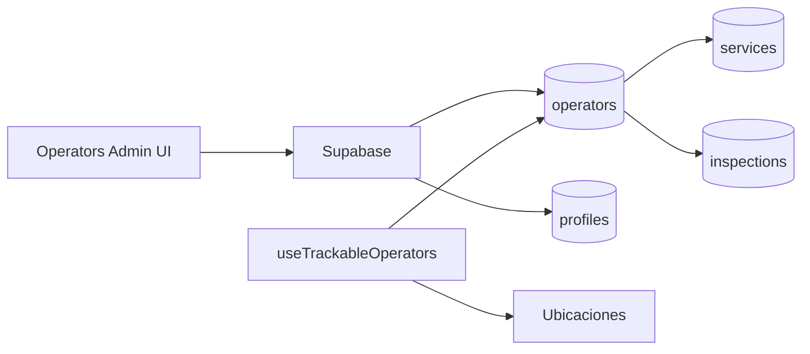

# operators-admin

## Resumen
Modulo administrativo para mantener **operadores** (alta/edicion) y su informacion operativa. Es parte del conjunto admin-only.

**Entrypoints**
- Pagina: [Operators](file:///Users/sergioiriartevasquez/Desktop/gruas-alerta-calendario/src/pages/Operators.tsx)
- Componentes: [src/components/operators](file:///Users/sergioiriartevasquez/Desktop/gruas-alerta-calendario/src/components/operators)

## Arquitectura y componentes
- Listado: `OperatorsTable` + `OperatorsMobileView` con filtros y paginacion.
- Formularios/modales: `OperatorForm`, `OperatorDetailsModal`.
- Integracion con servicios: un operador se relaciona con asignaciones de servicios e inspecciones.
- Metricas: KPIs de activos, de grua, administrativos y con licencia.

### Novedades julio 2026
- **Campo `Cargo`** disponible para todos los tipos de operador (operador de grua y administrativo)
- **Modal de detalle** con seccion `Informacion Laboral` (tipo, cargo, licencia/departamento, vencimiento examen)
- **Iconografia unificada:** `UserCog` de Lucide para operadores operativos en toda la interfaz
- **Hook `useTrackableOperators`:** filtra operadores activos, tipo `crane_operator` y con `trackingEnabled = true`
- **Filtro de rastreo** aplicado en Ubicaciones para excluir administrativos de mapa en vivo, historial y tiempos muertos
- **Correccion de iconos:** reemplazo de emoji `🚚` y SVG custom por `UserCog` de Lucide

## API expuesta

### Ruta (frontend)
- `/operators` (AdminOnlyRoute)

### Operaciones Supabase (tablas)
- `operators` (entidad principal)
- `profiles`/`user_roles` (segun como se modela el usuario vinculado al operador)
- relacionadas: `inspections`, `services`, `calendar_events`

## Especificacion de uso (con ejemplos)

### Crear operador
```ts
import { supabase } from '@/integrations/supabase/client'

await supabase.from('operators').insert({
  name: 'Operador Demo',
  is_active: true,
  operator_type: 'crane_operator',
  position: 'Operador Senior'
})
```

### Filtrar operadores rastreables
```ts
import { useTrackableOperators } from '@/hooks/operators/useTrackableOperators'

const trackableOperators = useTrackableOperators()
// resultado: operadores activos, crane_operator, trackingEnabled = true
```

## Dependencias

### Externas (principales)
- `react`
- `lucide-react` (UserCog, Briefcase, Users, ShieldCheck, IdCard)

### Internas (principales)
- Hooks: `useOperatorsData`, `useOperatorMutations`, `useOperatorDocuments`, `useTrackableOperators`
- UI: `@/components/ui/*`, `MetricCard`
- Integracion con auth/permisos: `@/contexts/UserContext`, `@/hooks/useUserModulePermissions`

## Configuracion requerida
- RLS: solo admins deben poder escribir en `operators`.
- Vinculacion operador↔usuario: si existe, validar consistencia (RPC `get_operator_id_by_user` esta tipada).
- `position` (Cargo) es un campo opcional visible en formulario y modal.

## Casos de uso principales
- Alta/baja y mantenimiento de operadores.
- Asignacion de cargo a cualquier tipo de operador.
- Consultar historial de servicios/inspecciones por operador.
- Filtrar operadores con rastreo habilitado para modulo de Ubicaciones.

## Diagramas



## Rendimiento
- Listar operadores suele ser liviano; si se muestran metricas/contadores, agregarlas en RPC o vistas.
- `useTrackableOperators` usa `useMemo` para evitar recalculacion innecesaria.

## Seguridad
- RLS estricta por rol.
- Evitar exponer datos personales del usuario asociado al operador (email/telefono) en roles no autorizados.
