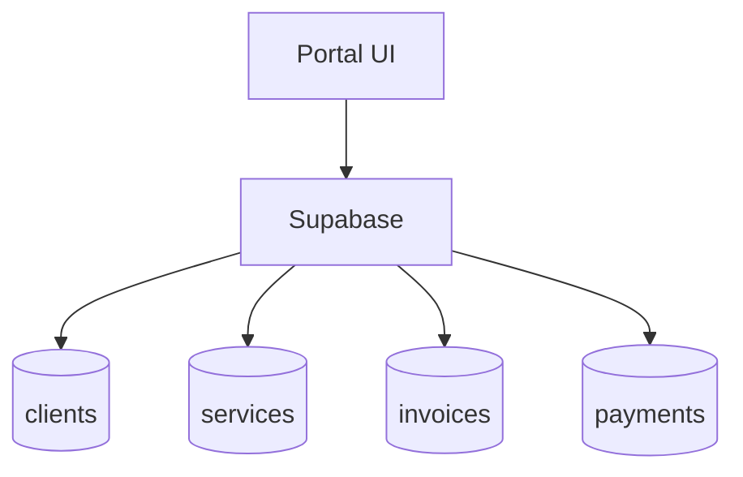

# portal

## Resumen
Módulo de **portal cliente** (rol `client`) para autogestión:
- ver servicios asociados,
- solicitar un servicio,
- revisar facturas.

**Entrypoints**
- Layout: [PortalLayout](file:///Users/sergioiriartevasquez/Desktop/gruas-alerta-calendario/src/components/portal/layout/PortalLayout.tsx)
- Páginas: [src/pages/portal](file:///Users/sergioiriartevasquez/Desktop/gruas-alerta-calendario/src/pages/portal)
- Componentes: [src/components/portal](file:///Users/sergioiriartevasquez/Desktop/gruas-alerta-calendario/src/components/portal)

## Arquitectura y componentes
- Acceso restringido con `ProtectedRoute requireRole="client"` (ver [App.tsx](file:///Users/sergioiriartevasquez/Desktop/gruas-alerta-calendario/src/App.tsx#L195-L205)).
- Layout propio (header/sidebar) para experiencia simplificada.
- Hooks dedicados en `src/hooks/portal/*` para cargar datos del cliente y acciones (solicitud de servicio).

## API expuesta

### Rutas (frontend)
- `/portal` (dashboard)
- `/portal/services`
- `/portal/request-service`
- `/portal/invoices`

### Operaciones Supabase (tablas/RPC típicas)
- `clients` (identificación del cliente actual)
- `services` (servicios del cliente)
- `invoices`, `invoice_services`, `payments` (facturación/pagos visibles al cliente)
- `saved_locations` (ubicaciones guardadas, si se usan en solicitud)

RPC típicas para seguridad:
- `get_user_client_id_safe` / `get_client_id_for_user` (según implementación)

## Especificación de uso (con ejemplos)

### Obtener clientId del usuario autenticado (RPC)
```ts
import { supabase } from '@/integrations/supabase/client'

const { data: clientId } = await supabase.rpc('get_user_client_id_safe')
```

### Consultar servicios del cliente
```ts
const { data } = await supabase
  .from('services')
  .select('id, folio, status, date')
  .eq('client_id', clientId)
  .order('date', { ascending: false })
```

## Dependencias

### Externas (principales)
- `react`, `react-router-dom`
- `react-hook-form`, `zod` (solicitud de servicio)
- `date-fns`
- `lucide-react`, `sonner`

### Internas (principales)
- `@/components/ui/*`
- `@/hooks/portal/*`
- `@/integrations/supabase/client`
- `@/contexts/UserContext` (perfil/rol) y `@/contexts/AuthContext`

## Configuración requerida
- RLS estricta por `client_id`.
- Mapeo usuario→cliente consistente (perfil/tabla `profiles`, relación en `clients` o RPC).

## Casos de uso principales
- Cliente revisa estado de sus servicios.
- Cliente solicita un nuevo servicio (creación de registro o “request” según modelo).
- Cliente revisa facturas y estatus de pago.

## Diagramas



## Rendimiento
- Consultas deben estar filtradas por `client_id` y con columnas explícitas.
- Evitar traer historiales largos en una sola vista; paginar facturas/servicios.

## Seguridad
- Nunca confiar en `clientId` calculado en frontend: validar con RLS/RPC en DB.
- Proteger PII y documentos (si se adjuntan) con políticas de storage.
