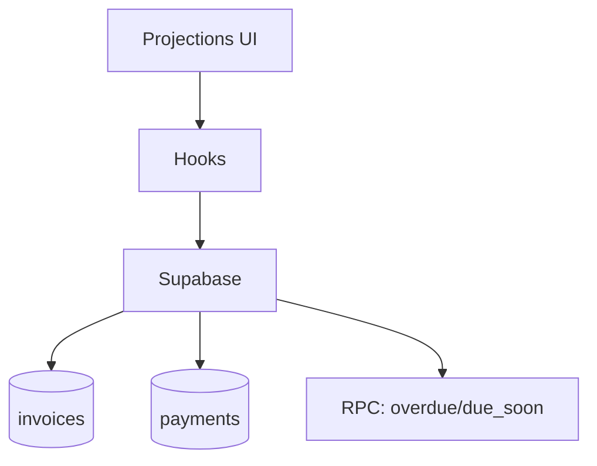

# projections

## Resumen
Módulo de **proyecciones** financieras: cashflow, aging y reportes de deudores, orientado a anticipar ingresos/cobranza.

**Entrypoints**
- Página: [IncomeProjections](file:///Users/sergioiriartevasquez/Desktop/gruas-alerta-calendario/src/pages/IncomeProjections.tsx)
- Componentes: [src/components/projections](file:///Users/sergioiriartevasquez/Desktop/gruas-alerta-calendario/src/components/projections)

## Arquitectura y componentes
- `CashFlowChart`, `AgingReport`, `TopDebtorsCard`, `PendingInvoicesTable`, filtros y header.
- Visualizaciones con `recharts`.
- Datos cargados mediante hooks (react-query) desde `invoices/payments` y funciones para vencimientos cuando aplica.

## API expuesta

### Ruta (frontend)
- `/income-projections`

### Operaciones Supabase (tablas/RPC típicas)
- `invoices` (estado, vencimiento, montos)
- `payments` / `payment_applications` (pagos aplicados)
- `scheduled_payments` (si se usa para proyección)

RPC:
- `get_invoice_overdue_stats`
- `get_overdue_invoices_for_alerts`
- `get_invoices_due_soon`

## Especificación de uso (con ejemplos)

### Obtener facturas por vencer (RPC)
```ts
import { supabase } from '@/integrations/supabase/client'
const { data } = await supabase.rpc('get_invoices_due_soon')
```

## Dependencias

### Externas (principales)
- `react`
- `@tanstack/react-query`
- `recharts`
- `date-fns`
- `lucide-react`

### Internas (principales)
- Hooks: `hooks/projections/*` y/o `useReports` cuando se comparte infraestructura
- Utilidades: formateo moneda/fecha (`@/lib/utils`, `@/utils/currencyUtils`)
- Integración con `invoices`

## Configuración requerida
- Definición de “vencido” y reglas de aging deben ser consistentes (idealmente calculadas en backend/RPC).
- RLS para lectura financiera.

## Casos de uso principales
- Visualizar proyección de caja y deudores relevantes.
- Priorizar cobranza por buckets de vencimiento.

## Diagramas



## Rendimiento
- Agregaciones: preferir RPC/vistas para evitar cálculos client-side costosos.
- Charts: limitar puntos/series y memoizar transformaciones.

## Seguridad
- Datos financieros: RLS estricta y evitar exponer detalles por cliente a roles no autorizados.
