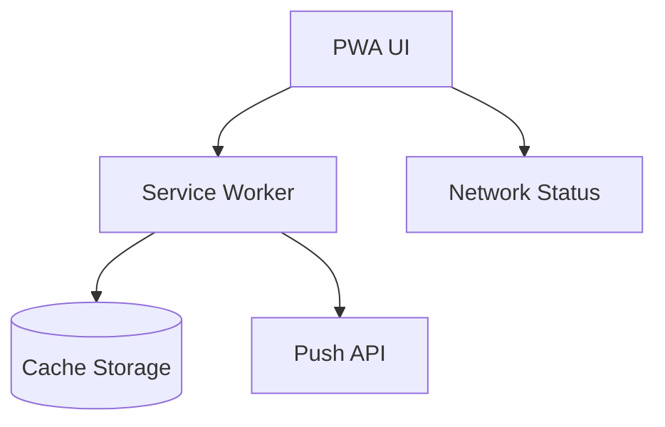

# pwa

## Resumen
Módulo PWA que habilita:
- instalación en dispositivo (install prompt),
- manejo de service worker (actualizaciones, cache),
- indicadores de conectividad/sincronización,
- base para notificaciones push (en conjunto con el módulo `notifications`).

**Entrypoints**
- Service worker: [public/sw.js](file:///Users/sergioiriartevasquez/Desktop/gruas-alerta-calendario/public/sw.js)
- Manifest: [public/manifest.json](file:///Users/sergioiriartevasquez/Desktop/gruas-alerta-calendario/public/manifest.json)
- Componentes: [src/components/pwa](file:///Users/sergioiriartevasquez/Desktop/gruas-alerta-calendario/src/components/pwa)
- Docs existentes:
  - [notifications.md](./notifications.md)

## Arquitectura y componentes
- UI:
  - `InstallPrompt`, `PWAWrapper`, `ConnectionStatus`, `SyncIndicator`, `UpdateNotification`.
- Hooks:
  - `usePWAInstall`, `usePWACapabilities`, `useServiceWorkerManager`, `useNetworkStatus`, `useOfflineStorage` (según uso).

## API expuesta

### Superficie pública (UI)
Imports típicos:
```tsx
import { PWAWrapper } from '@/components/pwa/PWAWrapper'
import { UpdateNotification } from '@/components/pwa/UpdateNotification'
```

### API del navegador
- `navigator.serviceWorker.register`
- `beforeinstallprompt`
- Cache Storage API (según implementación SW)

## Configuración requerida
- `public/manifest.json` con:
  - `name`, `short_name`, `icons`, `start_url`, `display`.
- Hosting:
  - servir `sw.js` con headers correctos y scope adecuado.
  - mantener `public/_headers` y `public/_redirects` coherentes con SPA/PWA.
- HTTPS en producción (requerido por SW y push).

## Casos de uso principales
- Operación en terreno con conectividad intermitente.
- Instalación como “app” en móvil/desktop.
- Notificación de actualizaciones y manejo de refresh controlado.

## Diagramas



## Rendimiento
- Cachear assets estáticos para reducir tiempos de carga.
- Evitar cachear respuestas sensibles sin estrategia (stale-while-revalidate controlado).

## Seguridad
- No cachear respuestas con datos sensibles a menos que exista un control explícito.
- Usar HTTPS y validar scope del SW para no interferir con otras apps del mismo dominio.
