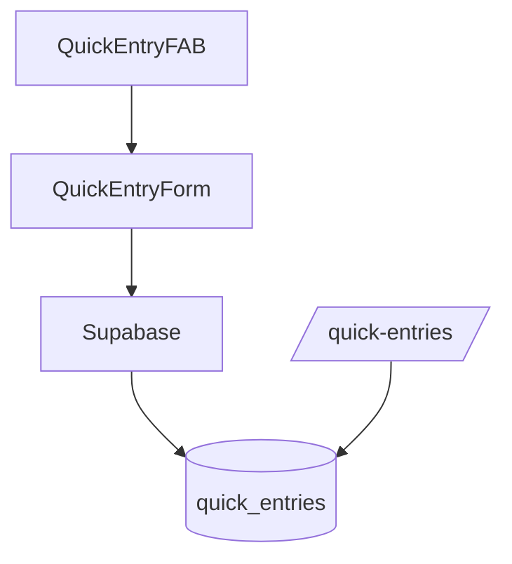

# quick-entry

## Resumen
Módulo de **captura rápida** para registrar entradas operativas “ligeras” (pendientes) desde un botón flotante (FAB) y administrarlas desde una vista dedicada.

**Entrypoints**
- Página: [QuickEntries](file:///Users/sergioiriartevasquez/Desktop/gruas-alerta-calendario/src/pages/QuickEntries.tsx)
- Componentes: [src/components/quick-entry](file:///Users/sergioiriartevasquez/Desktop/gruas-alerta-calendario/src/components/quick-entry)
- Contexto: [QuickEntryContext](file:///Users/sergioiriartevasquez/Desktop/gruas-alerta-calendario/src/contexts/QuickEntryContext.tsx#L1-L30)
- Integración en layout: [Layout](file:///Users/sergioiriartevasquez/Desktop/gruas-alerta-calendario/src/components/layout/Layout.tsx#L6-L48)

## Arquitectura y componentes
- `QuickEntryFAB`: acción flotante global en layout admin.
- `QuickEntryForm`: formulario rápido (incluye captura de ubicación/fotos cuando aplica).
- `PendingEntriesView`: lista de entradas pendientes.
- Contexto `QuickEntryProvider` expone un `refreshTrigger` para forzar recargas en distintos puntos de la UI.

## API expuesta

### Rutas (frontend)
- `/quick-entries` (AdminOnlyRoute)

### Hooks/exports públicos
- `QuickEntryProvider` y `useQuickEntryContext()`:
  - Import: `import { QuickEntryProvider, useQuickEntryContext } from '@/contexts/QuickEntryContext'`

### Operaciones Supabase (tablas)
- `quick_entries` (entidad principal)
- apoyo: `saved_locations` (si se usan ubicaciones), storage/buckets (si hay fotos)

## Especificación de uso (con ejemplos)

### Forzar refresh desde cualquier componente
```tsx
import { useQuickEntryContext } from '@/contexts/QuickEntryContext'

export function Example() {
  const { triggerRefresh } = useQuickEntryContext()
  return <button onClick={triggerRefresh}>Actualizar entradas</button>
}
```

## Dependencias

### Externas (principales)
- `react`, `react-router-dom`
- `date-fns`
- `lucide-react`, `sonner`

### Internas (principales)
- Hooks: `useQuickEntry`
- UI: `@/components/ui/*`
- Integración con layout y permisos admin.

## Configuración requerida
- RLS: solo roles autorizados deben ver/crear/editar `quick_entries`.
- Si se capturan fotos/archivos: configurar Supabase Storage y políticas.

## Casos de uso principales
- Registrar rápidamente información operacional (pendiente) sin recorrer el formulario completo de servicios.
- Revisar y completar pendientes desde la vista dedicada.

## Diagramas



## Rendimiento
- Evitar recargar toda la app: usar `refreshTrigger` y queries por clave.

## Seguridad
- Datos capturados pueden incluir PII/fotos: controlar RLS y storage.
