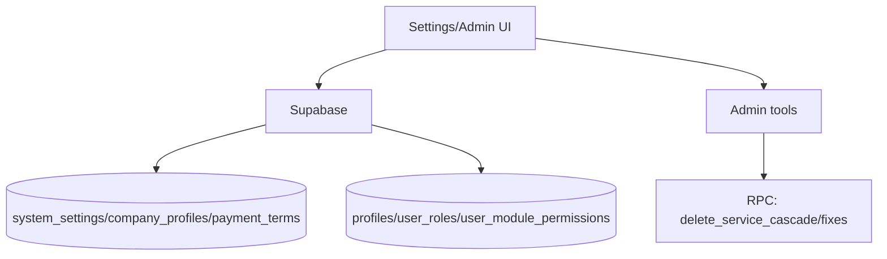

# settings-admin

## Resumen
Módulo de **configuración del sistema** y herramientas administrativas:
- configuración de empresa, términos de pago, categorías, usuarios/permisos,
- ajustes de zona horaria y preferencias,
- herramientas de emergencia (reparación de estados, reasignaciones, eliminación/cierre forzado).

**Entrypoints**
- Página: [Settings](file:///Users/sergioiriartevasquez/Desktop/gruas-alerta-calendario/src/pages/Settings.tsx)
- Componentes settings: [src/components/settings](file:///Users/sergioiriartevasquez/Desktop/gruas-alerta-calendario/src/components/settings)
- Componentes admin: [src/components/admin](file:///Users/sergioiriartevasquez/Desktop/gruas-alerta-calendario/src/components/admin)
- Guía existente: [system-admin-guide.md](../technical/system-admin-guide.md)

## Arquitectura y componentes
- Tabs/Secciones:
  - company settings (branding, datos),
  - categorías/configuración del sistema,
  - gestión usuarios y permisos por módulo,
  - términos de pago y ajustes financieros.
- Herramientas admin:
  - `ServiceDeletionTool`, `ServiceLiberationTool`, `BulkStatusRepairTool`, `ForceStatusChangeTool`, `PaymentReassignmentTool`.

## API expuesta

### Ruta (frontend)
- `/settings` (AdminOnlyRoute)

### Operaciones Supabase (tablas)
- configuración:
  - `system_settings`, `company_profiles`, `company_data`
  - `payment_terms`, `user_settings`
- seguridad/permisos:
  - `profiles`, `user_roles`, `user_module_permissions`, `user_invitations`
- operaciones:
  - `services`, `invoices`, `payments`, `payment_applications`, `calendar_events`, `inspections`, `costs`

### RPC destacadas
- `delete_service_cascade` (acciones de borrado en cascada)
- Diagnóstico y corrección de pagos (según sección): `fix_payment_system_inconsistencies`, `validate_payment_system_integrity`, etc.

## Especificación de uso (con ejemplos)

### Actualizar término de pago
```ts
import { supabase } from '@/integrations/supabase/client'

await supabase.from('payment_terms').update({ name: '30 días' }).eq('id', termId)
```

### Eliminar servicio en cascada (RPC)
```ts
await supabase.rpc('delete_service_cascade', { p_service_id: serviceId })
```

## Dependencias

### Externas (principales)
- `react`
- `@tanstack/react-query`
- `react-hook-form`, `zod`
- `date-fns`
- `lucide-react`, `sonner`

### Internas (principales)
- Hooks: `useSettings`, `useSystemSettings`, `useUserManagement`, `useUserPermissions`, `useUserModulePermissions`, `usePaymentTerms`
- UI: `@/components/ui/*`
- Integración con `auth` y `supabase-integration`.

## Configuración requerida
- RLS y roles:
  - `admin` debe tener acceso completo a settings,
  - `viewer` lectura acotada (si aplica),
  - `client/operator` sin acceso (redirigidos).
- Asegurar consistencia de catálogos (service types/rates/cost centers) con secciones admin dedicadas.

## Casos de uso principales
- Administrar usuarios, roles y permisos por módulo.
- Configurar datos corporativos (branding, términos de pago, zona horaria).
- Ejecutar herramientas de emergencia ante inconsistencias (servicios/pagos).

## Diagramas



## Rendimiento
- Evitar cargar todas las secciones/tabs al inicio; cargar bajo demanda.
- Acciones admin pesadas (fixes) deben ejecutarse explícitamente y mostrar progreso/resultado.

## Seguridad
- Superficie crítica: restringir a admins y validar rol también en RPC.
- No loguear datos sensibles en consola (usuarios/pagos).
- Mantener auditoría de acciones de emergencia y correcciones masivas.
