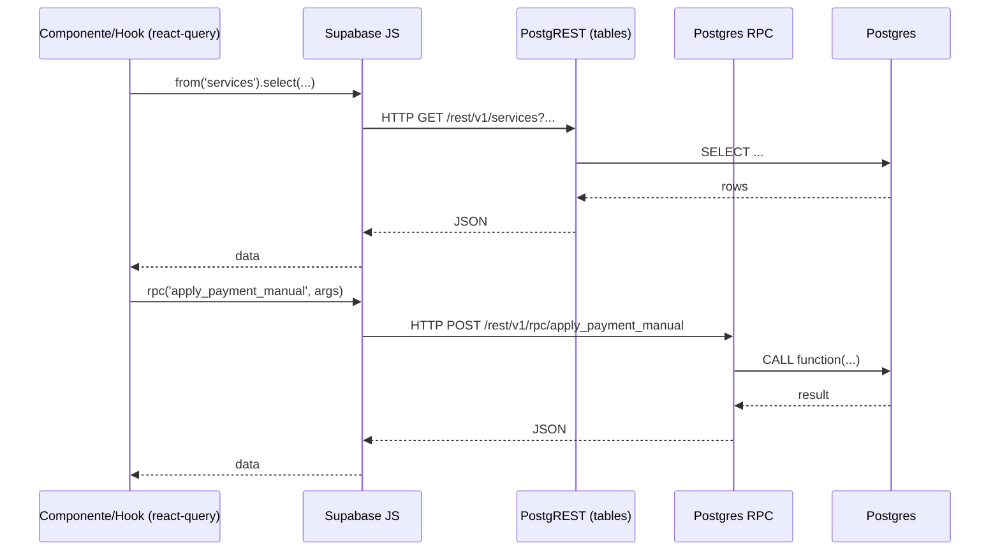

# supabase-integration

## Resumen
Módulo transversal de acceso a datos con **Supabase** (Postgres + Auth + PostgREST + RPC). Define:
- cliente Supabase tipado,
- tipos de base de datos (`Database`) para queries type-safe,
- servicios de dominio que coordinan consistencia entre tablas (ej. sincronización compras inventario ↔ costos ↔ piezas).

**Entrypoints**
- Cliente: [integrations/supabase/client.ts](file:///Users/sergioiriartevasquez/Desktop/gruas-alerta-calendario/src/integrations/supabase/client.ts#L1-L18)
- Tipos BD: [integrations/supabase/types.ts](file:///Users/sergioiriartevasquez/Desktop/gruas-alerta-calendario/src/integrations/supabase/types.ts#L1-L200)
- Servicio ejemplo (consistencia cross-tabla): [UnifiedPurchaseService](file:///Users/sergioiriartevasquez/Desktop/gruas-alerta-calendario/src/services/UnifiedPurchaseService.ts#L1-L900)

## Arquitectura y componentes

### Cliente Supabase (frontend)
El cliente se inicializa con:
- `persistSession: true` (sesión persistida),
- `autoRefreshToken: true` (rotación automática),
- storage en `localStorage`.

Referencia: [client.ts](file:///Users/sergioiriartevasquez/Desktop/gruas-alerta-calendario/src/integrations/supabase/client.ts#L12-L18).

### Tipado de esquema (Database)
`Database` incluye:
- tablas (`public.Tables.*`) con `Row/Insert/Update/Relationships`,
- funciones RPC (`public.Functions.*`) con `Args` y `Returns`.

Uso: habilita autocompletado y detección temprana de errores en `supabase.from(...).insert/select/update`.

Referencia: [types.ts](file:///Users/sergioiriartevasquez/Desktop/gruas-alerta-calendario/src/integrations/supabase/types.ts#L9-L17).

### Servicios de dominio (patrón “orquestador”)
Cuando una operación afecta múltiples dominios, se encapsula en un servicio:
- crea/actualiza registros en varias tablas,
- establece enlaces bidireccionales (ej. `costs.inventory_movement_id`),
- maneja idempotencia (reusa movimientos existentes),
- intenta rollback parcial ante fallos.

Ejemplo: `UnifiedPurchaseService.registerPurchase()` sincroniza compra y consumo inmediato entre inventario/costos/piezas:
- `inventory_items`, `inventory_locations`, `cost_categories`, `costs`, `inventory_movements`, `inventory_stock`, `crane_parts`, `supplier_invoice_items`.
- Referencia: [UnifiedPurchaseService](file:///Users/sergioiriartevasquez/Desktop/gruas-alerta-calendario/src/services/UnifiedPurchaseService.ts#L76-L820).

## API expuesta

### Cliente exportado
```ts
import { supabase } from '@/integrations/supabase/client'
```

### Operaciones principales (métodos)
- Tablas (PostgREST): `supabase.from('<table>').select/insert/update/delete`
- RPC: `supabase.rpc('<function>', args)`
- Auth: `supabase.auth.getSession/getUser/onAuthStateChange/refreshSession/signOut`

### Tablas clave por dominio (referencia rápida)
Inventario:
- `inventory_items`, `inventory_stock`, `inventory_movements`, `inventory_locations`, `inventory_alerts`, `inventory_consumptions`

Operación de servicios:
- `services`, `service_costs`, `service_closures`, `service_change_history`, `inspections`

Facturación/pagos:
- `invoices`, `invoice_services`, `payments`, `payment_applications`, `invoice_alert_settings`

Proveedores:
- `suppliers`, `supplier_invoices`, `supplier_invoice_items`, `supplier_payments`

Activos (grúas):
- `cranes`, `crane_parts`, `crane_maintenance`, `crane_documents`

Calendario:
- `calendar_events`

### RPC (funciones) usadas por el frontend (tendencia)
El código consume múltiples RPC para diagnóstico y reparación del sistema de pagos/inventario, por ejemplo:
- `apply_payment_manual`, `smart_apply_payment`
- `validate_payment_system_integrity`, `fix_payment_system_inconsistencies`
- `global_inventory_cleanup`, `detect_duplicate_crane_parts`

La lista completa de RPC tipadas está en [types.ts](file:///Users/sergioiriartevasquez/Desktop/gruas-alerta-calendario/src/integrations/supabase/types.ts#L5087-L5655).

## Especificación de uso (con ejemplos)

### Query tipado simple
```ts
import { supabase } from '@/integrations/supabase/client'

const { data, error } = await supabase
  .from('clients')
  .select('id, name, department')
  .limit(20)
```

### RPC (Postgres function)
```ts
import { supabase } from '@/integrations/supabase/client'

const { data, error } = await supabase.rpc('get_overdue_invoices_for_alerts')
```

### Orquestación transaccional a nivel aplicación
```ts
import { UnifiedPurchaseService } from '@/services/UnifiedPurchaseService'

const result = await UnifiedPurchaseService.registerPurchase({
  itemName: 'Filtro hidráulico',
  quantity: 2,
  unitCost: 35000,
  date: new Date().toISOString().slice(0, 10),
  immediateConsumption: true,
  craneId: 'uuid-grua'
})
if (!result.success) throw new Error(result.error)
```

## Dependencias

### Externas (principales)
- `@supabase/supabase-js`

### Internas (principales)
- `@/integrations/supabase/types` (tipado)
- `@/services/*` (servicios de dominio)
- `@/hooks/*` (react-query wrappers)
- `@/utils/supabaseErrorHandler` (normalización/mensajes de error)

## Configuración requerida
- Variables de entorno Vite:
  - `VITE_SUPABASE_URL`
  - `VITE_SUPABASE_PUBLISHABLE_KEY` (anon/public)
  - `VITE_SUPABASE_PROJECT_ID`

Nota de hardening:
- El repositorio contiene valores en `.env` y en el cliente generado. Para entornos productivos, preferir **inyección por CI/CD** y evitar duplicación de claves en múltiples archivos.
- Nunca usar service role key en frontend.

## Casos de uso principales
- Lectura/escritura de datos por dominio con políticas RLS.
- Ejecución de RPC para automatización, consistencia y diagnósticos.
- Sincronizaciones multi-tabla en servicios de dominio.

## Diagramas



## Rendimiento
- Preferir selects con columnas explícitas (evitar `select('*')` en tablas grandes).
- Evitar N+1: consolidar queries o usar vistas/RPC cuando sea necesario.
- React Query:
  - cache y deduplicación ya están habilitados a nivel app; aprovechar hooks para no duplicar fetch.
- En operaciones multi-tabla, mantener idempotencia (ej. reuso de movimientos existentes) para tolerancia a reintentos.

## Seguridad
- RLS es obligatorio para cada tabla expuesta a frontend; `ProtectedRoute` no reemplaza RLS.
- Sanitizar/validar inputs en frontend (zod) y, cuando corresponda, en SQL/RPC.
- Registrar auditoría solo sin datos sensibles (evitar almacenar tokens o datos personales innecesarios).
