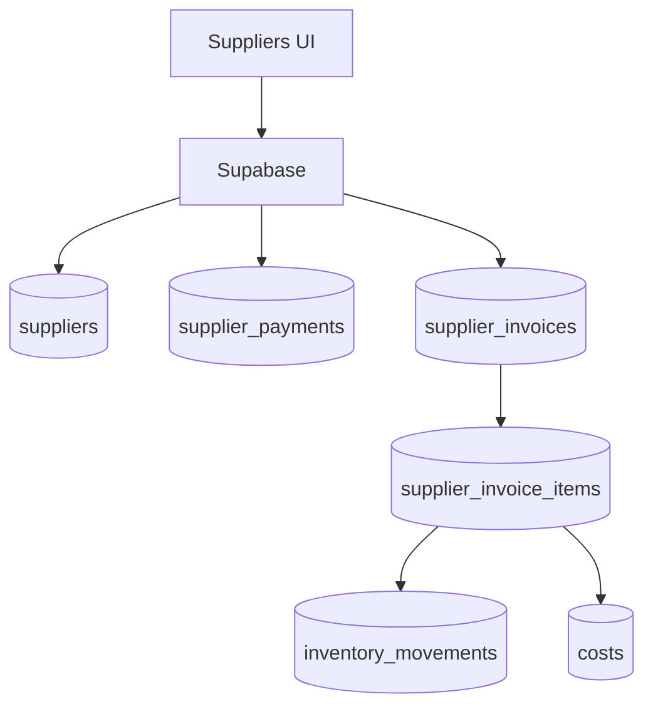

# suppliers

## Resumen
Módulo de **proveedores**: catálogo, pagos (pendientes/vencidos/pagados), calendario de vencimientos e importación de documentos XML (facturas) con trazabilidad a inventario/costos cuando aplica.

**Entrypoints**
- Página (export nombrado): [Suppliers](file:///Users/sergioiriartevasquez/Desktop/gruas-alerta-calendario/src/pages/Suppliers.tsx#L16-L201)
- Componentes: [src/components/suppliers](file:///Users/sergioiriartevasquez/Desktop/gruas-alerta-calendario/src/components/suppliers)
- Referencias existentes:
  - [supplier-payments.md](../features/supplier-payments.md)
  - [supplier-payments-duplicate-elimination.md](../features/supplier-payments-duplicate-elimination.md)

## Arquitectura y componentes
- Vista por tabs:
  - pagos (`PaymentList`)
  - proveedores (`SupplierList`)
  - calendario (`SupplierPaymentCalendar`)
- Flujos:
  - alta/edición proveedor (`SupplierForm`)
  - registrar pago (`RegisterPaymentModal`)
  - importar XML (`XMLDocumentUpload`, `XMLSupplierUpload`, según implementación)
- Métricas: `useSupplierStats` (tarjetas KPI en el header).

## API expuesta

### Ruta (frontend)
- `/suppliers`

### Operaciones Supabase (tablas)
- `suppliers`
- `supplier_payments` (estado, vencimiento, pagado)
- `supplier_invoices` y `supplier_invoice_items` (XML)
- `supplier_categories` (clasificación)
- integración: `costs`, `inventory_movements` (si XML crea compras/consumos), `crane_parts` (si consumo inmediato a grúa)

### RPC relevantes
- Duplicados/diagnóstico: `check_supplier_duplicates`, `check_supplier_invoice_duplicates`, `update_overdue_supplier_payments` (según uso)

## Especificación de uso (con ejemplos)

### Registrar un pago a proveedor
```ts
import { supabase } from '@/integrations/supabase/client'

await supabase.from('supplier_payments').insert({
  supplier_id: supplierId,
  amount: 150000,
  due_date: '2026-04-30',
  status: 'pending'
})
```

### Consultar pagos vencidos
```ts
const { data } = await supabase
  .from('supplier_payments')
  .select('id, amount, due_date, status')
  .eq('status', 'overdue')
  .order('due_date', { ascending: true })
```

## Dependencias

### Externas (principales)
- `react`
- `@tanstack/react-query`
- `react-hook-form`, `zod`
- `react-dropzone` (XML uploads)
- `date-fns`
- `lucide-react`, `sonner`

### Internas (principales)
- Hooks: `useSuppliers`, `useSupplierPayments`, `useSupplierInvoices`, `useSupplierStats`, `useSupplierPaymentStats`
- Utilidades: `@/utils/supplierIdentity`, `@/utils/suppliers/*`, parsers XML (según implementación)
- UI: `@/components/ui/*`

## Configuración requerida
- Importación XML:
  - definir validaciones y mapeos a `supplier_invoices/items` y (opcional) inventario.
- RLS:
  - admins/viewers gestionan proveedores y pagos,
  - portal (si aplica) debe restringirse por cliente/rol.

## Casos de uso principales
- Mantener catálogo de proveedores.
- Seguimiento de pagos pendientes y vencidos.
- Importar facturas XML y conciliar con costos/inventario.

## Diagramas



## Rendimiento
- Calendario de pagos: consultar por rango de fechas y estado.
- Import XML: procesar y validar localmente antes de escribir; usar inserciones por lote.

## Seguridad
- Evitar duplicados y corrupción de datos financieros (validaciones + RPC de deduplicación si existen).
- Restringir subida de XML a tipos/tamaños permitidos y evitar almacenar datos sensibles innecesarios.
