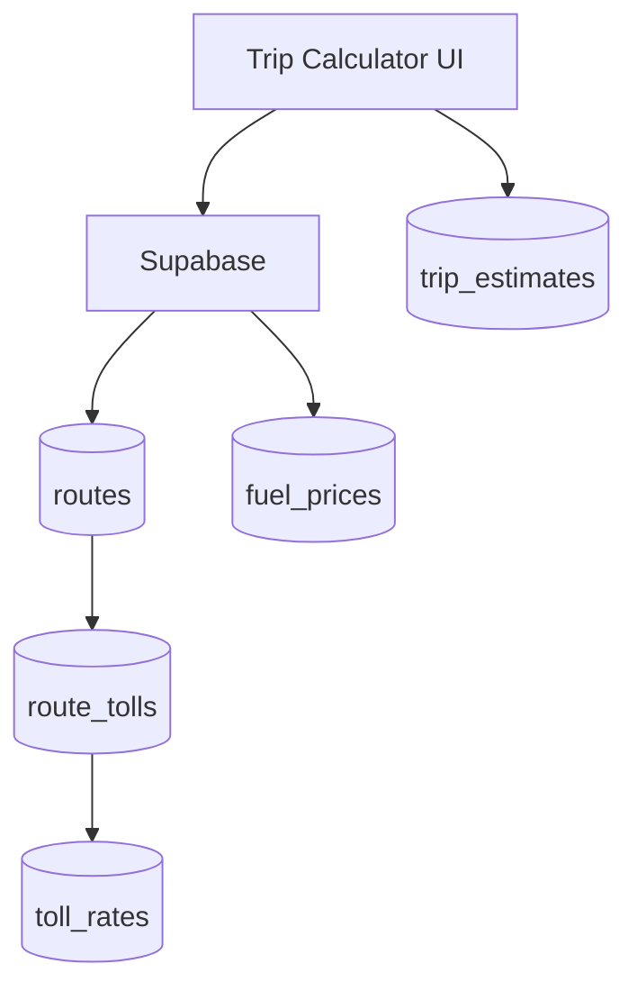

# trip-calculator

## Resumen
Módulo de **cálculo de viaje** para estimar costos de traslado (combustible, peajes, rutas), con apoyo de catálogos de estaciones/tarifas y almacenamiento de estimaciones.

**Entrypoints**
- Página: [TripCalculator](file:///Users/sergioiriartevasquez/Desktop/gruas-alerta-calendario/src/pages/TripCalculator.tsx)
- Componentes: [src/components/trip-calculator](file:///Users/sergioiriartevasquez/Desktop/gruas-alerta-calendario/src/components/trip-calculator)

## Arquitectura y componentes
- Formulario principal:
  - `TripRouteMap` (visualización) y `FuelPriceForm` (parámetros), según implementación.
- Hooks:
  - `useTripCalculation`, `useTollCalculation`, `useTripEstimates`, `useFuelPrices` (típicos).

## API expuesta

### Ruta (frontend)
- `/trip-calculator`

### Operaciones Supabase (tablas)
- `routes` (rutas definidas)
- `route_tolls` (peajes por ruta)
- `toll_rates`, `toll_stations`
- `fuel_prices`
- `trip_estimates` (persistencia de estimaciones)

## Especificación de uso (con ejemplos)

### Guardar una estimación
```ts
import { supabase } from '@/integrations/supabase/client'

await supabase.from('trip_estimates').insert({
  origin: 'Concepción',
  destination: 'Santiago',
  estimated_cost: 180000,
  fuel_price: 1350
})
```

## Dependencias

### Externas (principales)
- `react`
- `react-hook-form`, `zod`
- `lucide-react`, `sonner`

### Internas (principales)
- Hooks: `useTripCalculation`, `useTollCalculation`, `useTripEstimates`, `useFuelPrices`
- UI: `@/components/ui/*`
- Utilidades: formateo moneda/validaciones

## Configuración requerida
- Catálogos de peajes y tarifas actualizados.
- RLS: quién puede crear/editar rutas/tarifas (admin) vs quién puede solo consultar.

## Casos de uso principales
- Calcular costo estimado antes de asignar un servicio con traslado.
- Evaluar impacto de cambios en combustible/peajes.

## Diagramas



## Rendimiento
- Evitar recalcular rutas/peajes en cada input; usar debounce y memoización.

## Seguridad
- Validar inputs para evitar datos corruptos (distancias, costos negativos).
- Restringir edición de catálogos a admins.
