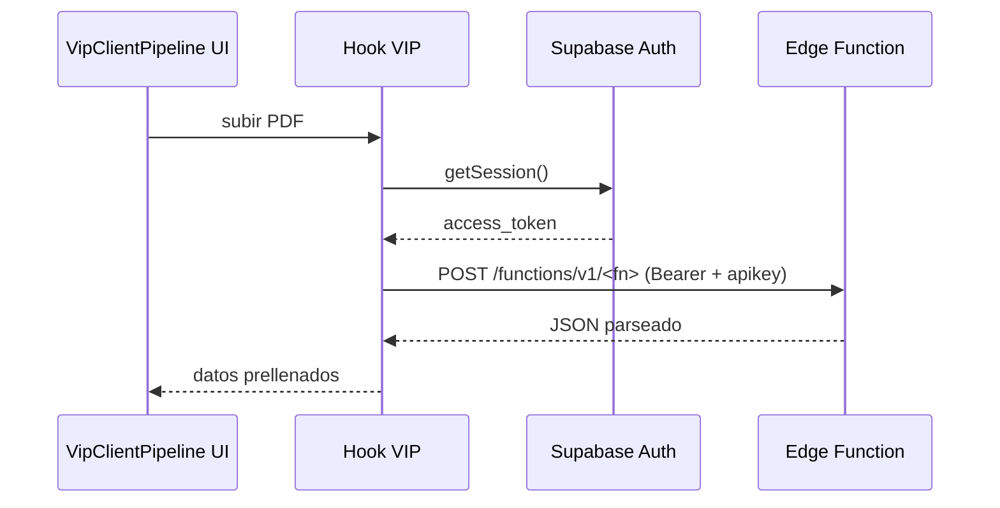

# vip-pipeline

## Resumen
Módulo VIP orientado a un flujo “pipeline” por cliente que incluye **importación desde PDF** (cotizaciones/órdenes) y automatización asistida por funciones edge.

**Entrypoints**
- Página: [VipClientPipeline](file:///Users/sergioiriartevasquez/Desktop/gruas-alerta-calendario/src/pages/VipClientPipeline.tsx)
- Hooks: [src/hooks/vip](file:///Users/sergioiriartevasquez/Desktop/gruas-alerta-calendario/src/hooks/vip)
- Cliente edge function: [vipPdfImportClient](file:///Users/sergioiriartevasquez/Desktop/gruas-alerta-calendario/src/utils/vipPdfImportClient.ts#L1-L50)
- Referencia existente: [vip-pipeline-prompt.md](../development/vip-pipeline-prompt.md)

## Arquitectura y componentes
- UI: pipeline por cliente (generalmente basada en tabs/cards y estados de avance).
- Importación PDF:
  - la lógica se encapsula en hooks `useQuotePDFImport` / `usePurchaseOrderPDFImport` (según carpeta),
  - el transporte a backend se hace mediante `invokeEdgeFunctionJson`, que llama a `/functions/v1/<name>`.

## API expuesta

### Ruta (frontend)
- `/clients/:clientId/pipeline`

### Edge Functions (HTTP)
Patrón:
- URL: `${VITE_SUPABASE_URL}/functions/v1/<functionName>`
- Headers:
  - `apikey: VITE_SUPABASE_PUBLISHABLE_KEY`
  - `Authorization: Bearer <session.access_token>`

Referencia: [invokeEdgeFunctionJson](file:///Users/sergioiriartevasquez/Desktop/gruas-alerta-calendario/src/utils/vipPdfImportClient.ts#L14-L49).

### Controles de sesión (feature flags)
- `isVipPdfAiDisabled()` / `disableVipPdfAiForSession()` permiten desactivar IA en la sesión (flag en memoria).

## Especificación de uso (con ejemplos)

### Invocar una edge function que retorna JSON
```ts
import { invokeEdgeFunctionJson } from '@/utils/vipPdfImportClient'

type Result = { ok: boolean; parsed: unknown }
const result = await invokeEdgeFunctionJson<Result>('vip-parse-quote', {
  clientId,
  documentBase64
})
```

## Dependencias

### Externas (principales)
- `react`, `react-router-dom`
- `date-fns`
- `fetch` (HTTP) + `@supabase/supabase-js` (sesión)
- `lucide-react`, `sonner`

### Internas (principales)
- `@/integrations/supabase/client` (para `auth.getSession()`)
- Hooks VIP: `src/hooks/vip/*`
- Parsers/validaciones: `@/utils/localVipPdfParser`, `@/utils/vipPdfImportErrors` (si se usan)

## Configuración requerida
- Variables de entorno:
  - `VITE_SUPABASE_URL`
  - `VITE_SUPABASE_PUBLISHABLE_KEY`
- Edge functions desplegadas y autorizadas (RLS/claims en función).

## Casos de uso principales
- Importar documentos PDF y convertirlos en datos estructurados para el pipeline.
- Acelerar carga de datos (prellenado de formularios/registro de servicios/costos).

## Diagramas



## Rendimiento
- PDFs grandes: procesar de forma incremental y limitar reintentos.
- Evitar invocar IA/parse en cada render; sólo por acción explícita.

## Seguridad
- No exponer `access_token` en logs.
- Las edge functions deben validar:
  - rol del usuario,
  - pertenencia del `clientId`,
  - tamaño/tipo del documento.
