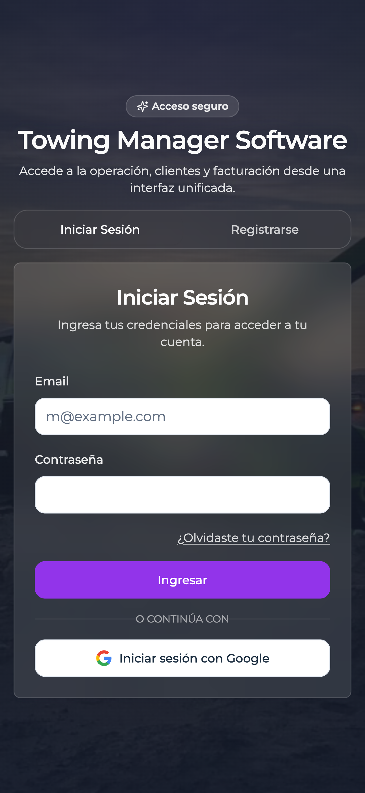
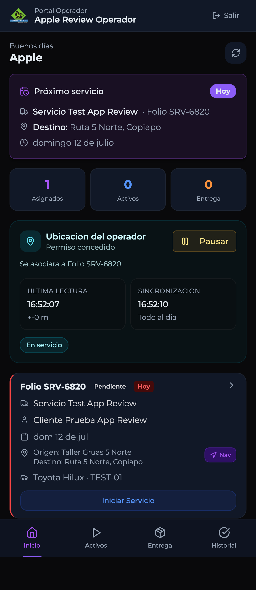
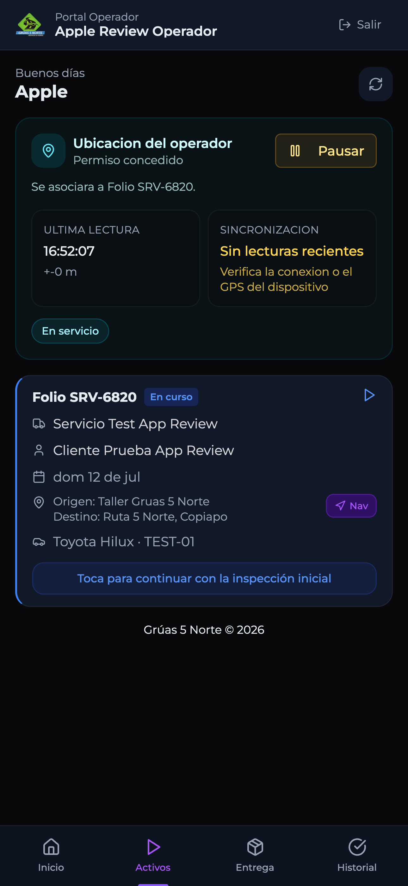
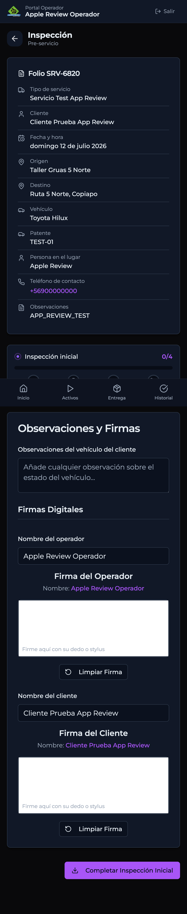
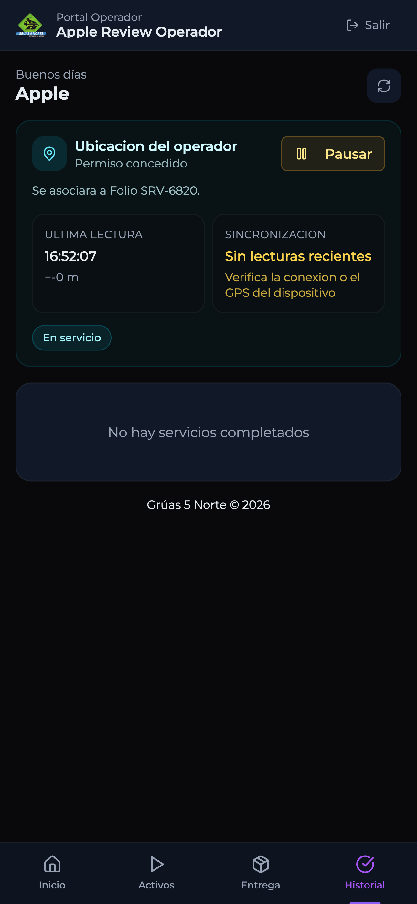

# Manual de Usuario para Operadores

Guia practica para usar la app movil **TMS Operador** en terreno.

Este manual esta pensado para operadores que no tienen experiencia previa con la aplicacion. La idea es explicar cada paso en lenguaje simple, con ejemplos reales de pantalla.

## 1. Para que sirve la app

La app **TMS Operador** sirve para que el operador pueda:

- entrar a su cuenta de trabajo;
- ver los servicios que tiene asignados;
- compartir su ubicacion mientras esta trabajando;
- iniciar un servicio;
- completar la inspeccion previa o final;
- continuar un servicio que quedo a medias;
- revisar servicios anteriores.

## 2. Antes de comenzar

Antes de usar la app, revisa esto:

1. Tu telefono debe tener internet.
2. Debes tener activado el GPS o ubicacion.
3. Debes conocer tu correo y contraseña de operador.
4. Si la app te pide permisos de ubicacion, fotos o camara, debes aceptarlos para que funcione correctamente.

## 3. Iniciar sesion

Cuando abras la app, veras la pantalla de acceso.

### Que debes hacer

1. Escribe tu **correo**.
2. Escribe tu **contraseña**.
3. Presiona **Ingresar**.

### Importante

- Si escribes mal la contraseña, la app no podra entrar.
- Si tu cuenta tiene mas de un portal disponible, despues del ingreso puede aparecer una pantalla para elegir. En ese caso debes entrar como **Operador**.

## 4. Pantalla principal

Despues de entrar, llegas a la pantalla principal.

En esta vista veras varias zonas importantes.

### 4.1 Saludo inicial

En la parte superior aparece tu nombre. Eso confirma que entraste con tu cuenta correcta.

### 4.2 Proximo servicio

Si tienes un servicio pendiente, arriba veras una tarjeta con:

- tipo de servicio;
- folio;
- destino;
- fecha.

Esto te ayuda a identificar rapidamente que trabajo sigue.

### 4.3 Resumen rapido

Debajo del proximo servicio veras tres contadores:

- **Asignados**: servicios pendientes por comenzar.
- **Activos**: servicios ya iniciados y aun no terminados.
- **Entrega**: servicios que quedaron listos para cierre o entrega.

### 4.4 Ubicacion del operador

Esta tarjeta es una de las mas importantes.

Aqui la app muestra:

- si el permiso de ubicacion esta concedido;
- a que folio se esta asociando la ubicacion;
- la ultima lectura GPS registrada;
- la ultima sincronizacion;
- el estado del seguimiento.

### 4.5 Boton Pausar

En la tarjeta de ubicacion aparece el boton **Pausar**.

Usalo solo si realmente necesitas detener temporalmente el seguimiento. Si lo pausas:

- la app deja de enviar nuevas posiciones;
- tu ubicacion puede dejar de verse actualizada en oficina;
- cuando vuelvas a trabajar, tendras que reanudar.

## 5. Menu inferior

En la parte de abajo siempre veras cuatro pestañas:

- **Inicio**
- **Activos**
- **Entrega**
- **Historial**

Cada una cumple una funcion distinta.

## 6. Inicio

La pestaña **Inicio** muestra los servicios que aun no comienzan.

Cuando veas una tarjeta de servicio con el boton **Iniciar Servicio**, ese es el paso correcto para comenzar la atencion.

### Informacion que suele aparecer en la tarjeta

- folio;
- estado;
- cliente;
- fecha;
- origen;
- destino;
- vehiculo;
- boton **Nav** para abrir navegacion.

### Boton Nav

El boton **Nav** abre la navegacion hacia el destino del servicio. Sirve para salir rapidamente a ruta.

## 7. Iniciar un servicio

Cuando te asignen un servicio:

1. entra a **Inicio**;
2. busca el folio correcto;
3. revisa origen, destino y vehiculo;
4. presiona **Iniciar Servicio**.

Cuando haces eso, el servicio deja de estar como pendiente y pasa a trabajo en curso.

## 8. Pestaña Activos

En **Activos** veras los servicios que ya fueron comenzados y que todavia no se terminan.

En esta vista, la tarjeta del servicio normalmente muestra un mensaje parecido a:

**Toca para continuar con la inspeccion inicial**

Eso significa que el servicio ya esta en marcha y debes seguir con el formulario de inspeccion.

## 9. Entrar a la inspeccion

Al iniciar un servicio, la app abre la pantalla de inspeccion.

En esta vista aparece:

- el folio del servicio;
- el tipo de servicio;
- el cliente;
- la fecha;
- origen y destino;
- el vehiculo;
- la patente;
- observaciones del servicio;
- el avance de la inspeccion.

## 10. Como funciona la inspeccion

La inspeccion esta separada por bloques. En el servicio revisado hoy, la app muestra estas etapas:

- **Vehiculo**
- **Equipamiento**
- **Fotos**
- **Firma operador**

Dependiendo del servicio, la app puede pedir tambien informacion del cliente o firma de recepcion.

### 10.1 Observaciones

Hay un espacio para escribir observaciones del vehiculo del cliente.

Usalo si notas algo importante, por ejemplo:

- golpe visible;
- parabrisas dañado;
- faltan accesorios;
- carga especial;
- condicion riesgosa del vehiculo.

Si no hay nada especial que informar, puedes dejarlo vacio solo si la app no lo exige.

### 10.2 Nombre del operador

La app normalmente completa tu nombre en forma automatica. Revisa que sea correcto.

### 10.3 Firma del operador

Debes firmar con el dedo sobre el recuadro correspondiente.

Si la firma sale mal:

1. presiona **Limpiar Firma**;
2. vuelve a firmar.

### 10.4 Firma del cliente

Si la app la solicita, pide al cliente que firme en el recuadro indicado.

### 10.5 Completar inspeccion

Cuando todo este listo, presiona **Completar Inspeccion Inicial**.

No lo hagas antes de revisar que:

- escribiste lo necesario;
- tomaste las fotos necesarias;
- las firmas quedaron bien;
- la informacion visible coincide con el servicio real.

## 11. Pestaña Entrega

La pestaña **Entrega** se usa cuando un servicio ya avanzo a una etapa de cierre o entrega.

Si no tienes servicios en esa etapa, puede verse vacia. Eso es normal.

En esa vista debes revisar si hay un folio pendiente de cierre y abrirlo para completar la etapa final.

## 12. Pestaña Historial

La pestaña **Historial** muestra los servicios ya terminados.

Si no aparece nada, la app mostrara un mensaje como:

**No hay servicios completados**

Eso solo significa que todavia no tienes servicios cerrados en el historial visible.

## 13. Ubicacion: que significan los mensajes

La tarjeta de ubicacion puede mostrar distintos mensajes. Aqui va una explicacion simple:

### Permiso concedido

Todo bien. La app tiene permiso para usar ubicacion.

### Ultima lectura

Es la hora de la ultima posicion GPS tomada por el telefono.

### Sincronizacion

Indica si esa informacion ya se envio correctamente.

### Todo al dia

La ubicacion se esta enviando normalmente.

### Sin lecturas recientes

Puede significar una de estas cosas:

- internet inestable;
- GPS apagado;
- señal debil;
- la app quedo en pausa;
- el telefono esta restringiendo permisos o bateria.

## 14. Que hacer si la app no muestra ubicacion

Si la oficina te dice que no aparece tu posicion:

1. abre la app;
2. revisa que diga **Permiso concedido**;
3. revisa que no este en pausa;
4. confirma que el GPS del telefono este encendido;
5. confirma que tengas internet;
6. presiona el boton de actualizar;
7. espera unos segundos y vuelve a revisar la hora de **Ultima lectura**.

Si aun no cambia, contacta al administrador.

## 15. Que hacer si un servicio no aparece

Si crees que deberias tener un servicio y no lo ves:

1. revisa la pestaña **Inicio**;
2. revisa la pestaña **Activos**;
3. presiona actualizar;
4. confirma con la oficina que el servicio este asignado a tu usuario correcto.

## 16. Que hacer si cerraste la app por accidente

No te preocupes. Haz esto:

1. vuelve a abrir la app;
2. entra con tu cuenta si es necesario;
3. entra a **Activos**;
4. abre el servicio que estaba en curso;
5. continua desde la inspeccion o el paso en que quedaste.

## 17. Recomendaciones de uso en terreno

- Mantén el telefono con bateria suficiente.
- Si vas a salir a una zona con señal debil, abre la app antes de partir.
- No pauses la ubicacion salvo que realmente sea necesario.
- Revisa bien el folio antes de iniciar un servicio.
- Firma con calma para que quede legible.
- Si tomas fotos, verifica que no salgan borrosas.

## 18. Errores comunes

### “No puedo entrar”

Revisa correo, contraseña e internet.

### “No aparece mi servicio”

Actualiza y confirma que el servicio este asignado a tu usuario.

### “La ubicacion no se actualiza”

Revisa permisos, GPS, internet y que la app no este pausada.

### “No puedo continuar”

Entra a la pestaña **Activos** y abre nuevamente el servicio.

## 19. Resumen rapido del flujo normal

El orden habitual de trabajo es este:

1. abrir la app;
2. iniciar sesion;
3. revisar el servicio asignado;
4. iniciar el servicio;
5. compartir ubicacion durante el trabajo;
6. completar la inspeccion;
7. continuar el servicio hasta su cierre;
8. revisar luego en historial cuando corresponda.

## 20. Observacion final

Este manual fue preparado usando el flujo actual del portal operador y pantallas reales de prueba. Si en el futuro cambian botones, nombres o pasos, este documento tambien deberia actualizarse.
